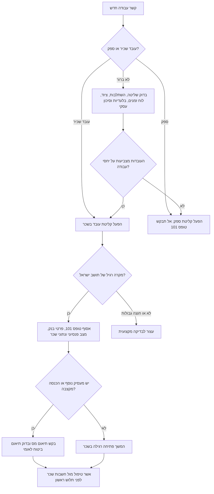
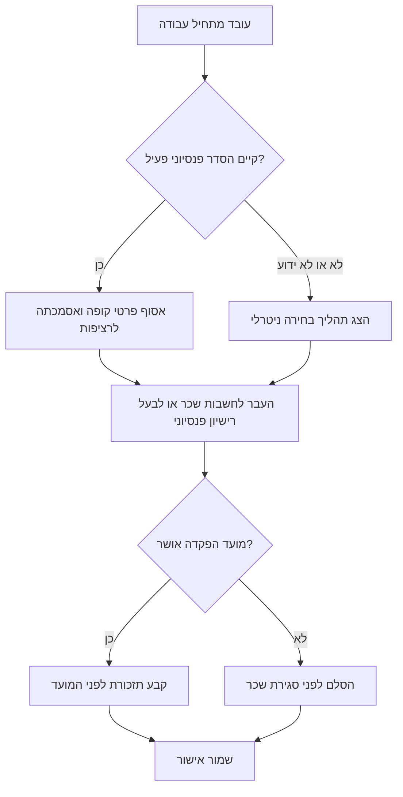

# מדריך קליטת עובדים

## מטרה

הכן חומרי קליטה מעשיים לעובדים בישראל. השתמש במדריך עבור עסקים קטנים, עוסקים מורשים, חברות, עמותות, קליניקות, חנויות, משרדי שירותים, סטודיואים ופרילנסרים שמעסיקים עובד. הפק רשימות תיוג, הודעות לעובד, משימות מנהל, מסירה לחשבות שכר, תוכניות חפיפה ונושאים לבדיקה מקצועית.

המדריך מתאים לעובד חודשי, עובד שעתי, עובד משמרות, עובד מרחוק, עובד עם מעסיק נוסף, עובד עם הסדר פנסיוני פעיל, עובד נוער, עובד זר ומעבר מנותן שירות עצמאי לעובד שכיר.

אל תציג את התוצר כייעוץ משפטי, ייעוץ מס, ייעוץ שכר, ייעוץ פנסיוני או ייעוץ ביטוחי. סמן נושאים שמחייבים בדיקה מול חשב שכר, רואה חשבון, עורך דין לדיני עבודה, בעל רישיון פנסיוני או רשות מוסמכת.

## כללי עבודה

- השתמש בלשון ציווי ניטרלית.
- אל תכלול מיתוג, סימנים חזותיים, הפניות לתמונות, ניסוח שיווקי או שמות יוצרים.
- השתמש בפורמט DD/MM/YYYY בחומרים בעברית ובסימן ₪ לסכומים. בחומרים באנגלית שמור על DD-MM-YYYY.
- הפרד בין קליטת עובד שכיר לבין קליטת ספק.
- התייחס לטופס 101, תעודת זהות, פרטי בנק, פרטי פנסיה ומסמכים רפואיים כמידע רגיש.
- שמור הנחיות לעובד קצרות וברורות, והרחב ברשימות למנהל.
- סמן ספים משתנים, היתרי עבודה, מועדי פנסיה ושאלות סיווג כנושאים לבדיקה מקצועית.

## רשימת קליטה ישראלית

| תחום | פעולה נדרשת | תוצר |
|---|---|---|
| זהות | אסוף שם מלא, מספר תעודת זהות או דרכון, כתובת, טלפון ודוא"ל אישי | רשומת עובד |
| טופס 101 | בקש כרטיס עובד מלא לפני סגירת שכר | פריט קליטת מס |
| שכר | אסוף פרטי בנק, סוג שכר, תאריך התחלה, היקף עבודה ומועד תשלום | מסירה לחשבות שכר |
| ביטוח לאומי | שאל על מעסיק נוסף, קצבה, סטטוס סטודנט, עובד נוער, עובד זר ותושבות חריגה | בדיקת תיאום |
| דמי ביטוח בריאות | טפל כחלק מחישוב השכר והניכויים | הערת בדיקה לחשבות שכר |
| פנסיה | שאל אם קיים הסדר פנסיוני פעיל ואסוף פרטי קופה | קליטה פנסיונית |
| תנאי עבודה | הכן הודעה לעובד או הסכם העסקה | מסמך תנאים |
| נוכחות | הגדר שעון נוכחות, דוח שעות, היעדרויות, הפסקות ושעות נוספות | נוהל נוכחות |
| נהלים | מסור כללי סודיות, פרטיות, בטיחות, מניעת הטרדה מינית, הוצאות ועבודה מרחוק לפי צורך | אישורים |
| חפיפה | תכנן יום ראשון, שבוע ראשון וחודש ראשון | רשימת חפיפה |

## תרשים החלטה: בחירת מסלול

## תהליך טופס 101

1. בקש טופס 101 מיד עם הקליטה והנחה את העובד למסור את הטופס המלא למעסיק בתוך 7 ימים מתחילת העבודה, ולפני סגירת השכר כאשר מועד השכר מוקדם יותר.
2. הנחה את העובד למלא את הטופס בעצמו ולפי נתוני שנת המס הנוכחית.
3. בדוק אם העובד הצהיר על מעסיק נוסף, משלם קצבה או הכנסה נוספת.
4. בקש אישור תיאום מס כאשר קיימת הכנסה נוספת.
5. העבר את הטופס והאישורים לחשבות שכר.
6. שמור את המסמכים בתיקייה מוגבלת גישה.
7. בקש טופס חדש בתחילת כל שנת מס וטופס מעודכן כאשר משתנים כתובת, מצב משפחתי, תושבות או זכאות לנקודות זיכוי.

מקרי קצה:

- מעסיק נוסף: בקש תיאום מס ושאל את חשבות השכר אם נדרש תיאום ביטוח לאומי.
- סטודנט: בקש אישור לימודים רק כאשר הוא רלוונטי לטיפול בשכר או לזכאות שהוצהרה.
- עולה חדש או תושב חוזר: בקש אסמכתה רשמית לזכאות.
- סירוב או עיכוב: אל תמלא את הטופס במקום העובד; העבר לחשבות שכר להנחיות ניכוי.
- עבודה חוצה גבולות: עצור לבדיקה של מס, היתר עבודה, ביטוח לאומי ודיני עבודה.

## תהליך פנסיוני

1. שאל אם קיים לעובד הסדר פנסיוני פעיל, קופת גמל או ביטוח מנהלים. אם לא היה הסדר פעיל קודם, תקופת ההמתנה הכללית היא 6 חודשים; אם היה הסדר פעיל, הזכאות מתחילה מהיום הראשון וההפקדה מתבצעת בדרך כלל לאחר 3 חודשים או בתום שנת המס, לפי המוקדם, רטרואקטיבית לתחילת העבודה. בדוק הסדרים ענפיים.
2. אם קיים הסדר פעיל, אסוף שם קופה, מספר חשבון או פוליסה ופרטי איש קשר. אל תחייב את העובד לבחור מוצר פנסיוני או גוף מסוים.
3. אם אין הסדר פעיל או שהמצב לא ידוע, הצג תהליך בחירה ניטרלי ובקש מחשבות שכר או מבעל רישיון פנסיוני לבדוק כללי ברירת מחדל.
4. בקש אישור למועד ההפקדה הראשונה.
5. קבע תזכורת לפני המועד ושמור אישורים בתיקייה מוגבלת גישה.

## ביטוח לאומי ודמי ביטוח בריאות

אסוף נתונים שעשויים להשפיע על טיפול השכר:

- מעסיק נוסף.
- הכנסה מקצבה.
- סטטוס סטודנט.
- העסקת נוער.
- עובד זר.
- תושבות חריגה או עבודה חוצה גבולות.
- נכות, פגיעה בעבודה או גמלה מיוחדת.

אל תחשב דמי ביטוח לאומי או דמי ביטוח בריאות ידנית ללא מערכת שכר מאומתת. בקש מחשבות שכר לבדוק צורך בתיאום כאשר יש כמה מקורות הכנסה. לשנת 2026, מדרגת הגבייה המופחתת לעובד שכיר היא ₪7,703 ותקרת ההכנסה החייבת היא ₪51,910; אמת נתונים עדכניים לפני כל חישוב.

## הודעה לעובד או הסכם העסקה

מסור הודעה לעובד לא יאוחר מ-30 ימים מתחילת העבודה לעובד בגיר, ולא יאוחר מ-7 ימים לעובד שטרם מלאו לו 18. כלול:

- שם המעסיק ומספר מזהה.
- שם העובד ומספר תעודת זהות או דרכון.
- תאריך תחילת עבודה בפורמט DD/MM/YYYY.
- תפקיד, מחלקה ומנהל ישיר.
- תחומי אחריות עיקריים.
- מקום עבודה או הסדר עבודה מרחוק.
- ימי עבודה, שעות עבודה, הפסקות ויום מנוחה.
- שכר ברוטו, שכר שעתי, עמלות, שעות נוספות ומועד תשלום.
- חופשה, מחלה, דמי הבראה, החזר נסיעות והטבות חייבות במס.
- תהליך שיוך פנסיוני.
- חובות סודיות, פרטיות ואבטחת מידע.
- תקופת חפיפה ושיחות מעקב.
- הערות לבדיקה מקצועית כאשר קיימים תנאים חריגים.

## רשימת בדיקה למסירה

- [ ] קבע אם מדובר בעובד שכיר או בספק.
- [ ] אסוף טופס 101, פרטים מזהים, פרטי בנק ומצב פנסיוני.
- [ ] שאל על מעסיק נוסף והכנסה נוספת.
- [ ] בקש אישורי תיאום לפי צורך.
- [ ] הכן הודעה לעובד או הסכם העסקה.
- [ ] הגדר שיטת דיווח שעות לפני תחילת העבודה.
- [ ] הכן טפסי ציוד והרשאות.
- [ ] מסור הנחיות בטיחות, פרטיות, סודיות ומניעת הטרדה מינית.
- [ ] העבר מסירה לחשבות שכר לפני סגירת שכר.
- [ ] קבע שיחות לאחר 7 ימים ולאחר 30 ימים.
- [ ] שמור מסמכים רגישים בתיקייה מוגבלת גישה.
- [ ] סמן שאלות משפטיות, מסיות, פנסיוניות ושאלות היתר לבדיקה מקצועית.

## טעויות שיש להימנע מהן

הימנע מ:

- בקשת טופס 101 אחרי סגירת שכר.
- הגדרת עובד כספק כאשר העובדות מצביעות על יחסי עבודה.
- בחירת מוצר פנסיוני במקום העובד ללא תהליך תקין.
- הבטחת שכר נטו בלי בדיקת חשבות שכר.
- שליחת תעודת זהות, פרטי בנק, פרטי פנסיה או מסמכים רפואיים בערוץ לא מאושר.
- ויתור על דיווח שעות בגלל שהעסק קטן.
- התחלת עבודה של עובד זר לפני בדיקת היתר.
- מסירת הדרכת בטיחות בעברית בלבד לעובד שאינו מבין עברית.
- שימוש בתבניות ישנות עם שם מעסיק שגוי, תאריכים שגויים או הטבות לא רלוונטיות.
- ערבוב מסלולי עובד, ספק, מתמחה, מתנדב ועובד משק בית.

## בדיקת נוכחות ושעות עבודה

נהל רישום שוטף של שעות עבודה, שעות נוספות, מנוחה שבועית ותשלומים קשורים. אם הרישום אינו נעשה באמצעי מכני, דיגיטלי או אלקטרוני, דאג לחתימת העובד בכל יום ולאישור אחראי שמונה לכך.

## בדיקת העסקת נוער

לפני שיבוץ עובד נוער, אמת גיל, סוג עבודה מותר, שעות יומיות, שעות שבועיות, מגבלות עבודת לילה ודרישות בטיחות. ההנחיה הכללית לשנת 2026 מאשרת עד 8 שעות ביום ועד 40 שעות בשבוע, ובני 16 עד 18 במקום עבודה של חמישה ימים בשבוע יכולים לעבוד עד 9 שעות ביום בכפוף לתקרה שבועית של 40 שעות.

## בדיקת עובד זר

לפני קליטת עובד זר, אמת היתר, אשרה, אישור מעסיק, חוזה עבודה, ביטוח רפואי, מגורים הולמים לפי צורך, מסלול פנסיה או פיקדון והדרכת בטיחות בשפה שהעובד מבין.

## בדיקת נהלי מקום עבודה

למניעת הטרדה מינית, מנה אחראי והגדר דרך יעילה להגשת תלונה. מעסיק שמעסיק מעל 25 עובדים חייב לקבוע תקנון הכולל את עיקרי החוק ודרכי הטיפול בתלונות. בפרטיות ועבודה מרחוק, צמצם ניטור, אבטח מידע אישי והגבל גישה למטרה עסקית לגיטימית.

## פתרון תקלות מהיר

| תקלה | פעולה |
|---|---|
| טופס 101 חסר | שלח תזכורת, קבע מועד אחרון והעבר לחשבות שכר לפני סגירת שכר |
| מעסיק נוסף ללא תיאום | בקש תיאום מס ושאל על תיאום ביטוח לאומי |
| חסרים פרטי פנסיה | בקש דוח קופה, פרטי איש קשר או אישור ממעסיק קודם |
| תאריך התחלה השתנה | עדכן תנאים, מסירה לשכר, הרשאות ולוח חפיפה |
| פרטי בנק נדחו | בקש פרטים מתוקנים ואישור בנק לפי צורך |
| עובד שעתי שכח לדווח נוכחות | השתמש בטופס תיקון באישור מנהל |
| מסמך רגיש נשלח בערוץ פתוח | העבר לתיקייה מוגבלת גישה ומחק עותקים מיותרים |
| היתר עובד זר לא ברור | עצור תחילת עבודה ובדוק היתר, אשרה, ביטוח וטיפול שכר |

## תבנית תוצר

כאשר מכינים חומרי קליטה, החזר:

1. סיכום הקשר.
2. בקשת מסמכים לעובד.
3. רשימת מנהל.
4. מסירה לחשבות שכר.
5. קליטה פנסיונית.
6. סדר יום ליום הראשון.
7. תוכנית חפיפה לחודש הראשון.
8. נושאים לבדיקה מקצועית.
9. תזכורת לשמירת מידע רגיש.
