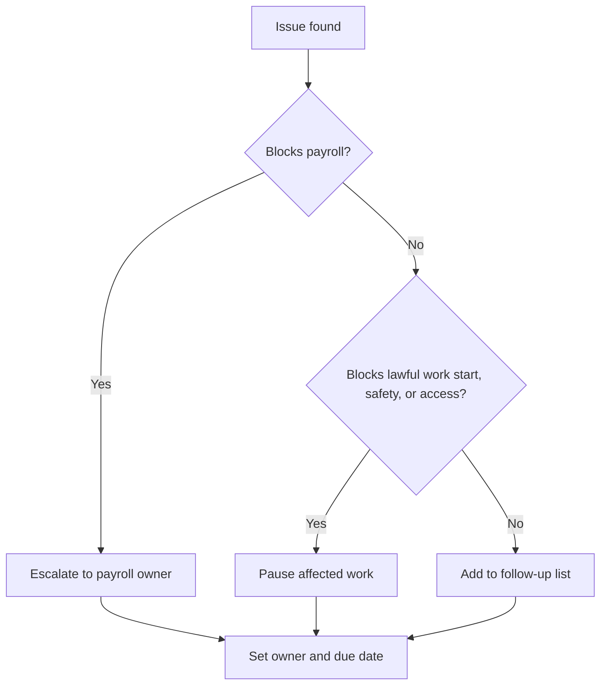

# Troubleshooting Guide

## Triage

## Common issues

### Form 101 is missing

Actions:

1. Send a clear reminder that the employee should submit the form within 7 days of starting work and before payroll close when needed.
2. Provide the secure upload route.
3. Do not complete the form for the employee.
4. Ask payroll how to withhold if the form remains missing.

### Another employer without coordination

Actions:

1. Request tax coordination.
2. Ask payroll whether National Insurance coordination is required.
3. Explain that default withholding may apply without approvals.
4. Add an annual renewal reminder.

### Pension details are missing

Actions:

1. Ask for a recent pension statement, provider app screenshot, agent name, or fund service contact.
2. Send available details to payroll or a licensed pension professional.
3. Confirm first deposit deadline.
4. Track the deadline.

### Worker status is unclear

Actions:

1. Flag the issue for classification review.
2. Compare control, integration, equipment, schedule, exclusivity, and business risk.
3. Prepare separate employee and supplier branches.
4. Do not start work until the engagement path is documented.

### Hourly employee lacks timekeeping

Actions:

1. Choose a timekeeping method before the first shift.
2. Train employee and manager.
3. Use correction forms for missed entries.
4. Send approved hours to payroll on a fixed date.

### Sensitive document was sent through an open channel

Actions:

1. Move the document to restricted storage.
2. Remove unnecessary copies.
3. Send future upload instructions.
4. Review who has access.

### Foreign-worker documents are incomplete

Actions:

1. Pause work start.
2. Verify right to work, employer authorization, medical insurance, written contract, suitable housing where relevant, and pension or deposit route.
3. Confirm health insurance and sector obligations.
4. Provide understood safety materials.

## Escalation matrix

| Issue | Escalate to | Timing |
|---|---|---|
| Missing Form 101 before payroll close | Payroll provider or accountant | Same day |
| Classification uncertainty | Labor lawyer or accountant | Before work starts |
| Foreign-worker permit uncertainty | Immigration or labor professional | Before work starts |
| Pension deadline risk | Payroll provider or licensed pension professional | Before deposit deadline |
| Tax coordination question | Payroll provider or accountant | Before payroll close |
| National Insurance coordination question | Payroll provider or National Insurance service | Before payroll close |
| Safety incident | Safety owner and manager | Immediately |
| Privacy incident | Privacy or security owner and legal adviser | Immediately |
