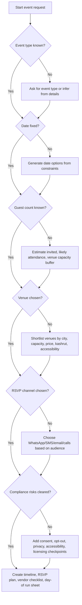

# Event Scheduler & Invitation Manager

Use this skill to plan Israeli lifecycle events end to end: weddings, bar mitzvah, bat mitzvah, brit milah, naming ceremonies, family celebrations, community events, and small-business customer gatherings. Focus on Hebrew invitations, RSVP tracking, venue constraints, supplier schedules, guest privacy, payment milestones, and day-of logistics.

Operate in a neutral, practical style. Prefer checklists, tables, risk flags, and concrete next actions. Keep legal, tax, religious, medical, and accessibility topics as operational checkpoints, not legal advice. Direct the user to verify binding requirements with the relevant official body before payment, publication, or ceremony scheduling.

## Scope

Use this skill when the user needs any of the following:

- Build an event timeline from a target date, birth date, Torah portion, school calendar, or venue option.
- Draft Hebrew RSVP wording for WhatsApp, SMS, email, landing pages, or call-center scripts.
- Track confirmations, declines, undecided guests, dietary restrictions, accessibility needs, children, and transport.
- Compare Israeli venues by capacity, price per plate, parking, kashrut certificate, accessibility, security, and noise limits.
- Schedule vendors such as venue, catering, photographer, DJ, band, designer, mohel, rabbi, synagogue, shuttle provider, childcare, and event manager.
- Prepare lifecycle-specific checklists for weddings, bar/bat mitzvah, brit milah, and family celebrations.
- Avoid common Israeli operational failures: overbooking, Shabbat timing conflicts, missing ACUM licensing, late marriage-file handling, weak RSVP data hygiene, unapproved marketing messages, or missing accessibility arrangements.

Do not use this skill to replace a lawyer, accountant, rabbi, medical professional, licensed accessibility consultant, or official government/municipal authority.

## Core operating model

Every answer should progress through five decisions:

1. **Event type**: wedding, bar mitzvah, bat mitzvah, brit milah, naming ceremony, private party, customer event, or community event.
2. **Hard date constraints**: birth timing, Torah reading, school breaks, holidays, Shabbat, venue availability, mourning/custom restrictions, religious-council windows, and vendor availability.
3. **Guest model**: invited households, expected attendance, RSVP status, language, transport, accessibility, children, dietary needs, and seating clusters.
4. **Venue model**: capacity, minimum guests, per-plate cost, location, parking, weather backup, kashrut certificate, accessibility, insurance, security, and closing hour.
5. **Compliance model**: personal data minimization, consent for messages, opt-out path, accessibility statement where needed, invoice/VAT documentation, Israel invoice allocation-number follow-up where applicable, ACUM music licensing where applicable, and religious/medical verification where applicable.

## Decision tree

## Web-validated Israeli checkpoints as of 04/06/2026

Use these as operational defaults, then recheck the official portal before payment or publication:

| Checkpoint | Current planning value | Action |
|---|---:|---|
| VAT | 18% | Require itemized supplier quotes that state whether VAT is included |
| Israel invoice allocation | ₪10,000 before VAT until 31/05/2026; ₪5,000 before VAT from 01/06/2026 | Ask accountant or Tax Authority portal when supplier/customer invoice crosses threshold |
| ACUM family event | ₪395.30 including VAT; arrange up to 72 hours before event | Add owner and receipt checkpoint for weddings, bar/bat mitzvah, brit/brita and similar events |
| ACUM business event | Separate 2026 tariff | Do not apply the family-event fee to customer or company events |
| Event-hall noise monitor | 95 dB average threshold appears in current Ministry guidance | Ask the venue how noise monitoring, closing hour and outdoor sound are handled |
| Brit milah mohel fee reference | Recommended fee: certified mohel ₪1,000; expert mohel ₪1,500 | Treat as budget reference only; verify credential and medical clearance |

## Event-specific playbooks

### Wedding

Use a wedding playbook when the user mentions wedding, engagement, chuppah, venue, ketubah, marriage registration, rabbi, mikveh, civil marriage registration, photographer, DJ, or guests.

| Timing | Action | Owner | Notes |
|---|---:|---|---|
| 9-12 months before | Define budget, city range, guest bands, religious/civil path | Couple | Separate must-have items from negotiable items |
| 6-9 months before | Close venue, photographer, music, ceremony lead | Couple | Check capacity, cancellation, force majeure, parking, accessibility |
| 3-6 months before | Prepare invitations, guest list, hotel/transport, vendor payment dates | Couple/event manager | Use household-level RSVP tracking |
| 21-90 days before | Handle marriage-file requirements where relevant | Couple | Verify current religious-council requirements before booking dependent tasks |
| 14 days before | Freeze seating draft and transport count | Event manager | Keep 5-10% reserve for late changes |
| 72 hours before | Verify music license, final guest count, vendor arrival schedule | Event manager | Check exact deadline with official licensing portal |
| Event day | Run seating, chuppah timing, vendor contacts, emergency list | Event manager | Keep printed and offline copies |

**Wedding edge cases**

- Mixed Hebrew/English families: produce two invitation versions, but keep one canonical guest ID.
- Separated parents or sensitive seating: tag guests by conflict group and avoid same table.
- Venue minimum exceeds likely attendance: negotiate a lower guaranteed minimum or add a staged upgrade clause.
- Outdoor summer event: require shaded reception plan, water stations, fan/misting option, and heat contingency.
- Winter garden event: require rain plan, indoor chuppah option, covered photography location, and revised sound layout.
- Civil-marriage path: separate ceremony logistics from registration/recognition tasks; avoid implying automatic legal completion.

### Bar mitzvah / Bat mitzvah

Use this playbook when the user mentions synagogue, Torah reading, aliyah, kiddush, school friends, family lunch, evening party, dvar Torah, tefillin, bat mitzvah club, or teenage celebration.

| Timing | Action | Owner | Notes |
|---|---:|---|---|
| 12-18 months before | Confirm Hebrew date, Torah portion, synagogue slot | Family | Some communities book early |
| 6-9 months before | Choose format: synagogue kiddush, hall lunch, evening party, combined | Family | Keep religious and social events separate in planning |
| 3-6 months before | Close photographer, DJ/activity, invitation channel, lesson schedule | Family | Add youth supervision plan |
| 6 weeks before | Send invitations and RSVP link/message | Family | Segment adults, classmates, family abroad |
| 2 weeks before | Finalize seating, transport, dietary list, child pickup policy | Event manager | Confirm allergies and security |
| Event week | Rehearsal, vendor call sheet, printed aliyah honors list | Family | Keep synagogue customs documented |

**Edge cases**

- Divorced or blended families: build honor assignments before printing programs.
- School class invited but parents not invited: state drop-off/pickup times clearly.
- Friday-night/Saturday event: map candle-lighting, Shabbat observance, transport expectations, and non-driving guests.
- Classmate allergies: request parent confirmation and avoid informal "probably fine" assumptions.
- Separate synagogue and party venues: create two RSVP questions and two attendance counts.

### Brit milah / Simchat bat / Naming ceremony

Use this playbook when the user mentions birth, brit, mohel, sandak, synagogue hall, home event, naming, simchat bat, eight-day timing, or quick family gathering.

| Timing | Action | Owner | Notes |
|---|---:|---|---|
| Birth day | Record birth date/time, medical status, location, Shabbat/holiday constraints | Parents | Medical clearance overrides ceremony pressure |
| Within 24 hours | Contact mohel/ceremony lead and venue/home host | Parents | Confirm credentials and availability |
| 2-5 days before | Send save-the-date or conditional notice | Family | Keep wording flexible until clearance |
| 24-48 hours before | Confirm doctor/mohel approval, guest count, catering, chairs, parking | Family | Keep event small when timing is uncertain |
| Event day | Prepare baby needs, quiet room, parking instructions, food labels | Family | Assign one non-parent logistics owner |

**Edge cases**

- Birth close to sunset: treat ceremony date as uncertain until rabbinic/medical confirmation.
- Baby not medically cleared: postpone; do not pressure parents or suppliers.
- Event at home: check elevator, stroller access, neighbor notices, parking, and waste pickup.
- Mixed observance guests: provide arrival window and ceremony time separately.
- Last-minute naming ceremony: use phone tree or WhatsApp broadcast with consent and minimal personal data.

## RSVP model

Track RSVP at the **household/person hybrid level**. A family may answer as one household, while seating, meals, accessibility, and transport still require person-level details.

| Field | Required | Example | Notes |
|---|---:|---|---|
| guest_id | Yes | `G-00042` | Stable internal key |
| household_name | Yes | `משפחת לוי` | Use in messages |
| contact_name | Yes | `דנה לוי` | Primary respondent |
| phone | Usually | `+972501234567` | Normalize Israeli numbers |
| email | Optional | `dana@example.com` | Useful for formal invitations |
| party_size_invited | Yes | `4` | Contract capacity planning |
| party_size_confirmed | Yes | `3` | Catering and seating |
| status | Yes | `confirmed`, `declined`, `tentative`, `no_response` | Avoid free-text status |
| side/group | Optional | `כלה`, `חתן`, `כיתה`, `עבודה` | Seating and reporting |
| children_count | Optional | `2` | Menu and supervision |
| dietary | Optional | `טבעוני, ללא גלוטן` | Confirm exact needs |
| accessibility | Optional | `כיסא גלגלים` | Venue must confirm suitability |
| transport | Optional | `needs_shuttle` | Bus size planning |
| language | Optional | `he`, `en`, `ru`, `fr`, `ar` | Invitation variant |

### Hebrew RSVP templates

**Initial WhatsApp/SMS**

> שלום {name}, נשמח לאישור הגעה ל{event_title} בתאריך {date}.  
> נא להשיב במספר המגיעים, ילדים, רגישויות למזון וצורך בהסעה.  
> להסרה מרשימת עדכונים כתבו "הסר".

**Reminder after no response**

> שלום {name}, תזכורת קצרה לאישור הגעה ל{event_title} ב-{date}.  
> כדי לסגור סידורי הושבה וקייטרינג, נא להשיב עד {deadline}: מגיעים / לא מגיעים / עדיין לא בטוח.

**Final logistics**

> שלום {name}, מחכים לראותך ב{event_title}.  
> הגעה: {venue_name}, {address}. קבלת פנים: {reception_time}. טקס: {ceremony_time}.  
> חניה/הסעה: {transport_note}. במקרה שינוי, נא לעדכן את {contact_name}.

### RSVP anti-patterns

- Do not store health notes beyond operational need. Use "רגישות לשומשום" rather than broad medical history.
- Do not send promotional content to event guests without consent.
- Do not mix invited count and confirmed count.
- Do not overwrite a household answer without preserving the previous value and timestamp.
- Do not rely only on WhatsApp reactions; require an explicit count.
- Do not publish guest lists publicly.
- Do not promise accessibility until the venue confirms physical access, accessible toilets, route from parking, and seating.

## Venue logistics checklist

| Area | Check | Failure mode |
|---|---|---|
| Capacity | Maximum seated, standing, chuppah/ceremony layout, dance floor | Contract capacity differs from practical capacity |
| Minimum | Guaranteed guest count and deadline for final count | Paying for empty seats |
| Food | Kashrut certificate, vegan/vegetarian, allergies, children menu | Missing dietary commitments |
| Accessibility | Step-free entry, toilets, parking, route, seating | Guest cannot enter or use facilities |
| Parking | Spaces, nearby lots, shuttle pickup, signage | Late arrivals and traffic stress |
| Sound | Music license, noise cutoff, generator/backup | Fine, shutdown, neighbor complaint |
| Weather | Rain/heat/wind plan, shade, fans, heaters | Unsafe or uncomfortable event |
| Security | Guard requirements, first aid, emergency exit | Unclear responsibility |
| Payments | Deposit, cancellation, indexation, VAT, invoice allocation-number follow-up, final payment | Surprise cost or invoice gap |
| Day-of | Vendor entry time, loading zone, coordinator, contact tree | Delayed setup |

## Budgeting approach

Use three bands for quick planning:

| Event | Lean | Standard | Premium |
|---|---:|---:|---:|
| Wedding, 250 guests | ₪80,000-₪120,000 | ₪120,000-₪180,000 | ₪180,000+ |
| Bar/Bat mitzvah, 120 guests | ₪20,000-₪45,000 | ₪45,000-₪90,000 | ₪90,000+ |
| Brit/Naming, 40 guests | ₪2,500-₪8,000 | ₪8,000-₪18,000 | ₪18,000+ |
| Customer/community event, 80 guests | ₪5,000-₪20,000 | ₪20,000-₪60,000 | ₪60,000+ |

Treat numbers as planning ranges. Check current supplier quotes, VAT, service charges, security costs, municipal constraints, and venue-specific minimums before committing.

## Production workflow

## Concrete examples

### 250-person wedding

Inputs: event date 18/06/2026, Rehovot, 320 invited, 250 expected, venue minimum 240, ₪330 per plate, traditional Jewish ceremony, WhatsApp plus phone calls.

Recommended output:

1. Build a guest sheet with household ID, phone, side, invited count, confirmed count, dietary needs, accessibility, and transport.
2. Send Hebrew RSVP wording with opt-out and a response deadline.
3. Set a venue negotiation target: final count no earlier than 7 days before the event; allow 5% reserve.
4. Add marriage-file and ceremony dependencies as separate checklist items.
5. Schedule music licensing verification at least 72 hours before the event.
6. Freeze seating 10-14 days before; keep reserve seats.
7. Print supplier call sheet with coordinator, venue manager, photographer, DJ, rabbi, shuttle driver, and emergency contacts.

### Bar mitzvah with synagogue and evening party

Inputs: synagogue event 07/11/2026, party 08/11/2026, 80 family synagogue guests, 140 party guests, 35 classmates, wheelchair access for grandmother.

Recommended output:

- Create two linked event records.
- Ask each invitee which part they attend.
- Confirm synagogue access and seating before printing invitations.
- Build separate food counts for kiddush, party adults, party children, vegetarian/vegan/gluten-free.
- Add pickup language for classmates.
- Assign one adult to supervise the classmate table and one family member to manage honors.

### Brit milah at home

Inputs: birth 03/03/2026 before sunset, planned ceremony 10/03/2026 subject to medical clearance, 35 guests, apartment building in Givatayim.

Recommended output:

- Mark date as tentative until mohel/doctor confirms.
- Use flexible invitation wording: "בכפוף לאישור רפואי".
- Avoid over-ordering catering until 24-48 hours before.
- Check elevator access, stroller storage, chairs, quiet room, trash removal, and neighbor notice.
- Assign a non-parent logistics contact.

## Troubleshooting quick table

| Symptom | Likely cause | Fix |
|---|---|---|
| Confirmed count exceeds venue capacity | Household answers were counted twice or children were ignored | Reconcile by phone number and household ID |
| Many guests reply with emojis | RSVP wording did not require a number | Send a follow-up requiring exact count |
| Elderly guests missing logistics | WhatsApp-only communication | Add phone-call workflow |
| Venue quote changed | Date, guest minimum, VAT, or menu tier changed | Request itemized written quote |
| Supplier asks for cash-only payment | Documentation risk | Request receipt/invoice and record payment terms |
| Wheelchair guest cannot access venue | Accessibility not verified physically | Confirm route, toilet, parking, and seating with venue |
| Ceremony date conflict appears late | Holiday/custom/religious timing checked too late | Validate date constraints before deposit |

## Production checklist

- [ ] Event type and scope confirmed.
- [ ] Date constraints checked, including holidays, Shabbat, school calendar, and religious/medical dependencies.
- [ ] Budget range approved with contingency.
- [ ] Venue capacity, minimum, cancellation, accessibility, parking, and weather plan documented.
- [ ] Supplier list includes contact, arrival time, payment milestones, cancellation terms, and backup contact.
- [ ] RSVP sheet uses stable IDs and normalized phone numbers.
- [ ] Invitation includes response deadline and opt-out wording when sent by message.
- [ ] Sensitive guest data minimized and access limited.
- [ ] Dietary and accessibility needs confirmed directly.
- [ ] Seating draft created with conflict groups and family sensitivities.
- [ ] Transport list reconciled with pickup times and passenger count.
- [ ] Music licensing, religious-council, medical, tax, invoice allocation-number, and accessibility checkpoints verified where relevant.
- [ ] Day-of run sheet printed and stored offline.
- [ ] Post-event supplier payments, invoices, thank-you messages, and data cleanup scheduled.

## File index

- `references/api-reference.md` — Israeli compliance/API-style adapter reference.
- `references/workflow-guide.md` — end-to-end workflows.
- `references/troubleshooting.md` — operational troubleshooting.
- `references/test-scenarios.md` — concrete planning scenarios.
- `references/migration-checklist.md` — migration from ad hoc spreadsheets or older wedding-only packages.
- `scripts/event_scheduler_invitation_client.py` — typed sync and async helper library.
- `scripts/event-scheduler-invitation-cli.py` — command-line interface.
- `scripts/examples/` — runnable examples.
