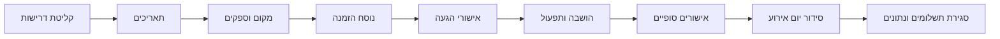

# מנהל אירועים והזמנות בישראל

השתמשו במיומנות זו לתכנון אירועי חיים בישראל מקצה לקצה: חתונה, בר מצווה, בת מצווה, ברית מילה, שמחת בת, אירוע משפחתי, אירוע קהילתי ואירוע לקוחות של עסק קטן או פרילנסר. הדגש הוא על הזמנות בעברית, אישורי הגעה, רשימות מוזמנים, הושבה, ספקים, אולם או גן אירועים, תשלומים, פרטיות, נגישות ותפעול ביום האירוע.

הניסוח צריך להיות ענייני, מקצועי ויישומי. העדיפו רשימות בדיקה, טבלאות, סימוני סיכון וצעדים אופרטיביים. נושאים משפטיים, חשבונאיים, דתיים, רפואיים ונגישותיים הם נקודות בקרה תפעוליות בלבד. לפני התחייבות כספית או פרסום הזמנה, ודאו את הדרישות המחייבות מול הגורם הרשמי או בעל המקצוע המוסמך.

## מתי להשתמש

השתמשו במיומנות כאשר נדרש אחד מהדברים הבאים:

- בניית לוח זמנים לאירוע לפי תאריך יעד, תאריך לידה, פרשת שבוע, חופשות בית ספר או זמינות אולם.
- ניסוח הודעות אישור הגעה בעברית לוואטסאפ, מסרון, דוא"ל, דף נחיתה או מוקד טלפוני.
- מעקב אחר מגיעים, לא מגיעים, מתלבטים, רגישויות למזון, נגישות, ילדים והסעות.
- השוואת אולמות וגני אירועים לפי קיבולת, מחיר למנה, חניה, כשרות, נגישות, אבטחה ושעת סיום.
- תיאום ספקים: אולם, הסעדה, צילום, תקליטן, להקה, עיצוב, מוהל, רב, בית כנסת, הסעות, שמרטפות ומנהל אירוע.
- הכנת רשימות בדיקה ייעודיות לחתונה, בר/בת מצווה, ברית מילה ואירוע עסקי קטן.
- מניעת כשלים נפוצים: התחייבות יתר לאולם, התנגשות עם שבת או חגים, שכחת רישיון אקו"ם, טיפול מאוחר בתיק נישואין, ניהול רשלני של פרטי מוזמנים, הודעות שיווקיות ללא הסכמה או היעדר פתרון נגישות.

אין להשתמש במיומנות כתחליף לעורך דין, רואה חשבון, רב, רופא, מורשה נגישות או רשות רשמית.

## מודל עבודה

כל תשובה צריכה לעבור דרך חמש החלטות:

1. **סוג האירוע**: חתונה, בר מצווה, בת מצווה, ברית מילה, שמחת בת, מסיבה פרטית, אירוע לקוחות או אירוע קהילתי.
2. **מגבלות תאריך**: שעת לידה, פרשת שבוע, חופשות, שבת, זמינות אולם, מנהגי אבלות, חלונות רבנות, זמינות ספקים ומצב רפואי.
3. **מודל מוזמנים**: בתי אב, כמות מוזמנים, אישורי הגעה, שפה, הסעות, נגישות, ילדים, רגישויות והושבה.
4. **מודל מקום**: קיבולת, מינימום מוזמנים, מחיר למנה, מיקום, חניה, חלופת מזג אוויר, כשרות, נגישות, ביטוח, אבטחה ושעת סיום.
5. **מודל ציות**: צמצום מידע אישי, הסכמה לקבלת הודעות, אפשרות הסרה, נגישות, חשבוניות, מע"מ, בדיקת מספר הקצאה לחשבונית ישראל כאשר נדרש, רישיון מוזיקה של אקו"ם ואימות דתי או רפואי כאשר רלוונטי.

## עץ החלטה

```mermaid
flowchart TD
    A[בקשת תכנון אירוע] --> B{סוג האירוע ידוע?}
    B -- לא --> B1[בררו סוג אירוע או הסיקו מהפרטים]
    B -- כן --> C{התאריך סגור?}
    B1 --> C
    C -- לא --> C1[הציעו תאריכים לפי אילוצים]
    C -- כן --> D{כמות מוזמנים ידועה?}
    C1 --> D
    D -- לא --> D1[העריכו מוזמנים, אחוז הגעה ומרווח קיבולת]
    D -- כן --> E{נבחר מקום?}
    D1 --> E
    E -- לא --> E1[סננו מקומות לפי עיר, קיבולת, מחיר, כשרות ונגישות]
    E -- כן --> F{נבחר ערוץ אישורי הגעה?}
    E1 --> F
    F -- לא --> F1[בחרו וואטסאפ, מסרון, דוא"ל או שיחות לפי קהל]
    F -- כן --> G{סיכוני ציות נסגרו?}
    F1 --> G
    G -- לא --> G1[הוסיפו הסכמה, הסרה, פרטיות, נגישות ורישיונות]
    G -- כן --> H[צרו לוח זמנים, תכנית אישורי הגעה, ספקים וסידור יום אירוע]
    G1 --> H
```


## נקודות בקרה ישראליות שאומתו ברשת נכון ל-04/06/2026

השתמשו בערכים אלה כברירת מחדל תפעולית, אך בדקו שוב מול הפורטל הרשמי לפני תשלום, פרסום או הפקת חשבונית:

| נקודת בקרה | ערך תכנון נוכחי | פעולה |
|---|---:|---|
| מע"מ | 18% | דרשו הצעת מחיר מפורטת שמציינת אם המע"מ כלול |
| מספר הקצאה לחשבונית ישראל | ₪10,000 לפני מע"מ עד 31/05/2026; ₪5,000 לפני מע"מ החל מ-01/06/2026 | סמנו לבדיקה מול רואה חשבון או רשות המסים כאשר החשבונית עוברת את הסף |
| אקו"ם לאירוע משפחתי | ₪395.30 כולל מע"מ; הסדרה עד 72 שעות לפני האירוע | הקצו אחראי ושמרו אסמכתה לחתונה, בר/בת מצווה, ברית/בריתה ואירוע דומה |
| אקו"ם לאירוע עסקי | תעריף 2026 נפרד | אל תחילו תעריף משפחתי על אירוע לקוחות או אירוע חברה |
| מד רעש באולם אירועים | בהנחיית המשרד מופיע סף ממוצע של 95 דציבל | שאלו את המקום על מד רעש, שעת סיום והגבלות סאונד חיצוני |
| תעריף מומלץ לברית | מוהל מוסמך ₪1,000; מוהל מומחה ₪1,500 | השתמשו להערכת תקציב בלבד; ודאו הסמכה ואישור רפואי |

## תסריטי אירוע

### חתונה

הפעילו תסריט חתונה כאשר המשתמש מזכיר חתונה, אירוסין, חופה, אולם, כתובה, תיק נישואין, רב, מקווה, חתונה אזרחית, צלם, תקליטן או רשימת מוזמנים.

| מועד | פעולה | אחראי | הערות |
|---|---:|---|---|
| 9-12 חודשים לפני | הגדירו תקציב, אזור, כמות מוזמנים ומסלול דתי/אזרחי | בני הזוג | הפרידו בין חובה לרצוי |
| 6-9 חודשים לפני | סגרו אולם, צילום, מוזיקה ומסדר טקס | בני הזוג | בדקו קיבולת, ביטול, כוח עליון, חניה ונגישות |
| 3-6 חודשים לפני | הכינו הזמנות, רשימת מוזמנים, מלונות/הסעות ותשלומים | מנהל אירוע | ניהול לפי בית אב מונע כפילויות |
| 21-90 ימים לפני | טפלו בדרישות תיק נישואין כאשר רלוונטי | בני הזוג | ודאו דרישות עדכניות מול המועצה הדתית |
| 14 ימים לפני | סגרו טיוטת הושבה וכמות הסעות | מנהל אירוע | השאירו רזרבה של 5%-10% לשינויים |
| 72 שעות לפני | בדקו רישיון מוזיקה, כמות סופית ולוח הגעת ספקים | מנהל אירוע | בדקו מועד אחרון מול הפורטל הרשמי |
| יום האירוע | ניהול הושבה, חופה, ספקים וחירום | מנהל אירוע | החזיקו עותק מודפס ולא מקוון |

**מקרי קצה בחתונה**

- משפחות דוברות עברית ואנגלית: צרו שתי גרסאות הזמנה, אך שמרו מזהה מוזמן אחד.
- הורים גרושים או רגישות משפחתית: סמנו קבוצות קונפליקט והימנעו מהושבה משותפת.
- מינימום אולם גבוה מהצפי: התמקחו על מינימום נמוך יותר או על מנגנון שדרוג מדורג.
- אירוע קיץ בחוץ: דרשו הצללה, עמדות מים, מאווררים או מצננים ותכנית עומס חום.
- אירוע חורף בגן: דרשו חלופת גשם, אזור צילום מקורה, חופה פנימית ותכנית סאונד חלופית.
- חתונה אזרחית: הפרידו בין טקס חגיגי לבין משימות רישום והכרה; אל תציגו טקס פרטי כפעולה משפטית מספיקה.

### בר מצווה / בת מצווה

הפעילו תסריט כאשר מופיעים בית כנסת, קריאה בתורה, עלייה לתורה, קידוש, חברים מהכיתה, ארוחת משפחה, מסיבה בערב, דרשה, תפילין, מועדון בת מצווה או אירוע לנער/ה.

| מועד | פעולה | אחראי | הערות |
|---|---:|---|---|
| 12-18 חודשים לפני | אשרו תאריך עברי, פרשה ותור בבית הכנסת | משפחה | בקהילות מסוימות סוגרים מוקדם |
| 6-9 חודשים לפני | בחרו פורמט: קידוש, ארוחה, מסיבה או שילוב | משפחה | הפרידו בין אירוע דתי וחברתי |
| 3-6 חודשים לפני | סגרו צילום, תקליטן/פעילות, הזמנות ושיעורים | משפחה | הוסיפו תכנית השגחה לנוער |
| 6 שבועות לפני | שלחו הזמנות וקישור/הודעת אישור הגעה | משפחה | פלחו מבוגרים, חברי כיתה ומשפחה מחו"ל |
| 2 שבועות לפני | סגרו הושבה, הסעות, רגישויות וכללי איסוף ילדים | מנהל אירוע | אשרו אלרגיות ואבטחה |
| שבוע האירוע | חזרה, דף קשר ספקים ורשימת כיבודים | משפחה | תעדו מנהגי בית כנסת |

**מקרי קצה**

- משפחות גרושות או מורכבות: בנו רשימת כיבודים לפני הדפסת תכנייה.
- הזמנת כיתה ללא הורים: ציינו שעת איסוף, שער כניסה ואיש קשר.
- אירוע בשבת: מיפוי הדלקת נרות, נסיעות, אורחים שומרי שבת ואירוח.
- אלרגיות של ילדים: דרשו אישור הורים; אל תסתפקו בהערכה.
- בית כנסת ומסיבה בשני מקומות: צרו שתי שאלות אישור הגעה ושתי ספירות.

### ברית מילה / שמחת בת

הפעילו תסריט כאשר מופיעים לידה, ברית, מוהל, סנדק, אולם בית כנסת, אירוע בבית, קריאת שם, שמחת בת או אירוע מהיר למשפחה.

| מועד | פעולה | אחראי | הערות |
|---|---:|---|---|
| יום הלידה | רשמו תאריך, שעה, מצב רפואי, שבת/חג ומיקום | הורים | אישור רפואי קודם לכל לחץ טקסי |
| עד 24 שעות | צרו קשר עם מוהל/עורך טקס ומקום | הורים | בדקו הכשרה וזמינות |
| 2-5 ימים לפני | שלחו שמירת תאריך או הודעה מותנית | משפחה | שמרו ניסוח גמיש עד אישור |
| 24-48 שעות לפני | אשרו רופא/מוהל, כמות מוזמנים, הסעדה, כיסאות וחניה | משפחה | הזמינו בזהירות כשיש אי-ודאות |
| יום האירוע | הכינו ציוד לתינוק, חדר שקט, שילוט וחניה | משפחה | מנו אחראי תפעול שאינו אחד ההורים |

**מקרי קצה**

- לידה סמוך לשקיעה: התייחסו לתאריך הברית כלא סופי עד אישור רבני/רפואי.
- תינוק ללא אישור רפואי: דחו את הטקס; אין ללחוץ על ההורים או הספקים.
- אירוע בבית: בדקו מעלית, גישה לעגלות, הודעה לשכנים, חניה ופינוי אשפה.
- אורחים ברמות שמירת מצוות שונות: הפרידו בין שעת הגעה לשעת הטקס.
- שמחת בת מהירה: השתמשו בעץ טלפוני או רשימת וואטסאפ עם הסכמה ומינימום מידע אישי.

## מודל אישורי הגעה

נהלו אישורי הגעה בשילוב של **בית אב ואדם בודד**. משפחה יכולה להשיב כיחידה אחת, אבל הושבה, מנות, נגישות והסעות דורשות פירוט אישי.

| שדה | חובה | דוגמה | הערות |
|---|---:|---|---|
| מזהה מוזמן | כן | `G-00042` | מפתח פנימי קבוע |
| שם בית אב | כן | `משפחת לוי` | מתאים לפנייה בהודעה |
| איש קשר | כן | `דנה לוי` | מי שמשיב בפועל |
| טלפון | לרוב | `+972501234567` | נרמלו מספרים ישראליים |
| דוא"ל | אופציונלי | `dana@example.com` | מתאים להזמנות רשמיות |
| כמות מוזמנים | כן | `4` | לתכנון קיבולת |
| כמות מאושרת | כן | `3` | להסעדה והושבה |
| סטטוס | כן | `מאושר`, `לא מגיע`, `מתלבט`, `ללא מענה` | אל תשתמשו בטקסט חופשי |
| צד/קבוצה | אופציונלי | `כלה`, `חתן`, `כיתה`, `עבודה` | לדוחות והושבה |
| ילדים | אופציונלי | `2` | תפריט והשגחה |
| רגישויות | אופציונלי | `טבעוני, ללא גלוטן` | אשרו צורך מדויק |
| נגישות | אופציונלי | `כיסא גלגלים` | דרוש אישור מקום |
| הסעה | אופציונלי | `צריך הסעה` | לתכנון אוטובוס |
| שפה | אופציונלי | `עברית`, `אנגלית`, `רוסית`, `צרפתית`, `ערבית` | גרסת הזמנה |

### תבניות עבריות

**הודעה ראשונה**

> שלום {name}, נשמח לאישור הגעה ל{event_title} בתאריך {date}.  
> נא להשיב במספר המגיעים, ילדים, רגישויות למזון וצורך בהסעה.  
> להסרה מרשימת עדכונים כתבו "הסר".

**תזכורת למי שלא השיב**

> שלום {name}, תזכורת קצרה לאישור הגעה ל{event_title} ב-{date}.  
> כדי לסגור סידורי הושבה והסעדה, נא להשיב עד {deadline}: מגיעים / לא מגיעים / עדיין לא בטוח.

**הודעה תפעולית סופית**

> שלום {name}, מחכים לראותך ב{event_title}.  
> הגעה: {venue_name}, {address}. קבלת פנים: {reception_time}. טקס: {ceremony_time}.  
> חניה/הסעה: {transport_note}. במקרה שינוי, נא לעדכן את {contact_name}.

### טעויות נפוצות באישורי הגעה

- אל תשמרו מידע רפואי מעבר לצורך תפעולי. כתבו "רגישות לשומשום" ולא היסטוריה רפואית.
- אל תשלחו תוכן שיווקי למוזמנים ללא הסכמה.
- אל תערבבו כמות מוזמנים עם כמות מאושרת.
- אל תדרסו תשובה קודמת בלי לשמור תאריך ושעה.
- אל תסתמכו על אימוג'י בוואטסאפ; דרשו מספר מדויק.
- אל תפרסמו רשימות מוזמנים בפומבי.
- אל תבטיחו נגישות לפני שהמקום אישר כניסה, שירותים, מסלול מהחניה וסידור הושבה.

## בדיקת מקום

| תחום | בדיקה | כשל נפוץ |
|---|---|---|
| קיבולת | ישיבה, עמידה, חופה/טקס, רחבת ריקודים | קיבולת חוזית לא תואמת קיבולת מעשית |
| מינימום | התחייבות מינימום ומועד ספירה סופית | תשלום על מקומות ריקים |
| אוכל | כשרות, טבעוני, צמחוני, אלרגיות, ילדים | התחייבויות תזונתיות לא מתועדות |
| נגישות | כניסה, שירותים, חניה, מסלול, הושבה | אורח אינו יכול להיכנס או להשתמש בשירותים |
| חניה | מקומות, חניונים סמוכים, נקודת הסעה, שילוט | איחורים ועומסי תנועה |
| סאונד | רישיון מוזיקה, שעת סיום, גיבוי חשמל | תלונה, קנס או הפסקת מוזיקה |
| מזג אוויר | גשם, חום, רוח, הצללה, חימום | אירוע לא בטוח או לא נוח |
| אבטחה | מאבטחים, עזרה ראשונה, יציאות חירום | אחריות לא ברורה |
| תשלומים | מקדמה, ביטול, הצמדה, מע"מ, מספר הקצאה, תשלום סופי | עלות מפתיעה או חוסר חשבונית |
| יום האירוע | שעת כניסת ספקים, פריקה, מנהל אירוע | עיכוב בהקמה |

## תקציב בשקלים

| אירוע | חסכוני | סטנדרטי | פרימיום |
|---|---:|---:|---:|
| חתונה, 250 מוזמנים | ₪80,000-₪120,000 | ₪120,000-₪180,000 | ₪180,000+ |
| בר/בת מצווה, 120 מוזמנים | ₪20,000-₪45,000 | ₪45,000-₪90,000 | ₪90,000+ |
| ברית/שמחת בת, 40 מוזמנים | ₪2,500-₪8,000 | ₪8,000-₪18,000 | ₪18,000+ |
| אירוע לקוחות/קהילה, 80 מוזמנים | ₪5,000-₪20,000 | ₪20,000-₪60,000 | ₪60,000+ |

המספרים הם טווחי תכנון בלבד. לפני חתימה בדקו הצעות מחיר עדכניות, מע"מ, דמי שירות, אבטחה, דרישות עירוניות ומינימום מוזמנים.

## תהליך הפקה



## דוגמאות

### חתונה ל-250 איש

קלט: 18/06/2026, רחובות, 320 מוזמנים, צפי 250, מינימום אולם 240, ₪330 למנה, חופה יהודית, וואטסאפ ושיחות טלפון.

פלט מומלץ:

1. צרו גיליון מוזמנים עם מזהה בית אב, טלפון, צד, כמות מוזמנים, כמות מאושרת, רגישויות, נגישות והסעות.
2. שלחו הודעת אישור הגעה בעברית עם תאריך יעד ואפשרות הסרה.
3. הגדירו יעד משא ומתן מול האולם: ספירה סופית לא לפני 7 ימים לפני האירוע ורזרבה של 5%.
4. הפרידו משימות תיק נישואין וטקס ממשימות האולם.
5. קבעו בדיקת רישיון אקו"ם לפחות 72 שעות לפני האירוע.
6. הקפיאו הושבה 10-14 ימים לפני והשאירו שולחן או מקומות רזרבה.
7. הדפיסו דף קשר לספקים: מנהל אירוע, מנהל אולם, צלם, תקליטן, רב, נהג הסעה ואיש חירום.

### בר מצווה עם בית כנסת ומסיבה

קלט: אירוע בבית כנסת בשבת 07/11/2026, מסיבה 08/11/2026, 80 לקידוש, 140 למסיבה, 35 חברי כיתה, סבתא עם כיסא גלגלים.

פלט מומלץ:

- צרו שני אירועים מקושרים.
- שאלו כל מוזמן לאיזה חלק הוא מגיע.
- אשרו גישה ושירותים נגישים בבית הכנסת לפני הדפסת הזמנות.
- בנו ספירות נפרדות: קידוש, מבוגרים במסיבה, ילדים, צמחוני/טבעוני/ללא גלוטן.
- הוסיפו ניסוח איסוף: "האירוע מסתיים בשעה 22:30. נא לתאם איסוף מהכניסה הראשית."
- מנו מבוגר אחראי לשולחן הכיתה ובן משפחה אחראי לכיבודים.

### ברית מילה בבית

קלט: לידה 03/03/2026 לפני השקיעה, טקס מתוכנן 10/03/2026 בכפוף לאישור רפואי, 35 מוזמנים, בניין מגורים בגבעתיים.

פלט מומלץ:

- סמנו את התאריך כמותנה עד אישור מוהל/רופא.
- השתמשו בנוסח גמיש: "בכפוף לאישור רפואי".
- אל תזמינו הסעדה בכמות גדולה לפני 24-48 שעות לפני האירוע.
- בדקו מעלית, מקום לעגלות, כיסאות, חדר שקט, פינוי אשפה והודעה לשכנים.
- מנו איש קשר תפעולי שאינו אחד ההורים.

## טבלת תקלות מהירה

| סימן | סיבה סבירה | פתרון |
|---|---|---|
| כמות מאושרת גבוהה מקיבולת המקום | כפילות בתי אב או ספירת ילדים שגויה | בצעו איחוד לפי טלפון ומזהה בית אב |
| הרבה תשובות באימוג'י | ההודעה לא דרשה מספר | שלחו תזכורת עם דרישה לכמות מדויקת |
| אורחים מבוגרים לא קיבלו פרטים | שימוש בוואטסאפ בלבד | הוסיפו שיחות טלפון |
| הצעת המחיר השתנתה | תאריך, מינימום, מע"מ או תפריט השתנו | דרשו הצעת מחיר מפורטת בכתב |
| ספק מבקש מזומן בלבד | סיכון תיעוד וחשבונית | דרשו קבלה/חשבונית ותנאי תשלום כתובים |
| אורח בכיסא גלגלים לא מצליח להיכנס | נגישות לא נבדקה בפועל | אשרו מסלול, שירותים, חניה והושבה מול המקום |
| קונפליקט תאריך מתגלה מאוחר | חגים/מנהגים/רבנות נבדקו מאוחר | בדקו אילוצי תאריך לפני מקדמה |

## רשימת בדיקה להפקה

- [ ] סוג האירוע והיקף האירוע הוגדרו.
- [ ] נבדקו חגים, שבת, חופשות, דרישות דתיות ומצב רפואי רלוונטי.
- [ ] אושר תקציב עם רזרבה.
- [ ] תועדו קיבולת מקום, מינימום, ביטול, נגישות, חניה וחלופת מזג אוויר.
- [ ] רשימת ספקים כוללת איש קשר, שעת הגעה, תשלומים, תנאי ביטול ואיש קשר חלופי.
- [ ] גיליון אישורי הגעה משתמש במזהים קבועים ובמספרי טלפון מנורמלים.
- [ ] ההזמנה כוללת תאריך יעד ואפשרות הסרה כאשר נשלחת בהודעה.
- [ ] המידע האישי צומצם והגישה אליו מוגבלת.
- [ ] רגישויות ונגישות אושרו ישירות.
- [ ] טיוטת הושבה כוללת קבוצות רגישות וקונפליקטים משפחתיים.
- [ ] רשימת הסעות תואמת נקודות איסוף וכמות נוסעים.
- [ ] רישיון מוזיקה, רבנות, אישור רפואי, חשבוניות ונגישות נבדקו לפי הצורך.
- [ ] סידור יום האירוע הודפס ונשמר גם ללא אינטרנט.
- [ ] סגירת תשלומים, חשבוניות, הודעות תודה וניקוי מידע נקבעו לאחר האירוע.

## מפתח קבצים

- `references/api-reference.md` — התייחסות לממשקים, פורטלים, בדיקות רשת ודרישות ישראליות.
- `references/workflow-guide.md` — תהליכי עבודה מקצה לקצה.
- `references/troubleshooting.md` — טיפול בתקלות תפעוליות.
- `references/test-scenarios.md` — תרחישי בדיקה קונקרטיים.
- `references/migration-checklist.md` — מעבר מגיליונות או מחבילה ישנה.
- `scripts/event_scheduler_invitation_client.py` — ספריית עזר מסונכרנת ואסינכרונית.
- `scripts/event-scheduler-invitation-cli.py` — ממשק שורת פקודה.
- `scripts/examples/` — דוגמאות הרצה.
