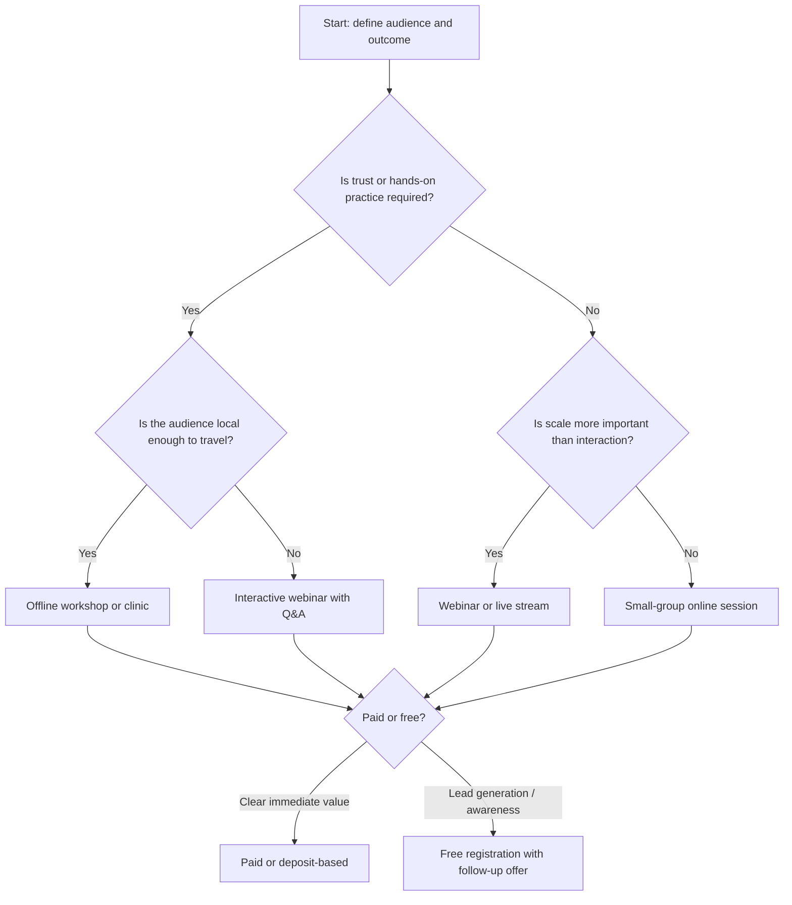
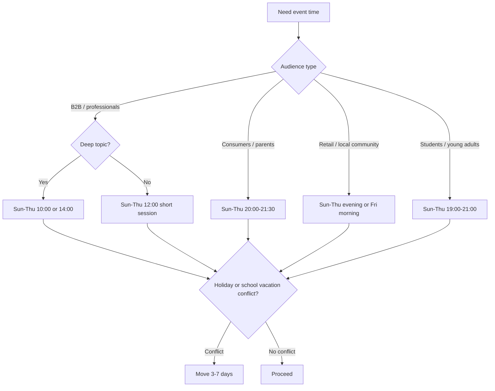
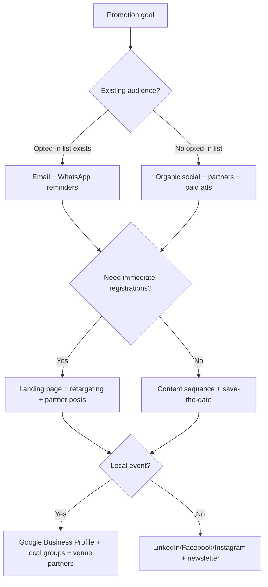

# Event & Webinar Promoter

Plan, validate, write, schedule, and improve event and webinar promotions for Israeli audiences. Use this skill for small businesses, freelancers, community organizers, consultants, creators, educators, local service providers, and consumer-facing initiatives operating in Israel.

The default operating context is Israel: timezone `Asia/Jerusalem`, Hebrew-first copy, ₪ pricing, `DD-MM-YYYY` dates, Sunday–Thursday workweeks, sensitivity to Jewish holidays and local school/work routines, and practical compliance checks for marketing messages.

## Core outcomes

Use the skill to produce:

- A complete event or webinar promotion plan.
- Hebrew and English copy for landing pages, WhatsApp, SMS, email, LinkedIn, Facebook, Instagram, Google Business Profile, partner messages, and reminder sequences.
- A timezone-aware schedule for launch, reminders, registration close, follow-up, and replay expiration.
- Compliance and accessibility checks for Israeli audiences.
- UTM-tagged campaign links and measurement plans.
- Cancellation, postponement, low-registration, and sold-out response workflows.
- CLI-generated plans and checklists for repeatable production use.

## Use when

Use this skill when the user asks to:

- Promote a workshop, lecture, meetup, webinar, course preview, professional training, open day, sale event, launch event, community session, clinic, demo, consultation evening, or live stream.
- Build a marketing calendar for an Israeli audience.
- Generate Hebrew promotional copy with professional local phrasing.
- Decide whether an event should be online, offline, hybrid, free, paid, recorded, or invite-only.
- Create reminders and follow-up messages.
- Review a promotion for compliance, clarity, timing, accessibility, or conversion risk.

## Do not use when

Do not use this skill to:

- Provide legal advice as a substitute for a qualified Israeli lawyer.
- Send unsolicited marketing messages without documented consent or a valid legal basis.
- Create misleading scarcity, false testimonials, fake prices, hidden fees, or manipulative urgency.
- Promote unsafe, illegal, discriminatory, or deceptive events.
- Scrape private contact lists, buy mailing lists, or bypass unsubscribe choices.
- Create impersonation campaigns or messages that hide the advertiser identity.

## Operating defaults for Israel

| Area | Default |
|---|---|
| Timezone | `Asia/Jerusalem` |
| Date format | `DD-MM-YYYY` |
| Time format | 24-hour format, for example `19:30` |
| Currency | ₪, including VAT status where relevant |
| Workweek | Sunday–Thursday, with Friday treated as short/low-response and Saturday avoided unless the event is explicitly suitable |
| Language | Hebrew-first unless the audience is clearly English-speaking |
| Tone | Direct, useful, warm, specific, non-hype |
| Registration cutoff | 2–24 hours before the event, depending on capacity and preparation |
| Reminder cadence | Save-the-date, 72h, 24h, morning-of, 2h, post-event |
| Accessibility | Include access notes, captions/recording options when possible, venue instructions, and contact for adjustments |
| Consent | Require opt-in evidence before promotional email/SMS/WhatsApp blasts |

## Required intake

Collect or infer the following before producing a final plan. If details are missing, use safe defaults and mark assumptions.

| Field | Required | Safe default |
|---|---:|---|
| Event name | Yes | Create a descriptive working title |
| Format | Yes | Webinar if no venue is supplied |
| Date and time | Yes | Suggest 20:00 Israel time for consumer webinars; 10:00 or 14:00 for B2B |
| Duration | Yes | 60 minutes for webinar, 90 minutes for workshop |
| Audience | Yes | Define one primary audience segment |
| Offer | Yes | Clarify the practical benefit |
| Price | No | Free registration unless paid offer is stated |
| Capacity | No | 100 online, 20 offline |
| Location/link | No | “Registration link pending” |
| Speaker/host | No | Use business or professional role |
| Consent status | Yes for outbound messaging | If unknown, avoid direct marketing blasts |
| Goal | No | Registrations first, sales second |
| Language | No | Hebrew |
| Assets | No | Plan copy that works without design assets |

## Decision tree: choose event format



## Decision tree: choose timing



## Decision tree: select promotion channels



## Production workflow

### 1. Define the event promise

Write one sentence that connects the audience, pain, outcome, and proof.

Template:

> For **[audience]** who struggle with **[problem]**, this **[format]** shows **[outcome]** using **[method/proof]**, so they leave with **[practical result]**.

Example:

> For independent therapists who struggle to fill private clinics, this webinar shows how to build a simple referral and follow-up system using WhatsApp, Google Business Profile, and ethical consent-based messaging, so they leave with a weekly client-acquisition routine.

### 2. Validate market fit

Check:

- Is the title concrete enough to understand in 3 seconds?
- Is the outcome specific and believable?
- Is the audience narrow enough for Hebrew copy to feel personal?
- Is the price aligned with the practical value?
- Is there a visible reason to attend live?
- Is there a clear next step after registration?
- Is the event date far enough away to promote properly?

### 3. Build the registration path

Minimum landing page sections:

1. Hero: title, date, time, host, price, CTA.
2. Outcome bullets: what participants will know or receive.
3. Audience fit: who should attend and who should skip.
4. Agenda: 3–5 timed blocks.
5. Host credibility: practical, not inflated.
6. Logistics: platform/venue, duration, recording, accessibility.
7. Compliance: privacy note, cancellation terms for paid events, unsubscribe or contact options.
8. CTA repeated.

### 4. Create the promotion calendar

Default promotional runway:

| Event type | Minimum runway | Better runway |
|---|---:|---:|
| Free webinar | 7 days | 14–21 days |
| Paid webinar | 14 days | 21–30 days |
| Offline workshop | 21 days | 30–45 days |
| Professional course preview | 14 days | 30 days |
| Consumer local event | 10 days | 21 days |

### 5. Write Hebrew copy first

Hebrew copy should be concrete and direct. Avoid translated English idioms. Use natural Israeli professional phrasing.

Good:

> סדנה מעשית לבעלי עסקים קטנים שרוצים להפוך פניות מוואטסאפ לשיחות מכירה מסודרות — בלי מערכת מסובכת ובלי לרדוף אחרי לקוחות.

Weak:

> וובינר עוצמתי שישנה לכם את החיים ויגרום לעסק שלכם להתפוצץ.

### 6. Schedule reminders

Default webinar sequence:

| Timing | Channel | Purpose |
|---|---|---|
| Launch | Email/social/WhatsApp to opted-in audience | Explain value and open registration |
| 72 hours before | Email | Reframe the problem and repeat CTA |
| 24 hours before | Email + WhatsApp/SMS where consent exists | Logistics and attendance reason |
| Morning of | Email | Calendar, link, expectation |
| 2 hours before | WhatsApp/SMS where consent exists | Short practical reminder |
| 1–3 hours after | Email | Thanks, replay/materials, next step |
| 24–48 hours after | Email | Offer, FAQ, deadline if real |
| Replay expiration | Email | Real deadline only |

### 7. Measure performance

Track:

- Landing page views.
- Registration conversion rate.
- Channel-level registrations using UTM links.
- Show-up rate.
- Attendance duration.
- Chat/Q&A participation.
- Replay views.
- Sales calls booked or purchases.
- Unsubscribes and spam complaints.
- Cost per registration and cost per attended participant.

## Concrete examples

### Example A: free webinar for freelancers

Input:

```json
{
  "event_name": "איך לתמחר שירותים בלי להפסיד לקוחות",
  "format": "webinar",
  "audience": "פרילנסרים בתחילת הדרך",
  "date": "24-06-2026",
  "time": "20:00",
  "duration_minutes": 60,
  "price_nis": 0,
  "goal": "registrations"
}
```

Recommended plan:

- Launch 14 days before.
- Use Hebrew-first landing page.
- Lead channel: LinkedIn personal profile and relevant Facebook groups.
- Secondary channel: opt-in email list.
- Reminder at 24 hours and 2 hours before.
- Follow-up offer: 30-minute paid pricing consultation.

Hebrew post:

> פרילנסרים בתחילת הדרך: אם כל הצעת מחיר מרגישה כמו ניחוש, הוובינר הזה יעשה סדר. ביום ד׳, 24-06-2026, בשעה 20:00, נעבור על שיטה פשוטה לחישוב מחיר, ניסוח הצעת מחיר והתמודדות עם לקוח שמבקש הנחה. ההשתתפות ללא עלות בהרשמה מראש.

### Example B: paid local workshop

Input:

```json
{
  "event_name": "סדנת צילום מוצרים בסמארטפון",
  "format": "workshop",
  "audience": "בעלי חנויות אונליין קטנות",
  "date": "15-07-2026",
  "time": "10:00",
  "duration_minutes": 180,
  "price_nis": 290,
  "city": "חיפה",
  "capacity": 18
}
```

Recommended plan:

- Promote for 30 days.
- Use Google Business Profile, local business groups, Instagram Reels, partner posts by coworking space or studio.
- Add capacity honestly: “עד 18 משתתפים”.
- Include cancellation terms and whether price includes VAT.
- Send preparation message with what to bring.

Hebrew CTA:

> שמרו מקום לסדנה בחיפה — עד 18 משתתפים, עבודה מעשית על מוצרים אמיתיים, ותמונות שאפשר להעלות לחנות כבר באותו יום.

### Example C: professional B2B webinar

Input:

```json
{
  "event_name": "ניהול הרשאות וגישה בעסק קטן",
  "format": "webinar",
  "audience": "מנהלי תפעול ומנכ״לים בעסקים של 10-50 עובדים",
  "date": "30-06-2026",
  "time": "10:00",
  "duration_minutes": 45,
  "price_nis": 0,
  "goal": "qualified_leads"
}
```

Recommended plan:

- Schedule at 10:00 Israel time.
- Use LinkedIn, partner newsletter, and direct invitations only to contacts with relationship or consent.
- Keep title practical.
- Offer a checklist as registration incentive.
- Add Q&A block.

## Edge cases

### Unknown consent status

Do not create direct promotional SMS, WhatsApp, or email blasts. Create:

- Organic posts.
- Partner posts.
- Landing page copy.
- Non-promotional one-to-one relationship messages where appropriate.
- A consent-building form for future updates.

### Event occurs on Saturday

Flag the scheduling risk. Ask whether the audience expects Saturday activity. For general Israeli business audiences, recommend Sunday–Thursday alternatives.

### Friday afternoon event

Warn that response and attendance may be lower. Suggest Friday morning for local consumer events or move to Sunday evening.

### Mass or public events

For a public, large, outdoor, ticketed, or municipality-regulated event, add a licensing check before promotion. Requirements can depend on local authority, venue, audience size, safety, accessibility, police, fire, sanitation, noise, and temporary structures. Do not imply that a promotional plan replaces a business licensing review.

### Paid event without cancellation terms

Add cancellation/refund placeholders and recommend legal review before publishing.

### Online event with international audience

Keep `Asia/Jerusalem` as the source timezone and display at least one additional timezone. Example: `20:00 Israel time / 13:00 Eastern Time`.

### Recording availability unclear

Avoid promising replay access. Use “הקלטה תישלח אם תהיה זמינה” only when true; otherwise omit.

### Low registration 72 hours before

Use the low-registration workflow:

1. Re-check offer clarity.
2. Contact partners.
3. Publish a short practical teaser.
4. Invite warm leads one-to-one where appropriate.
5. Consider postponement only if attendance would harm the participant experience.

### Sold out

Stop scarcity copy. Create waitlist copy, explain capacity, and offer the next date when available.

### Accessibility gap

Add a contact line:

> להתאמות נגישות או שאלות לוגיסטיות, ניתן לפנות עד 48 שעות לפני האירוע.

### Hebrew gendered language uncertainty

Use neutral plural where possible:

- “משתתפים ומשתתפות” for formal inclusive tone.
- “מי שרוצה” for concise neutral phrasing.
- Avoid addressing only masculine singular unless the target segment is explicitly masculine.

## Copy patterns

### Landing page hero

```text
[Title]
[Date], [time] | [format/location] | [price]

ב-[duration] דקות תקבלו [outcome 1], [outcome 2] ו-[takeaway].
מיועד ל-[audience].
[CTA]
```

### WhatsApp reminder with consent

```text
היי, תזכורת קצרה: [event name] מתקיים היום בשעה [time].
קישור כניסה: [link]
מומלץ להיכנס 5 דקות לפני.
להסרה מעדכונים: [unsubscribe/contact]
```

### Email subject lines

- `[event name] — ההרשמה נפתחה`
- `מחר ב-[time]: [specific outcome]`
- `היום: קישור כניסה ופרטים חשובים`
- `הקלטה וחומרים מ-[event name]`
- `שאלה שחזרה בוובינר: [question]`

### Social post structure

1. Start with the audience or problem.
2. State the event and date.
3. Give 3 practical takeaways.
4. Add credibility proof.
5. End with one clear CTA.

## Compliance checklist for Israeli campaigns

Current checked tax values as of 03-06-2026: the standard VAT rate is 18% from 01-01-2025, and the 2026 exempt-dealer turnover ceiling found in Tax Authority guidance is ₪122,833. Treat these as operational reminders and re-check before publishing tax-sensitive copy.


This checklist is operational, not legal advice.

- Identify the advertiser clearly.
- Send promotional email/SMS/WhatsApp only to contacts with documented consent or another lawful basis.
- Include a simple unsubscribe method in direct marketing.
- Keep suppression lists and honor opt-outs.
- Avoid misleading price, date, capacity, location, recording, or bonus claims.
- State whether the price includes VAT when relevant.
- Add cancellation/refund terms for paid consumer events.
- Collect only registration data that is necessary.
- Explain privacy use in simple language.
- Secure registration exports and avoid sharing lists with partners without proper permission.
- Add accessibility contact and venue/platform access details.
- Use licensed images, music, and speaker materials.
- Keep screenshots or exports of consent, campaign copy, landing page, and terms.

## Anti-patterns

Avoid:

- “נותרו 3 מקומות” unless the registration system proves it.
- “הקלטה תישלח” when recording is not confirmed.
- Sending WhatsApp blasts to imported phone lists.
- Hiding price until after registration for paid consumer events.
- Scheduling a consumer webinar at 15:00 without a reason.
- Running ads to a landing page without date, time, host, or CTA.
- Using a generic title such as “וובינר שיווק”.
- Asking for ID number, birthdate, or address when an email and name are enough.
- Using mixed Hebrew/English marketing jargon when clear Hebrew exists.
- Promising guaranteed income, guaranteed clients, or guaranteed health/legal/financial outcomes.

## Troubleshooting quick guide

| Symptom | Likely cause | Fix |
|---|---|---|
| Many clicks, few registrations | Landing page promise unclear or form too long | Rewrite hero, reduce fields, add date/time above fold |
| Many registrations, low attendance | Weak reminders or no live reason | Add calendar invite, 24h and 2h reminders, live Q&A |
| High unsubscribes | Audience mismatch or too many messages | Segment list, reduce cadence, improve relevance |
| Low WhatsApp response | No consent or overly promotional tone | Use relationship-based messages and clear opt-out |
| Paid ads spend without signups | Audience broad or CTA weak | Narrow audience and test concrete titles |
| Complaints about timing | Wrong audience schedule | Use evening for consumers, work hours for B2B |
| Questions about location | Venue details missing | Add map link, parking, floor, accessibility, arrival time |
| No-show after payment | Missing preparation and reminder flow | Send calendar invite, receipt, logistics, and day-before reminder |

## Production checklist

Before publishing:

- [ ] Event title states a concrete outcome.
- [ ] Date, time, timezone, duration, price, and format are visible.
- [ ] Hebrew copy uses natural Israeli phrasing.
- [ ] CTA is specific: register, save seat, join waitlist, book call.
- [ ] Audience fit is clear.
- [ ] Agenda is practical.
- [ ] Host credibility is factual.
- [ ] Consent status is known for every direct channel.
- [ ] Unsubscribe route exists for direct marketing.
- [ ] Privacy note is present.
- [ ] Paid event terms are present.
- [ ] Accessibility contact is present.
- [ ] UTM links are generated per channel.
- [ ] Reminder sequence is scheduled in `Asia/Jerusalem`.
- [ ] Calendar invite uses correct timezone.
- [ ] Partner posts identify the organizer.
- [ ] Screenshots/exports are archived.
- [ ] Follow-up email and replay policy are ready.
- [ ] Low-registration fallback is prepared.
- [ ] Metrics dashboard or spreadsheet is ready.

## CLI and client

Use the installable helper in `event_webinar_promoter.client`, the reviewable script copy in `scripts/event_webinar_promoter_client.py`, or the Click CLI in `event_webinar_promoter.cli`.

Example:

```bash
python -m event_webinar_promoter.cli sample > sample-event.json
python -m event_webinar_promoter.cli create sample-event.json --store .event-webinar-promoter-state > create-response.json
EVENT_ID="$(python - <<'PY'\nimport json\nprint(json.load(open('create-response.json', encoding='utf-8'))['event_id'])\nPY\n)"
python -m event_webinar_promoter.cli plan --event-id "$EVENT_ID" --store .event-webinar-promoter-state --output plan.json
python -m event_webinar_promoter.cli checklist --event-id "$EVENT_ID" --store .event-webinar-promoter-state
```

## Output quality rules

Generate deliverables that are:

- Specific to the audience, not generic.
- Timezone-aware.
- Hebrew-first when serving Israeli consumers.
- Clear about assumptions.
- Practical enough to publish after business review.
- Careful with consent, accessibility, privacy, cancellation, and claims.
