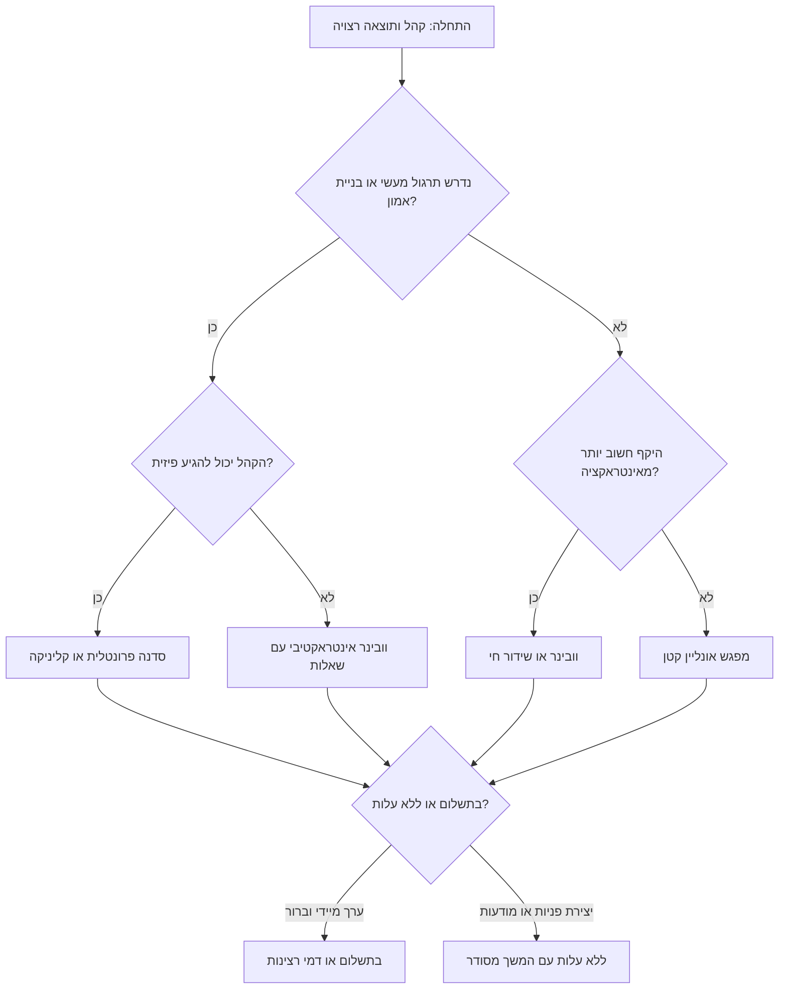
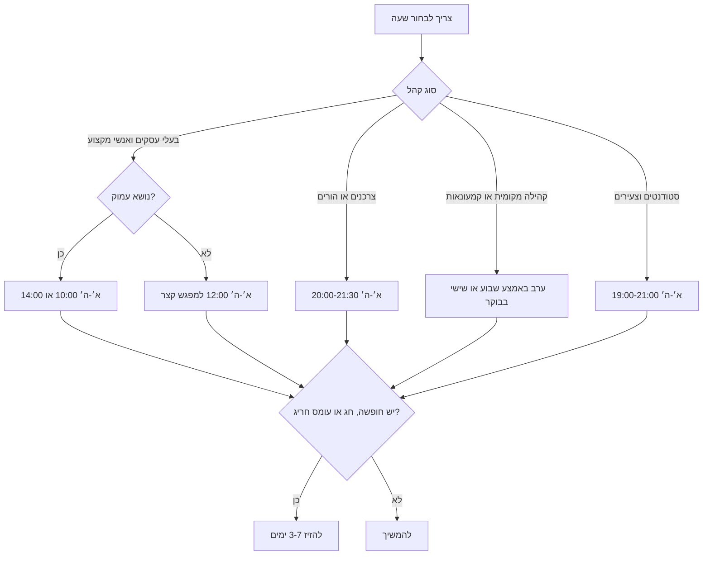
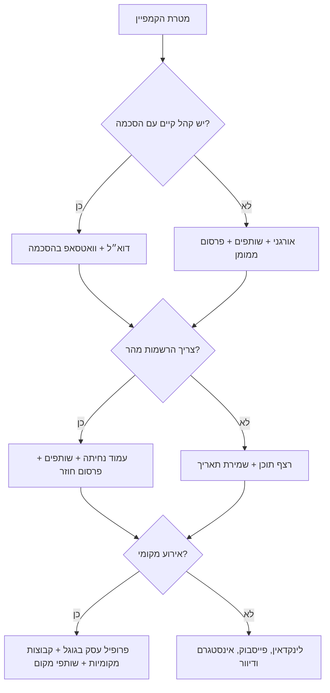

# מקדם אירועים וובינרים

תכנן, בדוק, כתוב, תזמן ושפר קמפיינים לקידום אירועים וובינרים לקהל ישראלי. הכלי מתאים לעסקים קטנים, פרילנסרים, יועצים, יוצרים, מדריכים, קהילות מקצועיות, נותני שירותים מקומיים וארגונים שפונים לצרכנים בישראל.

ברירת המחדל היא פעילות בישראל: אזור זמן `Asia/Jerusalem`, כתיבה בעברית טבעית, מחירים בש״ח, תאריכים בפורמט `DD/MM/YYYY`, רגישות לשבוע עבודה ישראלי, חגים, חופשות, הרגלי וואטסאפ, והקפדה תפעולית על הסכמה, הסרה, נגישות ופרטיות.

## תוצרים מרכזיים

השתמש בכלי כדי להכין:

- תוכנית מלאה לקידום אירוע, סדנה, וובינר או מפגש.
- עמוד הרשמה בעברית.
- פוסטים לרשתות חברתיות.
- הודעות וואטסאפ, SMS ודוא״ל רק כאשר קיימת הסכמה מתאימה.
- רצף תזכורות לפני האירוע ואחריו.
- לוח זמנים לפי שעון ישראל.
- קישורי UTM למדידת ערוצים.
- רשימות בדיקה לנגישות, פרטיות, דיוור, ביטולים ותנאי השתתפות.
- תוכנית פעולה במקרה של הרשמה נמוכה, דחייה, ביטול או תפוסה מלאה.

## מתי להשתמש

השתמש בכלי כאשר נדרש:

- לקדם סדנה, הרצאה, מפגש לקוחות, וובינר, יום פתוח, השקה, הדרכה מקצועית, מפגש קהילה או שידור חי.
- לנסח קופי בעברית לקהל ישראלי.
- לבחור זמן מתאים לאירוע לפי סוג הקהל.
- לבנות רצף הודעות לפני ואחרי האירוע.
- לבדוק האם הקמפיין ברור, מדיד, נגיש וזהיר מבחינה שיווקית.
- לתכנן קמפיין לעסק קטן ללא צוות שיווק גדול.

## מתי לא להשתמש

אל תשתמש בכלי כדי:

- לתת ייעוץ משפטי במקום עורך דין ישראלי.
- לשלוח דיוור פרסומי, SMS או הודעות וואטסאפ לרשימות ללא הסכמה או בסיס חוקי מתאים.
- ליצור לחץ שווא: “נותרו 2 מקומות” כשזה לא נכון.
- להסתיר מחיר, תנאי ביטול, מיקום או זהות מפרסם.
- להשתמש ברשימות קנויות.
- לעקוף בקשות הסרה.
- להבטיח הכנסה, תוצאות בריאותיות, תוצאות משפטיות או תוצאות עסקיות שאינן מובטחות.
- לקדם אירועים מטעים, מפלים, מסוכנים או בלתי חוקיים.

## ברירות מחדל ישראליות

| תחום | ברירת מחדל |
|---|---|
| אזור זמן | `Asia/Jerusalem` |
| פורמט תאריך | `DD/MM/YYYY`, לדוגמה `24/06/2026` |
| פורמט שעה | 24 שעות, לדוגמה `20:00` |
| מטבע | ₪ |
| שבוע עבודה | ראשון עד חמישי |
| שישי | מתאים בעיקר לבוקר ולאירועים מקומיים קצרים |
| שבת | להימנע כברירת מחדל, אלא אם הקהל מצפה לכך |
| שפה | עברית, אלא אם הקהל דובר אנגלית |
| טון | ברור, מקצועי, ישיר, חם ולא מנופח |
| תזכורות | 72 שעות, 24 שעות, בוקר האירוע, שעתיים לפני, אחרי האירוע |
| נגישות | לציין התאמות, הגעה, כתוביות/הקלטה כשיש, ופרטי קשר |
| פרטיות | לאסוף רק מידע הכרחי להרשמה ולתפעול |
| דיוור | לשלוח רק למי שנתן הסכמה או כאשר קיים בסיס חוקי מתאים |

## נתוני חובה לפני תכנון

ממשק JSON מקבל תאריכים בפורמט מכונה `DD-MM-YYYY`. קופי ומסמכים בעברית מציגים תאריכים בפורמט `DD/MM/YYYY`.


אם חסר מידע, השתמש בהנחה בטוחה וסמן אותה.

| שדה | חובה | ברירת מחדל בטוחה |
|---|---:|---|
| שם האירוע | כן | ליצור כותרת עבודה תיאורית |
| סוג האירוע | כן | וובינר אם אין מקום פיזי |
| תאריך ושעה | כן | 20:00 לצרכנים, 10:00 או 14:00 לקהל עסקי |
| משך | כן | 60 דקות לוובינר, 90 דקות לסדנה |
| קהל יעד | כן | להגדיר קהל ראשי אחד |
| הבטחת ערך | כן | לתאר תועלת מעשית וברורה |
| מחיר | לא | ללא עלות, אם לא צוין מחיר |
| קיבולת | לא | 100 אונליין, 20 פרונטלי |
| קישור/מיקום | לא | “קישור הרשמה יתווסף” |
| מנחה/מרצה | לא | להשתמש בשם העסק או בתפקיד מקצועי |
| סטטוס הסכמה לדיוור | חובה בערוצי דיוור ישיר | אם לא ידוע, לא לייצר דיוור ישיר |
| מטרת הקמפיין | לא | הרשמות תחילה, מכירה לאחר מכן |

## עץ החלטה: בחירת סוג האירוע



## עץ החלטה: בחירת זמן



## עץ החלטה: בחירת ערוצי קידום



## תהליך עבודה מלא

### 1. ניסוח הבטחת הערך

כתוב משפט אחד שמחבר בין קהל, כאב, תוצאה והוכחה.

תבנית:

> עבור **[קהל יעד]** שמתמודדים עם **[בעיה]**, ה-**[סוג אירוע]** הזה מראה איך להגיע ל-**[תוצאה]** באמצעות **[שיטה/ניסיון/דוגמה]**, כך שיוצאים עם **[תוצר מעשי]**.

דוגמה:

> עבור מטפלות ומטפלים עצמאיים שמתקשים למלא יומן פגישות, הוובינר הזה מראה איך לבנות שגרת הפניות ומעקב פשוטה בעזרת וואטסאפ, פרופיל עסק בגוגל ותוכן אמין, כך שיוצאים עם תהליך שבועי לגיוס פניות בלי לרדוף אחרי אנשים.

### 2. בדיקת התאמה שיווקית

בדוק:

- האם הכותרת מובנת תוך 3 שניות?
- האם התוצאה מעשית ולא מוגזמת?
- האם קהל היעד מספיק ממוקד?
- האם המחיר מתאים לערך?
- האם יש סיבה להגיע בזמן אמת?
- האם ברור מה קורה אחרי ההרשמה?
- האם נותר מספיק זמן לקדם את האירוע?
- האם קיים מסלול הסרה או יצירת קשר למי שמקבל הודעות ישירות?

### 3. בניית עמוד הרשמה

מבנה מינימלי:

1. כותרת, תאריך, שעה, מנחה, מחיר וכפתור הרשמה.
2. 3–5 תוצאות מעשיות.
3. למי זה מתאים ולמי פחות.
4. סדר יום קצר.
5. אמינות המנחה: ניסיון, דוגמאות, תחומי התמחות.
6. לוגיסטיקה: פלטפורמה, מיקום, משך, הקלטה, נגישות.
7. פרטיות, תנאי ביטול והסרה כשנדרש.
8. קריאה לפעולה חוזרת.

### 4. לוח זמנים לקידום

| סוג אירוע | זמן מינימלי | זמן מומלץ |
|---|---:|---:|
| וובינר ללא עלות | 7 ימים | 14–21 ימים |
| וובינר בתשלום | 14 ימים | 21–30 ימים |
| סדנה פרונטלית | 21 ימים | 30–45 ימים |
| מפגש חשיפה לקורס | 14 ימים | 30 ימים |
| אירוע צרכני מקומי | 10 ימים | 21 ימים |

### 5. כתיבה בעברית

כתוב בעברית טבעית, לא תרגום מאנגלית. העדף פשטות, תועלת ומילים מקומיות.

ניסוח טוב:

> סדנה מעשית לבעלי עסקים קטנים שרוצים להפוך פניות מוואטסאפ לשיחות מכירה מסודרות — בלי מערכת מסובכת ובלי לרדוף אחרי לקוחות.

ניסוח חלש:

> וובינר עוצמתי שישנה לכם את החיים ויטיס את העסק לשמיים.

### 6. רצף תזכורות

| זמן | ערוץ | מטרה |
|---|---|---|
| פתיחת הרשמה | דוא״ל, רשתות, וואטסאפ בהסכמה | להסביר ערך ולפתוח הרשמה |
| 72 שעות לפני | דוא״ל | להדגיש כאב ותועלת |
| 24 שעות לפני | דוא״ל + וואטסאפ/SMS בהסכמה | לוגיסטיקה וסיבה להגיע |
| בוקר האירוע | דוא״ל | קישור, שעה, ציפיות |
| שעתיים לפני | וואטסאפ/SMS בהסכמה | תזכורת קצרה |
| 1–3 שעות אחרי | דוא״ל | תודה, חומרים, שלב הבא |
| 24–48 שעות אחרי | דוא״ל | הצעה, שאלות נפוצות, דדליין אמיתי |
| סגירת הקלטה | דוא״ל | רק אם באמת יש תוקף מוגבל |

### 7. מדידה

מדוד:

- צפיות בעמוד הרשמה.
- שיעור הרשמה.
- הרשמות לפי UTM.
- שיעור הגעה בפועל.
- משך צפייה.
- השתתפות בצ׳אט ושאלות.
- צפייה בהקלטה.
- פגישות שנקבעו או רכישות.
- הסרות ותלונות.
- עלות להרשמה ועלות למשתתף שהגיע.

## דוגמאות מפורטות

### דוגמה א׳: וובינר לפרילנסרים

קלט:

```json
{
  "event_name": "איך לתמחר שירותים בלי להפסיד לקוחות",
  "format": "webinar",
  "audience": "פרילנסרים בתחילת הדרך",
  "date": "24-06-2026",
  "time": "20:00",
  "duration_minutes": 60,
  "price_nis": 0,
  "goal": "registrations"
}
```

המלצה:

- להתחיל קידום 14 ימים מראש.
- להשתמש בעמוד הרשמה קצר בעברית.
- לפרסם בלינקדאין, קבוצות פייסבוק רלוונטיות ורשימת דיוור מאושרת.
- לשלוח תזכורת 24 שעות ושעתיים לפני.
- להציע אחרי הוובינר פגישת ייעוץ קצרה בתשלום או שיחת התאמה.

קופי לפוסט:

> פרילנסרים בתחילת הדרך: אם כל הצעת מחיר מרגישה כמו ניחוש, הוובינר הזה יעשה סדר. ביום ד׳, 24/06/2026, בשעה 20:00, נעבור על שיטה פשוטה לחישוב מחיר, ניסוח הצעת מחיר והתמודדות עם לקוח שמבקש הנחה. ההשתתפות ללא עלות בהרשמה מראש.

### דוגמה ב׳: סדנה מקומית בתשלום

קלט:

```json
{
  "event_name": "סדנת צילום מוצרים בסמארטפון",
  "format": "workshop",
  "audience": "בעלי חנויות אונליין קטנות",
  "date": "15-07-2026",
  "time": "10:00",
  "duration_minutes": 180,
  "price_nis": 290,
  "city": "חיפה",
  "capacity": 18
}
```

המלצה:

- לקדם במשך 30 ימים.
- להשתמש בפרופיל עסק בגוגל, קבוצות מקומיות, סרטוני הדגמה קצרים באינסטגרם ושיתוף פעולה עם חלל עבודה או סטודיו.
- לציין “עד 18 משתתפים” רק אם הקיבולת אמיתית.
- לציין אם המחיר כולל מע״מ.
- לשלוח הודעת הכנה עם מה להביא.

קופי לכפתור:

> שמרו מקום לסדנה בחיפה — עד 18 משתתפים, עבודה מעשית על מוצרים אמיתיים, ותמונות שאפשר להעלות לחנות כבר באותו יום.

### דוגמה ג׳: וובינר B2B

קלט:

```json
{
  "event_name": "ניהול הרשאות וגישה בעסק קטן",
  "format": "webinar",
  "audience": "מנהלי תפעול ומנכ״לים בעסקים של 10-50 עובדים",
  "date": "30-06-2026",
  "time": "10:00",
  "duration_minutes": 45,
  "price_nis": 0,
  "goal": "qualified_leads"
}
```

המלצה:

- לקבוע לשעה 10:00.
- להשתמש בלינקדאין, דיוור שותפים והזמנות ישירות רק לקשרים רלוונטיים או נמענים עם הסכמה.
- להציע צ׳קליסט כמתנת הרשמה.
- להוסיף 10 דקות שאלות.

## מקרי קצה

### לא ידוע אם קיימת הסכמה לדיוור

אל תכין דיוור המוני ישיר. הכין במקום זאת:

- פוסטים אורגניים.
- הודעות לשותפים.
- עמוד הרשמה.
- הודעות אישיות לקשרים קיימים, ללא שפה פרסומית אגרסיבית.
- טופס שמאפשר הצטרפות לעדכונים עתידיים.

### אירוע בשבת

סמן סיכון. עבור רוב הקהלים העסקיים בישראל, עדיף להעביר לאחד מימי ראשון עד חמישי. אם מדובר בקהל שמצפה לפעילות בשבת, ציין זאת במפורש.

### אירוע בשישי אחר הצהריים

התרע על שיעור תגובה נמוך. עדיף שישי בבוקר לאירוע מקומי קצר או ראשון בערב לוובינר.

### אירועים המוניים או ציבוריים

באירוע ציבורי, גדול, פתוח, ממוסחר, כרטוסי או כזה שמתקיים במרחב שמוסדר על ידי רשות מקומית, הוסף בדיקת רישוי לפני קידום. הדרישות עשויות להיות תלויות ברשות המקומית, במקום, במספר המשתתפים, בטיחות, נגישות, משטרה, כבאות, תברואה, רעש ומבנים זמניים. אין להציג תוכנית קידום כתחליף לבדיקת רישוי עסק או אירוע.

### אירוע בתשלום ללא תנאי ביטול

הוסף מציין מקום לתנאי ביטול והמלץ על בדיקה משפטית לפני פרסום.

### קהל בינלאומי

השאר את שעון ישראל כשעון המקור והוסף אזור זמן נוסף. לדוגמה: `20:00 שעון ישראל / 13:00 שעון ניו יורק`.

### לא ברור אם תהיה הקלטה

אל תבטיח הקלטה. אם לא ברור, כתוב רק לאחר אישור: “הקלטה תישלח לנרשמים”.

### הרשמה נמוכה 72 שעות לפני האירוע

פעל כך:

1. בדוק אם הכותרת מבטיחה תוצאה ברורה.
2. בקש משותפים לפרסם מחדש.
3. פרסם טיפ קצר שמדגים את ערך האירוע.
4. פנה אישית לקשרים רלוונטיים כשיש הצדקה.
5. שקול דחייה רק אם מספר המשתתפים יפגע בחוויה.

### תפוסה מלאה

עצור קופי של מחסור. פתח רשימת המתנה, הסבר שהקיבולת מוגבלת, והצע תאריך נוסף אם קיים.

### פנייה מגדרית

העדף ניסוחים ניטרליים:

- “מי שרוצה ללמוד...”
- “משתתפים ומשתתפות”
- “בעלי ובעלות עסקים”
- “אפשר להצטרף” במקום “הירשם עכשיו” כשמתאים.

## תבניות קופי

### כותרת עמוד הרשמה

```text
[שם האירוע]
[תאריך], [שעה] | [אונליין/מיקום] | [מחיר]

ב-[משך] דקות תקבלו [תוצאה 1], [תוצאה 2] ו-[תוצר מעשי].
מיועד ל-[קהל יעד].
[כפתור הרשמה]
```

### תזכורת וואטסאפ בהסכמה

```text
היי, תזכורת קצרה: [שם האירוע] מתקיים היום בשעה [שעה].
קישור כניסה: [קישור]
מומלץ להיכנס 5 דקות לפני.
להסרה מעדכונים: [קישור/איש קשר]
```

### נושאי מייל

- `[שם האירוע] — ההרשמה נפתחה`
- `מחר ב-[שעה]: [תוצאה ספציפית]`
- `היום: קישור כניסה ופרטים חשובים`
- `הקלטה וחומרים מ-[שם האירוע]`
- `שאלה שחזרה בוובינר: [שאלה]`

## רשימת בדיקה רגולטורית ותפעולית

ערכי מס שנבדקו ב-03/06/2026: שיעור המע״מ הכללי הוא 18% החל מ-01/01/2025, ותקרת מחזור עוסק פטור לשנת 2026 שמופיעה בהנחיית רשות המסים היא ₪122,833. השתמש בזה כתזכורת תפעולית בלבד ובדוק שוב לפני פרסום קופי רגיש למס.


זוהי רשימת בדיקה תפעולית, לא ייעוץ משפטי.

- לזהות את המפרסם בצורה ברורה.
- לשלוח מסרים פרסומיים ישירים רק למי שנתן הסכמה או כשקיים בסיס חוקי מתאים.
- לכלול דרך הסרה פשוטה בדיוור ישיר.
- לשמור רשימות הסרה ולכבד אותן.
- לא להטעות לגבי מחיר, מועד, קיבולת, מיקום, הקלטה או בונוסים.
- לציין אם המחיר כולל מע״מ כאשר זה רלוונטי.
- לכלול תנאי ביטול והחזר באירוע צרכני בתשלום.
- לאסוף רק מידע הכרחי להרשמה.
- להסביר שימוש במידע בשפה פשוטה.
- לא לשתף רשימות נרשמים עם שותפים בלי הרשאה מתאימה.
- לכלול פרטי נגישות או איש קשר להתאמות.
- להשתמש בתמונות, מוזיקה וחומרים ברישיון מתאים.
- לשמור תיעוד של הסכמות, נוסחי קמפיין, עמוד הרשמה ותנאים.

## טעויות נפוצות

הימנע מ:

- “נותרו 3 מקומות” ללא ביסוס במערכת הרשמה.
- “הקלטה תישלח” כשאין הקלטה.
- שליחת הודעות וואטסאפ לרשימה מיובאת ללא הסכמה.
- הסתרת מחיר באירוע בתשלום.
- קביעת וובינר צרכני ב-15:00 ללא סיבה.
- פרסום ממומן לעמוד שאין בו תאריך, שעה, מנחה וכפתור הרשמה.
- כותרת כללית כמו “וובינר שיווק”.
- בקשת מספר תעודת זהות או כתובת כששם ודוא״ל מספיקים.
- שימוש בביטויים באנגלית כאשר יש עברית מקצועית וברורה.
- הבטחת הכנסה, לקוחות או תוצאות מובטחות.

## פתרון תקלות מהיר

| סימפטום | סיבה אפשרית | תיקון |
|---|---|---|
| הרבה קליקים, מעט הרשמות | ההבטחה לא ברורה או הטופס ארוך מדי | לחדד כותרת, לקצר טופס, להציג תאריך ושעה למעלה |
| הרבה נרשמים, מעט משתתפים | אין סיבה להגיע בזמן אמת | להוסיף תזכורות, יומן, שאלות ותמריץ להשתתפות |
| הרבה הסרות | תדירות גבוהה או קהל לא מתאים | לפלח רשימה ולהפחית הודעות |
| אין תגובות בוואטסאפ | אין הקשר אישי או אין הסכמה | לעבור לערוצים אורגניים או שותפים |
| פרסום ממומן לא ממיר | קהל רחב מדי או הצעה עמומה | לצמצם קהל ולבדוק כותרות |
| שאלות חוזרות על מיקום | פרטי הגעה חסרים | להוסיף כתובת, חניה, קומה, נגישות ושעת הגעה |
| אי-הגעה אחרי תשלום | אין תזכורות והכנה | לשלוח יומן, קבלה, פרטים ותזכורת יום לפני |

## צ׳קליסט לפני פרסום

- [ ] הכותרת מתארת תוצאה ברורה.
- [ ] תאריך, שעה, אזור זמן, משך, מחיר וסוג אירוע מופיעים בבירור.
- [ ] הקופי בעברית טבעית.
- [ ] הקריאה לפעולה אחת וברורה.
- [ ] קהל היעד מוגדר.
- [ ] סדר היום מעשי.
- [ ] אמינות המנחה עובדתית.
- [ ] סטטוס הסכמה ידוע לכל ערוץ ישיר.
- [ ] קיימת אפשרות הסרה.
- [ ] קיימת הודעת פרטיות קצרה.
- [ ] קיימים תנאי ביטול לאירוע בתשלום.
- [ ] קיימים פרטי נגישות.
- [ ] נוצרו קישורי UTM לכל ערוץ.
- [ ] התזכורות מתוזמנות לפי שעון ישראל.
- [ ] הזמנה ליומן כוללת אזור זמן נכון.
- [ ] שותפים יודעים לזהות את מארגן האירוע.
- [ ] נשמר תיעוד של נוסחים ותנאים.
- [ ] מייל המשך ותוכנית הקלטה מוכנים.
- [ ] קיימת תוכנית הרשמה נמוכה.
- [ ] קיימת דרך למדוד תוצאות.
