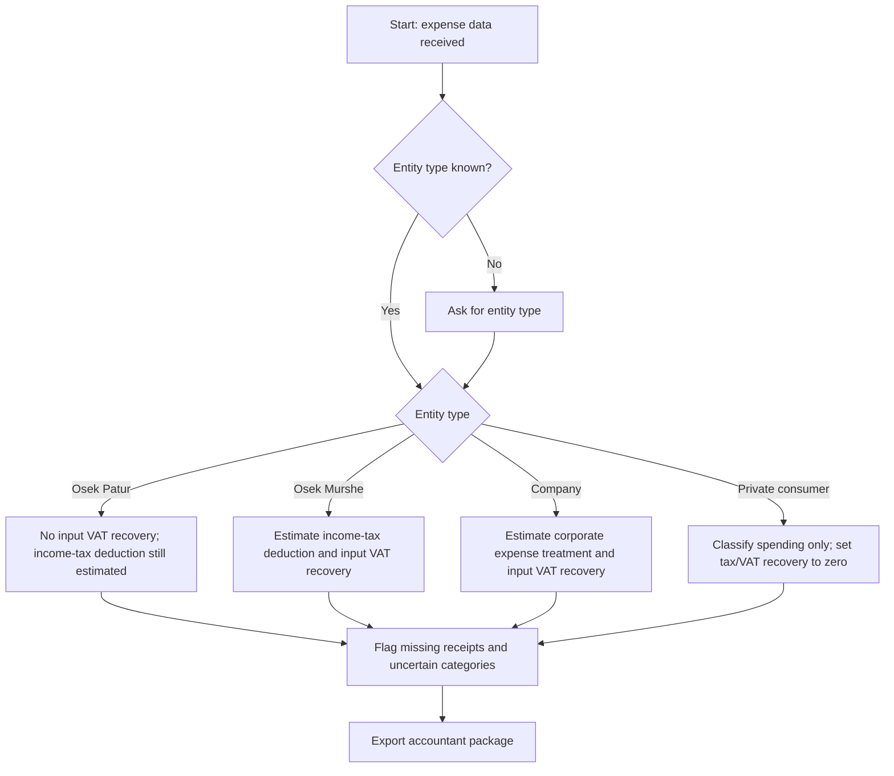
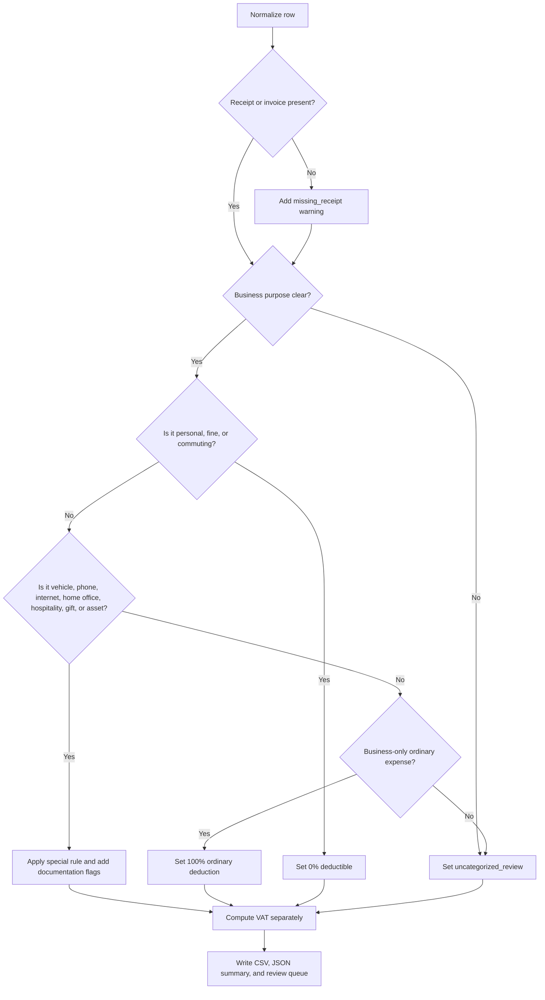

# Expense Manager

## Purpose

Use this skill to turn bank, credit-card, invoice, or free-text expense data into a structured accountant package. Classify each expense, estimate deductible portions, separate input VAT, flag missing documentation, and export CSV/JSON files suitable for accountant review and import into common Israeli bookkeeping systems.

Use it for:

- Osek Patur, Osek Murshe, company, and private-consumer tracking.
- Monthly expense cleanup before VAT or advance-payment review.
- Year-end accountant handoff.
- Duplicate, missing-invoice, and low-confidence review queues.
- Mapping expenses to an Israeli-style chart of accounts.

Do not use it for final filing, payroll, securities taxation, withholding-tax certification, or legal tax opinions.

## Operating principles

1. Preserve source data. Never overwrite the original CSV, Excel export, PDF receipt list, or bank statement.
2. Normalize every row to `date`, `vendor`, `amount`, `description`, `currency`, `receipt_number`, and `document_type`.
3. Ask for the entity type only when missing: `osek_patur`, `osek_murshe`, `company`, or `private_consumer`.
4. Estimate treatment conservatively. Unknown, mixed, or undocumented expenses go to review.
5. Keep Israeli VAT and income-tax treatment separate. A cost can be income-tax deductible but carry no input VAT recovery, especially for Osek Patur.
6. Export both machine-readable files and a human review summary.
7. Add a warning whenever a rule depends on an indexed cap, professional judgment, or missing invoice evidence.

## Required inputs

Minimum expense row:

```csv
date,vendor,amount,description
15/01/2026,Bezeq,234.00,Internet and phone for studio
```

Recommended row:

```csv
date,vendor,amount,currency,description,receipt_number,document_type,fx_rate_to_ils
15/01/2026,Bezeq,234.00,ILS,Internet and phone for studio,INV-8821,tax_invoice,1
```

Accepted date formats: `DD/MM/YYYY`, `YYYY-MM-DD`, `DD/MM/YYYY`, `YYYY/MM/DD`, and `DD.MM.YYYY`.

Accepted amount formats: `₪1,234.50`, `1,234.50`, `117`, and `(117)`.

## Core classification rules

| Category | Typical account code | Income-tax treatment | VAT treatment default | Documentation |
|---|---:|---:|---:|---|
| Professional services | 6700 | 100% | 100% for eligible VAT registrants | Tax invoice, engagement context |
| Software/SaaS/hosting | 6505 | 100% | 100% when business-only | Invoice, subscription evidence |
| Marketing/advertising | 6600 | 100% | 100% when business-only | Campaign invoice or receipt |
| Dedicated office rent | 6300 | 100% | 100% when a valid tax invoice exists | Lease and invoices |
| Home office | 6310 | Dedicated-area percentage | Usually the same percentage, subject to review | Floor-area calculation |
| Vehicle | 6400 | 45% default | Mixed-use limitation; default helper uses 66.67% of input VAT | Invoice; vehicle log for material amounts |
| Phone/internet | 6510 | 80% default | Mixed-use limitation; helper uses 66.67% of input VAT | Tax invoice |
| Workplace refreshments | 6555 | 80% default | 80% helper default | Invoice; workplace context |
| Domestic hospitality | 6620 | 0% default | 0% | Receipt retained for audit only |
| Foreign guest hospitality | 6625 | Potentially 100% subject to documentation | Potentially 100% subject to invoice | Guest identity, country, purpose |
| Business travel abroad | 6800 | Potentially 100%, caps may apply | Depends on invoice and jurisdiction | Itinerary, purpose, receipts |
| Office supplies | 6500 | 100% | 100% | Invoice |
| Capital equipment | 7800 | Depreciate above threshold | VAT may be recoverable, subject to eligibility | Asset register and invoice |
| Client gifts | 6630 | Capped per recipient per year | Subject to invoice and eligibility | Recipient list |
| Fines/penalties | 6990 | 0% | 0% | Keep notice outside deduction |
| Personal expenses | 9990 | 0% | 0% | Exclude from business books |

Treat all percentages as operational defaults for review. Require an accountant to confirm thresholds, caps, and final treatment before filing.

## Entity decision tree



## Expense classification decision tree



## Concrete examples

### Example 1: Osek Patur phone bill

Input:

```csv
date,vendor,amount,description
15/01/2026,Partner,234,Mobile phone and internet
```

Expected treatment:

- Category: `phone_internet`.
- Income-tax rate: 80% of the gross expense.
- VAT recovery: ₪0.00 because an Osek Patur cannot deduct input VAT.
- Review flag: missing tax invoice when no receipt number exists.

### Example 2: Osek Murshe software subscription

Input:

```csv
date,vendor,amount,description,receipt_number
10/02/2026,GitHub,117,Private repository hosting for client projects,GH-1001
```

Expected treatment:

- Category: `software_and_saas`.
- Gross: ₪117.00, net: ₪99.15, input VAT: ₪17.85 when the invoice includes Israeli VAT at 18%.
- Deductible income-tax base: net amount after recoverable VAT.
- Accountant should confirm foreign-service VAT handling when the vendor invoice is not Israeli.

### Example 3: Domestic client coffee

Input:

```csv
date,vendor,amount,description
21/03/2026,Aroma,58,Coffee with Israeli client
```

Expected treatment:

- Category: `domestic_hospitality`.
- Income-tax deduction: 0% by conservative default.
- VAT recovery: 0% by conservative default.
- Keep the receipt for audit trail, but exclude from deductible totals unless an accountant gives a documented exception.

### Example 4: Home office electricity

Input:

```csv
date,vendor,amount,description
05/04/2026,Israel Electric Corporation,500,Home electricity used partly for dedicated office
```

Configuration:

```bash
--home-office-percent 12.5
```

Expected treatment:

- Category: `home_office`.
- Deductible rate: 12.5%.
- Attach floor-area calculation and evidence that the room is used regularly and materially for the business.

### Example 5: Laptop purchase

Input:

```csv
date,vendor,amount,description,receipt_number
12/05/2026,KSP,5000,Laptop computer for design work,KSP-991
```

Expected treatment:

- Category: `capital_equipment`.
- Immediate income-tax deduction: ₪0.00 by default when above the immediate-expense threshold.
- Depreciation years: 3 by helper default.
- Add to asset register.

## Accountant-ready output structure

The helper creates:

```text
accountant-expense-package/
  README-accountant.md
  exports/
    expense-classification.csv
    import-mapping.json
  reports/
    accountant-summary.json
    sha256-manifest.txt
  source/
    original-import.csv
accountant-expense-package.zip
```

Use `expense-classification.csv` for row review and software import. Use `accountant-summary.json` for totals by category and account code. Use `sha256-manifest.txt` to prove that exported files were not silently changed after generation.

## Common Israeli accounting software export guidance

Most Israeli tools accept CSV/Excel imports after field mapping. Prepare these fields:

| Export field | Typical target meaning |
|---|---|
| `date` | Transaction/document date |
| `vendor` | Supplier name |
| `receipt_number` | Invoice/reference number |
| `account_code` | Expense card or chart-of-accounts code |
| `amount_ils` | Gross amount |
| `reclaimable_vat_ils` | Input VAT amount for eligible entities |
| `deductible_amount_ils` | Deductible expense estimate |
| `review_flags` | Rows that must be checked before import |

Validate target-specific import templates before upload. Hashavshevet, Rivhit, Priority, iCount, Green Invoice, and spreadsheet-based accountant workflows often use different column names.

## Edge cases

### Foreign currency

Require `fx_rate_to_ils`. Convert the gross amount to ₪ first, then compute net, VAT, and deductible amount. For foreign invoices, confirm whether Israeli VAT exists. If no Israeli VAT invoice exists, set recoverable VAT to zero manually.

### Credit-card refunds and negative rows

Keep refunds in the source audit trail. Convert negative rows to reversals in the accounting system instead of treating them as new expenses. Match refund rows to the original charge when possible.

### Split expenses

Split mixed purchases into separate rows. Example: an office-supply invoice that includes groceries should become `office_supplies` and `personal` rows.

### Missing invoice number

Flag `missing_receipt`. Do not remove the row. Keep it in the review queue and attach the invoice before import.

### Supplier names in Hebrew and English

Match both languages. Keep the original vendor string in exports. Avoid changing supplier names during normalization.

### Duplicate payments

Detect duplicates outside the helper by comparing date, amount, vendor, and receipt number. Send duplicate candidates to review rather than deleting automatically.

### Installments

Classify each installment according to the original purchase. Keep the original invoice number in every installment row.

### Cash expenses

Require receipt number and business purpose. Flag undocumented cash expenses.

### Gifts

Track annual amount by recipient. The helper applies a per-row cap only; maintain recipient-level annual control separately.

### Assets below threshold

The helper can expense small equipment immediately, but accountant policy may differ. Flag high-volume small assets for consistency review.

## Anti-patterns

- Marking restaurant meals with Israeli clients as 80% deductible.
- Recovering input VAT for Osek Patur.
- Treating every laptop, camera, or desk as an immediate expense when the value exceeds the threshold.
- Importing rows with `uncategorized_review` into bookkeeping software.
- Dropping rows with missing invoices instead of keeping a review queue.
- Mixing personal groceries and office refreshments in one row.
- Using bank statement text as proof of invoice existence.
- Applying home-office percentage without a documented dedicated workspace calculation.
- Assuming all foreign SaaS charges include recoverable Israeli VAT.
- Editing source bank exports directly.

## Troubleshooting quick guide

| Symptom | Likely cause | Action |
|---|---|---|
| All rows become `uncategorized_review` | Column names or descriptions are too sparse | Map headers and enrich descriptions |
| VAT appears for Osek Patur | Wrong entity type | Set `--entity-type osek_patur` |
| Home office shows 0% | Missing percentage | Set `--home-office-percent` |
| Restaurant row is 0% | Domestic hospitality rule matched | Confirm if foreign guest exception applies |
| Laptop has no immediate deduction | Above threshold and treated as asset | Add to depreciation schedule |
| CSV opens with garbled Hebrew | Wrong encoding in spreadsheet tool | Use UTF-8 with BOM output |

## Production checklist

Before sending to an accountant:

- Confirm entity type and fiscal year.
- Confirm VAT status and whether the entity can recover input VAT.
- Ensure every material row has an invoice or receipt number.
- Review every blocker flag.
- Confirm home-office percentage and keep the calculation.
- Confirm vehicle VAT rate and keep vehicle-use evidence when material.
- Split mixed purchases.
- Reconcile totals to bank and credit-card statements.
- Confirm foreign-currency rates.
- Confirm current indexed caps and thresholds.
- Run the test suite after changing rules.
- Create the ZIP package and retain the SHA-256 manifest.

## Commands

Classify a CSV:

```bash
python scripts/expense-manager-cli.py classify input.csv classified.csv --entity-type osek_murshe
```

Create a package:

```bash
python scripts/expense-manager-cli.py package input.csv ./out --package-name 2026-01-expenses --entity-type osek_murshe --home-office-percent 12.5
```

Classify one row:

```bash
python scripts/expense-manager-cli.py single --vendor Bezeq --amount 234 --date 15/01/2026 --description "Internet and phone"
```

## Professional review notice

Treat outputs as preparatory work. Require a licensed accountant or tax adviser to approve final VAT reports, annual returns, depreciation schedules, and classification policies.
