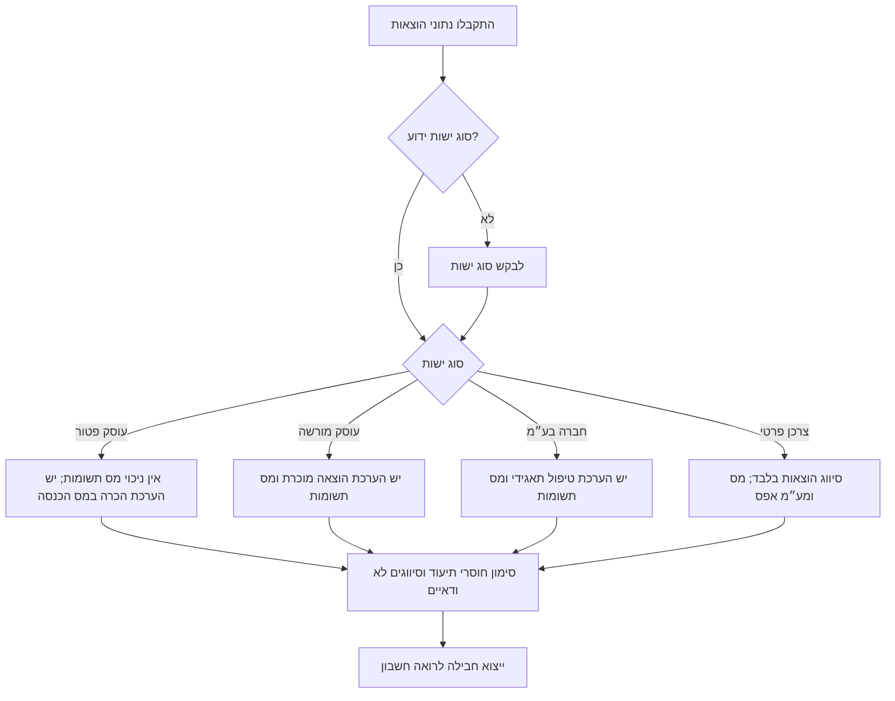
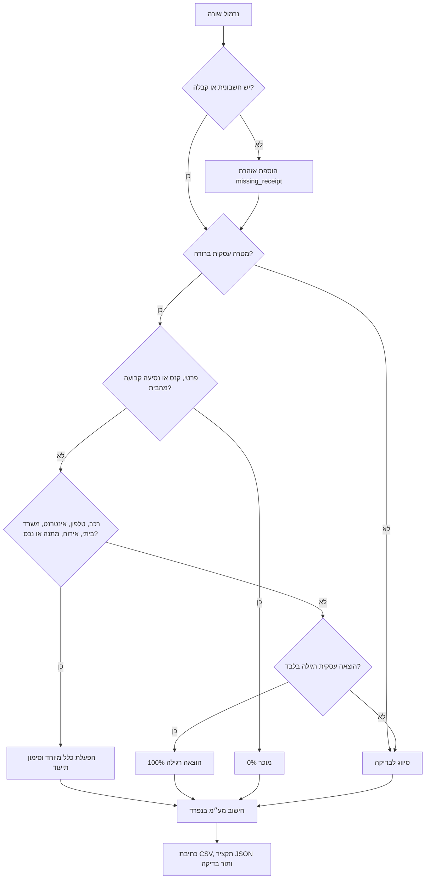

# ניהול הוצאות

## מטרת הכלי

יש להשתמש בכלי כדי להפוך נתוני הוצאות מקובצי בנק, כרטיס אשראי, חשבוניות או טקסט חופשי לחבילת עבודה מסודרת לרואה חשבון. הכלי מסווג כל הוצאה, מעריך את החלק המוכר במס הכנסה, מפריד מס תשומות, מסמן חוסרי תיעוד ומייצא קובצי קובצי CSV ו-JSON המתאימים לבדיקת רואה חשבון ולקליטה במערכות הנהלת חשבונות נפוצות בישראל.

מתאים ל:

- עוסק פטור, עוסק מורשה, חברה בע״מ ומעקב צרכני פרטי.
- ניקוי הוצאות חודשי לפני דיווח מע״מ או מקדמות.
- הכנת חומר סוף שנה.
- תור בדיקה עבור כפילויות, חשבוניות חסרות וסיווגים לא ודאיים.
- מיפוי הוצאות לכרטסת ישראלית.

אין להשתמש בכלי להגשה סופית, שכר, מיסוי ניירות ערך, אישורי ניכוי מס במקור או חוות דעת משפטית.

## עקרונות עבודה

1. יש לשמור את קובץ המקור ללא שינוי.
2. יש לנרמל כל שורה לשדות `date`, `vendor`, `amount`, `description`, `currency`, `receipt_number`, `document_type`.
3. יש לקבוע סוג ישות: `osek_patur`, `osek_murshe`, `company`, או `private_consumer`.
4. יש לבחור טיפול שמרני כאשר ההוצאה מעורבת, לא מתועדת או לא ברורה.
5. יש להפריד בין הכרה במס הכנסה לבין ניכוי מס תשומות. עוסק פטור אינו מנכה מע״מ גם כאשר ההוצאה מוכרת למס הכנסה.
6. יש לייצא גם קבצים למכונה וגם תקציר בדיקה אנושי.
7. יש לסמן אזהרה כאשר הכלל תלוי בתקרה צמודה, בשיקול דעת מקצועי או בחשבונית חסרה.

## קלט נדרש

שורת מינימום:

```csv
date,vendor,amount,description
15/01/2026,בזק,234.00,אינטרנט וטלפון לסטודיו
```

שורה מומלצת:

```csv
date,vendor,amount,currency,description,receipt_number,document_type,fx_rate_to_ils
15/01/2026,בזק,234.00,ILS,אינטרנט וטלפון לסטודיו,INV-8821,חשבונית מס,1
```

פורמטי תאריך נתמכים: `DD/MM/YYYY`, `YYYY-MM-DD`, `YYYY/MM/DD`, `DD.MM.YYYY`.

פורמטי סכום נתמכים: `₪1,234.50`, `1,234.50`, `117`, וגם `(117)`.

## כללי סיווג מרכזיים

| קטגוריה | קוד כרטיס טיפוסי | הכרה במס הכנסה | ברירת מחדל למע״מ | תיעוד נדרש |
|---|---:|---:|---:|---|
| שירותים מקצועיים | 6700 | 100% | 100% לנישום הזכאי לניכוי תשומות | חשבונית מס והקשר עסקי |
| תוכנה, שירותי ענן ואחסון | 6505 | 100% | 100% כאשר השימוש עסקי בלבד | חשבונית או מסמך חיוב |
| שיווק ופרסום | 6600 | 100% | 100% כאשר השימוש עסקי בלבד | חשבונית וקשר לקמפיין |
| שכירות משרד ייעודי | 6300 | 100% | 100% בכפוף לחשבונית מס תקינה | חוזה וחשבוניות |
| משרד ביתי | 6310 | לפי אחוז שטח ייעודי | לרוב לפי אותו אחוז, בכפוף לבדיקה | חישוב שטח |
| רכב | 6400 | 45% כברירת מחדל | הגבלת שימוש מעורב; ברירת מחדל 66.67% ממס התשומות | חשבונית; יומן רכב בסכומים מהותיים |
| טלפון ואינטרנט | 6510 | 80% כברירת מחדל | הגבלת שימוש מעורב; ברירת מחדל 66.67% ממס התשומות | חשבונית מס |
| כיבוד קל במקום העסק | 6555 | 80% כברירת מחדל | 80% כברירת מחדל | חשבונית והקשר למקום העסק |
| אירוח בארץ | 6620 | 0% כברירת מחדל | 0% | קבלה נשמרת לתיעוד בלבד |
| אירוח אורחי חוץ | 6625 | עשוי להיות 100% בכפוף לתיעוד | עשוי להיות 100% בכפוף לחשבונית | שם אורח, מדינה ומטרה עסקית |
| נסיעות עסקיות לחו״ל | 6800 | עשוי להיות 100%; ייתכנו תקרות | תלוי בחשבונית ובמדינה | מסלול, מטרה וקבלות |
| ציוד משרדי | 6500 | 100% | 100% | חשבונית |
| רכוש קבוע ופחת | 7800 | פחת מעל סף הוצאה מיידית | ייתכן ניכוי מע״מ לפי זכאות | חשבונית ורשימת רכוש קבוע |
| מתנות ללקוחות | 6630 | עד תקרה שנתית למקבל | בכפוף לחשבונית וזכאות | רשימת מקבלים |
| קנסות ועיצומים | 6990 | 0% | 0% | לשמור מחוץ לניכוי |
| הוצאה פרטית | 9990 | 0% | 0% | לא לקלוט כהוצאה עסקית |

האחוזים הם ברירות מחדל תפעוליות לבקרה. יש לאמת תקרות, שיעורים וסיווגים לפני דיווח סופי.

## עץ החלטה לסוג ישות



## עץ החלטה לסיווג הוצאה



## דוגמאות מעשיות

### דוגמה 1: חשבון טלפון לעוסק פטור

קלט:

```csv
date,vendor,amount,description
15/01/2026,פרטנר,234,טלפון נייד ואינטרנט
```

תוצאה צפויה:

- קטגוריה: `phone_internet`.
- שיעור הכרה למס הכנסה: 80% מהסכום ברוטו.
- ניכוי מע״מ: ₪0.00 כי עוסק פטור אינו מנכה מס תשומות.
- אזהרה: חסרה חשבונית כאשר אין מספר מסמך.

### דוגמה 2: מנוי תוכנה לעוסק מורשה

קלט:

```csv
date,vendor,amount,description,receipt_number
10/02/2026,GitHub,117,אחסון מאגרי קוד לפרויקטים של לקוחות,GH-1001
```

תוצאה צפויה:

- קטגוריה: `software_and_saas`.
- ברוטו: ₪117.00, נטו: ₪99.15, מס תשומות: ₪17.85 כאשר החשבונית כוללת מע״מ ישראלי בשיעור 18%.
- בסיס מס הכנסה: סכום נטו לאחר מע״מ הניתן לניכוי.
- יש לבדוק חיוב ספק זר בנפרד, מפני שלא כל חשבונית זרה כוללת מע״מ ישראלי הניתן לניכוי.

### דוגמה 3: קפה עם לקוח ישראלי

קלט:

```csv
date,vendor,amount,description
21/03/2026,ארומה,58,קפה עם לקוח ישראלי
```

תוצאה צפויה:

- קטגוריה: `domestic_hospitality`.
- הכרה במס הכנסה: 0% כברירת מחדל שמרנית.
- ניכוי מע״מ: 0% כברירת מחדל שמרנית.
- לשמור את הקבלה לתיעוד, אך לא לכלול בסכומים המוכרים ללא אישור מקצועי מפורש.

### דוגמה 4: חשמל למשרד ביתי

קלט:

```csv
date,vendor,amount,description
05/04/2026,חברת החשמל,500,חשמל בדירה המשמשת גם משרד ביתי
```

הגדרה:

```bash
--home-office-percent 12.5
```

תוצאה צפויה:

- קטגוריה: `home_office`.
- שיעור הכרה: 12.5%.
- לצרף חישוב שטח והסבר שהחדר משמש באופן קבוע ומהותי לעסק.

### דוגמה 5: רכישת מחשב נייד

קלט:

```csv
date,vendor,amount,description,receipt_number
12/05/2026,KSP,5000,מחשב נייד לעבודת עיצוב,KSP-991
```

תוצאה צפויה:

- קטגוריה: `capital_equipment`.
- הוצאה מיידית למס הכנסה: ₪0.00 כברירת מחדל כאשר הסכום מעל סף הוצאה מיידית.
- שנות פחת מוצעות: 3.
- להוסיף לרשימת רכוש קבוע.

## מבנה חבילת מסירה לרואה חשבון

```text
accountant-expense-package/
  README-accountant.md
  exports/
    expense-classification.csv
    import-mapping.json
  reports/
    accountant-summary.json
    sha256-manifest.txt
  source/
    original-import.csv
accountant-expense-package.zip
```

`expense-classification.csv` מיועד לבדיקה ולקליטה. `accountant-summary.json` מרכז סכומים לפי קטגוריה וכרטיס. `sha256-manifest.txt` מאפשר לוודא שהקבצים לא השתנו לאחר ההפקה.

## הנחיות ייצוא למערכות הנהלת חשבונות בישראל

מערכות רבות מקבלות CSV/Excel לאחר מיפוי שדות. להכין את השדות הבאים:

| שדה ייצוא | משמעות טיפוסית |
|---|---|
| `date` | תאריך מסמך/עסקה |
| `vendor` | שם ספק |
| `receipt_number` | מספר חשבונית/אסמכתא |
| `account_code` | כרטיס הוצאה |
| `amount_ils` | סכום ברוטו בש״ח |
| `reclaimable_vat_ils` | מס תשומות לניכוי |
| `deductible_amount_ils` | סכום הוצאה מוכרת להערכה |
| `review_flags` | שורות לבדיקה לפני קליטה |

יש לבדוק תבנית יבוא ספציפית לפני העלאה לחשבשבת, ריווחית, Priority, iCount, חשבונית ירוקה או גיליון עבודה של רואה החשבון.

## מקרי קצה

### מטבע זר

יש לספק `fx_rate_to_ils`. תחילה ממירים את הברוטו לש״ח, ורק לאחר מכן מחשבים נטו, מע״מ וסכום מוכר. בחשבוניות זרות יש לבדוק אם קיים מע״מ ישראלי. ללא חשבונית מס ישראלית, יש לקבוע מס תשומות לניכוי כ-₪0.00.

### החזרים וזיכויים בכרטיס אשראי

יש לשמור החזרים בתיעוד המקור. במערכת הנהלת החשבונות יש לקלוט אותם כזיכוי או היפוך של העסקה המקורית ולא כהוצאה חדשה.

### הוצאות מעורבות

יש לפצל רכישה מעורבת לשורות נפרדות. לדוגמה: חשבונית הכוללת טונר למשרד וגם קניות לבית תפוצל ל-`office_supplies` ו-`personal`.

### מספר חשבונית חסר

הכלי מסמן `missing_receipt`. אין למחוק את השורה. יש להשאיר בתור בדיקה ולצרף מסמך לפני קליטה.

### שמות ספקים בעברית ובאנגלית

יש לשמור את שם הספק המקורי. אין לתקן שמות ספקים בזמן הנרמול אלא אם קיימת טבלת ספקים מאושרת.

### כפילויות

יש לזהות כפילויות לפי תאריך, סכום, ספק ומספר חשבונית. אין למחוק אוטומטית; יש להעביר לבדיקה.

### תשלומים בתשלומים

יש לסווג כל תשלום לפי הרכישה המקורית ולהשאיר את מספר החשבונית המקורית בכל שורה.

### הוצאות במזומן

יש לדרוש קבלה ומטרה עסקית. הוצאה מזומן ללא תיעוד תסומן לבדיקה.

### מתנות

יש לעקוב אחר סכום שנתי לפי מקבל. הכלי מפעיל תקרה ברמת שורה בלבד; נדרש מעקב שנתי לפי מקבל מחוץ לכלי.

## טעויות נפוצות

- סיווג ארוחה עם לקוח ישראלי כהוצאה מוכרת של 80%.
- ניכוי מס תשומות לעוסק פטור.
- סיווג כל מחשב, מצלמה או שולחן כהוצאה מיידית אף שהסכום מעל הסף.
- קליטת שורות `uncategorized_review` ללא בדיקה.
- מחיקת שורות ללא חשבונית במקום השארתן בתור בדיקה.
- ערבוב קניות פרטיות וכיבוד משרדי באותה שורה.
- שימוש בדף בנק כהוכחה לקיום חשבונית.
- הפעלת אחוז משרד ביתי ללא חישוב שטח.
- הנחה שכל חיוב שירותי ענן מחו״ל כולל מע״מ ישראלי הניתן לניכוי.
- עריכת קובץ מקור של הבנק או כרטיס האשראי.

## פתרון תקלות מהיר

| סימפטום | סיבה סבירה | פעולה |
|---|---|---|
| כל השורות מסווגות לבדיקה | שמות עמודות לא מזוהים או תיאור דל | למפות כותרות ולהעשיר תיאור |
| מופיע מע״מ לעוסק פטור | סוג ישות שגוי | להגדיר `--entity-type osek_patur` |
| משרד ביתי מוצג 0% | חסר אחוז משרד ביתי | להגדיר `--home-office-percent` |
| מסעדה מוצגת 0% | זוהה כלל אירוח בארץ | לבדוק אם חל חריג של אורח חוץ |
| מחשב ללא הוצאה מיידית | מעל הסף ומטופל כרכוש קבוע | להוסיף לרשימת פחת |
| עברית משובשת ב-CSV | פתיחה בקידוד שגוי | להשתמש בפלט UTF-8 עם BOM |

## רשימת בדיקה לפני מסירה

- לאמת סוג ישות ושנת מס.
- לאמת סטטוס מע״מ וזכאות לניכוי תשומות.
- לוודא שלכל שורה מהותית יש חשבונית או קבלה.
- לבדוק כל דגל חוסם.
- לאמת אחוז משרד ביתי ולשמור חישוב שטח.
- לאמת שיעור מע״מ ברכב ולשמור תיעוד שימוש כאשר הסכום מהותי.
- לפצל רכישות מעורבות.
- להתאים סכומים לדפי בנק וכרטיס אשראי.
- לאמת שערי מטבע.
- לאמת תקרות וספים עדכניים.
- להריץ בדיקות לאחר שינוי כללים.
- ליצור ZIP ולשמור את קובץ ה-SHA-256.

## פקודות

סיווג CSV:

```bash
python scripts/expense-manager-cli.py classify input.csv classified.csv --entity-type osek_murshe
```

יצירת חבילה:

```bash
python scripts/expense-manager-cli.py package input.csv ./out --package-name 2026-01-expenses --entity-type osek_murshe --home-office-percent 12.5
```

סיווג שורה בודדת:

```bash
python scripts/expense-manager-cli.py single --vendor בזק --amount 234 --date 15/01/2026 --description "אינטרנט וטלפון"
```

## הודעת בקרה מקצועית

יש להתייחס לפלט כחומר הכנה. רואה חשבון או יועץ מס מוסמך חייב לאשר דיווחי מע״מ, דוחות שנתיים, לוחות פחת ומדיניות סיווג סופית.
