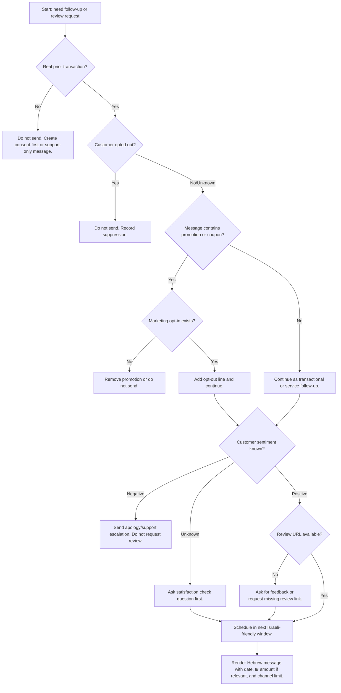

# Follow-Up & Review Solicitor

Use this skill to generate respectful Hebrew follow-up messages, payment reminders, appointment nudges, post-service check-ins, and review requests for Israeli small businesses, freelancers, and consumer-facing service providers. Optimize send timing for Israeli workweeks, Hebrew wording, ₪ amounts, DD/MM/YYYY dates, and common local expectations around WhatsApp, SMS, email, and Google Business Profile review links.

This skill is designed for lawful, consent-aware, transactional communication. Keep every message connected to a real customer interaction, avoid manipulative review gating, and include opt-out text when a message may be viewed as promotional.

## Core outcomes

Produce the following outputs:

1. A send plan with the recommended local send time in `Asia/Jerusalem`.
2. A Hebrew message ready for WhatsApp, SMS, email, or CRM insertion.
3. Compliance notes for consent, opt-out, privacy minimization, and review platform restrictions.
4. A fallback action when timing, consent, missing fields, or customer sentiment makes a review request unsuitable.
5. Structured payloads that can be passed to a CRM, SMS provider, WhatsApp Business provider, or manual copy-paste workflow.

## Use cases

Use the skill for:

- A freelancer asking for feedback after delivery of design, legal, writing, development, tax, tutoring, or consulting work.
- A beauty salon, clinic, garage, plumber, electrician, locksmith, or technician following up after a completed service visit.
- A shop checking whether a delivery arrived and then asking for a review only after a positive customer response.
- A bookkeeper or accountant sending a polite reminder for missing documents, payment, or approval of a report.
- A gym, course provider, or therapist sending appointment reminders without sensitive details.
- A consumer who needs a polite Hebrew message to ask a seller, service provider, or landlord for a status update.

Do not use the skill for bulk advertising, bought reviews, fake reviews, coercive review requests, medical diagnosis follow-up, debt collection threats, or messages that bypass platform policies.

## Inputs

Collect or infer these fields. Use safe defaults when a field is missing.

| Field | Required | Example | Notes |
|---|---:|---|---|
| `business_name` | Yes | `דוגמה שירותי חשמל` | Use the name the customer recognizes. |
| `customer_name` | Optional | `נועה` | Use first name only unless the existing relationship is formal. |
| `event_type` | Yes | `service_completed`, `invoice_due`, `appointment_reminder`, `delivery_checkin`, `review_request` | Drives wording and timing. |
| `event_date` | Yes | `24/06/2026` | Localize as DD/MM/YYYY. |
| `channel` | Yes | `whatsapp`, `sms`, `email`, `phone_script` | WhatsApp is common but not always appropriate. |
| `amount_ils` | Optional | `₪450` | Use for invoices and payment reminders only. |
| `review_url` | Optional | Google Business Profile review link | Required for direct review request. |
| `sentiment` | Optional | `positive`, `neutral`, `negative`, `unknown` | Request reviews only for positive or confirmed-satisfied customers. |
| `consent_status` | Recommended | `transactional`, `marketing_opt_in`, `opted_out`, `unknown` | Do not send promotional text to opted-out contacts. |
| `urgency` | Optional | `low`, `normal`, `high` | Urgent messages may use earlier windows but still avoid rest hours. |
| `business_type` | Optional | `freelancer`, `retail`, `service`, `clinic`, `accountant` | Improves phrasing and sensitive-field handling. |

## Timing model for Israeli audiences

Default timezone: `Asia/Jerusalem`.

| Message type | Primary window | Secondary window | Avoid |
|---|---|---|---|
| Post-service check-in | Same day 18:00-20:30 or next business day 09:30-11:30 | Sunday-Thursday 12:00-13:30 | Friday afternoon, Saturday, late evening |
| Review request after positive reply | 10-30 minutes after positive signal | Next business day 10:00 | Asking before satisfaction is confirmed |
| Appointment reminder | Previous business day 17:00-19:30 | Same day 08:30-10:00 | Saturday; too late for rescheduling |
| Payment reminder | Sunday-Thursday 09:30-12:30 | Sunday-Thursday 16:00-18:00 | Thursday late evening; Friday after 12:00 |
| Missing documents | Sunday-Thursday 09:00-12:00 | Sunday-Thursday 15:00-17:00 | Month-end panic wording |
| Delivery check-in | 1 day after delivery, 10:00-12:00 | 18:00-20:00 | Immediate review request before delivery is confirmed |

Hard rules:

- Do not schedule non-urgent messages on Saturday.
- Do not schedule Friday messages after 12:30 unless explicitly requested by the user.
- Do not schedule between 21:00 and 08:00.
- Treat Jewish and Israeli holidays as blackout periods when the business has not configured holiday-specific availability.
- For B2B accounting, legal, or office services, prefer Sunday-Thursday morning.
- For home services and retail, evening check-ins can work when the service happened the same day.

## Decision tree



## Message strategy

Follow these rules:

- Use short Hebrew sentences.
- Prefer neutral wording that works for any customer gender.
- Avoid exaggerated praise, pressure, and emotional manipulation.
- Use the customer's first name only when available.
- Keep SMS under 300 characters when possible.
- Put the review link at the end.
- Use `תודה` and `אפשר` instead of demanding language.
- Use `חוות דעת` rather than transliteration of "review".
- Use `חשבונית מס/קבלה`, `אישור תשלום`, `מסמכים חסרים`, and `דו"ח מע"מ` where relevant.
- Do not mention sensitive service details in reminders for clinics, therapy, legal, or debt matters.

## Template patterns

### Service completion check-in

```text
היי {customer_name}, תודה שבחרת ב{business_name}. רציתי לוודא שהכול תקין אחרי השירות מ-{event_date}. אם יש משהו שדורש טיפול נוסף, אפשר לענות כאן ואטפל בזה בהקדם.
```

Use this before a review request when sentiment is unknown.

### Review request after positive signal

```text
היי {customer_name}, תודה על העדכון. אם השירות היה טוב עבורך, אפשר להשאיר חוות דעת קצרה כאן:
{review_url}
זה עוזר ללקוחות נוספים להבין למה לצפות. תודה רבה.
```

Do not send this when the customer complained, asked for a refund, or has not confirmed satisfaction.

### Payment reminder

```text
היי {customer_name}, תזכורת נעימה לגבי חשבונית מס/קבלה מ-{event_date} על סך {amount_ils}. אפשר להסדיר תשלום כאן:
{payment_url}
אם התשלום כבר בוצע, אפשר להתעלם מההודעה. תודה.
```

Use this only for legitimate payment follow-up. Do not include threats or legal claims unless a qualified professional provided approved text.

### Missing documents for accountant or bookkeeper

```text
היי {customer_name}, חסרים עדיין מסמכים להשלמת הדיווח עבור {period_label}. נא לשלוח את החשבוניות/קבלות החסרות עד {due_date} כדי לאפשר הגשה בזמן. תודה.
```

Avoid exposing tax identifiers or financial details in SMS.

### Delivery check-in

```text
היי {customer_name}, רציתי לוודא שהמשלוח מ-{event_date} הגיע תקין. אם יש בעיה, אפשר לענות כאן. אם הכול בסדר, תודה על הבחירה ב{business_name}.
```

Ask for a review only after the customer confirms that the delivery is fine.

### Appointment reminder

```text
היי {customer_name}, תזכורת לפגישה עם {business_name} בתאריך {event_date} בשעה {appointment_time}. אם צריך לשנות מועד, נא לעדכן מראש. תודה.
```

For healthcare, therapy, legal, or other sensitive services, avoid service details beyond time and location.

## Edge cases

| Case | Correct behavior |
|---|---|
| Customer is unhappy | Send service recovery. Do not request review. |
| Review URL missing | Return missing-field action or ask for private feedback only. |
| Customer name missing | Use `היי,` and avoid awkward placeholders. |
| Business name missing | Ask for or require the business name before customer-facing send. |
| Mixed Hebrew and English brand | Keep brand names as provided; use real Hebrew legal/accounting terms. |
| Friday after noon | Move to Sunday morning unless the message is urgent and transactional. |
| Saturday request | Move to Sunday 09:30 for non-urgent communication. |
| Opted-out customer | Do not send. Record suppression. |
| Marketing coupon in review request | Remove coupon or require marketing consent; avoid incentivized reviews. |
| B2C cancellation rights | Do not imply that a review changes cancellation, refund, warranty, or legal rights. |

Service recovery template:

```text
היי {customer_name}, תודה שעדכנת. חשוב לטפל בזה כמו שצריך. אפשר לשלוח כאן פירוט קצר או תמונה, ואבדוק את הנושא בהקדם.
```

## Anti-patterns

| Anti-pattern | Why it fails | Better option |
|---|---|---|
| `תן לנו 5 כוכבים` | Pressures the customer and biases the review. | `אפשר להשאיר חוות דעת קצרה`. |
| `רק אם היית מרוצה, דרג אותנו` | Review gating can violate platform rules. | Ask for feedback first, then request a review after a positive reply. |
| Sending at 23:10 | Feels intrusive. | Schedule the next friendly window. |
| Coupon for review | Can be treated as incentivized review. | Thank the customer without a reward. |
| Mentioning medical/tax details in SMS | Creates privacy risk. | Use generic wording and secure portal links. |
| Bulk review blasts to old contacts | Consent and relevance risk. | Segment recent completed transactions only. |
| Ignoring complaints | Damages trust. | Escalate to support and pause review flow. |
| Overly formal legal tone | Sounds threatening. | Use polite, factual wording. |

## Production checklist

Before activating an automation:

- Confirm that every recipient has a real recent transaction or service interaction.
- Store consent status, opt-out status, channel preference, and last-contact date.
- Add a suppression list for opted-out contacts and unresolved complaints.
- Configure Israeli blackout periods, Friday cutoff, Saturday block, and holiday calendar.
- Use different templates for check-in, review request, payment reminder, and missing documents.
- Remove sensitive details from SMS and WhatsApp notifications.
- Keep review requests neutral and do not ask for a specific rating.
- Add opt-out text when the message can be interpreted as marketing.
- Log message ID, template ID, timestamp, channel, and status.
- Rate-limit sends per customer and per business.
- Test links on mobile before use.
- Keep a manual approval step for sensitive industries.
- Keep records needed for privacy and spam-law compliance.
- Review the latest legal requirements with qualified counsel before high-volume sending.
- If adding VAT calculations to invoice reminders, verify the current Israel Tax Authority VAT rate; the package only formats supplied ₪ amounts.

## Troubleshooting quick table

| Symptom | Likely cause | Fix |
|---|---|---|
| Message scheduled on Saturday | Calendar rules not enabled | Force an Israeli business calendar. |
| Customer receives duplicate WhatsApp | CRM and automation both active | Use idempotency keys per customer/event. |
| Review request sent to unhappy customer | Sentiment not captured | Require positive signal before review template. |
| SMS is cut off | Message exceeds segment limit | Use shorter template and move details to link. |
| Wrong currency format | Locale missing | Format as `₪1,250` and avoid `$`. |
| Date confusion | US date format used | Use `DD/MM/YYYY`. |
| Customer asks to stop | Opt-out not persisted | Add contact to suppression list immediately. |
| Link preview looks suspicious | Shortener or tracking domain | Use recognizable domain or platform link. |

## End-to-end examples

### Electrician after successful visit

Input:

```json
{
  "business_name": "אור חשמל",
  "customer_name": "דנה",
  "event_type": "service_completed",
  "event_date": "03/06/2026",
  "channel": "whatsapp",
  "sentiment": "unknown"
}
```

Output:

```text
היי דנה, תודה שבחרת באור חשמל. רציתי לוודא שהכול תקין אחרי השירות מ-03/06/2026. אם יש משהו שדורש טיפול נוסף, אפשר לענות כאן ואטפל בזה בהקדם.
```

Recommended send: same day 18:30 if before 20:30; otherwise next business day 09:30.

### Positive reply then review request

```json
{
  "business_name": "אור חשמל",
  "customer_name": "דנה",
  "event_type": "review_request",
  "event_date": "03/06/2026",
  "channel": "whatsapp",
  "sentiment": "positive",
  "review_url": "https://g.page/r/example/review"
}
```

Output:

```text
היי דנה, תודה על העדכון. אם השירות היה טוב עבורך, אפשר להשאיר חוות דעת קצרה כאן:
https://g.page/r/example/review
זה עוזר ללקוחות נוספים להבין למה לצפות. תודה רבה.
```

### Accountant missing documents

```text
היי יואב, חסרים עדיין מסמכים להשלמת הדיווח עבור מאי 2026. נא לשלוח את החשבוניות/קבלות החסרות עד 10/06/2026 כדי לאפשר הגשה בזמן. תודה.
```

## Output contract

```json
{
  "should_send": true,
  "recommended_send_at": "2026-06-04T18:30:00+03:00",
  "timezone": "Asia/Jerusalem",
  "channel": "whatsapp",
  "intent": "service_completed",
  "message_he": "היי דנה...",
  "compliance_notes": [
    "Transactional follow-up tied to a recent service.",
    "No promotional offer included.",
    "No sensitive service details included."
  ],
  "fallback_action": null
}
```

When a message must not be sent:

```json
{
  "should_send": false,
  "recommended_send_at": null,
  "message_he": "",
  "compliance_notes": [
    "Contact is opted out."
  ],
  "fallback_action": "Suppress contact and do not send review request."
}
```

## Escalation rules

Escalate to a human before sending when:

- The customer expressed anger, refund demand, legal threat, or safety concern.
- The message involves medical, therapy, legal, debt, insurance, tax investigation, or minors.
- The request includes a discount or reward in exchange for a review.
- The user asks to remove negative reviews, create fake reviews, or pressure customers.
- Consent status is missing for promotional text.
- The business wants to send high-volume campaigns to old contacts.

## Maintenance

Keep templates versioned. Review logs monthly. Update blackout dates yearly. Verify current legal requirements and channel policies before production use.
