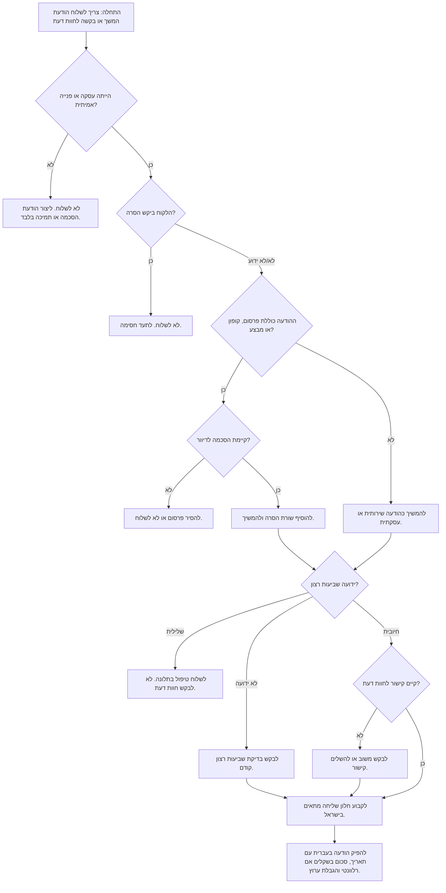

# מבקש חוות דעת והודעות המשך

השתמשו בסקיל זה כדי ליצור הודעות המשך בעברית, תזכורות תשלום, תזכורות לפגישות, בדיקת שביעות רצון ובקשות לחוות דעת עבור עסקים קטנים, עצמאים ונותני שירות בישראל. הסקיל מתאים לתקשורת ב-וואטסאפ, במסרון, בדוא"ל, במערכת ניהול לקוחות או כהודעה להעתקה ידנית.

הפלט מותאם לשבוע העבודה בישראל, לשפה עברית טבעית, לסכומים בשקלים, לתאריכים בפורמט `DD/MM/YYYY`, ולציפיות מקובלות של לקוחות בישראל. יש להשתמש בו רק לתקשורת לגיטימית, מכבדת ומבוססת קשר שירותי אמיתי.

## מטרות הסקיל

הסקיל מפיק:

1. מועד שליחה מומלץ לפי שעון ישראל.
2. הודעה בעברית מוכנה לשליחה.
3. הערות ציות לגבי הסכמה, הסרה מרשימת תפוצה, פרטיות ובקשות לחוות דעת.
4. פעולה חלופית כאשר לא נכון לבקש חוות דעת.
5. פלט מובנה לשילוב עם מערכת ניהול לקוחות, ספק מסרון, וואטסאפ Business או תהליך ידני.

## מתי להשתמש

מתאים במיוחד ל:

- עצמאים אחרי מסירת עבודה: עיצוב, פיתוח, כתיבה, ייעוץ, הדרכה, הנהלת חשבונות או שירות מקצועי אחר.
- מספרה, קוסמטיקאית, מוסך, טכנאי, חשמלאי, אינסטלטור, מנעולן או מתקין אחרי ביקור שירות.
- חנות או עסק מקוון שמוודאים שהמשלוח הגיע תקין.
- רואה חשבון או מנהל חשבונות שמזכיר על מסמכים חסרים, תשלום, אישור דו"ח מע"מ או חשבונית מס/קבלה.
- קליניקה או נותן שירות רגיש שצריכים תזכורת כללית בלי לחשוף פרטים רפואיים או אישיים.
- צרכן שרוצה לנסח הודעת מעקב מנומסת בעברית לספק, מוכר, בעל מקצוע או משכיר.

לא מתאים ל: פרסום המוני ללא הסכמה, חוות דעת מזויפות, קניית ביקורות, לחץ להשאיר דירוג חיובי, שליחה למי שביקש הסרה, או הודעות עם פרטים רגישים בערוץ לא מאובטח.

## שדות קלט

| שדה | חובה | דוגמה | הערות |
|---|---:|---|---|
| `business_name` | כן | `אור חשמל` | שם שהלקוח מזהה. |
| `customer_name` | לא | `דנה` | עדיף שם פרטי בלבד. |
| `event_type` | כן | `service_completed`, `invoice_due`, `appointment_reminder`, `delivery_checkin`, `review_request` | קובע נוסח ותזמון. |
| `event_date` | כן | `24/06/2026` | תאריך בפורמט ישראלי. |
| `channel` | כן | `whatsapp`, `sms`, `דואל`, `phone_script` | וואטסאפ נפוץ, אך לא מתאים לכל מקרה. |
| `amount_ils` | לא | `₪450` | רק לתשלומים וחשבוניות. |
| `review_url` | לא | קישור לחוות דעת בגוגל | נדרש לבקשה ישירה לחוות דעת. |
| `sentiment` | מומלץ | `positive`, `neutral`, `negative`, `unknown` | לבקש חוות דעת רק אחרי שביעות רצון ברורה. |
| `consent_status` | מומלץ | `transactional`, `marketing_opt_in`, `opted_out`, `unknown` | לא לשלוח פרסום למי שביקש הסרה. |
| `urgency` | לא | `low`, `normal`, `high` | גם הודעה דחופה לא נשלחת בשעות מנוחה. |
| `business_type` | לא | `freelancer`, `retail`, `service`, `clinic`, `accountant` | משפר את הניסוח והסרת פרטים רגישים. |

## מודל תזמון לקהל ישראלי

אזור זמן ברירת מחדל: `Asia/Jerusalem`.

| סוג הודעה | חלון מומלץ | חלון חלופי | להימנע מ |
|---|---|---|---|
| בדיקה אחרי שירות | אותו יום 18:00-20:30 או יום עסקים הבא 09:30-11:30 | א'-ה' 12:00-13:30 | שישי בצהריים, שבת, לילה |
| בקשה לחוות דעת אחרי תגובה חיובית | 10-30 דקות אחרי סימן חיובי | יום עסקים הבא 10:00 | בקשה לפני בדיקת שביעות רצון |
| תזכורת לפגישה | יום עסקים קודם 17:00-19:30 | אותו יום 08:30-10:00 | שבת או שליחה מאוחרת מדי |
| תזכורת תשלום | א'-ה' 09:30-12:30 | א'-ה' 16:00-18:00 | חמישי מאוחר, שישי אחרי 12:00 |
| מסמכים חסרים | א'-ה' 09:00-12:00 | א'-ה' 15:00-17:00 | ניסוח מלחיץ בסוף חודש |
| בדיקת משלוח | יום אחרי מסירה, 10:00-12:00 | 18:00-20:00 | בקשת חוות דעת לפני אישור שהמשלוח תקין |

כללי בסיס:

- אין לקבוע הודעות לא דחופות לשבת.
- אין לקבוע הודעות לשישי אחרי 12:30 אלא אם מדובר בבקשה מפורשת ודחופה.
- אין לשלוח בין 21:00 ל-08:00.
- בחגים ישראליים ויהודיים יש להשתמש ברשימת חסימה עסקית.
- לשירותים משרדיים, חשבונאיים ומשפטיים עדיף בוקר בימים א'-ה'.
- לשירותי בית וקמעונאות אפשר להשתמש בערב, בעיקר אחרי שירות שבוצע באותו יום.

## עץ החלטה



## אסטרטגיית ניסוח

הקפידו על:

- משפטים קצרים וברורים בעברית.
- ניסוח שמתאים לכל לקוח או לקוחה בלי פנייה מגדרית בעייתית.
- הימנעות מלחץ, התחנפות מוגזמת או בקשה לדירוג מסוים.
- שימוש בשם פרטי בלבד כאשר קיים.
- הודעת מסרון קצרה ככל האפשר.
- קישור לחוות דעת בסוף ההודעה.
- שימוש במונחים עבריים: `חוות דעת`, `חשבונית מס/קבלה`, `אישור תשלום`, `מסמכים חסרים`, `דו"ח מע"מ`.
- הסתרת פרטים רגישים בתזכורות לקליניקות, עורכי דין, מטפלים, ביטוח, חובות או קטינים.

## תבניות מומלצות

### בדיקה אחרי שירות

```text
היי {customer_name}, תודה שבחרת ב{business_name}. רציתי לוודא שהכול תקין אחרי השירות מ-{event_date}. אם יש משהו שדורש טיפול נוסף, אפשר לענות כאן ואטפל בזה בהקדם.
```

שימוש: כאשר שביעות הרצון עדיין לא ידועה.

### בקשה לחוות דעת אחרי תגובה חיובית

```text
היי {customer_name}, תודה על העדכון. אם השירות היה טוב עבורך, אפשר להשאיר חוות דעת קצרה כאן:
{review_url}
זה עוזר ללקוחות נוספים להבין למה לצפות. תודה רבה.
```

אין לשלוח אחרי תלונה, דרישת החזר, ביטול או חוסר שביעות רצון.

### תזכורת תשלום

```text
היי {customer_name}, תזכורת נעימה לגבי חשבונית מס/קבלה מ-{event_date} על סך {amount_ils}. אפשר להסדיר תשלום כאן:
{payment_url}
אם התשלום כבר בוצע, אפשר להתעלם מההודעה. תודה.
```

יש להשתמש רק לתזכורת לגיטימית. אין לכלול איומים או ניסוח משפטי ללא אישור מקצועי.

### מסמכים חסרים לרואה חשבון או מנהל חשבונות

```text
היי {customer_name}, חסרים עדיין מסמכים להשלמת הדיווח עבור {period_label}. נא לשלוח את החשבוניות/קבלות החסרות עד {due_date} כדי לאפשר הגשה בזמן. תודה.
```

אין לשלוח מזהים פיננסיים או מסמכים רגישים בתוך מסרון.

### בדיקת משלוח

```text
היי {customer_name}, רציתי לוודא שהמשלוח מ-{event_date} הגיע תקין. אם יש בעיה, אפשר לענות כאן. אם הכול בסדר, תודה על הבחירה ב{business_name}.
```

בקשה לחוות דעת תישלח רק לאחר אישור שהמשלוח תקין.

### תזכורת לפגישה

```text
היי {customer_name}, תזכורת לפגישה עם {business_name} בתאריך {event_date} בשעה {appointment_time}. אם צריך לשנות מועד, נא לעדכן מראש. תודה.
```

בקליניקה, טיפול, ייעוץ משפטי או שירות רגיש אחר אין לציין את סוג הטיפול.

## מקרי קצה

| מקרה | התנהגות נכונה |
|---|---|
| לקוח לא מרוצה | לשלוח הודעת טיפול. לא לבקש חוות דעת. |
| חסר קישור לחוות דעת | להחזיר פעולה להשלמת קישור או לבקש משוב פרטי בלבד. |
| חסר שם לקוח | להשתמש ב-`היי,` בלי משתנה ריק. |
| חסר שם עסק | להשלים שם עסק לפני שליחת הודעה ללקוח. |
| מותג באנגלית | להשאיר שם מותג כפי שנמסר ולהשתמש במונחים עבריים קיימים. |
| שישי אחרי הצהריים | להעביר ליום ראשון בבוקר, למעט הודעה דחופה ושירותית. |
| שבת | להעביר ליום ראשון 09:30. |
| לקוח שביקש הסרה | לא לשלוח ולתעד חסימה. |
| קופון תמורת חוות דעת | להסיר קופון או לעצור שליחה. |
| זכויות צרכניות | לא לרמוז שחוות דעת משפיעה על ביטול, אחריות או החזר. |

הודעת טיפול בתלונה:

```text
היי {customer_name}, תודה שעדכנת. חשוב לטפל בזה כמו שצריך. אפשר לשלוח כאן פירוט קצר או תמונה, ואבדוק את הנושא בהקדם.
```

## דפוסים שגויים

| דפוס שגוי | הבעיה | חלופה |
|---|---|---|
| `תן לנו 5 כוכבים` | לחץ על הלקוח והטיית חוות דעת. | `אפשר להשאיר חוות דעת קצרה`. |
| `רק אם היית מרוצה, דרג אותנו` | עלול להיחשב סינון ביקורות. | בדיקת שביעות רצון קודם, בקשה רק אחרי תגובה חיובית. |
| שליחה ב-23:10 | פולשני ולא מכבד. | חלון ישראלי מתאים למחרת. |
| קופון עבור ביקורת | עלול להיחשב תמריץ אסור. | תודה ללא תגמול. |
| פירוט רפואי או פיננסי במסרון | סיכון פרטיות. | ניסוח כללי וקישור מאובטח. |
| שליחה המונית לאנשי קשר ישנים | סיכון הסכמה ורלוונטיות. | רק עסקאות אחרונות ומפולחות. |
| התעלמות מתלונות | פגיעה באמון. | טיפול אנושי והשהיית בקשת חוות דעת. |
| ניסוח משפטי מאיים | מייצר התנגדות וסיכון. | ניסוח עובדתי ומנומס. |

## צ'קליסט לפני הפעלה

- ודאו שלכל נמען יש עסקה, שירות או פנייה אמיתית מהתקופה האחרונה.
- שמרו סטטוס הסכמה, העדפת ערוץ, סטטוס הסרה ותאריך קשר אחרון.
- הפעילו רשימת חסימה למי שביקש הסרה או הגיש תלונה פתוחה.
- הגדירו חסימת שבת, מגבלת שישי, שעות שקטות ולוח חגים.
- הפרידו בין תבניות: בדיקה, חוות דעת, תשלום, מסמכים חסרים ותזכורת פגישה.
- הסירו פרטים רגישים מ-מסרון ומ-וואטסאפ.
- אל תבקשו דירוג מסוים.
- הוסיפו שורת הסרה כאשר ההודעה עשויה להיחשב פרסומית.
- תעדו מזהה הודעה, תבנית, מועד, ערוץ וסטטוס.
- הגבילו כמות שליחות לכל לקוח ולעסק.
- בדקו קישורים במובייל לפני הפעלה.
- השאירו אישור ידני לענפים רגישים.
- שמרו תיעוד לציות לחוקי פרטיות ודיוור.
- בדקו דרישות משפטיות עדכניות עם גורם מוסמך לפני שליחה בהיקף גדול.
- אם מוסיפים חישוב מע״מ לתזכורות תשלום, בדקו את שיעור המע״מ העדכני ברשות המסים; החבילה רק מעצבת סכומים קיימים ב-₪.

## תקלות נפוצות

| סימפטום | סיבה אפשרית | פתרון |
|---|---|---|
| הודעה נקבעה לשבת | כללי לוח שנה לא הופעלו | הפעילו לוח עבודה ישראלי. |
| הלקוח קיבל הודעה כפולה | מערכת ניהול לקוחות ואוטומציה פעילים יחד | השתמשו במפתח ייחודי לפי לקוח ואירוע. |
| בקשת חוות דעת נשלחה ללקוח כועס | חסר סימון שביעות רצון | דרשו סימן חיובי לפני בקשת חוות דעת. |
| מסרון נחתך | ההודעה ארוכה מדי | קצרו נוסח והעבירו פרטים לקישור. |
| סכום מופיע בדולרים | חסרה לוקליזציה | השתמשו ב-`₪1,250`. |
| תאריך לא ברור | פורמט אמריקאי | השתמשו ב-`DD/MM/YYYY`. |
| לקוח ביקש להפסיק | סטטוס הסרה לא נשמר | הוסיפו לרשימת חסימה מיד. |
| קישור נראה חשוד | דומיין מקוצר או לא מוכר | השתמשו בקישור מוכר וברור. |

## דוגמאות מקצה לקצה

### חשמלאי אחרי ביקור

```json
{
  "business_name": "אור חשמל",
  "customer_name": "דנה",
  "event_type": "service_completed",
  "event_date": "03/06/2026",
  "channel": "whatsapp",
  "sentiment": "unknown"
}
```

```text
היי דנה, תודה שבחרת באור חשמל. רציתי לוודא שהכול תקין אחרי השירות מ-03/06/2026. אם יש משהו שדורש טיפול נוסף, אפשר לענות כאן ואטפל בזה בהקדם.
```

מועד מומלץ: אותו יום 18:30 אם עדיין לפני 20:30; אחרת יום עסקים הבא 09:30.

### תגובה חיובית ואז בקשת חוות דעת

```text
היי דנה, תודה על העדכון. אם השירות היה טוב עבורך, אפשר להשאיר חוות דעת קצרה כאן:
https://g.page/r/example/review
זה עוזר ללקוחות נוספים להבין למה לצפות. תודה רבה.
```

### רואה חשבון ומסמכים חסרים

```text
היי יואב, חסרים עדיין מסמכים להשלמת הדיווח עבור מאי 2026. נא לשלוח את החשבוניות/קבלות החסרות עד 10/06/2026 כדי לאפשר הגשה בזמן. תודה.
```

## חוזה פלט

```json
{
  "should_send": true,
  "recommended_send_at": "2026-06-04T18:30:00+03:00",
  "timezone": "Asia/Jerusalem",
  "channel": "whatsapp",
  "intent": "service_completed",
  "message_he": "היי דנה...",
  "compliance_notes": [
    "הודעה שירותית המבוססת על שירות שבוצע לאחרונה.",
    "לא נכלל מבצע או פרסום.",
    "לא נכללו פרטים רגישים."
  ],
  "fallback_action": null
}
```

כאשר אין לשלוח:

```json
{
  "should_send": false,
  "recommended_send_at": null,
  "message_he": "",
  "compliance_notes": [
    "הנמען ביקש הסרה."
  ],
  "fallback_action": "לחסום את הנמען ולא לשלוח בקשת חוות דעת."
}
```

## מתי להעביר לאישור אנושי

יש לעצור לפני שליחה כאשר:

- הלקוח הביע כעס, דרישת החזר, איום משפטי או חשש בטיחותי.
- ההודעה קשורה לרפואה, טיפול, משפט, חוב, ביטוח, חקירת מס או קטינים.
- מוצעת הטבה עבור חוות דעת.
- קיימת בקשה להסיר ביקורות שליליות, לייצר ביקורות מזויפות או ללחוץ על לקוחות.
- חסרה הסכמה להודעה שיווקית.
- מתוכננת שליחה בהיקף גדול לאנשי קשר ישנים.

## תחזוקה

שמרו גרסאות לתבניות. בדקו לוגים פעם בחודש. עדכנו ימי חסימה וחגים פעם בשנה. ודאו דרישות חוק ופלטפורמה עדכניות לפני שימוש מסחרי.
