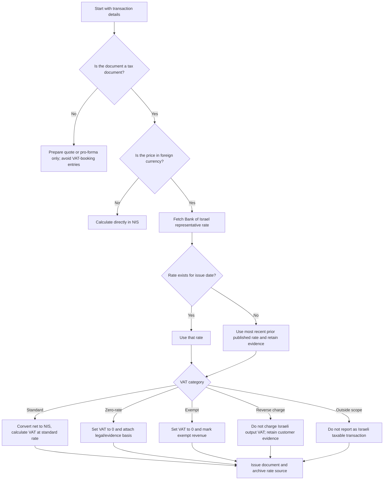

# Foreign-Currency Invoicing

Use this skill to prepare Israeli invoices, tax invoices, receipts, credit invoices, and internal accounting support files when the commercial price is stated in USD, EUR, GBP, JPY, CHF, or another foreign currency. Apply the Bank of Israel representative exchange rate, calculate VAT in NIS, and retain a clear audit trail.

This guide is operational support, not legal or tax advice. Confirm unusual VAT classifications, permanent-establishment questions, export-service eligibility, and allocation-number obligations with a licensed Israeli accountant or tax adviser.

## Core rule set

1. Identify the document type: quotation, invoice, tax invoice, tax invoice/receipt, receipt, or credit invoice.
2. Identify the tax event date that controls the exchange-rate date and the VAT rate.
3. Source the representative exchange rate from the Bank of Israel for the relevant currency and date.
4. For date-specific lookup, prefer the Bank of Israel SDMX series endpoint. Use the current public API only for current-day reference.
5. If no rate is published for the exact date, use the most recent published representative rate before that date and document the reason.
6. Convert the taxable base to NIS before calculating Israeli VAT.
7. Apply the correct VAT treatment: standard, zero-rate, exempt, reverse charge, or outside scope.
8. Show foreign-currency totals and NIS VAT totals clearly.
9. Save the exchange-rate source, customer evidence, VAT classification notes, and generated JSON with the accounting records.

## Decision tree



## Required invoice fields

Include at minimum:

- Supplier name, address, VAT dealer number or exempt dealer status.
- Customer name, address, tax identifier when available, and country.
- Document type and sequential document number from the accounting system.
- Issue date in DD/MM/YYYY format for Israeli records.
- Currency code, foreign-currency line amounts, and payment terms.
- Bank of Israel representative rate, rate date, endpoint URL, and unit where applicable.
- NIS taxable base, NIS VAT amount, and NIS total.
- VAT category and evidence note for every non-standard line.
- Allocation number details when the accounting system and current Israel Invoices rules require them.

## Exchange-rate handling

Use the representative exchange rate published by the Bank of Israel. Some currencies are quoted per 100 or another unit rather than per one currency unit. Always divide the quoted rate by the quoted unit before converting a line amount.

For date-specific automation, construct a Bank of Israel SDMX URL with a series such as `RER_USD_ILS`, the requested `startPeriod`, the same `endPeriod`, and `format=csv`. Store the URL and response payload. For current-day checks, the Bank of Israel public API also exposes `PublicApi/GetExchangeRates` and `PublicApi/GetExchangeRate?key=USD`.

Example for JPY:

```text
Bank of Israel quoted rate: 2.4000 NIS
Quoted unit: 100 JPY
Effective rate: 0.024000 NIS per 1 JPY
Foreign amount: 100,000 JPY
NIS base: 2,400.00 NIS
```

When a rate is unavailable because the date is a weekend, holiday, future date, or non-publication day, use the most recent published prior representative rate. Do not use a later rate for a document already issued unless a corrected document is issued under the accounting system rules.

## VAT treatment guide

| Category | Use when | VAT result | Evidence to retain |
|---|---|---:|---|
| standard | Israeli customer or regular taxable Israeli supply | Standard VAT, usually 18% from 01/01/2025 | Invoice, contract, delivery proof |
| zero | Qualifying zero-rated supply, commonly certain exports or qualifying foreign-resident services | 0% VAT | Customer residency, contract, proof of use abroad, export or service facts |
| exempt | Supply is exempt under VAT rules or supplier is exempt dealer where relevant | No VAT charged | Exemption basis and dealer status |
| reverse_charge | Customer accounts for tax under reverse-charge mechanics where applicable | No Israeli output VAT on supplier invoice | Customer country, tax registration, contract |
| out_of_scope | Transaction is outside Israeli VAT scope | No Israeli VAT | Place-of-supply analysis |

Do not treat every foreign-currency invoice as zero-rated. Currency is not the VAT test. The location of the customer, use of the service, place of supply, statutory exceptions, and retained evidence determine the treatment.

## Concrete examples

### USD freelance service to a foreign-resident business

Input:

```json
{
  "currency": "USD",
  "issue_date": "02/06/2026",
  "exchange_rate": "3.70",
  "lines": [
    {
      "description": "Consulting services",
      "quantity": "10",
      "unit_price": "200.00",
      "vat_category": "zero",
      "note": "Foreign-resident business; contract and proof of use abroad retained."
    }
  ]
}
```

Result:

```text
Net foreign: 2,000.00 USD
Net NIS: 7,400.00 ₪
VAT NIS: 0.00 ₪
Total foreign: 2,000.00 USD
```

### EUR implementation for an Israeli customer

```text
Net amount: 2,500.00 EUR
Representative rate: 4.02 ₪ per EUR
NIS taxable base: 10,050.00 ₪
VAT at 18%: 1,809.00 ₪
Total NIS accounting amount: 11,859.00 ₪
```

### Mixed invoice with standard and zero-rated lines

Calculate each line with its own VAT category. Keep a separate VAT breakdown. Do not apply zero-rate to the whole invoice when only one line qualifies.

## Edge cases

- Advance payments: issue a receipt or tax invoice/receipt according to dealer type and accounting method. Use the rate relevant to the tax event date.
- Credit invoice: use the original invoice currency and normally mirror the original exchange-rate basis unless professional guidance requires a current rate.
- Partial refunds: allocate the refund to the original lines and VAT categories.
- Cash-basis reporting: confirm the tax event date before selecting a rate.
- Multiple currencies: issue separate documents or separate currency sections. Avoid mixing line currencies without a clear conversion table.
- Payment received in NIS against a USD invoice: record foreign invoice totals and settlement differences separately.
- Rounding differences: define whether rounding occurs per line or at document total. Use one method consistently.
- Negative lines: prefer credit invoice workflows instead of negative line items unless the accounting system explicitly supports them.
- Missing customer evidence: use standard VAT until eligibility for zero-rate or exemption is documented.
- Unsupported currency: obtain the official representative rate if published, otherwise document a compliant alternative source with adviser approval.

## Production checklist

- Confirm document type and tax event date.
- Confirm VAT dealer or exempt dealer status.
- Confirm the standard VAT rate for the issue date.
- Fetch and store the Bank of Israel rate URL and payload.
- Preserve quoted unit for currencies such as JPY.
- Validate customer residency and place of use for zero-rated services.
- Record VAT in NIS.
- Use sequential document numbering from the accounting system.
- Check Israel Invoices allocation-number rules when the invoice type and amount bring the transaction into scope.
- Store JSON output, PDF invoice, rate evidence, and customer evidence together.
- Review exceptions with a licensed accountant before issuing.

## Anti-patterns

- Applying zero VAT only because the currency is USD or EUR.
- Using a payment date rate when the invoice tax event date controls the document.
- Using a later exchange rate for a backdated invoice.
- Ignoring quoted units such as 100 JPY.
- Omitting the NIS VAT amount from a tax invoice.
- Mixing exempt and zero-rated terminology.
- Hiding rounding differences in a free-text note instead of reconciling totals.
- Editing an issued tax document instead of issuing a cancellation or credit document.

## Troubleshooting summary

| Symptom | Likely cause | Action |
|---|---|---|
| Rate not found | Weekend, holiday, unsupported currency, future date, or API downtime | Search backward for the most recent published rate and retain evidence |
| VAT seems too high | Rate unit ignored or VAT applied twice | Check unit, taxable base, and line category |
| Customer rejects NIS VAT | Contract states only foreign total | Add invoice clause explaining Israeli statutory VAT in NIS |
| Accounting import fails | Date or decimal format mismatch | Use DD/MM/YYYY for Israeli-facing exports and dot decimals in JSON |
| Zero-rate classification uncertain | Missing evidence or exception applies | Charge standard VAT or obtain professional confirmation before issuing |

## CLI quick use

```bash
pip install -e .
pip install -r requirements-dev.txt

CREATE_RESPONSE=$(foreign-currency-invoicing create \
  --env sandbox \
  --currency USD \
  --issue-date 02/06/2026 \
  --exchange-rate 3.70 \
  --lines-json '[{"description":"Consulting","quantity":"1","unit_price":"500","vat_category":"standard"}]')

INVOICE_ID=$(python -c 'import json,sys; print(json.load(sys.stdin)["id"])' <<<"$CREATE_RESPONSE")
foreign-currency-invoicing show --env sandbox "$INVOICE_ID"
```

## References in this package

- `references/api-reference.md`: Bank of Israel endpoint shape, VAT/regulatory source list, response examples, and error tables.
- `references/workflow-guide.md`: end-to-end workflows for common Israeli cases.
- `references/troubleshooting.md`: detailed diagnosis and fixes.
- `references/test-scenarios.md`: more than 20 concrete validation scenarios.
- `references/migration-checklist.md`: migration from manual spreadsheets or older helpers.
- `references/verification-log.md`: web validation findings and second-pass confirmation.
- `scripts/foreign_currency_invoicing_client.py`: typed sync and async client.
- `scripts/foreign_currency_invoicing_cli.py`: Click CLI implementation.
