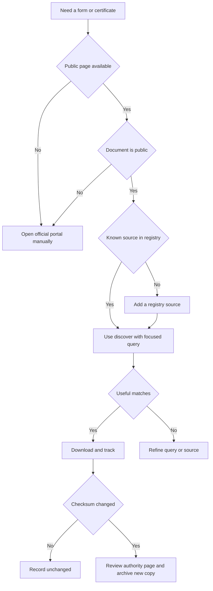
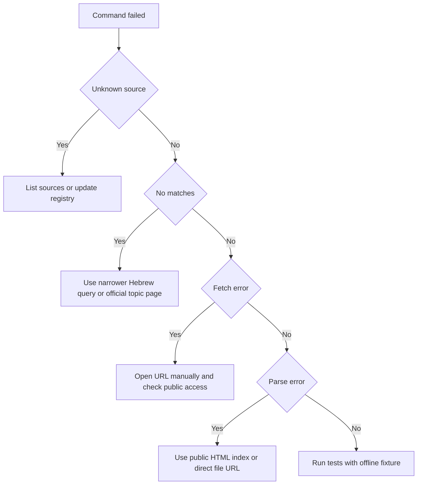

# Forms & Certificates Downloader

## Purpose

Locate, download, and version-track public Israeli government forms and certificates from official public portals. Use the skill when a small business, freelancer, consumer, bookkeeper, or payroll operator needs an auditable local copy of public forms from gov.il, the Israel Tax Authority, the National Insurance Institute, ministries, or public registry pages.

Use only public pages. Keep authentication, form submission, signatures, payments, identity verification, and private certificates inside official portals.

## Primary outcomes

- Build a local register of public forms and certificates.
- Detect when an official file changes by checksum.
- Keep source URLs, document URLs, timestamps, file sizes, and version hints.
- Support Hebrew document titles and Israeli field validation.
- Run safely in offline tests through `file://` fixtures.

## Fast decision tree



## When to use this skill

Use it for:

- A freelancer tracking annual income-tax forms such as form 1301.
- A bookkeeper refreshing VAT, withholding-tax, or income-tax public forms.
- A payroll team monitoring public National Insurance forms.
- A consumer downloading public ministry forms before a visit or online submission.
- A nonprofit or small company tracking public corporation registry forms.
- A support desk creating a repeatable workflow for public documents.

Avoid it for:

- Personal certificates that require login.
- Tax filings, benefit claims, or company filings that require submission.
- Pages protected by CAPTCHA, OTP, queue systems, smart cards, or identity verification.
- Legal or accounting interpretation.

## Installation

```bash
python -m venv .venv
source .venv/bin/activate
pip install -e .
pip install -r requirements-dev.txt
```

## Command workflow

Create a request and capture the response:

```bash
CREATE_RESPONSE=$(forms-certificates-downloader create-request tax-authority-public-forms \
  --query "1301" \
  --limit 5 \
  --env production \
  --download-dir ./downloads \
  --json-output)
```

Extract the request id:

```bash
REQUEST_ID=$(python -c 'import json,sys; print(json.load(sys.stdin)["request_id"])' <<< "$CREATE_RESPONSE")
```

Run the saved request:

```bash
forms-certificates-downloader run-request "$REQUEST_ID" \
  --env production \
  --download-dir ./downloads \
  --json-output
```

Export the manifest:

```bash
forms-certificates-downloader export-csv ./downloads/forms-register.csv --download-dir ./downloads
```

## Python workflow

```python
from forms_certificates_downloader import FormsCertificatesClient

client = FormsCertificatesClient(download_dir="downloads", env="production")
request = client.create_download_request("bituach-leumi-forms", query="דמי לידה", limit=10)
result = client.run_download_request(request.request_id)

for change in result["changes"]:
    print(change["status"], change["title"])
```

## Edge cases

### Official page returns HTML but no direct documents

Many gov.il pages load content dynamically or place final files behind service pages. Use a narrower source page or keep the specific service step manual. Do not scrape private or interactive areas.

### Same document appears under multiple titles

The manifest key is based on authority plus document URL. Duplicate titles from the same page are acceptable. If two official URLs serve the same file, keep both records unless a manual review confirms one is obsolete.

### File name has Hebrew, slash, or question mark

The client normalizes file names and preserves Hebrew letters. Unsafe file-system characters become separators.

### Authority replaces a file without changing the visible date

Checksum tracking detects the change even when the title stays the same. Compare the previous and current file, then annotate the operational record outside the manifest if a reviewer needs context.

### PDF generated by a dynamic endpoint

If the URL has no file extension but returns a PDF content type, the downloader stores it with a guessed extension. If the endpoint requires session state, keep the download manual.

### Registry source moved

Update `data/portal-registry.json`, run a focused discovery, and preserve the old manifest. Do not delete historical entries until retention rules allow it.

## Web-validated source notes

Use the default registry URLs as shipped unless a new official source is verified. The 2026 final validation corrected stale Tax Authority, gov.il services, and Corporations Authority paths. Treat VAT references as context only: the 2026 validation confirmed 18% from 01/01/2025, but this package does not calculate or file VAT.

## Troubleshooting decision tree



## Anti-patterns

- Pointing the registry at a personal-area URL.
- Running broad discovery against the entire services portal without a query.
- Treating a checksum change as legal or tax advice.
- Removing old manifest entries without a retention decision.
- Storing private customer documents in the public download directory.
- Overriding file names manually in a way that hides version information.
- Ignoring a source URL that redirects to a login page.
- Using screen scraping to bypass official controls.

## Production checklist

- Verify every registry URL opens without login.
- Use focused queries and sensible limits.
- Set a dedicated download directory per authority or client context.
- Keep `manifest.json` under backup.
- Export CSV before month-end or annual review.
- Review checksum changes manually.
- Keep private documents outside this package unless a separate access-control process exists.
- Pin dependencies in a controlled environment when running scheduled jobs.
- Run `python -m pytest scripts -q` after editing the registry or code.
- Run `python -m compileall scripts/ -q` before distribution.

## Validation helpers

```bash
forms-certificates-downloader validate tz 123456782 --json-output
forms-certificates-downloader validate phone +972521234567 --json-output
forms-certificates-downloader validate mikud 6100001 --json-output
```

Validation helpers check structure only. They do not confirm identity, ownership, eligibility, address validity, or tax status.

## References

Read `references/api-reference.md` for public portal patterns and non-API constraints. Read `references/workflow-guide.md` for end-to-end scenarios. Read `references/troubleshooting.md` for operational failures.
