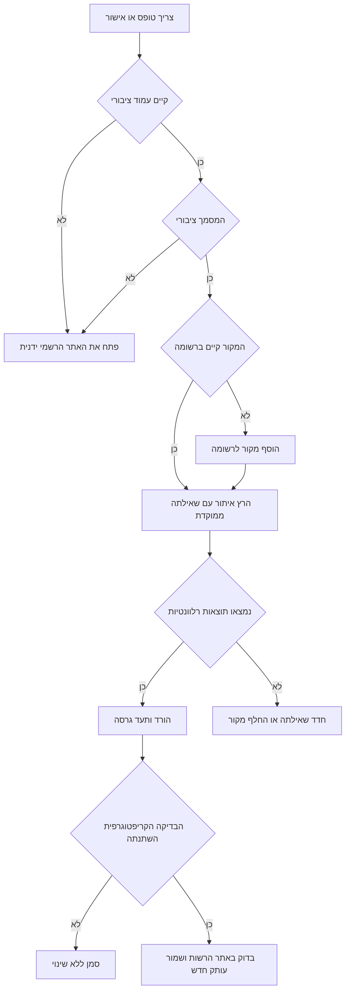
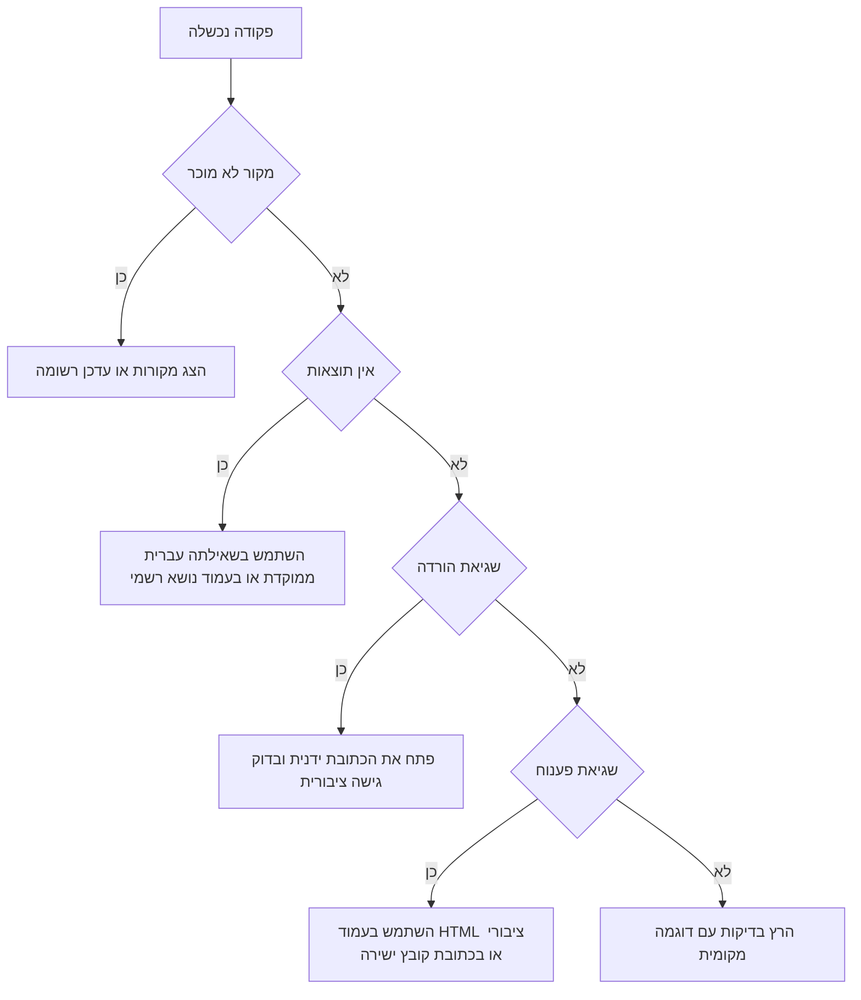

# הורדת טפסים ואישורים

## מטרה

אתר, הורד ותעד גרסאות של טפסים ואישורים ציבוריים מאתרי ממשלה בישראל. השתמש במיומנות כאשר עסק קטן, עצמאי, צרכן, מנהל חשבונות או חשב שכר צריך לשמור עותק מקומי מבוקר של מסמכים ציבוריים מאתר gov.il, רשות המסים, המוסד לביטוח לאומי, משרדי ממשלה או רשמים ציבוריים.

השתמש רק בעמודים ציבוריים. השאר התחברות, הגשת טפסים, חתימות, תשלומים, הזדהות והורדת אישורים אישיים בתוך האתרים הרשמיים.

## תוצרים עיקריים

- בניית מאגר מקומי של טפסים ואישורים ציבוריים.
- זיהוי שינוי בקובץ רשמי באמצעות SHA-256.
- שמירת כתובת מקור, כתובת מסמך, מועד הורדה, גודל קובץ ורמז גרסה.
- תמיכה בכותרות בעברית ובבדיקת מבנה של שדות ישראליים.
- הרצת בדיקות ללא רשת באמצעות קבצי דוגמה מקומיים.

## עץ החלטה מהיר



## מתי להשתמש

השתמש עבור:

- עצמאי שמעקב אחר טפסי מס הכנסה שנתיים, לדוגמה טופס 1301.
- מנהל חשבונות שמרענן טפסי מע"מ, ניכוי מס במקור או מס הכנסה.
- חשב שכר שמנטר טפסים ציבוריים של המוסד לביטוח לאומי.
- צרכן שמוריד טופס ציבורי לפני הגעה לסניף או מילוי מקוון.
- עמותה או חברה קטנה שעוקבת אחר טפסים ציבוריים של רשם התאגידים.
- מוקד שירות שמגדיר תהליך חוזר לטפסים ציבוריים.

אל תשתמש עבור:

- אישורים אישיים המחייבים התחברות.
- הגשת דוחות, תביעות או בקשות המחייבות שליחה לרשות.
- עמודים עם CAPTCHA, סיסמה חד-פעמית, תור המתנה, כרטיס חכם או הזדהות.
- ייעוץ מס, ייעוץ משפטי, ייעוץ חשבונאי או קביעת זכאות.

## התקנה

```bash
python -m venv .venv
source .venv/bin/activate
pip install -e .
pip install -r requirements-dev.txt
```

## תהליך עבודה בשורת הפקודה

צור בקשת הורדה ושמור את התשובה:

```bash
CREATE_RESPONSE=$(forms-certificates-downloader create-request tax-authority-public-forms \
  --query "1301" \
  --limit 5 \
  --env production \
  --download-dir ./downloads \
  --json-output)
```

חלץ את מזהה הבקשה מתוך התשובה:

```bash
REQUEST_ID=$(python -c 'import json,sys; print(json.load(sys.stdin)["request_id"])' <<< "$CREATE_RESPONSE")
```

הרץ את הבקשה לפי המזהה:

```bash
forms-certificates-downloader run-request "$REQUEST_ID" \
  --env production \
  --download-dir ./downloads \
  --json-output
```

ייצא את המאגר לקובץ CSV:

```bash
forms-certificates-downloader export-csv ./downloads/forms-register.csv --download-dir ./downloads
```

## שימוש בפייתון

```python
from forms_certificates_downloader import FormsCertificatesClient

client = FormsCertificatesClient(download_dir="downloads", env="production")
request = client.create_download_request("bituach-leumi-forms", query="דמי לידה", limit=10)
result = client.run_download_request(request.request_id)

for change in result["changes"]:
    print(change["status"], change["title"])
```

## דוגמאות לקצה

### עמוד רשמי מחזיר HTML ללא קישורים ישירים

חלק מעמודי gov.il מציגים תוכן דינמי או מפנים לעמוד שירות לפני קובץ סופי. בחר עמוד ציבורי ממוקד יותר או בצע את שלב השירות ידנית. אל תנסה לעקוף אזורים אישיים או מנגנוני הגנה.

### אותו מסמך מופיע בכמה כותרות

המפתח במאגר מבוסס על רשות וכתובת מסמך. כפילות בכותרות אינה תקלה. אם שתי כתובות רשמיות מגישות אותו קובץ, השאר את שתיהן עד לבדיקה ידנית שמאשרת שאחת מהן אינה עדכנית.

### שם הקובץ כולל עברית או סימנים אסורים

הלקוח מנרמל שמות קבצים ושומר אותיות עבריות. תווים שאינם מתאימים למערכת קבצים מוחלפים במפרידים.

### הרשות החליפה קובץ בלי לשנות תאריך גלוי

מעקב SHA-256 מזהה שינוי גם כאשר הכותרת נשארת זהה. השווה בין הקובץ הקודם והחדש, ואז תעד את ההקשר ברישום תפעולי נפרד אם נדרש אישור ביקורת.

### כתובת PDF נוצרת ממנגנון דינמי

אם לכתובת אין סיומת אבל סוג התוכן הוא PDF, הקובץ נשמר עם סיומת משוערת. אם נדרש מצב התחברות, בצע את ההורדה ידנית.

### מקור ברשומה עבר לכתובת חדשה

עדכן את `data/portal-registry.json`, הרץ איתור ממוקד ושמור את המאגר הישן. אל תמחק רשומות היסטוריות לפני החלטת שימור.

## עץ תקלות



## דפוסים שגויים

- הפניית הרשומה לכתובת באזור אישי.
- איתור רחב בפורטל השירותים בלי שאילתה.
- פירוש שינוי SHA-256 כהנחיית מס או כהמלצה משפטית.
- מחיקת רשומות ישנות ללא החלטת שימור.
- שמירת מסמכי לקוח פרטיים בתיקיית ההורדה הציבורית.
- שינוי שמות קבצים באופן שמסתיר גרסה או תאריך.
- התעלמות מהפניה לעמוד התחברות.
- גרידת מסך כדי לעקוף מנגנוני בקרה רשמיים.

## רשימת בדיקה לייצור

- ודא שכל כתובת ברשומה נפתחת ללא התחברות.
- השתמש בשאילתות ממוקדות ובמגבלת תוצאות.
- הגדר תיקיית הורדה ייעודית לכל רשות או הקשר לקוח.
- גבה את `manifest.json`.
- ייצא CSV לפני סגירת חודש או בדיקה שנתית.
- בדוק ידנית כל שינוי SHA-256.
- שמור מסמכים פרטיים מחוץ לחבילה אלא אם קיים תהליך הרשאות נפרד.
- קבע גרסאות תלות בסביבה מבוקרת כאשר מריצים משימה מתוזמנת.
- הרץ `python -m pytest scripts -q` אחרי שינוי ברשומה או בקוד.
- הרץ `python -m compileall scripts/ -q` לפני הפצה.

## התאמות ישראליות

- מטבע: ₪.
- תאריך להצגה תפעולית: DD/MM/YYYY, לדוגמה 02/06/2026.
- מזהה מסמך נשמר לפי כתובת מקור וכתובת מסמך.
- בדיקת תעודת זהות בודקת מבנה בלבד ואינה מאמתת בעלות.
- מיקוד נבדק כמספר בן שבע ספרות.
- מספר טלפון מוחזר בפורמט מקומי ובפורמט בינלאומי.

## מקורות נוספים

קרא את `references/api-reference.md` לדפוסי פורטלים ציבוריים. קרא את `references/workflow-guide.md` לתהליכים מקצה לקצה. קרא את `references/troubleshooting.md` לטיפול בתקלות.
