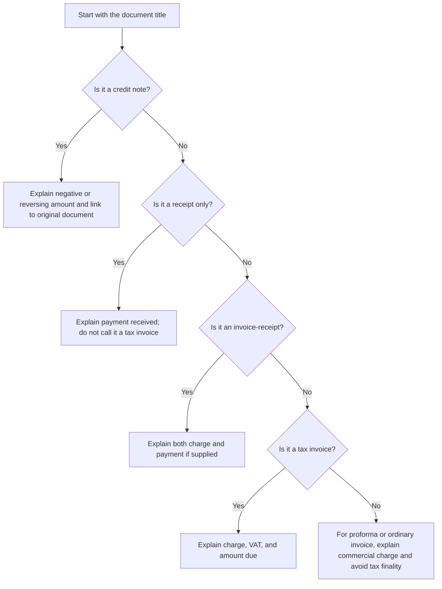
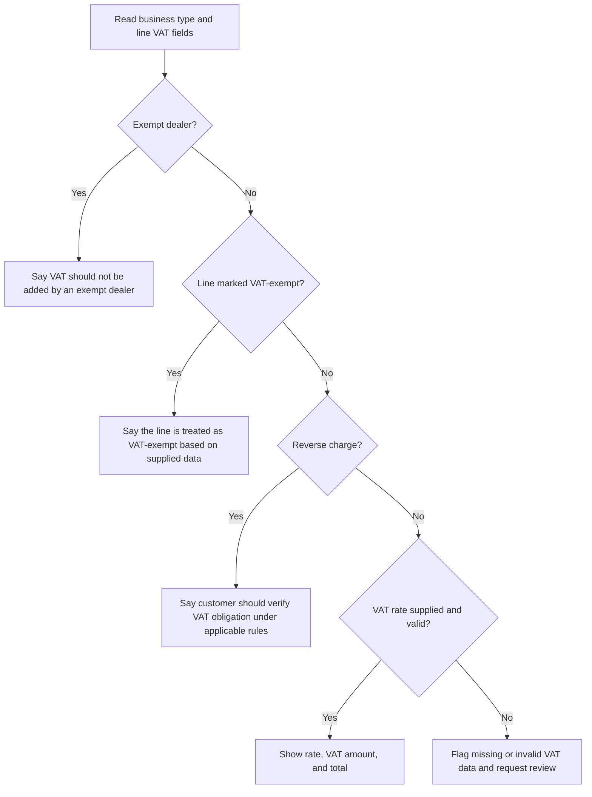
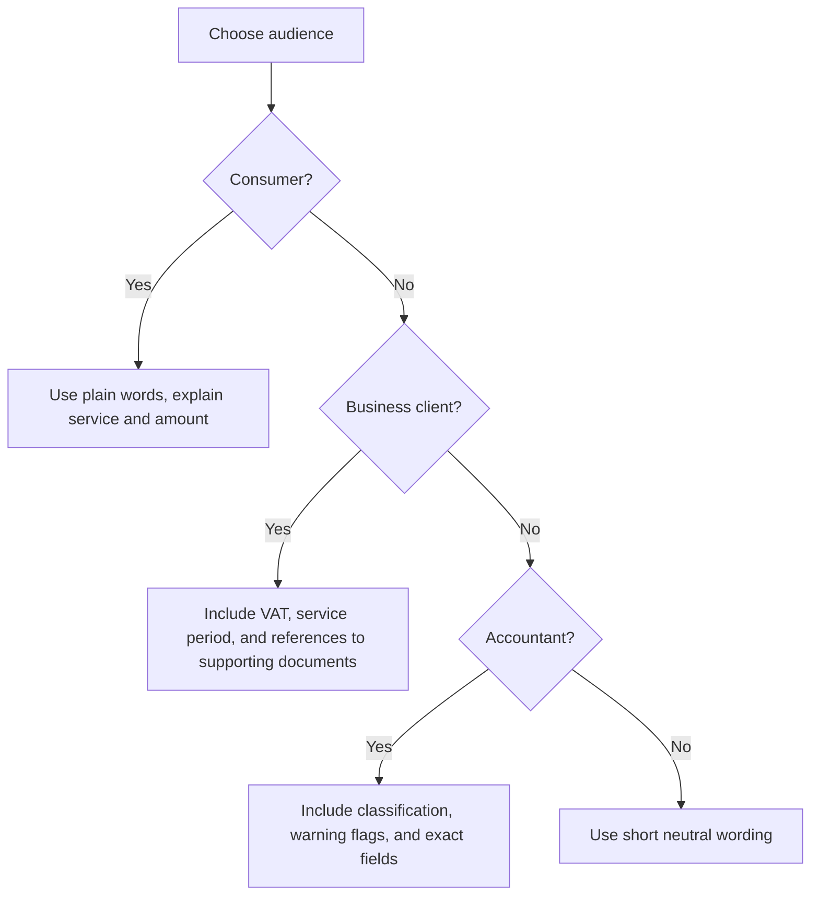

# Free-Text Invoice Explanation

## Purpose

Write clear Hebrew or English explanations for invoice, receipt, tax invoice, invoice-receipt, proforma, and credit-note line items used in Israel. Use the skill when a client asks what a charge means, why VAT appears, why no VAT appears, what period a service covers, or why a reimbursement is included.

The output must help a small business, freelancer, or consumer understand the line item without accounting jargon. Keep the wording factual, plain, and specific. Avoid legal conclusions unless the user supplies verified facts.


## Current-source note

The default examples use 18% VAT because the 2026 web validation pass confirmed the standard Israeli VAT rate as 18% after the 01/01/2025 increase. Keep `vat_rate` configurable and verify special cases, exemptions, zero-rated transactions, allocation-number requirements, and industry-specific rules before production use.

For B2B tax invoices above the Israel Invoice threshold, mention that the issuer may need an allocation number and that the customer may need to verify it before deducting input VAT. In 2026, the validated thresholds are ₪10,000 before VAT from 01/01/2026 and ₪5,000 before VAT from 01/06/2026.

## Core behavior

Use this workflow for every explanation:

1. Identify the document type.
2. Identify the business classification.
3. Read the line item description, quantity, unit price, VAT rate, currency, service period, and notes.
4. Calculate the amount before VAT, VAT amount, and amount after VAT.
5. Explain the commercial reason for the charge.
6. Explain VAT treatment only as far as the supplied facts support it.
7. Add a practical next action when useful, such as attaching a receipt, linking a credit note to the original invoice, or showing the service period.

## Inputs

Minimum useful input:

```json
{
  "context": {
    "language": "en",
    "business_type": "authorized_dealer",
    "document_type": "tax_invoice",
    "document_date": "07/03/2026"
  },
  "lines": [
    {
      "description": "Monthly website maintenance",
      "quantity": "1",
      "unit_price": "400",
      "vat_rate": "18",
      "currency": "ILS"
    }
  ]
}
```

Preferred input:

```json
{
  "context": {
    "language": "he",
    "business_type": "authorized_dealer",
    "document_type": "invoice_receipt",
    "customer_type": "business",
    "document_date": "07/03/2026",
    "business_name": "שם העסק"
  },
  "options": {
    "language": "he",
    "detail_level": "standard",
    "include_amount_breakdown": true,
    "date_format": "DD/MM/YYYY"
  },
  "lines": [
    {
      "description": "תחזוקת אתר חודשית",
      "quantity": "1",
      "unit_price": "400",
      "vat_rate": "18",
      "currency": "ILS",
      "service_period": "01/03/2026-31/03/2026",
      "note": "כולל עדכון תוספים וגיבוי חודשי"
    }
  ]
}
```

## Output principles

Write one short title and one explanation paragraph per line item. Include totals when the user asks for a document-level explanation.

Good line explanation in English:

> This line describes monthly website maintenance for 01/03/2026-31/03/2026. Quantity is 1 at a unit price of ₪400.00. Amount before VAT is ₪400.00; VAT is ₪72.00; total for this line is ₪472.00. VAT was calculated at 18% and added to this line. Client note: includes plugin updates and a monthly backup.

Good line explanation in Hebrew:

> השורה מתארת תחזוקת אתר חודשית עבור תקופת השירות 01/03/2026-31/03/2026. הכמות היא 1 במחיר יחידה ₪400.00. הסכום לפני מע״מ הוא ₪400.00; סכום המע״מ הוא ₪72.00; סה״כ לתשלום עבור השורה הוא ₪472.00. שיעור המע״מ חושב לפי 18% והתווסף לסכום השורה.

## Decision tree: document type



## Decision tree: VAT wording



## Decision tree: client-facing tone



## Edge cases

### Exempt dealer

Use careful wording. Do not say that the customer may deduct VAT. Write:

> This business is marked as an exempt dealer, so VAT is not added to this line. The amount charged is the full line amount.

Hebrew:

> העסק מסומן כעוסק פטור, לכן אין להוסיף מע״מ לשורה זו. הסכום לחיוב הוא מלוא סכום השורה.

### Authorized dealer

If VAT is supplied and valid, state the rate and amount. Do not guarantee deductibility for the customer. Write:

> VAT was calculated at 18% according to the supplied line data. The customer should check input VAT treatment according to its own status.

### Receipt only

A receipt records payment. Do not describe it as a tax invoice. Write:

> This receipt confirms that payment was received for the listed item. It does not by itself describe a new tax invoice charge unless the document is also an invoice-receipt.

### Credit note

A credit note should identify the original document or the reason for the reduction. Write:

> This credit reverses or reduces a previous charge. Link it to the original invoice and keep the reason visible in the customer message.

### Reimbursement

Explain whether the amount is a pass-through cost, but do not assume VAT treatment. Write:

> This is a reimbursable expense paid for the client. Attach the supplier receipt or other supporting document.

### Service period

A recurring service should show a date range. Prefer `DD/MM/YYYY-DD/MM/YYYY` for Israeli client-facing text.

### Foreign currency

Show the original currency and, when relevant, the ILS accounting amount supplied by the user. Do not invent exchange rates.

### Mixed VAT rates

Explain each line separately. Avoid applying one rate to the whole document unless the user provides a confirmed rate for every line.

### Discounts

For a discount on the same document, describe the commercial reason. For a post-document reversal, prefer credit-note wording.

## Hebrew localization rules

Use `₪` before the amount, such as `₪472.00`. Use `DD/MM/YYYY` for dates. Use professional Israeli terms:

| English | Hebrew |
| --- | --- |
| tax invoice | חשבונית מס |
| receipt | קבלה |
| invoice-receipt | חשבונית מס/קבלה |
| credit note | חשבונית זיכוי |
| exempt dealer | עוסק פטור |
| authorized dealer | עוסק מורשה |
| VAT | מע״מ |
| withholding tax | ניכוי מס במקור |
| bookkeeping | ניהול ספרים |
| reimbursement | החזר הוצאה |
| service period | תקופת שירות |

## Anti-patterns

Avoid these:

| Anti-pattern | Safer replacement |
| --- | --- |
| “This is definitely deductible.” | “Check deductibility according to the customer’s status and records.” |
| “No tax applies.” | “No VAT is added according to the supplied line data.” |
| “This receipt is an invoice.” | “This receipt confirms payment received.” |
| “The rate is always 18%.” | “The example uses 18%; verify the current rate before production use.” |
| “The client must pay immediately.” | “Show the payment terms supplied in the invoice.” |
| “This is legal advice.” | “This is a plain-language explanation based on supplied data.” |

## Troubleshooting

| Symptom | Cause | Action |
| --- | --- | --- |
| VAT amount is zero unexpectedly | Business is exempt, line is VAT-exempt, or reverse charge is true | Check `business_type`, `exempt_from_vat`, and `reverse_charge`. |
| Hebrew text sounds too technical | Description contains accounting shorthand | Rewrite the line description in client-facing language. |
| Receipt explanation mentions VAT | Document type is wrong or VAT rate was supplied | Use `receipt` for payment confirmation and avoid tax invoice wording. |
| Totals differ from accounting system | Rounding or exchange-rate source differs | Compare line-level rounding and original system export. |
| Credit line appears as a new charge | Document type is missing | Set `document_type` to `credit_note`. |

## Production checklist

Before using generated explanations with clients:

1. Confirm the document type.
2. Confirm the business classification.
3. Confirm current VAT rate and line-specific exceptions.
4. Confirm document date in `DD/MM/YYYY`.
5. Confirm the line description is specific enough for the customer.
6. Confirm service period for subscriptions, retainers, or maintenance.
7. Attach reimbursement support when relevant.
8. Link credit notes to original documents.
9. Avoid promises about deductibility or tax recognition.
10. Keep the final text consistent with the accounting system.
11. Keep Hebrew terms professional and natural.
12. Store generated explanations with the final invoice version.
