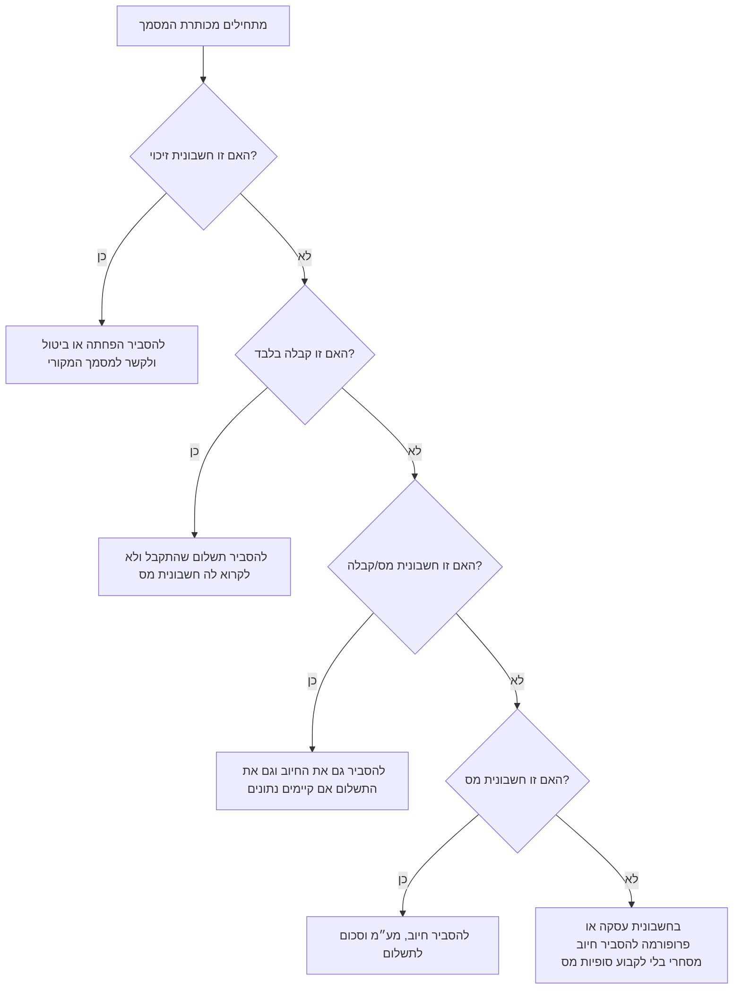
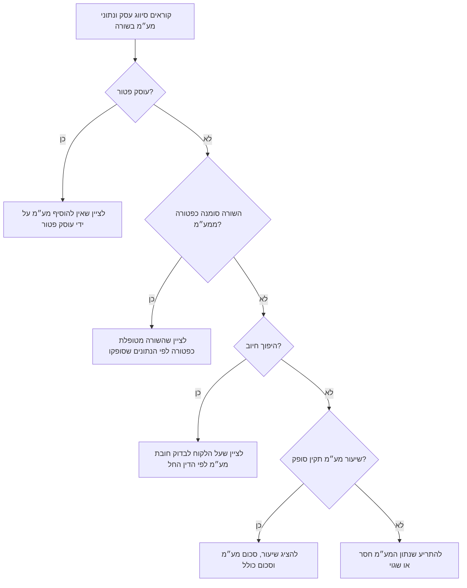
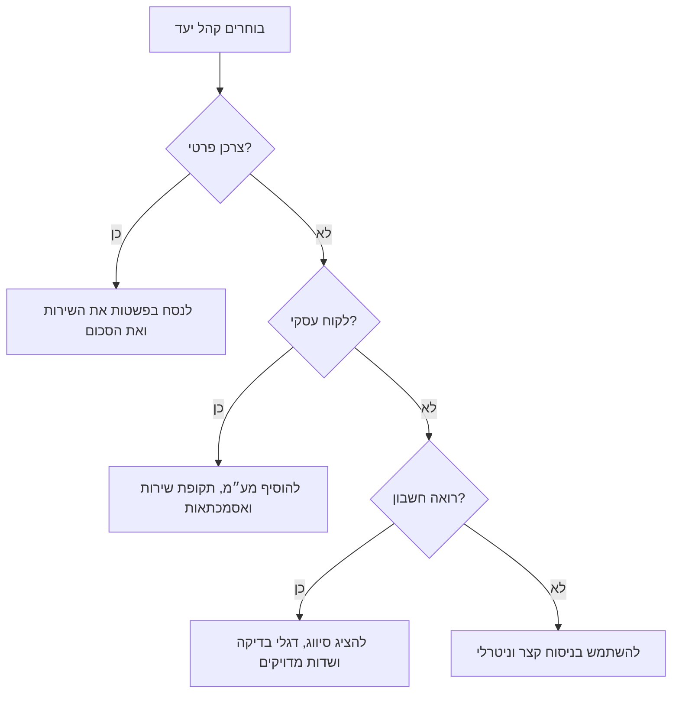

# הסבר חופשי לשורות חשבונית

## מטרה

לנסח בעברית או באנגלית הסברים פשוטים לשורות במסמכי חיוב ישראליים: חשבונית מס, קבלה, חשבונית מס/קבלה, חשבונית זיכוי, חשבונית עסקה ופרופורמה. להשתמש במיומנות כאשר לקוח מבקש להבין על מה החיוב, למה נוסף מע״מ, למה לא נוסף מע״מ, איזו תקופה השירות מכסה, או למה הופיע החזר הוצאה.

ההסבר צריך לעזור לעסק קטן, לפרילנסר או לצרכן להבין את השורה בלי ניסוח חשבונאי כבד. יש לכתוב באופן עובדתי, ברור וממוקד. אין לקבוע מסקנות משפטיות או מסקנות מס ללא נתונים מאומתים.


## הערת מקורות עדכנית

בדוגמאות ברירת המחדל נעשה שימוש במע״מ בשיעור 18%, לאחר שבדיקת המקורות לשנת 2026 אישרה כי זהו שיעור המע״מ הרגיל בישראל לאחר העלייה מיום 01/01/2025. יש להשאיר את `vat_rate` כשדה ניתן לשינוי ולאמת חריגים, פטורים, עסקאות בשיעור אפס, דרישות מספר הקצאה וכללים ענפיים לפני שימוש בפועל.

בחשבונית מס לעסקה בין עסקים מעל תקרת חשבוניות ישראל, יש לציין בזהירות שייתכן צורך במספר הקצאה ושייתכן שהלקוח יצטרך לאמת אותו לפני ניכוי מע״מ תשומות. בשנת 2026 התקרות שאומתו הן ₪10,000 לפני מע״מ מיום 01/01/2026 ו-₪5,000 לפני מע״מ מיום 01/06/2026.

## מהלך עבודה בסיסי

בכל הסבר יש לבצע את השלבים הבאים:

1. לזהות את סוג המסמך.
2. לזהות את סיווג העסק.
3. לקרוא את תיאור השורה, הכמות, מחיר היחידה, שיעור המע״מ, המטבע, תקופת השירות וההערות.
4. לחשב סכום לפני מע״מ, סכום מע״מ וסכום לאחר מע״מ.
5. להסביר את הסיבה המסחרית לחיוב.
6. להסביר את הטיפול במע״מ רק לפי הנתונים שסופקו.
7. להוסיף פעולה מעשית כאשר הדבר מועיל, למשל צירוף אסמכתה, קישור חשבונית זיכוי למסמך המקורי, או הצגת תקופת השירות.

## קלט מינימלי

```json
{
  "context": {
    "language": "he",
    "business_type": "authorized_dealer",
    "document_type": "tax_invoice",
    "document_date": "07/03/2026"
  },
  "lines": [
    {
      "description": "תחזוקת אתר חודשית",
      "quantity": "1",
      "unit_price": "400",
      "vat_rate": "18",
      "currency": "ILS"
    }
  ]
}
```

## קלט מומלץ

```json
{
  "context": {
    "language": "he",
    "business_type": "authorized_dealer",
    "document_type": "invoice_receipt",
    "customer_type": "business",
    "document_date": "07/03/2026",
    "business_name": "שם העסק"
  },
  "options": {
    "language": "he",
    "detail_level": "standard",
    "include_amount_breakdown": true,
    "date_format": "DD/MM/YYYY"
  },
  "lines": [
    {
      "description": "תחזוקת אתר חודשית",
      "quantity": "1",
      "unit_price": "400",
      "vat_rate": "18",
      "currency": "ILS",
      "service_period": "01/03/2026-31/03/2026",
      "note": "כולל עדכון תוספים וגיבוי חודשי"
    }
  ]
}
```

## עקרונות ניסוח

לכל שורה יש ליצור כותרת קצרה ופסקת הסבר אחת. במסמך מלא יש להוסיף סיכום סכומים כאשר הדבר נדרש.

דוגמה טובה בעברית:

> השורה מתארת תחזוקת אתר חודשית עבור תקופת השירות 01/03/2026-31/03/2026. הכמות היא 1 במחיר יחידה ₪400.00. הסכום לפני מע״מ הוא ₪400.00; סכום המע״מ הוא ₪72.00; סה״כ לתשלום עבור השורה הוא ₪472.00. שיעור המע״מ חושב לפי 18% והתווסף לסכום השורה.

דוגמה טובה באנגלית:

> This line describes monthly website maintenance for 01/03/2026-31/03/2026. Quantity is 1 at a unit price of ₪400.00. Amount before VAT is ₪400.00; VAT is ₪72.00; total for this line is ₪472.00.

## עץ החלטה: סוג מסמך



## עץ החלטה: ניסוח מע״מ



## עץ החלטה: רמת פירוט



## מקרים מיוחדים

### עוסק פטור

יש להיזהר בניסוח. אין לומר שהלקוח מקבל מע״מ לקיזוז. ניסוח מומלץ:

> העסק מסומן כעוסק פטור, לכן אין להוסיף מע״מ לשורה זו. הסכום לחיוב הוא מלוא סכום השורה.

### עוסק מורשה

כאשר שיעור המע״מ סופק והוא תקין, יש לציין את השיעור ואת הסכום. אין להבטיח ללקוח שניתן לקזז את המע״מ. ניסוח מומלץ:

> המע״מ חושב לפי 18% בהתאם לנתוני השורה שסופקו. על הלקוח לבדוק את הטיפול במע״מ תשומות לפי מעמדו ולפי ספריו.

### קבלה בלבד

קבלה מתעדת תשלום. אין להציג אותה כחשבונית מס. ניסוח מומלץ:

> קבלה זו מאשרת שהתקבל תשלום עבור הפריט הרשום. היא אינה מתארת חיוב חדש בחשבונית מס, אלא אם המסמך הוא חשבונית מס/קבלה.

### חשבונית זיכוי

חשבונית זיכוי צריכה לזהות את המסמך המקורי או את הסיבה להפחתה. ניסוח מומלץ:

> זיכוי זה מפחית או מבטל חיוב קודם. יש לקשר אותו לחשבונית המקורית ולהציג את סיבת הזיכוי בהודעה ללקוח.

### החזר הוצאה

יש להסביר אם מדובר בעלות ששולמה עבור הלקוח, אך אין להניח את הטיפול במע״מ ללא נתונים. ניסוח מומלץ:

> מדובר בהחזר הוצאה ששולמה עבור הלקוח. יש לצרף חשבונית ספק, קבלה או אסמכתה אחרת.

### תקופת שירות

בשירות מתמשך יש להציג טווח תאריכים. ללקוח ישראלי יש להעדיף `DD/MM/YYYY-DD/MM/YYYY`, לדוגמה `01/03/2026-31/03/2026`.

### מטבע זר

יש להציג את המטבע המקורי, ואם נדרש גם את הסכום השקלי שסופק על ידי המשתמש. אין להמציא שערי חליפין.

### שיעורי מע״מ מעורבים

יש להסביר כל שורה בנפרד. אין להחיל שיעור אחד על כל המסמך אלא אם סופק שיעור מאומת לכל שורה.

### הנחות

בהנחה באותו מסמך יש להסביר את הסיבה המסחרית. בהפחתה לאחר הוצאת מסמך יש להעדיף ניסוח של חשבונית זיכוי.

## מונחים מקצועיים

| מונח באנגלית | מונח בעברית |
| --- | --- |
| tax invoice | חשבונית מס |
| receipt | קבלה |
| invoice-receipt | חשבונית מס/קבלה |
| credit note | חשבונית זיכוי |
| exempt dealer | עוסק פטור |
| authorized dealer | עוסק מורשה |
| VAT | מע״מ |
| withholding tax | ניכוי מס במקור |
| bookkeeping | ניהול ספרים |
| reimbursement | החזר הוצאה |
| service period | תקופת שירות |
| input VAT | מע״מ תשומות |
| output VAT | מע״מ עסקאות |

## תבניות ניסוח מומלצות

### שירות רגיל עם מע״מ

> השורה מתארת [תיאור השירות] עבור [תקופה]. הסכום לפני מע״מ הוא ₪[סכום]. המע״מ חושב לפי [שיעור]% והוא ₪[סכום]. סה״כ לתשלום עבור השורה הוא ₪[סכום].

### עוסק פטור

> השורה מתארת [תיאור השירות]. העסק מסווג כעוסק פטור לפי הנתונים שסופקו, לכן לא נוסף מע״מ לשורה זו.

### החזר הוצאה

> השורה מתארת החזר הוצאה עבור [תיאור]. הסכום משקף עלות ששולמה עבור הלקוח. יש לצרף אסמכתה מתאימה.

### זיכוי

> השורה מתארת זיכוי עבור [תיאור]. הזיכוי מפחית חיוב קודם ויש לקשר אותו למסמך המקורי.

## ניסוחים שיש להימנע מהם

| ניסוח בעייתי | ניסוח בטוח יותר |
| --- | --- |
| זה מוכר בוודאות במס | יש לבדוק הכרה בהוצאה לפי מצב הלקוח והמסמכים שברשותו |
| אין מס על העסקה | לפי הנתונים שסופקו, לא נוסף מע״מ לשורה |
| הקבלה היא חשבונית | הקבלה מאשרת תשלום שהתקבל |
| המע״מ תמיד 18% | הדוגמה משתמשת ב-18%; יש לאמת את השיעור העדכני לפני שימוש בפועל |
| הלקוח חייב לשלם מיד | יש להציג את תנאי התשלום שמופיעים במסמך |
| זה ייעוץ משפטי | זהו הסבר בשפה פשוטה לפי הנתונים שסופקו |

## פתרון תקלות

| תסמין | סיבה אפשרית | פעולה |
| --- | --- | --- |
| המע״מ יוצא אפס בלי כוונה | העסק סומן כעוסק פטור, השורה פטורה, או הוגדר היפוך חיוב | לבדוק `business_type`, `exempt_from_vat`, `reverse_charge`. |
| הניסוח בעברית טכני מדי | תיאור השורה מכיל קיצורים חשבונאיים | לנסח מחדש את תיאור השורה בשפה שמובנת ללקוח. |
| קבלה מוצגת כחשבונית מס | סוג המסמך שגוי | להשתמש ב-`receipt` לאישור תשלום בלבד. |
| הסכומים לא תואמים למערכת הנהלת החשבונות | עיגול או שער מטבע שונים | להשוות עיגול ברמת שורה ואת נתוני המקור. |
| זיכוי מוצג כחיוב חדש | סוג המסמך חסר | להגדיר `document_type` כ-`credit_note`. |

## רשימת בדיקה לפני שימוש מול לקוח

1. לאמת את סוג המסמך.
2. לאמת את סיווג העסק.
3. לאמת את שיעור המע״מ העדכני ואת החריגים לכל שורה.
4. לוודא תאריך בפורמט `DD/MM/YYYY`.
5. לוודא שתיאור השורה מספיק ברור ללקוח.
6. לציין תקופת שירות במנוי, ריטיינר או תחזוקה.
7. לצרף אסמכתה להחזר הוצאה.
8. לקשר חשבונית זיכוי למסמך המקורי.
9. להימנע מהבטחות לגבי קיזוז מע״מ או הכרה בהוצאה.
10. לוודא התאמה בין ההסבר לבין מערכת הנהלת החשבונות.
11. להשתמש במונחים עבריים מקצועיים וטבעיים.
12. לשמור את ההסבר יחד עם הגרסה הסופית של המסמך.
