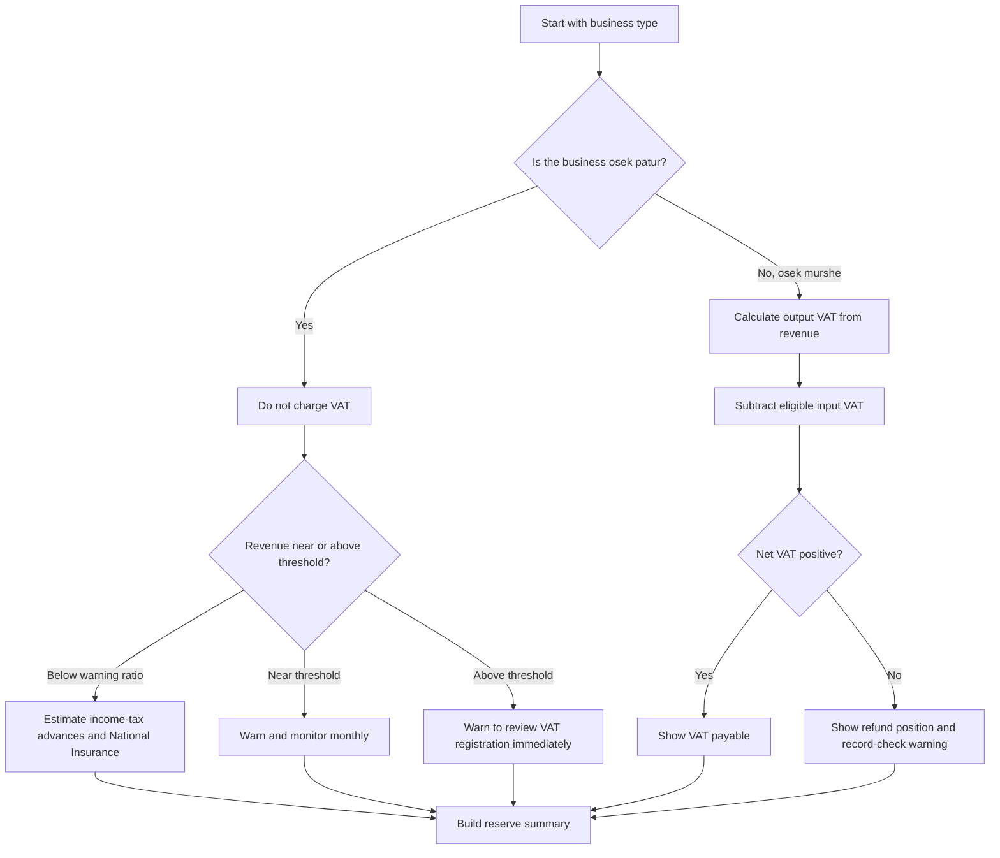

# Freelancer Tax Calculator for Israel

## Purpose

Use this skill to prepare practical Israeli tax estimates for independent workers and small businesses. Focus on three operating questions:

1. VAT: calculate output VAT, input VAT credit, payable VAT, refund position, and osek patur threshold utilization.
2. Income-tax advances: estimate advance payments from the official Tax Authority percentage or from a scenario percentage.
3. National Insurance and health insurance: estimate annual contributions using configurable thresholds and rates.

Treat every result as an estimate. Israeli tax obligations depend on current legislation, sector rules, annual indexation, income type, family status, deductions, credits, and assessments issued by the Tax Authority and National Insurance Institute. Request official portal values, accountant guidance, or current written notices whenever exact compliance is required.

## Operating principles

- Use ₪ amounts and round money to two decimals.
- Prefer annual calculations for planning and monthly or bi-monthly calculations for cash-flow scheduling.
- Use the official income-tax advance percentage when available.
- Separate revenue excluding VAT from cash collected including VAT.
- Keep osek patur and osek murshe logic separate.
- Flag osek patur threshold risk before a breach occurs.
- Keep rates and thresholds configurable.
- Show assumptions in every report.
- Store scenario inputs alongside results so the calculation can be reproduced.

## Required inputs

| Field | Required | Applies to | Meaning |
|---|---:|---|---|
| Business type | Yes | All | `osek-patur` or `osek-murshe` |
| Annual revenue excluding VAT | Yes | All | Revenue before VAT. For osek patur, this is the receipt amount because VAT is not charged. |
| Deductible expenses excluding VAT | Recommended | All | Recognized expenses for profit and National Insurance estimation. |
| Input VAT | Optional | osek murshe | VAT paid on eligible business expenses. Ignored for osek patur. |
| Income-tax advance rate | Recommended | All | Percentage set by the Tax Authority, such as `0.07` for 7 percent. |
| Income-tax advance base | Recommended | All | Use `revenue` for standard turnover-style planning or `profit` for scenario analysis. |
| National Insurance thresholds and rates | Optional | All | Use defaults only for planning; verify annually. |
| Micro-business flag | Optional | Eligible osek patur or osek murshe below the configured patur ceiling | Applies a 30 percent normative expense scenario for eligible small-business planning. |

## Decision tree



## Calculation model

### VAT

For osek murshe:

```text
output_vat = revenue_excluding_vat * vat_rate
vat_payable = max(output_vat - input_vat_credit, 0)
refund_position = max(input_vat_credit - output_vat, 0)
```

For osek patur:

```text
output_vat = 0
input_vat_credit = 0
threshold_utilization = revenue / configured_osek_patur_threshold
```

### Income-tax advances

Use `income_tax_advance_base = revenue` when the Tax Authority percentage is applied to turnover. Use `profit` only for scenario analysis or when a professional has instructed that basis.

```text
advance_base = revenue_excluding_vat or estimated_profit
annual_advance = advance_base * income_tax_advance_rate
monthly_reserve = annual_advance / 12
```

### National Insurance and health insurance estimate

The 2026 defaults use combined reduced and regular rates of 7.70 percent and 18.00 percent, a reduced annual threshold of ₪92,436, and an annual ceiling of ₪622,920. The local model applies configured combined rates directly to estimated profit for reserve planning. Official BTL calculations may adjust the insured base for deductible National Insurance amounts, pension contributions, minimum payments, status, mixed income, and final assessment.

```text
profit = max(revenue_excluding_vat - effective_expenses, 0)
capped_income = min(profit, annual_ceiling)
reduced_tier_base = min(capped_income, reduced_threshold)
regular_tier_base = max(capped_income - reduced_tier_base, 0)
annual_contribution = reduced_tier_base * reduced_rate + regular_tier_base * regular_rate
```

## Concrete examples

### Osek patur near the ceiling

Input:

```json
{
  "business_type": "osek-patur",
  "annual_revenue_ils": "116000",
  "deductible_expenses_ils": "22000",
  "income_tax_advance_rate": "0.06",
  "income_tax_advance_base": "revenue"
}
```

Expected behavior:

- VAT output remains ₪0.00.
- Input VAT is not credited.
- A threshold warning appears when utilization crosses the configured warning ratio.
- Income-tax advances are calculated from the selected base.
- National Insurance is calculated from estimated profit.

### Osek murshe with input VAT

Input:

```json
{
  "business_type": "osek-murshe",
  "annual_revenue_ils": "300000",
  "deductible_expenses_ils": "80000",
  "input_vat_ils": "7200",
  "income_tax_advance_rate": "0.10",
  "income_tax_advance_base": "revenue"
}
```

Expected behavior:

- Output VAT equals annual revenue multiplied by the configured VAT rate.
- Input VAT reduces VAT payable.
- Income-tax advances use revenue unless `profit` is selected.
- National Insurance uses estimated profit after expenses.

### VAT refund position

Input VAT can exceed output VAT in a period with heavy equipment purchases or low sales. Show the refund position, but add a warning to verify invoices, eligibility, and filing rules before treating the amount as cash available.

## Edge cases

| Case | Expected handling |
|---|---|
| Negative revenue, expense, or input VAT | Reject with `negative_amount`. |
| Rate above 1 | Reject with `invalid_rate`. |
| Osek patur with input VAT | Ignore input VAT and warn. |
| Osek patur above threshold | Warn to review VAT registration immediately. |
| Expenses exceed revenue | Profit-based estimates are zero where relevant; keep turnover-based advances if selected. |
| Input VAT greater than revenue | Warn that only VAT components should be entered. |
| VAT-inclusive revenue supplied by mistake | Use the gross-to-net helper before calculation. |
| Micro-business scenario above patur ceiling | Reject with `micro_business_ineligible`. |
| Missing official advance percentage | Allow zero but warn. |
| Current-year law changed | Update configuration and rerun saved scenarios. |

## Anti-patterns

- Do not apply input VAT credit to osek patur.
- Do not mix VAT-inclusive and VAT-exclusive amounts in one calculation.
- Do not use the package defaults as official current-year law without verification.
- Do not apply a micro-business normative expense scenario to any business above the configured osek patur ceiling.
- Do not suppress threshold warnings to make a scenario look safer.
- Do not treat National Insurance estimates as final assessments.
- Do not use a profit-based advance base when an official turnover percentage is known, unless instructed by a professional.
- Do not delete scenario input files before the report has been reviewed.

## Troubleshooting quick reference

| Symptom | Likely cause | Fix |
|---|---|---|
| VAT appears too high | Revenue was entered including VAT. | Split gross amount into net revenue and VAT. |
| Osek patur VAT is always zero | Correct behavior. | Record VAT paid as part of expenses if eligible by professional guidance. |
| Advance payment differs from portal | Wrong advance base or rate. | Confirm current Tax Authority percentage and base. |
| National Insurance differs from portal | Thresholds, status, or credits differ. | Update configuration and compare with official notice. |
| JSON has strings for amounts | Intentional Decimal-safe output. | Parse as Decimal in downstream systems. |
| Scenario ID cannot be found | Different store directory. | Set `FTC_STORE_DIR` or pass `--store-dir`. |

## Web-validated 2026 defaults

- VAT rate: 18 percent.
- Osek patur ceiling: ₪122,833.
- National Insurance and health-insurance combined reduced rate: 7.70 percent.
- National Insurance and health-insurance combined regular rate: 18.00 percent.
- National Insurance reduced monthly base: ₪7,703, annualized to ₪92,436.
- National Insurance monthly ceiling: ₪51,910, annualized to ₪622,920.
- Small-business normative expense scenario: 30 percent of turnover for eligible businesses.

## Production checklist

Before using a report for a real business decision:

1. Confirm business type and VAT registration status.
2. Confirm the calculation date and tax year.
3. Update VAT rate, osek patur threshold, National Insurance thresholds, and rates.
4. Confirm whether the Tax Authority advance percentage applies to turnover or another base.
5. Reconcile revenue to invoices, receipts, clearing reports, and bank deposits.
6. Reconcile expenses to invoices and payment records.
7. Separate input VAT from expense amounts for osek murshe.
8. Review threshold warnings for osek patur.
9. Save the input scenario and the JSON report.
10. Attach assumptions for accountant review.
11. Compare the estimate to official portal notices before payment.
12. Keep a copy of the configuration used for the calculation.

## Disclaimer / הבהרה

This skill is a preparation and automation aid only. It does not constitute tax, legal, financial, or other professional advice, and its output must be reviewed by a licensed professional (רו"ח / עו"ד / יועץ מס) before any filing, payment, or contractual use.

כלי זה מהווה שכבת הכנה ואוטומציה בלבד. אין בו ייעוץ מס, ייעוץ משפטי או ייעוץ מקצועי אחר, ויש לאמת כל פלט מול בעל מקצוע מורשה לפני הגשה, תשלום או שימוש חוזי.
