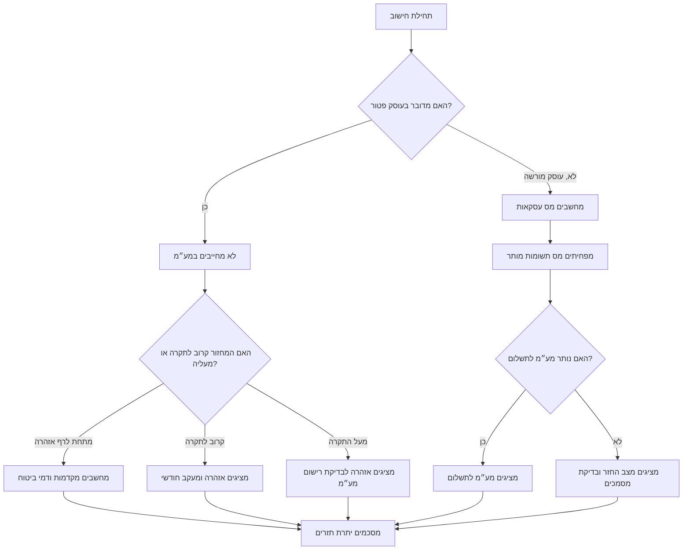

# מחשבון מס לעצמאים בישראל

## מטרה

יש להשתמש במיומנות זו להכנת אומדן מס מעשי לעצמאים ולעסקים קטנים בישראל. החישוב מתמקד בשלושה נושאים תפעוליים:

1. מע״מ: חישוב מס עסקאות, מס תשומות, מע״מ לתשלום, מצב החזר וניצול תקרת עוסק פטור.
2. מקדמות מס הכנסה: אומדן לפי אחוז המקדמות הרשמי בתיק או לפי אחוז תרחיש.
3. דמי ביטוח לאומי ודמי ביטוח בריאות: אומדן לפי מדרגות ושיעורים שנתיים שניתנים להגדרה.

כל תוצאה היא אומדן בלבד. חבות המס בפועל תלויה בחקיקה עדכנית, סוג ההכנסה, זכאות לניכויים ולזיכויים, מעמד במוסד לביטוח לאומי, שומה, הוראות רואה חשבון או יועץ מס, ונתונים אישיים שאינם תמיד חלק מקובץ העבודה.

## עקרונות עבודה

- להציג סכומים ב-₪ ולעגל לשתי ספרות אחרי הנקודה.
- להציג תאריכים בפורמט ישראלי: `DD/MM/YYYY`.
- להעדיף חישוב שנתי לתכנון וחישוב חודשי או דו-חודשי לתזרים.
- להשתמש באחוז המקדמות הרשמי כאשר הוא ידוע.
- להפריד בין הכנסה לפני מע״מ לבין תקבול כולל מע״מ.
- להפריד בין לוגיקה של עוסק פטור לבין לוגיקה של עוסק מורשה.
- להתריע על התקרבות לתקרת עוסק פטור לפני חריגה בפועל.
- לשמור שיעורי מס ותקרות כנתונים ניתנים לעדכון.
- להציג הנחות בכל דוח.
- לשמור את נתוני התרחיש יחד עם תוצאת החישוב.

## נתוני חובה

| שדה | חובה | רלוונטי ל | משמעות |
|---|---:|---|---|
| סוג עסק | כן | כולם | `osek-patur` או `osek-murshe` |
| מחזור שנתי לפני מע״מ | כן | כולם | הכנסה ללא מע״מ. אצל עוסק פטור זהו סכום הקבלות משום שלא נגבה מע״מ. |
| הוצאות מוכרות לפני מע״מ | מומלץ | כולם | הוצאות לצורך אומדן רווח ודמי ביטוח לאומי. |
| מס תשומות | אופציונלי | עוסק מורשה | מע״מ ששולם על הוצאות עסקיות מותרות. אינו מזוכה אצל עוסק פטור. |
| אחוז מקדמות מס הכנסה | מומלץ | כולם | אחוז שנקבע על ידי רשות המסים, לדוגמה `0.07` עבור 7 אחוז. |
| בסיס מקדמות מס הכנסה | מומלץ | כולם | `revenue` לחישוב לפי מחזור או `profit` לתרחיש לפי רווח. |
| מדרגות ושיעורי ביטוח לאומי | אופציונלי | כולם | ברירת המחדל מיועדת לתכנון בלבד ויש לאמת אותה בכל שנה. |
| דגל עסק זעיר | אופציונלי | עוסק פטור או עוסק מורשה זכאי מתחת לתקרת עוסק פטור | מפעיל תרחיש הוצאה נורמטיבית של 30% לצורך תכנון בלבד. |

## עץ החלטה



## מודל החישוב

### מע״מ

לעוסק מורשה:

```text
מס_עסקאות = מחזור_לפני_מע״מ * שיעור_מע״מ
מע״מ_לתשלום = max(מס_עסקאות - מס_תשומות, 0)
מצב_החזר = max(מס_תשומות - מס_עסקאות, 0)
```

לעוסק פטור:

```text
מס_עסקאות = 0
מס_תשומות_לקיזוז = 0
ניצול_תקרה = מחזור / תקרת_עוסק_פטור_מוגדרת
```

### מקדמות מס הכנסה

יש להשתמש ב-`income_tax_advance_base = revenue` כאשר אחוז המקדמות מוחל על מחזור. יש להשתמש ב-`profit` רק לצורך תרחיש או כאשר התקבלה הנחיה מקצועית לכך.

```text
בסיס_מקדמות = מחזור_לפני_מע״מ או רווח_משוער
מקדמה_שנתית = בסיס_מקדמות * אחוז_מקדמות
שמירה_חודשית = מקדמה_שנתית / 12
```

### דמי ביטוח לאומי ודמי ביטוח בריאות

ברירות המחדל לשנת 2026 משתמשות בשיעורים משולבים של 7.70% ו-18.00%, בבסיס חודשי מופחת של ₪7,703 ובתקרה חודשית של ₪51,910. המודל המקומי מחיל את השיעורים המשולבים על הרווח המשוער לצורך שמירת תזרים. החישוב הרשמי של המוסד לביטוח לאומי עשוי להתחשב בהפחתת חלק מדמי הביטוח, בהפרשות, בהכנסה מזערית, במעמד אישי, בעיסוקים מעורבים ובשומה סופית.

```text
רווח = max(מחזור_לפני_מע״מ - הוצאות_אפקטיביות, 0)
הכנסה_מבוטחת = min(רווח, תקרה_שנתית)
בסיס_מופחת = min(הכנסה_מבוטחת, סף_מופחת)
בסיס_רגיל = max(הכנסה_מבוטחת - בסיס_מופחת, 0)
חיוב_שנתי = בסיס_מופחת * שיעור_מופחת + בסיס_רגיל * שיעור_רגיל
```

## דוגמאות מעשיות

### עוסק פטור קרוב לתקרה

```json
{
  "business_type": "osek-patur",
  "annual_revenue_ils": "116000",
  "deductible_expenses_ils": "22000",
  "income_tax_advance_rate": "0.06",
  "income_tax_advance_base": "revenue"
}
```

תוצאה צפויה:

- מס עסקאות נשאר ₪0.00.
- מס תשומות אינו מתקזז.
- מופיעה אזהרה כאשר ניצול התקרה עובר את רף האזהרה שהוגדר.
- מקדמות מס הכנסה מחושבות לפי הבסיס שנבחר.
- דמי ביטוח לאומי ודמי ביטוח בריאות מחושבים לפי רווח משוער.

### עוסק מורשה עם מס תשומות

```json
{
  "business_type": "osek-murshe",
  "annual_revenue_ils": "300000",
  "deductible_expenses_ils": "80000",
  "input_vat_ils": "7200",
  "income_tax_advance_rate": "0.10",
  "income_tax_advance_base": "revenue"
}
```

תוצאה צפויה:

- מס עסקאות מחושב לפי המחזור לפני מע״מ כפול שיעור המע״מ המוגדר.
- מס תשומות מקטין את המע״מ לתשלום.
- מקדמות מס הכנסה מחושבות לפי מחזור, אלא אם נבחר בסיס רווח.
- דמי ביטוח לאומי מחושבים לפי רווח לאחר הוצאות.

## מקרי קצה

| מקרה | טיפול צפוי |
|---|---|
| מחזור, הוצאה או מס תשומות שליליים | דחייה עם `negative_amount`. |
| שיעור גדול מ-1 | דחייה עם `invalid_rate`. |
| עוסק פטור עם מס תשומות | התעלמות ממס תשומות והצגת אזהרה. |
| עוסק פטור מעל התקרה | אזהרה לבדיקת רישום במע״מ. |
| הוצאות גבוהות מהמחזור | בסיסי רווח נקבעים לאפס כאשר הדבר רלוונטי. |
| מס תשומות גבוה מהמחזור | אזהרה לבדיקה שהוזן רכיב המע״מ בלבד. |
| מחזור כולל מע״מ הוזן בטעות | יש לפצל סכום ברוטו לנטו ולרכיב מע״מ לפני החישוב. |
| תרחיש עסק זעיר מעל תקרת עוסק פטור | דחייה עם `micro_business_ineligible`. |
| חסר אחוז מקדמות רשמי | ניתן לחשב עם אפס, אך מוצגת אזהרה. |
| שינוי חקיקה או תקרה שנתית | יש לעדכן הגדרות ולהריץ מחדש תרחישים שמורים. |

## דפוסי עבודה שגויים

- אין לקזז מס תשומות לעוסק פטור.
- אין לערבב סכומים לפני מע״מ וסכומים כולל מע״מ באותו חישוב.
- אין להתייחס לברירות המחדל כחוק עדכני ללא בדיקה.
- אין להפעיל תרחיש עסק זעיר על עוסק מורשה.
- אין להסתיר אזהרות תקרה כדי להציג תרחיש בטוח יותר.
- אין להתייחס לאומדן דמי הביטוח כשומה סופית.
- אין להשתמש בבסיס רווח למקדמות כאשר ידוע אחוז רשמי לפי מחזור, אלא אם התקבלה הנחיה מקצועית.
- אין למחוק קובצי תרחיש לפני בדיקת הדוח.

## פתרון תקלות מהיר

| סימן | סיבה סבירה | פתרון |
|---|---|---|
| המע״מ נראה גבוה מדי | הוזן מחזור כולל מע״מ. | לפצל סכום ברוטו לנטו ולרכיב מע״מ. |
| אצל עוסק פטור המע״מ תמיד אפס | זו התנהגות תקינה. | לשקול את המע״מ ששולם כחלק מההוצאה לפי הנחיה מקצועית. |
| המקדמה שונה מהפורטל | בסיס או שיעור שגויים. | לאמת את אחוז המקדמות ואת בסיס החישוב. |
| דמי הביטוח שונים מהודעת המוסד לביטוח לאומי | תקרות, מעמד או זיכויים שונים. | לעדכן הגדרות ולהשוות להודעה רשמית. |
| סכומים בקובץ JSON מופיעים כמחרוזות | זו בחירה מכוונת לשמירת דיוק עשרוני. | לקרוא את הערכים כ-Decimal במערכת המשך. |
| מזהה תרחיש לא נמצא | תיקיית שמירה אחרת. | להגדיר `FTC_STORE_DIR` או להעביר `--store-dir`. |

## ברירות מחדל שאומתו לשנת 2026

- שיעור מע״מ: 18%.
- תקרת עוסק פטור: ₪122,833.
- שיעור מופחת משולב לדמי ביטוח לאומי ודמי ביטוח בריאות: 7.70%.
- שיעור רגיל משולב לדמי ביטוח לאומי ודמי ביטוח בריאות: 18.00%.
- בסיס חודשי מופחת: ₪7,703, כלומר ₪92,436 בשנה.
- תקרה חודשית: ₪51,910, כלומר ₪622,920 בשנה.
- תרחיש הוצאה נורמטיבית לעסק זעיר: 30% מהמחזור לעסק זכאי.

## רשימת בדיקה לשימוש מעשי

1. לאמת סוג עסק ומעמד במע״מ.
2. לאמת תאריך חישוב ושנת מס בפורמט `DD/MM/YYYY` בדוח המוצג.
3. לעדכן שיעור מע״מ, תקרת עוסק פטור, מדרגות ושיעורי ביטוח לאומי.
4. לאמת אם אחוז מקדמות מס הכנסה מוחל על מחזור או על בסיס אחר.
5. להתאים מחזור לחשבוניות, קבלות, דוחות סליקה והפקדות בנק.
6. להתאים הוצאות לחשבוניות ולתשלומים.
7. להפריד מס תשומות מסכום ההוצאה אצל עוסק מורשה.
8. לבדוק אזהרות תקרה אצל עוסק פטור.
9. לשמור את קובץ התרחיש ואת דוח JSON.
10. לצרף הנחות לבדיקה של רואה חשבון או יועץ מס.
11. להשוות את האומדן להודעות רשמיות לפני תשלום.
12. לשמור עותק של ההגדרות ששימשו לחישוב.
