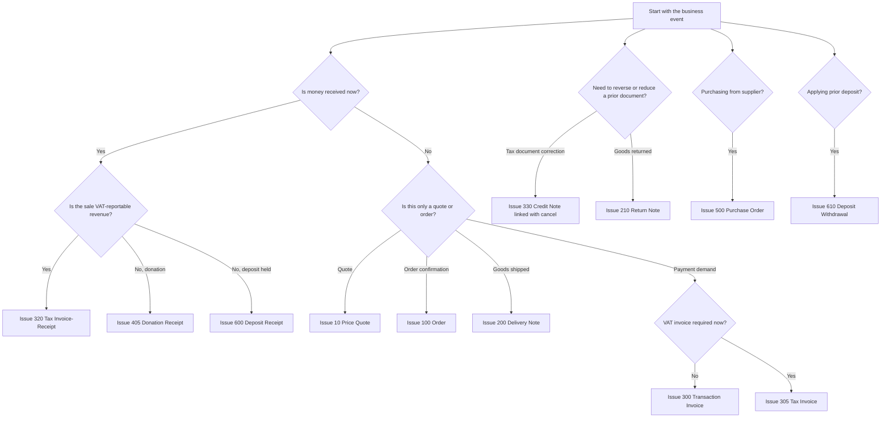
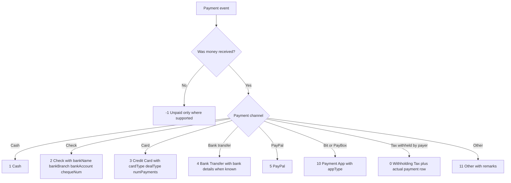
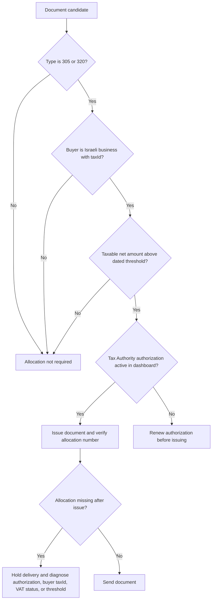
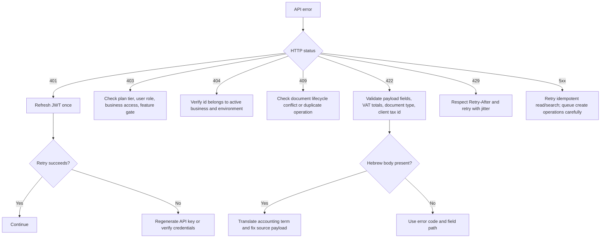

# Green Invoice (Morning)

## Scope

This skill is a neutral technical reference for issuing and managing Israeli business documents through the Green Invoice (Morning) API. It covers authentication, clients, documents, payments, catalog items, expenses, webhooks, production rollout, sandbox testing, and operational troubleshooting.

Official documentation entry points:

- API documentation: https://www.greeninvoice.co.il/api-docs/
- In-application API explorer: https://app.greeninvoice.co.il/api
- API key generation: https://www.greeninvoice.co.il/help-center/generating-api-key/
- Tax Authority connection for allocation numbers: https://www.greeninvoice.co.il/help-center/developers/tax-auth-connect/
- Tax invoice allocation background: https://www.greeninvoice.co.il/magazine/israel-invoice/
- Webhooks overview: https://www.greeninvoice.co.il/magazine/webhooks/

Use the production base URL for live issuance and the sandbox base URL for integration tests:

| Environment | Base URL |
|---|---|
| Production | `https://api.greeninvoice.co.il/api/v1` |
| Sandbox | `https://sandbox.d.greeninvoice.co.il/api/v1` |

## Authentication and headers

Green Invoice uses an API key id and secret with `grant_type: "client_credentials"` to obtain a bearer access token. Send the returned `accessToken` or compatible `token` value with every authenticated request.

```bash
curl -s -X POST "https://api.greeninvoice.co.il/api/v1/account/token" \
  -H "Content-Type: application/json" \
  --data-binary '{"id":"$GREEN_INVOICE_KEY_ID","secret":"$GREEN_INVOICE_KEY_SECRET","grant_type":"client_credentials"}'
```

```python
from green_invoice_client import GreenInvoiceClient

client = GreenInvoiceClient.from_env()
token = client.authenticate()
profile = client.verify_auth()
print(token.get("accessToken") or token.get("token"))
print(profile["email"])
```

Required headers after authentication:

```text
Authorization: Bearer <jwt>
Content-Type: application/json
```

Token handling rules:

- Cache the token until shortly before its JWT `exp` value.
- Refresh on `401` once, then fail loudly if the retry also returns `401`.
- Treat `403` differently from `401`: it usually means missing plan access, missing business permission, inactive feature, or a document operation blocked for that entity.
- Never log the full token, API secret, client tax id, card number, or bank account.

## Document type selection

| Code | Hebrew | English | Use |
|---:|---|---|---|
| 10 | הצעת מחיר | Price Quote | Commercial offer before commitment; no accounting effect until accepted. |
| 100 | הזמנה | Order | Customer order confirmation before delivery or invoicing. |
| 200 | תעודת משלוח | Delivery Note | Goods shipment without immediate tax invoice. |
| 210 | תעודת החזרה | Return Note | Return of goods that were delivered. |
| 300 | חשבון עסקה | Transaction Invoice | Payment demand or pro forma-like billing request; not a VAT invoice. |
| 305 | חשבונית מס | Tax Invoice | VAT invoice for B2B/B2C sale where payment will be collected later. |
| 320 | חשבונית מס/קבלה | Tax Invoice-Receipt | Combined VAT invoice and receipt when payment is received at issue time. |
| 330 | חשבונית זיכוי | Credit Note | Cancels or reduces a previous tax invoice or tax invoice-receipt. |
| 400 | קבלה | Receipt | Receipt for payment against an existing invoice or non-VAT payment event. |
| 405 | קבלה על תרומה | Donation Receipt | Receipt for donation income for eligible non-profit entities. |
| 500 | הזמנת רכש | Purchase Order | Purchase order sent to a supplier. |
| 600 | קבלת פיקדון | Deposit Receipt | Receipt for a deposit or prepayment held before revenue recognition. |
| 610 | משיכת פיקדון | Deposit Withdrawal | Withdrawal or application of a previous deposit. |

### Decision tree: document type



## Payment type selection

| Code | Hebrew | English | Use |
|---:|---|---|---|
| -1 | לא שולם | Unpaid | Use only as an explicit unpaid marker where supported. |
| 0 | ניכוי במקור | Withholding Tax | Tax withheld by payer; record alongside actual cash/bank/card payment. |
| 1 | מזומן | Cash | Cash payment. |
| 2 | המחאה | Check | Check payment; include bank and check details. |
| 3 | כרטיס אשראי | Credit Card | Credit/debit card transaction; include card/deal fields when known. |
| 4 | העברה בנקאית | Bank Transfer | Bank transfer or wire. |
| 5 | פייפאל | PayPal | PayPal payment. |
| 10 | אפליקציית תשלום | Payment App | Bit, PayBox, or legacy app payment with appType. |
| 11 | אחר | Other | Fallback when the payment channel has no dedicated enum. |

### Decision tree: payment type




Current webhook payloads expose payment methods as string values under `paymentMethod.type` (for example `wire-transfer`). Keep numeric payment codes for legacy document creation payloads, and validate new payment channels against the current endpoint documentation before deployment.

## SHAAM allocation number rules

Israeli B2B tax invoices and tax-invoice-receipts may require an allocation number from the Tax Authority / שע״מ so the buyer can deduct input VAT. The live 2026 threshold table is:

| Effective date | Net invoice threshold before VAT | Source |
|---|---:|---|
| May 2024 | ₪25,000 | Green Invoice 2026 allocation guide; Tax Authority invoice reform. |
| 1 January 2025 | ₪20,000 | Green Invoice 2026 allocation guide; Tax Authority invoice reform. |
| 1 January 2026 | ₪10,000 | Green Invoice 2026 allocation guide and Tax Authority 2026 reform notice. |
| 1 June 2026 and onward | ₪5,000 | Green Invoice 2026 allocation guide and Tax Authority 24/05/2026 notice. |

Operational rules:

- Applies to Israeli business buyers for `305` חשבונית מס and `320` חשבונית מס/קבלה when the taxable net amount crosses the active threshold.
- The threshold is before VAT. VAT that pushes the gross amount above the threshold does not by itself create a requirement.
- Does not apply to exempt dealers issuing receipts only, B2C private buyers, foreign customers with zero-rated VAT, credit notes, self-invoices, or non-tax documents.
- Credit notes do not require a new allocation number; keep the original allocation reference in bookkeeping notes when reversing an allocated invoice.
- The dashboard Tax Authority authorization is valid for a limited period and must be renewed before issuing qualifying documents.
- For API integrations, issue the document only after the account has an active Tax Authority authorization and verify the allocation field returned on the issued document before sending it to the buyer.

### Decision tree: SHAAM allocation



## Core document payload

The most common payload has `client`, `income`, optional `payment`, and document-level controls.

```json
{
  "description": "May 2026 implementation services",
  "remarks": "Payment received by bank transfer on 2026-05-31.",
  "footer": "Thank you for your business.",
  "emailContent": "Hello, attached is the tax invoice-receipt for May 2026 services.",
  "type": 320,
  "date": "2026-05-31",
  "dueDate": "2026-05-31",
  "lang": "he",
  "currency": "ILS",
  "vatType": 0,
  "rounding": true,
  "signed": true,
  "attachment": true,
  "client": {
    "name": "Example Ltd",
    "emails": [
      "finance@example.co.il"
    ],
    "taxId": "515555555",
    "address": "Rothschild 1",
    "city": "Tel Aviv-Yafo",
    "zip": "6100001",
    "country": "IL",
    "phone": "03-5550100",
    "contactPerson": "Noa Levi",
    "paymentTerms": -1,
    "labels": [
      "b2b",
      "monthly"
    ],
    "add": true,
    "self": false
  },
  "income": [
    {
      "catalogNum": "IMPL-001",
      "description": "API implementation services",
      "quantity": 1,
      "price": 8000.0,
      "currency": "ILS",
      "currencyRate": 1.0,
      "vatRate": 0.18,
      "vatType": 0
    },
    {
      "catalogNum": "SUP-001",
      "description": "Production support package",
      "quantity": 2,
      "price": 750.0,
      "currency": "ILS",
      "currencyRate": 1.0,
      "vatRate": 0.18,
      "vatType": 0
    }
  ],
  "discount": {
    "amount": 5,
    "type": "percentage"
  },
  "payment": [
    {
      "type": 4,
      "date": "2026-05-31",
      "price": 10649.5,
      "currency": "ILS",
      "currencyRate": 1.0,
      "bankName": "Bank Leumi",
      "bankBranch": "800",
      "bankAccount": "123456"
    }
  ],
  "linkedDocumentIds": [],
  "linkType": "link"
}
```

## Operation cookbook

Every operation below includes a runnable curl shape and a Python call using the bundled client. Replace ids, dates, and credentials with account data before production use.

### Authenticate: `POST /account/token`

Exchange API key id and secret, plus `grant_type: "client_credentials"`, for a bearer access token.

**curl**

```bash
curl -s -X POST "https://api.greeninvoice.co.il/api/v1/account/token" \
  -H "Authorization: Bearer $GREEN_INVOICE_TOKEN" \
  -H "Content-Type: application/json" \
  --data-binary @- <<'JSON'
{
  "id": "api_key_id",
  "secret": "api_key_secret",
  "grant_type": "client_credentials"
}
JSON
```

**Python**

```python
from green_invoice_client import GreenInvoiceClient

client = GreenInvoiceClient(
    key_id="api_key_id",
    key_secret="api_key_secret",
    environment="production",
)
token = client.authenticate()
print(token.get("accessToken") or token.get("token"))
```

**Response**

```json
{
  "accessToken": "eyJhbGciOiJIUzI1NiIsInR5cCI6IkpXVCJ9.sample.signature",
  "tokenType": "Bearer",
  "expiresIn": 3600
}
```

### Verify user: `GET /users/me`

Return the authenticated user profile and active business context.

**curl**

```bash
curl -s "https://api.greeninvoice.co.il/api/v1/users/me" \
  -H "Authorization: Bearer $GREEN_INVOICE_TOKEN" \
  -H "Content-Type: application/json"
```

**Python**

```python
from green_invoice_client import GreenInvoiceClient

client = GreenInvoiceClient.from_env()
payload = {}
result = client.verify_auth()
print(result)
```

**Response**

```json
{
  "id": "usr_8f42",
  "name": "Dana Cohen",
  "email": "dana@example.co.il",
  "businessId": "biz_9a10",
  "roles": [
    "admin"
  ]
}
```

### List businesses: `GET /businesses`

List businesses available to the authenticated user.

**curl**

```bash
curl -s "https://api.greeninvoice.co.il/api/v1/businesses" \
  -H "Authorization: Bearer $GREEN_INVOICE_TOKEN" \
  -H "Content-Type: application/json"
```

**Python**

```python
from green_invoice_client import GreenInvoiceClient

client = GreenInvoiceClient.from_env()
payload = {}
result = client.list_businesses()
print(result)
```

**Response**

```json
{
  "items": [
    {
      "id": "biz_9a10",
      "name": "Dana Cohen Consulting",
      "type": 1,
      "taxId": "012345678",
      "country": "IL",
      "currency": "ILS",
      "vatRate": 0.18
    }
  ]
}
```

### Search businesses: `POST /businesses/search`

Search accessible businesses.

**curl**

```bash
curl -s -X POST "https://api.greeninvoice.co.il/api/v1/businesses/search" \
  -H "Authorization: Bearer $GREEN_INVOICE_TOKEN" \
  -H "Content-Type: application/json" \
  --data-binary @- <<'JSON'
{
  "name": "Dana",
  "page": 0,
  "pageSize": 20
}
JSON
```

**Python**

```python
from green_invoice_client import GreenInvoiceClient

client = GreenInvoiceClient.from_env()
payload = {
  "name": "Dana",
  "page": 0,
  "pageSize": 20
}
result = client.search_businesses(payload)
print(result)
```

**Response**

```json
{
  "items": [
    {
      "id": "biz_9a10",
      "name": "Dana Cohen Consulting",
      "type": 1,
      "taxId": "012345678"
    }
  ],
  "page": 0,
  "pageSize": 20,
  "total": 1
}
```

### Create document: `POST /documents`

Create and issue a document.

**curl**

```bash
curl -s -X POST "https://api.greeninvoice.co.il/api/v1/documents" \
  -H "Authorization: Bearer $GREEN_INVOICE_TOKEN" \
  -H "Content-Type: application/json" \
  --data-binary @- <<'JSON'
{
  "description": "May 2026 implementation services",
  "remarks": "Payment received by bank transfer on 2026-05-31.",
  "footer": "Thank you for your business.",
  "emailContent": "Hello, attached is the tax invoice-receipt for May 2026 services.",
  "type": 320,
  "date": "2026-05-31",
  "dueDate": "2026-05-31",
  "lang": "he",
  "currency": "ILS",
  "vatType": 0,
  "rounding": true,
  "signed": true,
  "attachment": true,
  "client": {
    "name": "Example Ltd",
    "emails": [
      "finance@example.co.il"
    ],
    "taxId": "515555555",
    "address": "Rothschild 1",
    "city": "Tel Aviv-Yafo",
    "zip": "6100001",
    "country": "IL",
    "phone": "03-5550100",
    "contactPerson": "Noa Levi",
    "paymentTerms": -1,
    "labels": [
      "b2b",
      "monthly"
    ],
    "add": true,
    "self": false
  },
  "income": [
    {
      "catalogNum": "IMPL-001",
      "description": "API implementation services",
      "quantity": 1,
      "price": 8000.0,
      "currency": "ILS",
      "currencyRate": 1.0,
      "vatRate": 0.18,
      "vatType": 0
    },
    {
      "catalogNum": "SUP-001",
      "description": "Production support package",
      "quantity": 2,
      "price": 750.0,
      "currency": "ILS",
      "currencyRate": 1.0,
      "vatRate": 0.18,
      "vatType": 0
    }
  ],
  "discount": {
    "amount": 5,
    "type": "percentage"
  },
  "payment": [
    {
      "type": 4,
      "date": "2026-05-31",
      "price": 10649.5,
      "currency": "ILS",
      "currencyRate": 1.0,
      "bankName": "Bank Leumi",
      "bankBranch": "800",
      "bankAccount": "123456"
    }
  ],
  "linkedDocumentIds": [],
  "linkType": "link"
}
JSON
```

**Python**

```python
from green_invoice_client import GreenInvoiceClient

client = GreenInvoiceClient.from_env()
payload = {
  "description": "May 2026 implementation services",
  "remarks": "Payment received by bank transfer on 2026-05-31.",
  "footer": "Thank you for your business.",
  "emailContent": "Hello, attached is the tax invoice-receipt for May 2026 services.",
  "type": 320,
  "date": "2026-05-31",
  "dueDate": "2026-05-31",
  "lang": "he",
  "currency": "ILS",
  "vatType": 0,
  "rounding": true,
  "signed": true,
  "attachment": true,
  "client": {
    "name": "Example Ltd",
    "emails": [
      "finance@example.co.il"
    ],
    "taxId": "515555555",
    "address": "Rothschild 1",
    "city": "Tel Aviv-Yafo",
    "zip": "6100001",
    "country": "IL",
    "phone": "03-5550100",
    "contactPerson": "Noa Levi",
    "paymentTerms": -1,
    "labels": [
      "b2b",
      "monthly"
    ],
    "add": true,
    "self": false
  },
  "income": [
    {
      "catalogNum": "IMPL-001",
      "description": "API implementation services",
      "quantity": 1,
      "price": 8000.0,
      "currency": "ILS",
      "currencyRate": 1.0,
      "vatRate": 0.18,
      "vatType": 0
    },
    {
      "catalogNum": "SUP-001",
      "description": "Production support package",
      "quantity": 2,
      "price": 750.0,
      "currency": "ILS",
      "currencyRate": 1.0,
      "vatRate": 0.18,
      "vatType": 0
    }
  ],
  "discount": {
    "amount": 5,
    "type": "percentage"
  },
  "payment": [
    {
      "type": 4,
      "date": "2026-05-31",
      "price": 10649.5,
      "currency": "ILS",
      "currencyRate": 1.0,
      "bankName": "Bank Leumi",
      "bankBranch": "800",
      "bankAccount": "123456"
    }
  ],
  "linkedDocumentIds": [],
  "linkType": "link"
}
result = client.create_document(payload)
print(result)
```

**Response**

```json
{
  "id": "doc_1001",
  "type": 320,
  "number": 1024,
  "status": 1,
  "date": "2026-05-31",
  "dueDate": "2026-05-31",
  "lang": "he",
  "currency": "ILS",
  "vatType": 0,
  "subtotal": 9500.0,
  "discount": {
    "amount": 5,
    "type": "percentage",
    "total": 475.0
  },
  "taxableTotal": 9025.0,
  "vatTaxableTotal": 1624.5,
  "total": 10649.5,
  "rounding": true,
  "signed": true,
  "client": {
    "id": "cli_2001",
    "name": "Example Ltd",
    "emails": [
      "finance@example.co.il"
    ],
    "taxId": "515555555",
    "country": "IL"
  },
  "income": [
    {
      "catalogNum": "IMPL-001",
      "description": "API implementation services",
      "quantity": 1,
      "price": 8000.0,
      "currency": "ILS",
      "vatRate": 0.18,
      "total": 8000.0
    },
    {
      "catalogNum": "SUP-001",
      "description": "Production support package",
      "quantity": 2,
      "price": 750.0,
      "currency": "ILS",
      "vatRate": 0.18,
      "total": 1500.0
    }
  ],
  "payment": [
    {
      "id": "pay_7001",
      "type": 4,
      "date": "2026-05-31",
      "price": 10649.5,
      "currency": "ILS",
      "bankName": "Bank Leumi",
      "bankBranch": "800",
      "bankAccount": "123456"
    }
  ],
  "files": {
    "signed": true,
    "downloadLinks": {
      "he": "https://www.greeninvoice.co.il/api/v1/documents/download?d=abc123",
      "en": "https://www.greeninvoice.co.il/api/v1/documents/download?d=def456",
      "origin": "https://www.greeninvoice.co.il/api/v1/documents/download?d=ghi789"
    }
  },
  "createdAt": "2026-05-31T10:10:00+03:00",
  "updatedAt": "2026-05-31T10:10:00+03:00"
}
```

### Get document: `GET /documents/{id}`

Return a full document by id.

**curl**

```bash
curl -s "https://api.greeninvoice.co.il/api/v1/documents/{id}" \
  -H "Authorization: Bearer $GREEN_INVOICE_TOKEN" \
  -H "Content-Type: application/json"
```

**Python**

```python
from green_invoice_client import GreenInvoiceClient

client = GreenInvoiceClient.from_env()
payload = {}
result = client.get_document("doc_1001")
print(result)
```

**Response**

```json
{
  "id": "doc_1001",
  "type": 320,
  "number": 1024,
  "status": 1,
  "date": "2026-05-31",
  "dueDate": "2026-05-31",
  "lang": "he",
  "currency": "ILS",
  "vatType": 0,
  "subtotal": 9500.0,
  "discount": {
    "amount": 5,
    "type": "percentage",
    "total": 475.0
  },
  "taxableTotal": 9025.0,
  "vatTaxableTotal": 1624.5,
  "total": 10649.5,
  "rounding": true,
  "signed": true,
  "client": {
    "id": "cli_2001",
    "name": "Example Ltd",
    "emails": [
      "finance@example.co.il"
    ],
    "taxId": "515555555",
    "country": "IL"
  },
  "income": [
    {
      "catalogNum": "IMPL-001",
      "description": "API implementation services",
      "quantity": 1,
      "price": 8000.0,
      "currency": "ILS",
      "vatRate": 0.18,
      "total": 8000.0
    },
    {
      "catalogNum": "SUP-001",
      "description": "Production support package",
      "quantity": 2,
      "price": 750.0,
      "currency": "ILS",
      "vatRate": 0.18,
      "total": 1500.0
    }
  ],
  "payment": [
    {
      "id": "pay_7001",
      "type": 4,
      "date": "2026-05-31",
      "price": 10649.5,
      "currency": "ILS",
      "bankName": "Bank Leumi",
      "bankBranch": "800",
      "bankAccount": "123456"
    }
  ],
  "files": {
    "signed": true,
    "downloadLinks": {
      "he": "https://www.greeninvoice.co.il/api/v1/documents/download?d=abc123",
      "en": "https://www.greeninvoice.co.il/api/v1/documents/download?d=def456",
      "origin": "https://www.greeninvoice.co.il/api/v1/documents/download?d=ghi789"
    }
  },
  "createdAt": "2026-05-31T10:10:00+03:00",
  "updatedAt": "2026-05-31T10:10:00+03:00"
}
```

### Search documents: `POST /documents/search`

Search documents with filters and pagination.

**curl**

```bash
curl -s -X POST "https://api.greeninvoice.co.il/api/v1/documents/search" \
  -H "Authorization: Bearer $GREEN_INVOICE_TOKEN" \
  -H "Content-Type: application/json" \
  --data-binary @- <<'JSON'
{
  "page": 0,
  "pageSize": 25,
  "type": [
    320
  ],
  "fromDate": "2026-05-01",
  "toDate": "2026-05-31",
  "clientName": "Example"
}
JSON
```

**Python**

```python
from green_invoice_client import GreenInvoiceClient

client = GreenInvoiceClient.from_env()
payload = {
  "page": 0,
  "pageSize": 25,
  "type": [
    320
  ],
  "fromDate": "2026-05-01",
  "toDate": "2026-05-31",
  "clientName": "Example"
}
result = client.search_documents(payload)
print(result)
```

**Response**

```json
{
  "items": [
    {
      "id": "doc_1001",
      "type": 320,
      "number": 1024,
      "status": 1,
      "date": "2026-05-31",
      "clientName": "Example Ltd",
      "total": 10649.5,
      "currency": "ILS"
    }
  ],
  "page": 0,
  "pageSize": 25,
  "total": 1
}
```

### Close document: `POST /documents/{id}/close`

Close an open document manually or after linked payment.

**curl**

```bash
curl -s -X POST "https://api.greeninvoice.co.il/api/v1/documents/{id}/close" \
  -H "Authorization: Bearer $GREEN_INVOICE_TOKEN" \
  -H "Content-Type: application/json" \
  --data-binary @- <<'JSON'
{
  "reason": "Paid outside integration",
  "date": "2026-05-31"
}
JSON
```

**Python**

```python
from green_invoice_client import GreenInvoiceClient

client = GreenInvoiceClient.from_env()
payload = {
  "reason": "Paid outside integration",
  "date": "2026-05-31"
}
result = client.close_document("doc_1001", payload)
print(result)
```

**Response**

```json
{
  "id": "doc_1001",
  "status": 2,
  "closedAt": "2026-05-31T10:15:00+03:00"
}
```

### Get download links: `GET /documents/{id}/download/links`

Return signed document download links.

**curl**

```bash
curl -s "https://api.greeninvoice.co.il/api/v1/documents/{id}/download/links" \
  -H "Authorization: Bearer $GREEN_INVOICE_TOKEN" \
  -H "Content-Type: application/json"
```

**Python**

```python
from green_invoice_client import GreenInvoiceClient

client = GreenInvoiceClient.from_env()
payload = {}
result = client.get_document_download_links("doc_1001")
print(result)
```

**Response**

```json
{
  "he": "https://www.greeninvoice.co.il/api/v1/documents/download?d=abc123",
  "en": "https://www.greeninvoice.co.il/api/v1/documents/download?d=def456",
  "origin": "https://www.greeninvoice.co.il/api/v1/documents/download?d=ghi789"
}
```

### Email document: `POST /documents/{id}/email`

Send a document email using the saved client address or supplied recipients.

**curl**

```bash
curl -s -X POST "https://api.greeninvoice.co.il/api/v1/documents/{id}/email" \
  -H "Authorization: Bearer $GREEN_INVOICE_TOKEN" \
  -H "Content-Type: application/json" \
  --data-binary @- <<'JSON'
{
  "to": [
    "finance@example.co.il"
  ],
  "subject": "חשבונית מס/קבלה 1024",
  "message": "שלום, מצורפת חשבונית מס/קבלה עבור השירות."
}
JSON
```

**Python**

```python
from green_invoice_client import GreenInvoiceClient

client = GreenInvoiceClient.from_env()
payload = {
  "to": [
    "finance@example.co.il"
  ],
  "subject": "חשבונית מס/קבלה 1024",
  "message": "שלום, מצורפת חשבונית מס/קבלה עבור השירות."
}
result = client.email_document("doc_1001", payload)
print(result)
```

**Response**

```json
{
  "id": "doc_1001",
  "sent": true,
  "recipients": [
    "finance@example.co.il"
  ],
  "sentAt": "2026-05-31T10:20:00+03:00"
}
```

### Create client: `POST /clients`

Create a client record.

**curl**

```bash
curl -s -X POST "https://api.greeninvoice.co.il/api/v1/clients" \
  -H "Authorization: Bearer $GREEN_INVOICE_TOKEN" \
  -H "Content-Type: application/json" \
  --data-binary @- <<'JSON'
{
  "name": "Example Ltd",
  "emails": [
    "finance@example.co.il"
  ],
  "taxId": "515555555",
  "address": "Rothschild 1",
  "city": "Tel Aviv-Yafo",
  "zip": "6100001",
  "country": "IL",
  "active": true,
  "paymentTerms": 30,
  "labels": [
    "b2b"
  ]
}
JSON
```

**Python**

```python
from green_invoice_client import GreenInvoiceClient

client = GreenInvoiceClient.from_env()
payload = {
  "name": "Example Ltd",
  "emails": [
    "finance@example.co.il"
  ],
  "taxId": "515555555",
  "address": "Rothschild 1",
  "city": "Tel Aviv-Yafo",
  "zip": "6100001",
  "country": "IL",
  "active": true,
  "paymentTerms": 30,
  "labels": [
    "b2b"
  ]
}
result = client.create_client(payload)
print(result)
```

**Response**

```json
{
  "id": "cli_2001",
  "name": "Example Ltd",
  "emails": [
    "finance@example.co.il"
  ],
  "active": true,
  "taxId": "515555555",
  "country": "IL",
  "createdAt": "2026-05-31T09:00:00+03:00"
}
```

### Get client: `GET /clients/{id}`

Return a client by id.

**curl**

```bash
curl -s "https://api.greeninvoice.co.il/api/v1/clients/{id}" \
  -H "Authorization: Bearer $GREEN_INVOICE_TOKEN" \
  -H "Content-Type: application/json"
```

**Python**

```python
from green_invoice_client import GreenInvoiceClient

client = GreenInvoiceClient.from_env()
payload = {}
result = client.get_client("cli_2001")
print(result)
```

**Response**

```json
{
  "id": "cli_2001",
  "name": "Example Ltd",
  "emails": [
    "finance@example.co.il"
  ],
  "active": true,
  "taxId": "515555555",
  "country": "IL"
}
```

### Update client: `PUT /clients/{id}`

Update mutable client fields.

**curl**

```bash
curl -s -X PUT "https://api.greeninvoice.co.il/api/v1/clients/{id}" \
  -H "Authorization: Bearer $GREEN_INVOICE_TOKEN" \
  -H "Content-Type: application/json" \
  --data-binary @- <<'JSON'
{
  "name": "Example Ltd",
  "emails": [
    "finance@example.co.il",
    "bookkeeping@example.co.il"
  ],
  "active": true,
  "paymentTerms": 45,
  "labels": [
    "b2b",
    "priority"
  ]
}
JSON
```

**Python**

```python
from green_invoice_client import GreenInvoiceClient

client = GreenInvoiceClient.from_env()
payload = {
  "name": "Example Ltd",
  "emails": [
    "finance@example.co.il",
    "bookkeeping@example.co.il"
  ],
  "active": true,
  "paymentTerms": 45,
  "labels": [
    "b2b",
    "priority"
  ]
}
result = client.update_client("cli_2001", payload)
print(result)
```

**Response**

```json
{
  "id": "cli_2001",
  "name": "Example Ltd",
  "emails": [
    "finance@example.co.il",
    "bookkeeping@example.co.il"
  ],
  "paymentTerms": 45,
  "labels": [
    "b2b",
    "priority"
  ]
}
```

### Delete client: `DELETE /clients/{id}`

Delete or deactivate a client record when allowed.

**curl**

```bash
curl -s -X DELETE "https://api.greeninvoice.co.il/api/v1/clients/{id}" \
  -H "Authorization: Bearer $GREEN_INVOICE_TOKEN" \
  -H "Content-Type: application/json"
```

**Python**

```python
from green_invoice_client import GreenInvoiceClient

client = GreenInvoiceClient.from_env()
payload = {}
result = client.delete_client("cli_2001")
print(result)
```

**Response**

```json
{
  "id": "cli_2001",
  "deleted": true
}
```

### Search clients: `POST /clients/search`

Search clients with filters and pagination.

**curl**

```bash
curl -s -X POST "https://api.greeninvoice.co.il/api/v1/clients/search" \
  -H "Authorization: Bearer $GREEN_INVOICE_TOKEN" \
  -H "Content-Type: application/json" \
  --data-binary @- <<'JSON'
{
  "name": "Example",
  "email": "finance@example.co.il",
  "active": true,
  "page": 0,
  "pageSize": 25
}
JSON
```

**Python**

```python
from green_invoice_client import GreenInvoiceClient

client = GreenInvoiceClient.from_env()
payload = {
  "name": "Example",
  "email": "finance@example.co.il",
  "active": true,
  "page": 0,
  "pageSize": 25
}
result = client.search_clients(payload)
print(result)
```

**Response**

```json
{
  "items": [
    {
      "id": "cli_2001",
      "name": "Example Ltd",
      "emails": [
        "finance@example.co.il"
      ],
      "active": true
    }
  ],
  "page": 0,
  "pageSize": 25,
  "total": 1
}
```

### Associate client: `POST /clients/{id}/assoc`

Associate existing documents to a client.

**curl**

```bash
curl -s -X POST "https://api.greeninvoice.co.il/api/v1/clients/{id}/assoc" \
  -H "Authorization: Bearer $GREEN_INVOICE_TOKEN" \
  -H "Content-Type: application/json" \
  --data-binary @- <<'JSON'
{
  "documentIds": [
    "doc_1001",
    "doc_1002"
  ]
}
JSON
```

**Python**

```python
from green_invoice_client import GreenInvoiceClient

client = GreenInvoiceClient.from_env()
payload = {
  "documentIds": [
    "doc_1001",
    "doc_1002"
  ]
}
result = client.associate_client_documents("cli_2001", payload)
print(result)
```

**Response**

```json
{
  "clientId": "cli_2001",
  "documentIds": [
    "doc_1001",
    "doc_1002"
  ],
  "associated": 2
}
```

### Create item: `POST /items`

Create a catalog item.

**curl**

```bash
curl -s -X POST "https://api.greeninvoice.co.il/api/v1/items" \
  -H "Authorization: Bearer $GREEN_INVOICE_TOKEN" \
  -H "Content-Type: application/json" \
  --data-binary @- <<'JSON'
{
  "catalogNum": "CONSULT-HOUR",
  "description": "Consulting hour",
  "price": 450.0,
  "currency": "ILS",
  "vatType": 0,
  "active": true
}
JSON
```

**Python**

```python
from green_invoice_client import GreenInvoiceClient

client = GreenInvoiceClient.from_env()
payload = {
  "catalogNum": "CONSULT-HOUR",
  "description": "Consulting hour",
  "price": 450.0,
  "currency": "ILS",
  "vatType": 0,
  "active": true
}
result = client.create_item(payload)
print(result)
```

**Response**

```json
{
  "id": "itm_3001",
  "catalogNum": "CONSULT-HOUR",
  "description": "Consulting hour",
  "price": 450.0,
  "currency": "ILS",
  "active": true
}
```

### Get item: `GET /items/{id}`

Return a catalog item.

**curl**

```bash
curl -s "https://api.greeninvoice.co.il/api/v1/items/{id}" \
  -H "Authorization: Bearer $GREEN_INVOICE_TOKEN" \
  -H "Content-Type: application/json"
```

**Python**

```python
from green_invoice_client import GreenInvoiceClient

client = GreenInvoiceClient.from_env()
payload = {}
result = client.get_item("itm_3001")
print(result)
```

**Response**

```json
{
  "id": "itm_3001",
  "catalogNum": "CONSULT-HOUR",
  "description": "Consulting hour",
  "price": 450.0,
  "currency": "ILS",
  "active": true
}
```

### Update item: `PUT /items/{id}`

Update catalog item fields.

**curl**

```bash
curl -s -X PUT "https://api.greeninvoice.co.il/api/v1/items/{id}" \
  -H "Authorization: Bearer $GREEN_INVOICE_TOKEN" \
  -H "Content-Type: application/json" \
  --data-binary @- <<'JSON'
{
  "description": "Senior consulting hour",
  "price": 520.0,
  "currency": "ILS",
  "active": true
}
JSON
```

**Python**

```python
from green_invoice_client import GreenInvoiceClient

client = GreenInvoiceClient.from_env()
payload = {
  "description": "Senior consulting hour",
  "price": 520.0,
  "currency": "ILS",
  "active": true
}
result = client.update_item("itm_3001", payload)
print(result)
```

**Response**

```json
{
  "id": "itm_3001",
  "description": "Senior consulting hour",
  "price": 520.0,
  "currency": "ILS",
  "active": true
}
```

### Search items: `POST /items/search`

Search catalog items.

**curl**

```bash
curl -s -X POST "https://api.greeninvoice.co.il/api/v1/items/search" \
  -H "Authorization: Bearer $GREEN_INVOICE_TOKEN" \
  -H "Content-Type: application/json" \
  --data-binary @- <<'JSON'
{
  "description": "consulting",
  "active": true,
  "page": 0,
  "pageSize": 25
}
JSON
```

**Python**

```python
from green_invoice_client import GreenInvoiceClient

client = GreenInvoiceClient.from_env()
payload = {
  "description": "consulting",
  "active": true,
  "page": 0,
  "pageSize": 25
}
result = client.search_items(payload)
print(result)
```

**Response**

```json
{
  "items": [
    {
      "id": "itm_3001",
      "catalogNum": "CONSULT-HOUR",
      "description": "Consulting hour",
      "price": 450.0
    }
  ],
  "page": 0,
  "pageSize": 25,
  "total": 1
}
```

### List webhooks: `GET /webhooks`

List registered webhooks for the active business.

**curl**

```bash
curl -s "https://api.greeninvoice.co.il/api/v1/webhooks" \
  -H "Authorization: Bearer $GREEN_INVOICE_TOKEN" \
  -H "Content-Type: application/json"
```

**Python**

```python
from green_invoice_client import GreenInvoiceClient

client = GreenInvoiceClient.from_env()
payload = {}
result = client.list_webhooks()
print(result)
```

**Response**

```json
{
  "items": [
    {
      "id": "wh_4001",
      "url": "https://example.com/green-invoice/webhook",
      "events": [
        "document.created"
      ],
      "active": true,
      "createdAt": "2026-05-30T12:00:00+03:00"
    }
  ]
}
```

### Register webhook: `POST /webhooks`

Register a webhook endpoint.

**curl**

```bash
curl -s -X POST "https://api.greeninvoice.co.il/api/v1/webhooks" \
  -H "Authorization: Bearer $GREEN_INVOICE_TOKEN" \
  -H "Content-Type: application/json" \
  --data-binary @- <<'JSON'
{
  "url": "https://example.com/green-invoice/webhook",
  "events": [
    "document.created",
    "document.updated"
  ],
  "secret": "shared-signing-secret",
  "active": true
}
JSON
```

**Python**

```python
from green_invoice_client import GreenInvoiceClient

client = GreenInvoiceClient.from_env()
payload = {
  "url": "https://example.com/green-invoice/webhook",
  "events": [
    "document.created",
    "document.updated"
  ],
  "secret": "shared-signing-secret",
  "active": true
}
result = client.register_webhook(payload)
print(result)
```

**Response**

```json
{
  "id": "wh_4001",
  "url": "https://example.com/green-invoice/webhook",
  "events": [
    "document.created",
    "document.updated"
  ],
  "active": true
}
```

### Delete webhook: `DELETE /webhooks/{id}`

Delete a webhook registration.

**curl**

```bash
curl -s -X DELETE "https://api.greeninvoice.co.il/api/v1/webhooks/{id}" \
  -H "Authorization: Bearer $GREEN_INVOICE_TOKEN" \
  -H "Content-Type: application/json"
```

**Python**

```python
from green_invoice_client import GreenInvoiceClient

client = GreenInvoiceClient.from_env()
payload = {}
result = client.delete_webhook("wh_4001")
print(result)
```

**Response**

```json
{
  "id": "wh_4001",
  "deleted": true
}
```

### Create expense: `POST /expenses`

Create an expense record.

**curl**

```bash
curl -s -X POST "https://api.greeninvoice.co.il/api/v1/expenses" \
  -H "Authorization: Bearer $GREEN_INVOICE_TOKEN" \
  -H "Content-Type: application/json" \
  --data-binary @- <<'JSON'
{
  "date": "2026-05-31",
  "description": "Office supplies",
  "amount": 236.0,
  "currency": "ILS",
  "vat": 36.0,
  "supplierName": "Office Store",
  "supplierTaxId": "514444444",
  "category": 0
}
JSON
```

**Python**

```python
from green_invoice_client import GreenInvoiceClient

client = GreenInvoiceClient.from_env()
payload = {
  "date": "2026-05-31",
  "description": "Office supplies",
  "amount": 236.0,
  "currency": "ILS",
  "vat": 36.0,
  "supplierName": "Office Store",
  "supplierTaxId": "514444444",
  "category": 0
}
result = client.create_expense(payload)
print(result)
```

**Response**

```json
{
  "id": "exp_5001",
  "date": "2026-05-31",
  "description": "Office supplies",
  "amount": 236.0,
  "currency": "ILS",
  "vat": 36.0,
  "status": "recorded"
}
```

### Get expense: `GET /expenses/{id}`

Return an expense by id.

**curl**

```bash
curl -s "https://api.greeninvoice.co.il/api/v1/expenses/{id}" \
  -H "Authorization: Bearer $GREEN_INVOICE_TOKEN" \
  -H "Content-Type: application/json"
```

**Python**

```python
from green_invoice_client import GreenInvoiceClient

client = GreenInvoiceClient.from_env()
payload = {}
result = client.get_expense("exp_5001")
print(result)
```

**Response**

```json
{
  "id": "exp_5001",
  "date": "2026-05-31",
  "description": "Office supplies",
  "amount": 236.0,
  "currency": "ILS",
  "vat": 36.0,
  "status": "recorded"
}
```

### Search expenses: `POST /expenses/search`

Search expenses with filters and pagination.

**curl**

```bash
curl -s -X POST "https://api.greeninvoice.co.il/api/v1/expenses/search" \
  -H "Authorization: Bearer $GREEN_INVOICE_TOKEN" \
  -H "Content-Type: application/json" \
  --data-binary @- <<'JSON'
{
  "fromDate": "2026-05-01",
  "toDate": "2026-05-31",
  "supplierName": "Office",
  "page": 0,
  "pageSize": 25
}
JSON
```

**Python**

```python
from green_invoice_client import GreenInvoiceClient

client = GreenInvoiceClient.from_env()
payload = {
  "fromDate": "2026-05-01",
  "toDate": "2026-05-31",
  "supplierName": "Office",
  "page": 0,
  "pageSize": 25
}
result = client.search_expenses(payload)
print(result)
```

**Response**

```json
{
  "items": [
    {
      "id": "exp_5001",
      "date": "2026-05-31",
      "description": "Office supplies",
      "amount": 236.0,
      "currency": "ILS"
    }
  ],
  "page": 0,
  "pageSize": 25,
  "total": 1
}
```


## End-to-end workflow examples

### Workflow 1: Immediate B2B tax invoice-receipt

**Request**

```json
{
  "description": "May 2026 implementation services",
  "remarks": "Payment received by bank transfer on 2026-05-31.",
  "footer": "Thank you for your business.",
  "emailContent": "Hello, attached is the tax invoice-receipt for May 2026 services.",
  "type": 320,
  "date": "2026-05-31",
  "dueDate": "2026-05-31",
  "lang": "he",
  "currency": "ILS",
  "vatType": 0,
  "rounding": true,
  "signed": true,
  "attachment": true,
  "client": {
    "name": "Example Ltd",
    "emails": [
      "finance@example.co.il"
    ],
    "taxId": "515555555",
    "address": "Rothschild 1",
    "city": "Tel Aviv-Yafo",
    "zip": "6100001",
    "country": "IL",
    "phone": "03-5550100",
    "contactPerson": "Noa Levi",
    "paymentTerms": -1,
    "labels": [
      "b2b",
      "monthly"
    ],
    "add": true,
    "self": false
  },
  "income": [
    {
      "catalogNum": "IMPL-001",
      "description": "API implementation services",
      "quantity": 1,
      "price": 8000.0,
      "currency": "ILS",
      "currencyRate": 1.0,
      "vatRate": 0.18,
      "vatType": 0
    },
    {
      "catalogNum": "SUP-001",
      "description": "Production support package",
      "quantity": 2,
      "price": 750.0,
      "currency": "ILS",
      "currencyRate": 1.0,
      "vatRate": 0.18,
      "vatType": 0
    }
  ],
  "discount": {
    "amount": 5,
    "type": "percentage"
  },
  "payment": [
    {
      "type": 4,
      "date": "2026-05-31",
      "price": 10649.5,
      "currency": "ILS",
      "currencyRate": 1.0,
      "bankName": "Bank Leumi",
      "bankBranch": "800",
      "bankAccount": "123456"
    }
  ],
  "linkedDocumentIds": [],
  "linkType": "link"
}
```

**Response**

```json
{
  "id": "doc_1001",
  "type": 320,
  "number": 1024,
  "status": 1,
  "date": "2026-05-31",
  "dueDate": "2026-05-31",
  "lang": "he",
  "currency": "ILS",
  "vatType": 0,
  "subtotal": 9500.0,
  "discount": {
    "amount": 5,
    "type": "percentage",
    "total": 475.0
  },
  "taxableTotal": 9025.0,
  "vatTaxableTotal": 1624.5,
  "total": 10649.5,
  "rounding": true,
  "signed": true,
  "client": {
    "id": "cli_2001",
    "name": "Example Ltd",
    "emails": [
      "finance@example.co.il"
    ],
    "taxId": "515555555",
    "country": "IL"
  },
  "income": [
    {
      "catalogNum": "IMPL-001",
      "description": "API implementation services",
      "quantity": 1,
      "price": 8000.0,
      "currency": "ILS",
      "vatRate": 0.18,
      "total": 8000.0
    },
    {
      "catalogNum": "SUP-001",
      "description": "Production support package",
      "quantity": 2,
      "price": 750.0,
      "currency": "ILS",
      "vatRate": 0.18,
      "total": 1500.0
    }
  ],
  "payment": [
    {
      "id": "pay_7001",
      "type": 4,
      "date": "2026-05-31",
      "price": 10649.5,
      "currency": "ILS",
      "bankName": "Bank Leumi",
      "bankBranch": "800",
      "bankAccount": "123456"
    }
  ],
  "files": {
    "signed": true,
    "downloadLinks": {
      "he": "https://www.greeninvoice.co.il/api/v1/documents/download?d=abc123",
      "en": "https://www.greeninvoice.co.il/api/v1/documents/download?d=def456",
      "origin": "https://www.greeninvoice.co.il/api/v1/documents/download?d=ghi789"
    }
  },
  "createdAt": "2026-05-31T10:10:00+03:00",
  "updatedAt": "2026-05-31T10:10:00+03:00"
}
```

### Workflow 2: B2B tax invoice above the allocation threshold

**Request**

```json
{
  "description": "Enterprise implementation milestone",
  "remarks": "B2B invoice above SHAAM allocation threshold. Payment due end of month plus 30.",
  "type": 305,
  "date": "2026-06-15",
  "dueDate": "2026-07-31",
  "lang": "he",
  "currency": "ILS",
  "vatType": 0,
  "rounding": true,
  "signed": true,
  "attachment": true,
  "client": {
    "name": "Alpha Manufacturing Ltd",
    "emails": [
      "ap@alpha.example"
    ],
    "taxId": "516666666",
    "country": "IL",
    "paymentTerms": 30,
    "add": true
  },
  "income": [
    {
      "catalogNum": "MILESTONE-2",
      "description": "Milestone 2 delivery",
      "quantity": 1,
      "price": 12000.0,
      "currency": "ILS",
      "currencyRate": 1.0,
      "vatRate": 0.18,
      "vatType": 0
    }
  ],
  "linkedDocumentIds": [],
  "linkType": "link"
}
```

**Response**

```json
{
  "id": "doc_1002",
  "type": 305,
  "number": 1025,
  "status": 0,
  "date": "2026-06-15",
  "dueDate": "2026-07-31",
  "currency": "ILS",
  "subtotal": 12000.0,
  "taxableTotal": 12000.0,
  "vatTaxableTotal": 2160.0,
  "total": 14160.0,
  "taxAuthorityAllocationNumber": "987654321",
  "client": {
    "id": "cli_2002",
    "name": "Alpha Manufacturing Ltd",
    "emails": [
      "ap@alpha.example"
    ],
    "taxId": "516666666",
    "country": "IL"
  },
  "income": [
    {
      "catalogNum": "MILESTONE-2",
      "description": "Milestone 2 delivery",
      "quantity": 1,
      "price": 12000.0,
      "currency": "ILS",
      "vatRate": 0.18,
      "total": 12000.0
    }
  ],
  "payment": [],
  "files": {
    "signed": true,
    "downloadLinks": {
      "he": "https://www.greeninvoice.co.il/api/v1/documents/download?d=shaamhe1025",
      "en": "https://www.greeninvoice.co.il/api/v1/documents/download?d=shaamen1025",
      "origin": "https://www.greeninvoice.co.il/api/v1/documents/download?d=shaamorigin1025"
    }
  },
  "createdAt": "2026-06-15T11:45:00+03:00",
  "updatedAt": "2026-06-15T11:45:00+03:00"
}
```

### Workflow 3: Receipt with withholding tax split

**Request**

```json
{
  "description": "Receipt for invoice 1025 with withholding tax",
  "remarks": "Customer withheld 5% tax at source and transferred the balance.",
  "type": 400,
  "date": "2026-07-20",
  "lang": "he",
  "currency": "ILS",
  "signed": true,
  "attachment": true,
  "client": {
    "id": "cli_2002",
    "name": "Alpha Manufacturing Ltd",
    "emails": [
      "ap@alpha.example"
    ],
    "taxId": "516666666",
    "country": "IL"
  },
  "payment": [
    {
      "type": 4,
      "date": "2026-07-20",
      "price": 13452.0,
      "currency": "ILS",
      "currencyRate": 1.0,
      "bankName": "Bank Hapoalim",
      "bankBranch": "600",
      "bankAccount": "778899"
    },
    {
      "type": 0,
      "date": "2026-07-20",
      "price": 708.0,
      "currency": "ILS",
      "currencyRate": 1.0
    }
  ],
  "linkedDocumentIds": [
    "doc_1002"
  ],
  "linkType": "link"
}
```

**Response**

```json
{
  "id": "doc_1003",
  "type": 400,
  "number": 2048,
  "status": 1,
  "date": "2026-07-20",
  "currency": "ILS",
  "subtotal": 0.0,
  "taxableTotal": 0.0,
  "vatTaxableTotal": 0.0,
  "total": 14160.0,
  "client": {
    "id": "cli_2002",
    "name": "Alpha Manufacturing Ltd",
    "emails": [
      "ap@alpha.example"
    ],
    "taxId": "516666666",
    "country": "IL"
  },
  "payment": [
    {
      "id": "pay_7002",
      "type": 4,
      "date": "2026-07-20",
      "price": 13452.0,
      "currency": "ILS",
      "bankName": "Bank Hapoalim",
      "bankBranch": "600",
      "bankAccount": "778899"
    },
    {
      "id": "pay_7003",
      "type": 0,
      "date": "2026-07-20",
      "price": 708.0,
      "currency": "ILS"
    }
  ],
  "linkedDocumentIds": [
    "doc_1002"
  ],
  "closedDocumentIds": [
    "doc_1002"
  ],
  "files": {
    "signed": true,
    "downloadLinks": {
      "he": "https://www.greeninvoice.co.il/api/v1/documents/download?d=receipthe2048",
      "en": "https://www.greeninvoice.co.il/api/v1/documents/download?d=receipten2048",
      "origin": "https://www.greeninvoice.co.il/api/v1/documents/download?d=receiptorigin2048"
    }
  },
  "createdAt": "2026-07-20T16:00:00+03:00",
  "updatedAt": "2026-07-20T16:00:00+03:00"
}
```

### Workflow 4: Credit note cancelling a tax invoice-receipt

**Request**

```json
{
  "description": "Full cancellation of tax invoice-receipt 1024",
  "remarks": "Service cancelled before delivery. Refund executed to original bank account.",
  "type": 330,
  "date": "2026-06-02",
  "lang": "he",
  "currency": "ILS",
  "vatType": 0,
  "rounding": true,
  "signed": true,
  "attachment": true,
  "client": {
    "id": "cli_2001",
    "name": "Example Ltd",
    "emails": [
      "finance@example.co.il"
    ],
    "taxId": "515555555",
    "country": "IL"
  },
  "income": [
    {
      "catalogNum": "IMPL-001",
      "description": "API implementation services cancellation",
      "quantity": 1,
      "price": 8000.0,
      "currency": "ILS",
      "currencyRate": 1.0,
      "vatRate": 0.18,
      "vatType": 0
    },
    {
      "catalogNum": "SUP-001",
      "description": "Production support package cancellation",
      "quantity": 2,
      "price": 750.0,
      "currency": "ILS",
      "currencyRate": 1.0,
      "vatRate": 0.18,
      "vatType": 0
    }
  ],
  "discount": {
    "amount": 5,
    "type": "percentage"
  },
  "linkedDocumentIds": [
    "doc_1001"
  ],
  "linkType": "cancel"
}
```

**Response**

```json
{
  "id": "doc_1004",
  "type": 330,
  "number": 1026,
  "status": 3,
  "date": "2026-06-02",
  "currency": "ILS",
  "subtotal": 9500.0,
  "discount": {
    "amount": 5,
    "type": "percentage",
    "total": 475.0
  },
  "taxableTotal": 9025.0,
  "vatTaxableTotal": 1624.5,
  "total": 10649.5,
  "client": {
    "id": "cli_2001",
    "name": "Example Ltd",
    "emails": [
      "finance@example.co.il"
    ],
    "taxId": "515555555",
    "country": "IL"
  },
  "income": [
    {
      "catalogNum": "IMPL-001",
      "description": "API implementation services cancellation",
      "quantity": 1,
      "price": 8000.0,
      "currency": "ILS",
      "vatRate": 0.18,
      "total": 8000.0
    },
    {
      "catalogNum": "SUP-001",
      "description": "Production support package cancellation",
      "quantity": 2,
      "price": 750.0,
      "currency": "ILS",
      "vatRate": 0.18,
      "total": 1500.0
    }
  ],
  "linkedDocumentIds": [
    "doc_1001"
  ],
  "canceledDocumentIds": [
    "doc_1001"
  ],
  "files": {
    "signed": true,
    "downloadLinks": {
      "he": "https://www.greeninvoice.co.il/api/v1/documents/download?d=credithe1026",
      "en": "https://www.greeninvoice.co.il/api/v1/documents/download?d=crediten1026",
      "origin": "https://www.greeninvoice.co.il/api/v1/documents/download?d=creditorigin1026"
    }
  },
  "createdAt": "2026-06-02T12:30:00+03:00",
  "updatedAt": "2026-06-02T12:30:00+03:00"
}
```

### Workflow 5: Foreign-currency VAT-exempt export invoice-receipt

**Request**

```json
{
  "description": "Exported software consulting",
  "remarks": "Service supplied to a non-Israeli customer. VAT exempt treatment confirmed before issuance.",
  "type": 320,
  "date": "2026-05-31",
  "dueDate": "2026-05-31",
  "lang": "en",
  "currency": "USD",
  "vatType": 1,
  "rounding": false,
  "signed": true,
  "attachment": true,
  "client": {
    "name": "Global Apps Inc",
    "emails": [
      "billing@globalapps.example"
    ],
    "taxId": "US-98-7654321",
    "address": "100 Market Street",
    "city": "New York",
    "zip": "10001",
    "country": "US",
    "add": true
  },
  "income": [
    {
      "catalogNum": "EXPORT-CONSULT",
      "description": "Remote software consulting",
      "quantity": 20,
      "price": 180.0,
      "currency": "USD",
      "currencyRate": 3.7,
      "vatRate": 0.0,
      "vatType": 2
    }
  ],
  "payment": [
    {
      "type": 5,
      "date": "2026-05-31",
      "price": 3600.0,
      "currency": "USD",
      "currencyRate": 3.7
    }
  ],
  "linkedDocumentIds": [],
  "linkType": "link"
}
```

**Response**

```json
{
  "id": "doc_1005",
  "type": 320,
  "number": 1027,
  "status": 1,
  "date": "2026-05-31",
  "lang": "en",
  "currency": "USD",
  "vatType": 1,
  "subtotal": 3600.0,
  "taxableTotal": 0.0,
  "exemptTotal": 3600.0,
  "vatTaxableTotal": 0.0,
  "total": 3600.0,
  "client": {
    "id": "cli_2003",
    "name": "Global Apps Inc",
    "emails": [
      "billing@globalapps.example"
    ],
    "taxId": "US-98-7654321",
    "country": "US"
  },
  "income": [
    {
      "catalogNum": "EXPORT-CONSULT",
      "description": "Remote software consulting",
      "quantity": 20,
      "price": 180.0,
      "currency": "USD",
      "currencyRate": 3.7,
      "vatRate": 0.0,
      "vatType": 2,
      "total": 3600.0
    }
  ],
  "payment": [
    {
      "id": "pay_7004",
      "type": 5,
      "date": "2026-05-31",
      "price": 3600.0,
      "currency": "USD",
      "currencyRate": 3.7
    }
  ],
  "files": {
    "signed": true,
    "downloadLinks": {
      "he": "https://www.greeninvoice.co.il/api/v1/documents/download?d=exporthe1027",
      "en": "https://www.greeninvoice.co.il/api/v1/documents/download?d=exporten1027",
      "origin": "https://www.greeninvoice.co.il/api/v1/documents/download?d=exportorigin1027"
    }
  },
  "createdAt": "2026-05-31T18:05:00+03:00",
  "updatedAt": "2026-05-31T18:05:00+03:00"
}
```

### Workflow 6: Deposit receipt for a prepayment

**Request**

```json
{
  "description": "Deposit received for September workshop",
  "remarks": "Deposit is held until the workshop is delivered.",
  "type": 600,
  "date": "2026-05-31",
  "lang": "he",
  "currency": "ILS",
  "signed": true,
  "attachment": true,
  "client": {
    "name": "Community Center",
    "emails": [
      "office@community.example"
    ],
    "taxId": "580000001",
    "country": "IL",
    "add": true
  },
  "payment": [
    {
      "type": 1,
      "date": "2026-05-31",
      "price": 1000.0,
      "currency": "ILS",
      "currencyRate": 1.0
    }
  ],
  "linkedDocumentIds": [],
  "linkType": "link"
}
```

**Response**

```json
{
  "id": "doc_1006",
  "type": 600,
  "number": 3001,
  "status": 1,
  "date": "2026-05-31",
  "currency": "ILS",
  "total": 1000.0,
  "client": {
    "id": "cli_2004",
    "name": "Community Center",
    "emails": [
      "office@community.example"
    ],
    "taxId": "580000001",
    "country": "IL"
  },
  "payment": [
    {
      "id": "pay_7005",
      "type": 1,
      "date": "2026-05-31",
      "price": 1000.0,
      "currency": "ILS"
    }
  ],
  "files": {
    "signed": true,
    "downloadLinks": {
      "he": "https://www.greeninvoice.co.il/api/v1/documents/download?d=deposithe3001",
      "en": "https://www.greeninvoice.co.il/api/v1/documents/download?d=depositen3001",
      "origin": "https://www.greeninvoice.co.il/api/v1/documents/download?d=depositorigin3001"
    }
  },
  "createdAt": "2026-05-31T13:20:00+03:00",
  "updatedAt": "2026-05-31T13:20:00+03:00"
}
```


## Edge cases

### Foreign-currency invoices

Use document `currency` and line-level `currency`. Provide `currencyRate` only when a specific rate must be frozen. For USD/EUR exports, set `lang: "en"` when the recipient expects English. For VAT-exempt export services, use document `vatType: 1` and line `vatType: 2` after confirming tax treatment.

### Credit notes that cancel tax invoices

Use type `330`, provide `linkedDocumentIds`, and set `linkType: "cancel"`. Match the original taxable lines when cancelling fully. For partial corrections, include only the amount being credited. A credit note should not be used as a receipt refund record by itself; record the bank/card refund in the payment system and keep references in `remarks`.

### Refunds with VAT split

Refund the net and VAT proportionally. For a partial refund of ₪1,000 net at 18% VAT, credit ₪1,000 net and ₪180 VAT. If an original discount existed, apply the same discount logic to the credited lines or explicitly state the correction basis in `remarks`.

### Discount calculations and fractional agorot

Use either `discount.type: "percentage"` or `discount.type: "sum"`. Enable `rounding: true` for consumer-facing documents where fractional agorot can appear after VAT. Store the API response totals rather than recalculating totals downstream because line rounding, document rounding, and VAT splitting can differ by agorot.

### B2C versus B2B routing

For private customers, a name and email can be sufficient. For B2B customers, always send `taxId`, legal name, country, and email. Above the SHAAM threshold, block sending until allocation number presence is verified in the issued document.

### Multi-line items

Use one `income` row per accounting meaning. Separate services, physical goods, discounts represented as negative lines, shipping, and VAT-exempt rows. Mixed VAT requires document `vatType: 2` and row-level `vatType` values.

### Free-text versus catalog items

Use `itemId` or `catalogNum` for recurring products, inventory reconciliation, and reporting. Use free-text `description` for one-off services. Do not overload one catalog item with changing tax treatment; create distinct catalog entries when VAT handling differs.

### Deposits and prepayments

Use type `600` when money is held as a deposit before revenue recognition. Use type `610` when applying or withdrawing a deposit. Issue the final tax document when revenue is recognized, then link or reference the deposit flow.

### Osek patur and VAT

An עוסק פטור cannot issue VAT-bearing tax invoices. Use receipt-style documents and verify account business type before generating a `305` or `320` payload with VAT.

## Troubleshooting

### Error-recovery flow



| Symptom | Likely diagnosis | Fix |
|---|---|---|
| `401 Unauthorized` immediately after token creation | Token missing from `Authorization` header or wrong environment token used | Re-authenticate against the same base URL used by later calls. |
| `401` after long-running worker uptime | JWT expired | Decode `exp`, refresh before expiry, retry once on 401. |
| `403 Forbidden` on most endpoints | Plan does not include API access or user lacks business permission | Verify subscription and active business role in dashboard. |
| `403` only on webhooks | Webhooks can be gated separately | Upgrade feature access or disable webhook registration in lower environments. |
| `404` for an id copied from production while using sandbox | Environment mismatch | Keep sandbox and production ids in separate databases. |
| `422` with VAT wording | `vatType`, `vatRate`, or business type mismatch | Match row VAT settings to account type and transaction. |
| Missing SHAAM allocation number | Authorization absent or expired; invoice under wrong buyer category | Renew Tax Authority authorization and verify B2B `taxId`. |
| Rate limit response | Burst too high | Respect `Retry-After`, use exponential backoff, and queue writes. |
| Plan-gating message references Best or Extra | Feature not included in active subscription | Do not retry; surface an actionable plan-access error. |
| Hebrew error mentions `מספר עוסק` | Missing or invalid Israeli business tax id | Send legal `taxId` for B2B clients. |
| Hebrew error mentions `סוג מסמך` | Document type invalid for business type or state | Choose the allowed document type for the entity and lifecycle. |

Common bilingual patterns:

| Hebrew fragment | English meaning | Handling |
|---|---|---|
| `אין הרשאה` | No permission | Check token user, business access, plan, or feature gate. |
| `פג תוקף` | Expired | Refresh token or renew Tax Authority authorization. |
| `מספר הקצאה` | Allocation number | Diagnose SHAAM authorization and invoice threshold. |
| `סכום לא תקין` | Invalid amount | Recalculate line totals, VAT, rounding, and payment split. |
| `לקוח חובה` | Client required | Supply `client.id` or complete new `client` object. |
| `מייל לא תקין` | Invalid email | Normalize recipient email list. |

## Production go-live checklist

- Create separate sandbox and production API keys.
- Store API secrets in a secret manager or environment variables.
- Confirm account plan includes API access and webhook access if webhooks are used.
- Verify business type, VAT status, legal name, tax id, and document numbering in the dashboard.
- Complete Tax Authority authorization for SHAAM allocation numbers where relevant.
- Run sandbox tests for all document types that the integration can issue.
- Validate B2B tax id collection before enabling high-value invoices.
- Store issued document ids, numbers, totals, currency, client id, allocation number, and download links.
- Implement idempotency in the application layer using order id or invoice intent id.
- Configure retry policy for `429` and `5xx`; never blindly replay successful document creation.
- Validate webhook signature before processing payloads.
- Keep sandbox and production ids isolated.
- Create operational alerts for 401 spikes, 403 spikes, SHAAM failures, and webhook delivery failures.
- Have an accountant approve representative documents before live issuance.

## Anti-patterns

- Do not create a `320` for every order regardless of payment status.
- Do not issue a VAT document for an עוסק פטור.
- Do not send B2B high-value invoices before checking allocation-number presence.
- Do not use a receipt as a substitute for a tax invoice when VAT is due.
- Do not hardcode document numbers; let the API assign official numbers.
- Do not recompute final totals from raw input after issuance; persist API response totals.
- Do not mix sandbox and production ids.
- Do not log secrets, bearer tokens, bank accounts, or full card numbers.
- Do not retry a document creation after an unknown network failure without first searching for the intended document.
- Do not use `type: 11` Other payment when a specific payment enum exists.

## Bundled files

- `scripts/green_invoice_client.py`: importable sync and async typed API client with retries, token refresh, and webhook signature verification.
- `scripts/green-invoice-cli.py`: command line interface for auth, clients, documents, items, payments, webhooks, and expenses.
- `scripts/test_green_invoice_client.py`: pytest suite using mocked HTTP transports.
- `scripts/examples/`: runnable workflow scripts.
- `references/api-reference.md`: endpoint catalogue and schema guide.
- `references/document-workflows.md`: lifecycle guide for all 13 document types.
- `references/troubleshooting.md`: deep diagnostics and curl snippets.
- `references/test-scenarios.md`: sandbox scenario matrix.
- `references/migration-checklist.md`: migration checklist.
