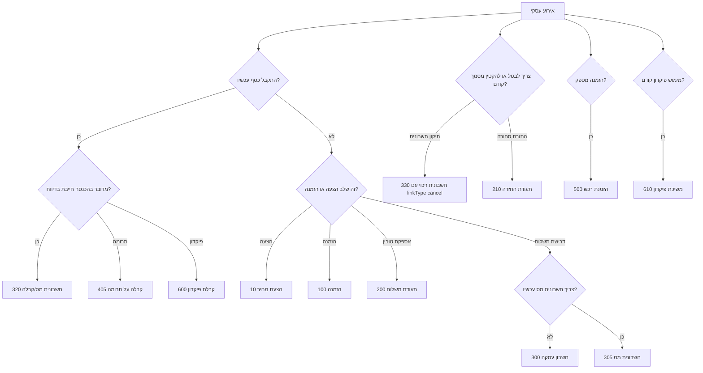
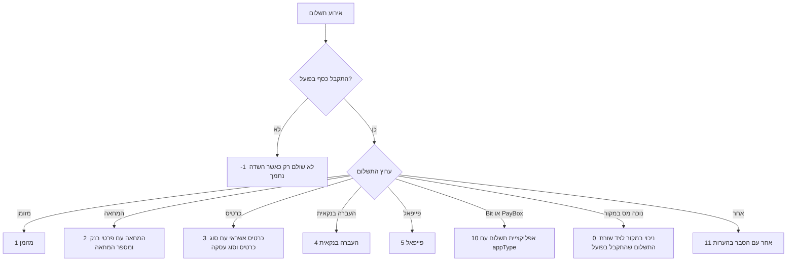
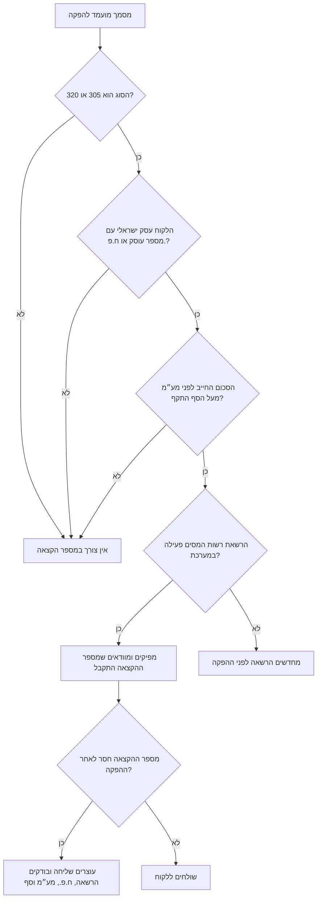
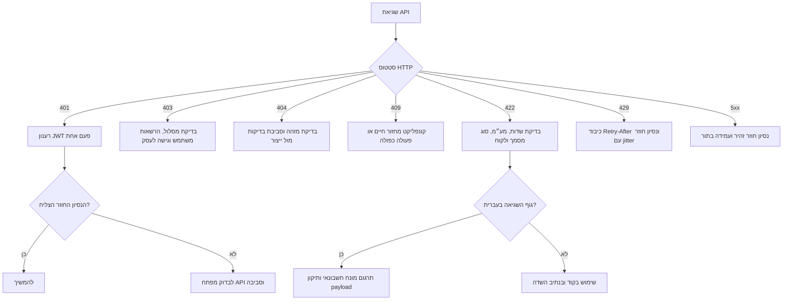

# חשבונית ירוקה (Morning)

## היקף

מסמך זה הוא מדריך טכני ניטרלי לעבודה עם API של חשבונית ירוקה (Morning) לעסקים בישראל. הוא מכסה אימות, לקוחות, מסמכים, אמצעי תשלום, קטלוג פריטים, הוצאות, וובהוקים, בדיקות בסביבת בדיקות, מעבר לייצור ותפעול תקלות.

קישורים רשמיים:

- תיעוד API: https://www.greeninvoice.co.il/api-docs/
- סייר API בתוך המערכת: https://app.greeninvoice.co.il/api
- הפקת מפתח API: https://www.greeninvoice.co.il/help-center/generating-api-key/
- חיבור לרשות המסים לצורך הקצאת מספר: https://www.greeninvoice.co.il/help-center/developers/tax-auth-connect/
- רקע על הקצאת מספר לחשבוניות ישראל: https://www.greeninvoice.co.il/magazine/israel-invoice/
- סקירת וובהוקים: https://www.greeninvoice.co.il/magazine/webhooks/

| סביבה | כתובת בסיס |
|---|---|
| ייצור | `https://api.greeninvoice.co.il/api/v1` |
| סביבת בדיקות | `https://sandbox.d.greeninvoice.co.il/api/v1` |

## אימות והרשאות

האימות מתבצע באמצעות מזהה מפתח API וסוד. הבקשה מחזירה טוקן JWT, ואותו מצרפים לכל בקשה עם כותרת `Authorization`.

```bash
curl -s -X POST "https://api.greeninvoice.co.il/api/v1/account/token" \
  -H "Content-Type: application/json" \
  --data-binary '{"id":"$GREEN_INVOICE_KEY_ID","secret":"$GREEN_INVOICE_KEY_SECRET","grant_type":"client_credentials"}'
```

```python
from green_invoice_client import GreenInvoiceClient

client = GreenInvoiceClient.from_env()
token = client.authenticate()
profile = client.verify_auth()
print(token.get("accessToken") or token.get("token"))
print(profile["email"])
```

כללי תפעול:

- לרענן טוקן לפני פקיעת `exp` של ה-JWT.
- לאחר `401` מותר לבצע רענון אחד ונסיון חוזר אחד.
- `403` אינו שגיאת טוקן רגילה; בדרך כלל מדובר בהרשאות עסק, מסלול שירות, תכונה חסומה או פעולה שאינה מותרת במסמך.
- אין להדפיס ללוג טוקנים, סודות API, מספרי חשבון בנק, מספרי כרטיס מלאים או מספרי עוסק של לקוחות ללא צורך תפעולי.

## סוגי מסמכים

| קוד | שם בעברית | שם באנגלית | שימוש |
|---:|---|---|---|
| 10 | הצעת מחיר | Price Quote | Commercial offer before commitment; no accounting effect until accepted. |
| 100 | הזמנה | Order | Customer order confirmation before delivery or invoicing. |
| 200 | תעודת משלוח | Delivery Note | Goods shipment without immediate tax invoice. |
| 210 | תעודת החזרה | Return Note | Return of goods that were delivered. |
| 300 | חשבון עסקה | Transaction Invoice | Payment demand or pro forma-like billing request; not a VAT invoice. |
| 305 | חשבונית מס | Tax Invoice | VAT invoice for B2B/B2C sale where payment will be collected later. |
| 320 | חשבונית מס/קבלה | Tax Invoice-Receipt | Combined VAT invoice and receipt when payment is received at issue time. |
| 330 | חשבונית זיכוי | Credit Note | Cancels or reduces a previous tax invoice or tax invoice-receipt. |
| 400 | קבלה | Receipt | Receipt for payment against an existing invoice or non-VAT payment event. |
| 405 | קבלה על תרומה | Donation Receipt | Receipt for donation income for eligible non-profit entities. |
| 500 | הזמנת רכש | Purchase Order | Purchase order sent to a supplier. |
| 600 | קבלת פיקדון | Deposit Receipt | Receipt for a deposit or prepayment held before revenue recognition. |
| 610 | משיכת פיקדון | Deposit Withdrawal | Withdrawal or application of a previous deposit. |

### עץ החלטה לבחירת סוג מסמך



## אמצעי תשלום

| קוד | שם בעברית | שם באנגלית | שימוש |
|---:|---|---|---|
| -1 | לא שולם | Unpaid | Use only as an explicit unpaid marker where supported. |
| 0 | ניכוי במקור | Withholding Tax | Tax withheld by payer; record alongside actual cash/bank/card payment. |
| 1 | מזומן | Cash | Cash payment. |
| 2 | המחאה | Check | Check payment; include bank and check details. |
| 3 | כרטיס אשראי | Credit Card | Credit/debit card transaction; include card/deal fields when known. |
| 4 | העברה בנקאית | Bank Transfer | Bank transfer or wire. |
| 5 | פייפאל | PayPal | PayPal payment. |
| 10 | אפליקציית תשלום | Payment App | Bit, PayBox, or legacy app payment with appType. |
| 11 | אחר | Other | Fallback when the payment channel has no dedicated enum. |

### עץ החלטה לבחירת אמצעי תשלום




ב-payload של וובהוק, אמצעי התשלום מופיע כיום כמחרוזת תחת `paymentMethod.type`, למשל `wire-transfer`. יש להשתמש בקודים מספריים רק עבור payload יצירת מסמך שמסתמך על ה-API הישן, ולאמת ערוצי תשלום חדשים מול תיעוד ה-endpoint העדכני לפני עלייה לאוויר.

## הקצאת מספר שע״מ

בחשבוניות מס ובחשבוניות מס/קבלה לעסק ישראלי עשוי להידרש מספר הקצאה מרשות המסים/שע״מ כדי שהלקוח יוכל לנכות מס תשומות. טבלת הספים המעודכנת לשנת 2026 היא:

| מועד תחילה | סכום חשבונית לפני מע״מ | מקור |
|---|---:|---|
| מאי 2024 | ₪25,000 | מדריך חשבוניות ישראל של מורנינג ועדכוני רשות המסים. |
| 01/01/2025 | ₪20,000 | מדריך חשבוניות ישראל של מורנינג ועדכוני רשות המסים. |
| 01/01/2026 | ₪10,000 | מדריך חשבוניות ישראל של מורנינג והודעת רשות המסים לשנת 2026. |
| 01/06/2026 ואילך | ₪5,000 | מדריך חשבוניות ישראל של מורנינג והודעת רשות המסים מ-24/05/2026. |

כללי עבודה:

- הכלל חל על לקוח עסקי ישראלי במסמכים `305` חשבונית מס ו-`320` חשבונית מס/קבלה כאשר סכום העסקה החייב לפני מע״מ עובר את הסף התקף.
- הסף מחושב לפני מע״מ. תוספת מע״מ שמעלה את הסכום הכולל מעבר לסף אינה מספיקה בפני עצמה.
- הכלל אינו חל על עוסק פטור שמפיק קבלות בלבד, לקוח פרטי, לקוח מחו״ל בעסקה בשיעור מע״מ אפס, חשבונית זיכוי, חשבונית עצמית או מסמך שאינו חשבונית מס.
- חשבונית זיכוי אינה דורשת מספר הקצאה חדש. כאשר מזכים חשבונית שהוקצה לה מספר, שומרים את מספר ההקצאה המקורי באסמכתאות הנהלת החשבונות לפי הצורך.
- הרשאת החיבור לרשות המסים מוגבלת בזמן ויש לחדש אותה לפני הפקת מסמכים שמחייבים הקצאה.
- באינטגרציית API, יש להפיק מסמך רלוונטי רק לאחר שההרשאה פעילה, ולא לשלוח את המסמך ללקוח לפני שנבדק שמספר ההקצאה התקבל במסמך שהופק.

### עץ החלטה: הקצאת מספר שע״מ



## Payload בסיסי למסמך

```json
{
  "description": "May 2026 implementation services",
  "remarks": "Payment received by bank transfer on 2026-05-31.",
  "footer": "Thank you for your business.",
  "emailContent": "Hello, attached is the tax invoice-receipt for May 2026 services.",
  "type": 320,
  "date": "2026-05-31",
  "dueDate": "2026-05-31",
  "lang": "he",
  "currency": "ILS",
  "vatType": 0,
  "rounding": true,
  "signed": true,
  "attachment": true,
  "client": {
    "name": "Example Ltd",
    "emails": [
      "finance@example.co.il"
    ],
    "taxId": "515555555",
    "address": "Rothschild 1",
    "city": "Tel Aviv-Yafo",
    "zip": "6100001",
    "country": "IL",
    "phone": "03-5550100",
    "contactPerson": "Noa Levi",
    "paymentTerms": -1,
    "labels": [
      "b2b",
      "monthly"
    ],
    "add": true,
    "self": false
  },
  "income": [
    {
      "catalogNum": "IMPL-001",
      "description": "API implementation services",
      "quantity": 1,
      "price": 8000.0,
      "currency": "ILS",
      "currencyRate": 1.0,
      "vatRate": 0.18,
      "vatType": 0
    },
    {
      "catalogNum": "SUP-001",
      "description": "Production support package",
      "quantity": 2,
      "price": 750.0,
      "currency": "ILS",
      "currencyRate": 1.0,
      "vatRate": 0.18,
      "vatType": 0
    }
  ],
  "discount": {
    "amount": 5,
    "type": "percentage"
  },
  "payment": [
    {
      "type": 4,
      "date": "2026-05-31",
      "price": 10649.5,
      "currency": "ILS",
      "currencyRate": 1.0,
      "bankName": "Bank Leumi",
      "bankBranch": "800",
      "bankAccount": "123456"
    }
  ],
  "linkedDocumentIds": [],
  "linkType": "link"
}
```

## דוגמאות פעולה מלאות

כל פעולה כוללת דוגמת curl ודוגמת Python באמצעות הלקוח המצורף. יש להחליף מזהים, תאריכים ופרטי חשבון לפני שימוש בייצור.

### אימות וקבלת טוקן: `POST /account/token`

החלפת מזהה מפתח וסוד בטוקן JWT לשימוש בבקשות הבאות.

**curl**

```bash
curl -s -X POST "https://api.greeninvoice.co.il/api/v1/account/token" \
  -H "Authorization: Bearer $GREEN_INVOICE_TOKEN" \
  -H "Content-Type: application/json" \
  --data-binary @- <<'JSON'
{
  "id": "api_key_id",
  "secret": "api_key_secret",
  "grant_type": "client_credentials"
}
JSON
```

**Python**

```python
from green_invoice_client import GreenInvoiceClient

client = GreenInvoiceClient(
    key_id="api_key_id",
    key_secret="api_key_secret",
    environment="production",
)
token = client.authenticate()
print(token.get("accessToken") or token.get("token"))
```

**תגובה**

```json
{
  "accessToken": "eyJhbGciOiJIUzI1NiIsInR5cCI6IkpXVCJ9.sample.signature",
  "tokenType": "Bearer",
  "expiresIn": 3600
}
```

### בדיקת משתמש מחובר: `GET /users/me`

בדיקת פרטי המשתמש והעסק הפעיל שאליהם הטוקן משויך.

**curl**

```bash
curl -s "https://api.greeninvoice.co.il/api/v1/users/me" \
  -H "Authorization: Bearer $GREEN_INVOICE_TOKEN" \
  -H "Content-Type: application/json"
```

**Python**

```python
from green_invoice_client import GreenInvoiceClient

client = GreenInvoiceClient.from_env()
payload = {}
result = client.verify_auth()
print(result)
```

**תגובה**

```json
{
  "id": "usr_8f42",
  "name": "Dana Cohen",
  "email": "dana@example.co.il",
  "businessId": "biz_9a10",
  "roles": [
    "admin"
  ]
}
```

### רשימת עסקים: `GET /businesses`

קבלת רשימת העסקים שהמשתמש יכול לגשת אליהם.

**curl**

```bash
curl -s "https://api.greeninvoice.co.il/api/v1/businesses" \
  -H "Authorization: Bearer $GREEN_INVOICE_TOKEN" \
  -H "Content-Type: application/json"
```

**Python**

```python
from green_invoice_client import GreenInvoiceClient

client = GreenInvoiceClient.from_env()
payload = {}
result = client.list_businesses()
print(result)
```

**תגובה**

```json
{
  "items": [
    {
      "id": "biz_9a10",
      "name": "Dana Cohen Consulting",
      "type": 1,
      "taxId": "012345678",
      "country": "IL",
      "currency": "ILS",
      "vatRate": 0.18
    }
  ]
}
```

### חיפוש עסקים: `POST /businesses/search`

חיפוש עסקים זמינים לפי שם ועמוד תוצאות.

**curl**

```bash
curl -s -X POST "https://api.greeninvoice.co.il/api/v1/businesses/search" \
  -H "Authorization: Bearer $GREEN_INVOICE_TOKEN" \
  -H "Content-Type: application/json" \
  --data-binary @- <<'JSON'
{
  "name": "Dana",
  "page": 0,
  "pageSize": 20
}
JSON
```

**Python**

```python
from green_invoice_client import GreenInvoiceClient

client = GreenInvoiceClient.from_env()
payload = {
  "name": "Dana",
  "page": 0,
  "pageSize": 20
}
result = client.search_businesses(payload)
print(result)
```

**תגובה**

```json
{
  "items": [
    {
      "id": "biz_9a10",
      "name": "Dana Cohen Consulting",
      "type": 1,
      "taxId": "012345678"
    }
  ],
  "page": 0,
  "pageSize": 20,
  "total": 1
}
```

### יצירת מסמך: `POST /documents`

יצירת מסמך חשבונאי או מסחרי והפקתו.

**curl**

```bash
curl -s -X POST "https://api.greeninvoice.co.il/api/v1/documents" \
  -H "Authorization: Bearer $GREEN_INVOICE_TOKEN" \
  -H "Content-Type: application/json" \
  --data-binary @- <<'JSON'
{
  "description": "May 2026 implementation services",
  "remarks": "Payment received by bank transfer on 2026-05-31.",
  "footer": "Thank you for your business.",
  "emailContent": "Hello, attached is the tax invoice-receipt for May 2026 services.",
  "type": 320,
  "date": "2026-05-31",
  "dueDate": "2026-05-31",
  "lang": "he",
  "currency": "ILS",
  "vatType": 0,
  "rounding": true,
  "signed": true,
  "attachment": true,
  "client": {
    "name": "Example Ltd",
    "emails": [
      "finance@example.co.il"
    ],
    "taxId": "515555555",
    "address": "Rothschild 1",
    "city": "Tel Aviv-Yafo",
    "zip": "6100001",
    "country": "IL",
    "phone": "03-5550100",
    "contactPerson": "Noa Levi",
    "paymentTerms": -1,
    "labels": [
      "b2b",
      "monthly"
    ],
    "add": true,
    "self": false
  },
  "income": [
    {
      "catalogNum": "IMPL-001",
      "description": "API implementation services",
      "quantity": 1,
      "price": 8000.0,
      "currency": "ILS",
      "currencyRate": 1.0,
      "vatRate": 0.18,
      "vatType": 0
    },
    {
      "catalogNum": "SUP-001",
      "description": "Production support package",
      "quantity": 2,
      "price": 750.0,
      "currency": "ILS",
      "currencyRate": 1.0,
      "vatRate": 0.18,
      "vatType": 0
    }
  ],
  "discount": {
    "amount": 5,
    "type": "percentage"
  },
  "payment": [
    {
      "type": 4,
      "date": "2026-05-31",
      "price": 10649.5,
      "currency": "ILS",
      "currencyRate": 1.0,
      "bankName": "Bank Leumi",
      "bankBranch": "800",
      "bankAccount": "123456"
    }
  ],
  "linkedDocumentIds": [],
  "linkType": "link"
}
JSON
```

**Python**

```python
from green_invoice_client import GreenInvoiceClient

client = GreenInvoiceClient.from_env()
payload = {
  "description": "May 2026 implementation services",
  "remarks": "Payment received by bank transfer on 2026-05-31.",
  "footer": "Thank you for your business.",
  "emailContent": "Hello, attached is the tax invoice-receipt for May 2026 services.",
  "type": 320,
  "date": "2026-05-31",
  "dueDate": "2026-05-31",
  "lang": "he",
  "currency": "ILS",
  "vatType": 0,
  "rounding": true,
  "signed": true,
  "attachment": true,
  "client": {
    "name": "Example Ltd",
    "emails": [
      "finance@example.co.il"
    ],
    "taxId": "515555555",
    "address": "Rothschild 1",
    "city": "Tel Aviv-Yafo",
    "zip": "6100001",
    "country": "IL",
    "phone": "03-5550100",
    "contactPerson": "Noa Levi",
    "paymentTerms": -1,
    "labels": [
      "b2b",
      "monthly"
    ],
    "add": true,
    "self": false
  },
  "income": [
    {
      "catalogNum": "IMPL-001",
      "description": "API implementation services",
      "quantity": 1,
      "price": 8000.0,
      "currency": "ILS",
      "currencyRate": 1.0,
      "vatRate": 0.18,
      "vatType": 0
    },
    {
      "catalogNum": "SUP-001",
      "description": "Production support package",
      "quantity": 2,
      "price": 750.0,
      "currency": "ILS",
      "currencyRate": 1.0,
      "vatRate": 0.18,
      "vatType": 0
    }
  ],
  "discount": {
    "amount": 5,
    "type": "percentage"
  },
  "payment": [
    {
      "type": 4,
      "date": "2026-05-31",
      "price": 10649.5,
      "currency": "ILS",
      "currencyRate": 1.0,
      "bankName": "Bank Leumi",
      "bankBranch": "800",
      "bankAccount": "123456"
    }
  ],
  "linkedDocumentIds": [],
  "linkType": "link"
}
result = client.create_document(payload)
print(result)
```

**תגובה**

```json
{
  "id": "doc_1001",
  "type": 320,
  "number": 1024,
  "status": 1,
  "date": "2026-05-31",
  "dueDate": "2026-05-31",
  "lang": "he",
  "currency": "ILS",
  "vatType": 0,
  "subtotal": 9500.0,
  "discount": {
    "amount": 5,
    "type": "percentage",
    "total": 475.0
  },
  "taxableTotal": 9025.0,
  "vatTaxableTotal": 1624.5,
  "total": 10649.5,
  "rounding": true,
  "signed": true,
  "client": {
    "id": "cli_2001",
    "name": "Example Ltd",
    "emails": [
      "finance@example.co.il"
    ],
    "taxId": "515555555",
    "country": "IL"
  },
  "income": [
    {
      "catalogNum": "IMPL-001",
      "description": "API implementation services",
      "quantity": 1,
      "price": 8000.0,
      "currency": "ILS",
      "vatRate": 0.18,
      "total": 8000.0
    },
    {
      "catalogNum": "SUP-001",
      "description": "Production support package",
      "quantity": 2,
      "price": 750.0,
      "currency": "ILS",
      "vatRate": 0.18,
      "total": 1500.0
    }
  ],
  "payment": [
    {
      "id": "pay_7001",
      "type": 4,
      "date": "2026-05-31",
      "price": 10649.5,
      "currency": "ILS",
      "bankName": "Bank Leumi",
      "bankBranch": "800",
      "bankAccount": "123456"
    }
  ],
  "files": {
    "signed": true,
    "downloadLinks": {
      "he": "https://www.greeninvoice.co.il/api/v1/documents/download?d=abc123",
      "en": "https://www.greeninvoice.co.il/api/v1/documents/download?d=def456",
      "origin": "https://www.greeninvoice.co.il/api/v1/documents/download?d=ghi789"
    }
  },
  "createdAt": "2026-05-31T10:10:00+03:00",
  "updatedAt": "2026-05-31T10:10:00+03:00"
}
```

### שליפת מסמך: `GET /documents/{id}`

שליפת מסמך מלא לפי מזהה.

**curl**

```bash
curl -s "https://api.greeninvoice.co.il/api/v1/documents/{id}" \
  -H "Authorization: Bearer $GREEN_INVOICE_TOKEN" \
  -H "Content-Type: application/json"
```

**Python**

```python
from green_invoice_client import GreenInvoiceClient

client = GreenInvoiceClient.from_env()
payload = {}
result = client.get_document("doc_1001")
print(result)
```

**תגובה**

```json
{
  "id": "doc_1001",
  "type": 320,
  "number": 1024,
  "status": 1,
  "date": "2026-05-31",
  "dueDate": "2026-05-31",
  "lang": "he",
  "currency": "ILS",
  "vatType": 0,
  "subtotal": 9500.0,
  "discount": {
    "amount": 5,
    "type": "percentage",
    "total": 475.0
  },
  "taxableTotal": 9025.0,
  "vatTaxableTotal": 1624.5,
  "total": 10649.5,
  "rounding": true,
  "signed": true,
  "client": {
    "id": "cli_2001",
    "name": "Example Ltd",
    "emails": [
      "finance@example.co.il"
    ],
    "taxId": "515555555",
    "country": "IL"
  },
  "income": [
    {
      "catalogNum": "IMPL-001",
      "description": "API implementation services",
      "quantity": 1,
      "price": 8000.0,
      "currency": "ILS",
      "vatRate": 0.18,
      "total": 8000.0
    },
    {
      "catalogNum": "SUP-001",
      "description": "Production support package",
      "quantity": 2,
      "price": 750.0,
      "currency": "ILS",
      "vatRate": 0.18,
      "total": 1500.0
    }
  ],
  "payment": [
    {
      "id": "pay_7001",
      "type": 4,
      "date": "2026-05-31",
      "price": 10649.5,
      "currency": "ILS",
      "bankName": "Bank Leumi",
      "bankBranch": "800",
      "bankAccount": "123456"
    }
  ],
  "files": {
    "signed": true,
    "downloadLinks": {
      "he": "https://www.greeninvoice.co.il/api/v1/documents/download?d=abc123",
      "en": "https://www.greeninvoice.co.il/api/v1/documents/download?d=def456",
      "origin": "https://www.greeninvoice.co.il/api/v1/documents/download?d=ghi789"
    }
  },
  "createdAt": "2026-05-31T10:10:00+03:00",
  "updatedAt": "2026-05-31T10:10:00+03:00"
}
```

### חיפוש מסמכים: `POST /documents/search`

חיפוש מסמכים לפי תאריכים, סוג, סטטוס, לקוח ואמצעי תשלום.

**curl**

```bash
curl -s -X POST "https://api.greeninvoice.co.il/api/v1/documents/search" \
  -H "Authorization: Bearer $GREEN_INVOICE_TOKEN" \
  -H "Content-Type: application/json" \
  --data-binary @- <<'JSON'
{
  "page": 0,
  "pageSize": 25,
  "type": [
    320
  ],
  "fromDate": "2026-05-01",
  "toDate": "2026-05-31",
  "clientName": "Example"
}
JSON
```

**Python**

```python
from green_invoice_client import GreenInvoiceClient

client = GreenInvoiceClient.from_env()
payload = {
  "page": 0,
  "pageSize": 25,
  "type": [
    320
  ],
  "fromDate": "2026-05-01",
  "toDate": "2026-05-31",
  "clientName": "Example"
}
result = client.search_documents(payload)
print(result)
```

**תגובה**

```json
{
  "items": [
    {
      "id": "doc_1001",
      "type": 320,
      "number": 1024,
      "status": 1,
      "date": "2026-05-31",
      "clientName": "Example Ltd",
      "total": 10649.5,
      "currency": "ILS"
    }
  ],
  "page": 0,
  "pageSize": 25,
  "total": 1
}
```

### סגירת מסמך: `POST /documents/{id}/close`

סגירת מסמך פתוח לאחר תשלום או סגירה ידנית.

**curl**

```bash
curl -s -X POST "https://api.greeninvoice.co.il/api/v1/documents/{id}/close" \
  -H "Authorization: Bearer $GREEN_INVOICE_TOKEN" \
  -H "Content-Type: application/json" \
  --data-binary @- <<'JSON'
{
  "reason": "Paid outside integration",
  "date": "2026-05-31"
}
JSON
```

**Python**

```python
from green_invoice_client import GreenInvoiceClient

client = GreenInvoiceClient.from_env()
payload = {
  "reason": "Paid outside integration",
  "date": "2026-05-31"
}
result = client.close_document("doc_1001", payload)
print(result)
```

**תגובה**

```json
{
  "id": "doc_1001",
  "status": 2,
  "closedAt": "2026-05-31T10:15:00+03:00"
}
```

### קבלת קישורי הורדה: `GET /documents/{id}/download/links`

קבלת קישורי הורדה למסמך חתום בעברית, באנגלית ובמקור.

**curl**

```bash
curl -s "https://api.greeninvoice.co.il/api/v1/documents/{id}/download/links" \
  -H "Authorization: Bearer $GREEN_INVOICE_TOKEN" \
  -H "Content-Type: application/json"
```

**Python**

```python
from green_invoice_client import GreenInvoiceClient

client = GreenInvoiceClient.from_env()
payload = {}
result = client.get_document_download_links("doc_1001")
print(result)
```

**תגובה**

```json
{
  "he": "https://www.greeninvoice.co.il/api/v1/documents/download?d=abc123",
  "en": "https://www.greeninvoice.co.il/api/v1/documents/download?d=def456",
  "origin": "https://www.greeninvoice.co.il/api/v1/documents/download?d=ghi789"
}
```

### שליחת מסמך במייל: `POST /documents/{id}/email`

שליחת מסמך לנמענים במייל.

**curl**

```bash
curl -s -X POST "https://api.greeninvoice.co.il/api/v1/documents/{id}/email" \
  -H "Authorization: Bearer $GREEN_INVOICE_TOKEN" \
  -H "Content-Type: application/json" \
  --data-binary @- <<'JSON'
{
  "to": [
    "finance@example.co.il"
  ],
  "subject": "חשבונית מס/קבלה 1024",
  "message": "שלום, מצורפת חשבונית מס/קבלה עבור השירות."
}
JSON
```

**Python**

```python
from green_invoice_client import GreenInvoiceClient

client = GreenInvoiceClient.from_env()
payload = {
  "to": [
    "finance@example.co.il"
  ],
  "subject": "חשבונית מס/קבלה 1024",
  "message": "שלום, מצורפת חשבונית מס/קבלה עבור השירות."
}
result = client.email_document("doc_1001", payload)
print(result)
```

**תגובה**

```json
{
  "id": "doc_1001",
  "sent": true,
  "recipients": [
    "finance@example.co.il"
  ],
  "sentAt": "2026-05-31T10:20:00+03:00"
}
```

### יצירת לקוח: `POST /clients`

פתיחת כרטיס לקוח.

**curl**

```bash
curl -s -X POST "https://api.greeninvoice.co.il/api/v1/clients" \
  -H "Authorization: Bearer $GREEN_INVOICE_TOKEN" \
  -H "Content-Type: application/json" \
  --data-binary @- <<'JSON'
{
  "name": "Example Ltd",
  "emails": [
    "finance@example.co.il"
  ],
  "taxId": "515555555",
  "address": "Rothschild 1",
  "city": "Tel Aviv-Yafo",
  "zip": "6100001",
  "country": "IL",
  "active": true,
  "paymentTerms": 30,
  "labels": [
    "b2b"
  ]
}
JSON
```

**Python**

```python
from green_invoice_client import GreenInvoiceClient

client = GreenInvoiceClient.from_env()
payload = {
  "name": "Example Ltd",
  "emails": [
    "finance@example.co.il"
  ],
  "taxId": "515555555",
  "address": "Rothschild 1",
  "city": "Tel Aviv-Yafo",
  "zip": "6100001",
  "country": "IL",
  "active": true,
  "paymentTerms": 30,
  "labels": [
    "b2b"
  ]
}
result = client.create_client(payload)
print(result)
```

**תגובה**

```json
{
  "id": "cli_2001",
  "name": "Example Ltd",
  "emails": [
    "finance@example.co.il"
  ],
  "active": true,
  "taxId": "515555555",
  "country": "IL",
  "createdAt": "2026-05-31T09:00:00+03:00"
}
```

### שליפת לקוח: `GET /clients/{id}`

שליפת כרטיס לקוח לפי מזהה.

**curl**

```bash
curl -s "https://api.greeninvoice.co.il/api/v1/clients/{id}" \
  -H "Authorization: Bearer $GREEN_INVOICE_TOKEN" \
  -H "Content-Type: application/json"
```

**Python**

```python
from green_invoice_client import GreenInvoiceClient

client = GreenInvoiceClient.from_env()
payload = {}
result = client.get_client("cli_2001")
print(result)
```

**תגובה**

```json
{
  "id": "cli_2001",
  "name": "Example Ltd",
  "emails": [
    "finance@example.co.il"
  ],
  "active": true,
  "taxId": "515555555",
  "country": "IL"
}
```

### עדכון לקוח: `PUT /clients/{id}`

עדכון פרטי לקוח קיימים.

**curl**

```bash
curl -s -X PUT "https://api.greeninvoice.co.il/api/v1/clients/{id}" \
  -H "Authorization: Bearer $GREEN_INVOICE_TOKEN" \
  -H "Content-Type: application/json" \
  --data-binary @- <<'JSON'
{
  "name": "Example Ltd",
  "emails": [
    "finance@example.co.il",
    "bookkeeping@example.co.il"
  ],
  "active": true,
  "paymentTerms": 45,
  "labels": [
    "b2b",
    "priority"
  ]
}
JSON
```

**Python**

```python
from green_invoice_client import GreenInvoiceClient

client = GreenInvoiceClient.from_env()
payload = {
  "name": "Example Ltd",
  "emails": [
    "finance@example.co.il",
    "bookkeeping@example.co.il"
  ],
  "active": true,
  "paymentTerms": 45,
  "labels": [
    "b2b",
    "priority"
  ]
}
result = client.update_client("cli_2001", payload)
print(result)
```

**תגובה**

```json
{
  "id": "cli_2001",
  "name": "Example Ltd",
  "emails": [
    "finance@example.co.il",
    "bookkeeping@example.co.il"
  ],
  "paymentTerms": 45,
  "labels": [
    "b2b",
    "priority"
  ]
}
```

### מחיקת לקוח: `DELETE /clients/{id}`

מחיקה או השבתה של לקוח כאשר הפעולה מותרת.

**curl**

```bash
curl -s -X DELETE "https://api.greeninvoice.co.il/api/v1/clients/{id}" \
  -H "Authorization: Bearer $GREEN_INVOICE_TOKEN" \
  -H "Content-Type: application/json"
```

**Python**

```python
from green_invoice_client import GreenInvoiceClient

client = GreenInvoiceClient.from_env()
payload = {}
result = client.delete_client("cli_2001")
print(result)
```

**תגובה**

```json
{
  "id": "cli_2001",
  "deleted": true
}
```

### חיפוש לקוחות: `POST /clients/search`

חיפוש לקוחות עם סינון ופגינציה.

**curl**

```bash
curl -s -X POST "https://api.greeninvoice.co.il/api/v1/clients/search" \
  -H "Authorization: Bearer $GREEN_INVOICE_TOKEN" \
  -H "Content-Type: application/json" \
  --data-binary @- <<'JSON'
{
  "name": "Example",
  "email": "finance@example.co.il",
  "active": true,
  "page": 0,
  "pageSize": 25
}
JSON
```

**Python**

```python
from green_invoice_client import GreenInvoiceClient

client = GreenInvoiceClient.from_env()
payload = {
  "name": "Example",
  "email": "finance@example.co.il",
  "active": true,
  "page": 0,
  "pageSize": 25
}
result = client.search_clients(payload)
print(result)
```

**תגובה**

```json
{
  "items": [
    {
      "id": "cli_2001",
      "name": "Example Ltd",
      "emails": [
        "finance@example.co.il"
      ],
      "active": true
    }
  ],
  "page": 0,
  "pageSize": 25,
  "total": 1
}
```

### שיוך מסמכים ללקוח: `POST /clients/{id}/assoc`

שיוך מסמכים קיימים לכרטיס לקוח.

**curl**

```bash
curl -s -X POST "https://api.greeninvoice.co.il/api/v1/clients/{id}/assoc" \
  -H "Authorization: Bearer $GREEN_INVOICE_TOKEN" \
  -H "Content-Type: application/json" \
  --data-binary @- <<'JSON'
{
  "documentIds": [
    "doc_1001",
    "doc_1002"
  ]
}
JSON
```

**Python**

```python
from green_invoice_client import GreenInvoiceClient

client = GreenInvoiceClient.from_env()
payload = {
  "documentIds": [
    "doc_1001",
    "doc_1002"
  ]
}
result = client.associate_client_documents("cli_2001", payload)
print(result)
```

**תגובה**

```json
{
  "clientId": "cli_2001",
  "documentIds": [
    "doc_1001",
    "doc_1002"
  ],
  "associated": 2
}
```

### יצירת פריט בקטלוג: `POST /items`

יצירת פריט בקטלוג המוצרים או השירותים.

**curl**

```bash
curl -s -X POST "https://api.greeninvoice.co.il/api/v1/items" \
  -H "Authorization: Bearer $GREEN_INVOICE_TOKEN" \
  -H "Content-Type: application/json" \
  --data-binary @- <<'JSON'
{
  "catalogNum": "CONSULT-HOUR",
  "description": "Consulting hour",
  "price": 450.0,
  "currency": "ILS",
  "vatType": 0,
  "active": true
}
JSON
```

**Python**

```python
from green_invoice_client import GreenInvoiceClient

client = GreenInvoiceClient.from_env()
payload = {
  "catalogNum": "CONSULT-HOUR",
  "description": "Consulting hour",
  "price": 450.0,
  "currency": "ILS",
  "vatType": 0,
  "active": true
}
result = client.create_item(payload)
print(result)
```

**תגובה**

```json
{
  "id": "itm_3001",
  "catalogNum": "CONSULT-HOUR",
  "description": "Consulting hour",
  "price": 450.0,
  "currency": "ILS",
  "active": true
}
```

### שליפת פריט: `GET /items/{id}`

שליפת פריט קטלוג לפי מזהה.

**curl**

```bash
curl -s "https://api.greeninvoice.co.il/api/v1/items/{id}" \
  -H "Authorization: Bearer $GREEN_INVOICE_TOKEN" \
  -H "Content-Type: application/json"
```

**Python**

```python
from green_invoice_client import GreenInvoiceClient

client = GreenInvoiceClient.from_env()
payload = {}
result = client.get_item("itm_3001")
print(result)
```

**תגובה**

```json
{
  "id": "itm_3001",
  "catalogNum": "CONSULT-HOUR",
  "description": "Consulting hour",
  "price": 450.0,
  "currency": "ILS",
  "active": true
}
```

### עדכון פריט: `PUT /items/{id}`

עדכון מחיר, תיאור או סטטוס של פריט קטלוג.

**curl**

```bash
curl -s -X PUT "https://api.greeninvoice.co.il/api/v1/items/{id}" \
  -H "Authorization: Bearer $GREEN_INVOICE_TOKEN" \
  -H "Content-Type: application/json" \
  --data-binary @- <<'JSON'
{
  "description": "Senior consulting hour",
  "price": 520.0,
  "currency": "ILS",
  "active": true
}
JSON
```

**Python**

```python
from green_invoice_client import GreenInvoiceClient

client = GreenInvoiceClient.from_env()
payload = {
  "description": "Senior consulting hour",
  "price": 520.0,
  "currency": "ILS",
  "active": true
}
result = client.update_item("itm_3001", payload)
print(result)
```

**תגובה**

```json
{
  "id": "itm_3001",
  "description": "Senior consulting hour",
  "price": 520.0,
  "currency": "ILS",
  "active": true
}
```

### חיפוש פריטים: `POST /items/search`

חיפוש פריטי קטלוג.

**curl**

```bash
curl -s -X POST "https://api.greeninvoice.co.il/api/v1/items/search" \
  -H "Authorization: Bearer $GREEN_INVOICE_TOKEN" \
  -H "Content-Type: application/json" \
  --data-binary @- <<'JSON'
{
  "description": "consulting",
  "active": true,
  "page": 0,
  "pageSize": 25
}
JSON
```

**Python**

```python
from green_invoice_client import GreenInvoiceClient

client = GreenInvoiceClient.from_env()
payload = {
  "description": "consulting",
  "active": true,
  "page": 0,
  "pageSize": 25
}
result = client.search_items(payload)
print(result)
```

**תגובה**

```json
{
  "items": [
    {
      "id": "itm_3001",
      "catalogNum": "CONSULT-HOUR",
      "description": "Consulting hour",
      "price": 450.0
    }
  ],
  "page": 0,
  "pageSize": 25,
  "total": 1
}
```

### רשימת וובהוקים: `GET /webhooks`

הצגת נקודות קצה רשומות לקבלת אירועי מערכת.

**curl**

```bash
curl -s "https://api.greeninvoice.co.il/api/v1/webhooks" \
  -H "Authorization: Bearer $GREEN_INVOICE_TOKEN" \
  -H "Content-Type: application/json"
```

**Python**

```python
from green_invoice_client import GreenInvoiceClient

client = GreenInvoiceClient.from_env()
payload = {}
result = client.list_webhooks()
print(result)
```

**תגובה**

```json
{
  "items": [
    {
      "id": "wh_4001",
      "url": "https://example.com/green-invoice/webhook",
      "events": [
        "document.created"
      ],
      "active": true,
      "createdAt": "2026-05-30T12:00:00+03:00"
    }
  ]
}
```

### רישום וובהוק: `POST /webhooks`

רישום נקודת קצה לקבלת אירועים.

**curl**

```bash
curl -s -X POST "https://api.greeninvoice.co.il/api/v1/webhooks" \
  -H "Authorization: Bearer $GREEN_INVOICE_TOKEN" \
  -H "Content-Type: application/json" \
  --data-binary @- <<'JSON'
{
  "url": "https://example.com/green-invoice/webhook",
  "events": [
    "document.created",
    "document.updated"
  ],
  "secret": "shared-signing-secret",
  "active": true
}
JSON
```

**Python**

```python
from green_invoice_client import GreenInvoiceClient

client = GreenInvoiceClient.from_env()
payload = {
  "url": "https://example.com/green-invoice/webhook",
  "events": [
    "document.created",
    "document.updated"
  ],
  "secret": "shared-signing-secret",
  "active": true
}
result = client.register_webhook(payload)
print(result)
```

**תגובה**

```json
{
  "id": "wh_4001",
  "url": "https://example.com/green-invoice/webhook",
  "events": [
    "document.created",
    "document.updated"
  ],
  "active": true
}
```

### מחיקת וובהוק: `DELETE /webhooks/{id}`

מחיקת רישום וובהוק.

**curl**

```bash
curl -s -X DELETE "https://api.greeninvoice.co.il/api/v1/webhooks/{id}" \
  -H "Authorization: Bearer $GREEN_INVOICE_TOKEN" \
  -H "Content-Type: application/json"
```

**Python**

```python
from green_invoice_client import GreenInvoiceClient

client = GreenInvoiceClient.from_env()
payload = {}
result = client.delete_webhook("wh_4001")
print(result)
```

**תגובה**

```json
{
  "id": "wh_4001",
  "deleted": true
}
```

### יצירת הוצאה: `POST /expenses`

רישום הוצאה.

**curl**

```bash
curl -s -X POST "https://api.greeninvoice.co.il/api/v1/expenses" \
  -H "Authorization: Bearer $GREEN_INVOICE_TOKEN" \
  -H "Content-Type: application/json" \
  --data-binary @- <<'JSON'
{
  "date": "2026-05-31",
  "description": "Office supplies",
  "amount": 236.0,
  "currency": "ILS",
  "vat": 36.0,
  "supplierName": "Office Store",
  "supplierTaxId": "514444444",
  "category": 0
}
JSON
```

**Python**

```python
from green_invoice_client import GreenInvoiceClient

client = GreenInvoiceClient.from_env()
payload = {
  "date": "2026-05-31",
  "description": "Office supplies",
  "amount": 236.0,
  "currency": "ILS",
  "vat": 36.0,
  "supplierName": "Office Store",
  "supplierTaxId": "514444444",
  "category": 0
}
result = client.create_expense(payload)
print(result)
```

**תגובה**

```json
{
  "id": "exp_5001",
  "date": "2026-05-31",
  "description": "Office supplies",
  "amount": 236.0,
  "currency": "ILS",
  "vat": 36.0,
  "status": "recorded"
}
```

### שליפת הוצאה: `GET /expenses/{id}`

שליפת הוצאה לפי מזהה.

**curl**

```bash
curl -s "https://api.greeninvoice.co.il/api/v1/expenses/{id}" \
  -H "Authorization: Bearer $GREEN_INVOICE_TOKEN" \
  -H "Content-Type: application/json"
```

**Python**

```python
from green_invoice_client import GreenInvoiceClient

client = GreenInvoiceClient.from_env()
payload = {}
result = client.get_expense("exp_5001")
print(result)
```

**תגובה**

```json
{
  "id": "exp_5001",
  "date": "2026-05-31",
  "description": "Office supplies",
  "amount": 236.0,
  "currency": "ILS",
  "vat": 36.0,
  "status": "recorded"
}
```

### חיפוש הוצאות: `POST /expenses/search`

חיפוש הוצאות לפי ספק, טווח תאריכים ופגינציה.

**curl**

```bash
curl -s -X POST "https://api.greeninvoice.co.il/api/v1/expenses/search" \
  -H "Authorization: Bearer $GREEN_INVOICE_TOKEN" \
  -H "Content-Type: application/json" \
  --data-binary @- <<'JSON'
{
  "fromDate": "2026-05-01",
  "toDate": "2026-05-31",
  "supplierName": "Office",
  "page": 0,
  "pageSize": 25
}
JSON
```

**Python**

```python
from green_invoice_client import GreenInvoiceClient

client = GreenInvoiceClient.from_env()
payload = {
  "fromDate": "2026-05-01",
  "toDate": "2026-05-31",
  "supplierName": "Office",
  "page": 0,
  "pageSize": 25
}
result = client.search_expenses(payload)
print(result)
```

**תגובה**

```json
{
  "items": [
    {
      "id": "exp_5001",
      "date": "2026-05-31",
      "description": "Office supplies",
      "amount": 236.0,
      "currency": "ILS"
    }
  ],
  "page": 0,
  "pageSize": 25,
  "total": 1
}
```


## תרחישי קצה לקצה

### תרחיש 1: חשבונית מס/קבלה B2B עם תשלום מיידי

**בקשה**

```json
{
  "description": "May 2026 implementation services",
  "remarks": "Payment received by bank transfer on 2026-05-31.",
  "footer": "Thank you for your business.",
  "emailContent": "Hello, attached is the tax invoice-receipt for May 2026 services.",
  "type": 320,
  "date": "2026-05-31",
  "dueDate": "2026-05-31",
  "lang": "he",
  "currency": "ILS",
  "vatType": 0,
  "rounding": true,
  "signed": true,
  "attachment": true,
  "client": {
    "name": "Example Ltd",
    "emails": [
      "finance@example.co.il"
    ],
    "taxId": "515555555",
    "address": "Rothschild 1",
    "city": "Tel Aviv-Yafo",
    "zip": "6100001",
    "country": "IL",
    "phone": "03-5550100",
    "contactPerson": "Noa Levi",
    "paymentTerms": -1,
    "labels": [
      "b2b",
      "monthly"
    ],
    "add": true,
    "self": false
  },
  "income": [
    {
      "catalogNum": "IMPL-001",
      "description": "API implementation services",
      "quantity": 1,
      "price": 8000.0,
      "currency": "ILS",
      "currencyRate": 1.0,
      "vatRate": 0.18,
      "vatType": 0
    },
    {
      "catalogNum": "SUP-001",
      "description": "Production support package",
      "quantity": 2,
      "price": 750.0,
      "currency": "ILS",
      "currencyRate": 1.0,
      "vatRate": 0.18,
      "vatType": 0
    }
  ],
  "discount": {
    "amount": 5,
    "type": "percentage"
  },
  "payment": [
    {
      "type": 4,
      "date": "2026-05-31",
      "price": 10649.5,
      "currency": "ILS",
      "currencyRate": 1.0,
      "bankName": "Bank Leumi",
      "bankBranch": "800",
      "bankAccount": "123456"
    }
  ],
  "linkedDocumentIds": [],
  "linkType": "link"
}
```

**תגובה**

```json
{
  "id": "doc_1001",
  "type": 320,
  "number": 1024,
  "status": 1,
  "date": "2026-05-31",
  "dueDate": "2026-05-31",
  "lang": "he",
  "currency": "ILS",
  "vatType": 0,
  "subtotal": 9500.0,
  "discount": {
    "amount": 5,
    "type": "percentage",
    "total": 475.0
  },
  "taxableTotal": 9025.0,
  "vatTaxableTotal": 1624.5,
  "total": 10649.5,
  "rounding": true,
  "signed": true,
  "client": {
    "id": "cli_2001",
    "name": "Example Ltd",
    "emails": [
      "finance@example.co.il"
    ],
    "taxId": "515555555",
    "country": "IL"
  },
  "income": [
    {
      "catalogNum": "IMPL-001",
      "description": "API implementation services",
      "quantity": 1,
      "price": 8000.0,
      "currency": "ILS",
      "vatRate": 0.18,
      "total": 8000.0
    },
    {
      "catalogNum": "SUP-001",
      "description": "Production support package",
      "quantity": 2,
      "price": 750.0,
      "currency": "ILS",
      "vatRate": 0.18,
      "total": 1500.0
    }
  ],
  "payment": [
    {
      "id": "pay_7001",
      "type": 4,
      "date": "2026-05-31",
      "price": 10649.5,
      "currency": "ILS",
      "bankName": "Bank Leumi",
      "bankBranch": "800",
      "bankAccount": "123456"
    }
  ],
  "files": {
    "signed": true,
    "downloadLinks": {
      "he": "https://www.greeninvoice.co.il/api/v1/documents/download?d=abc123",
      "en": "https://www.greeninvoice.co.il/api/v1/documents/download?d=def456",
      "origin": "https://www.greeninvoice.co.il/api/v1/documents/download?d=ghi789"
    }
  },
  "createdAt": "2026-05-31T10:10:00+03:00",
  "updatedAt": "2026-05-31T10:10:00+03:00"
}
```

### תרחיש 2: חשבונית מס B2B מעל סף הקצאת מספר שע״מ

**בקשה**

```json
{
  "description": "Enterprise implementation milestone",
  "remarks": "B2B invoice above SHAAM allocation threshold. Payment due end of month plus 30.",
  "type": 305,
  "date": "2026-06-15",
  "dueDate": "2026-07-31",
  "lang": "he",
  "currency": "ILS",
  "vatType": 0,
  "rounding": true,
  "signed": true,
  "attachment": true,
  "client": {
    "name": "Alpha Manufacturing Ltd",
    "emails": [
      "ap@alpha.example"
    ],
    "taxId": "516666666",
    "country": "IL",
    "paymentTerms": 30,
    "add": true
  },
  "income": [
    {
      "catalogNum": "MILESTONE-2",
      "description": "Milestone 2 delivery",
      "quantity": 1,
      "price": 12000.0,
      "currency": "ILS",
      "currencyRate": 1.0,
      "vatRate": 0.18,
      "vatType": 0
    }
  ],
  "linkedDocumentIds": [],
  "linkType": "link"
}
```

**תגובה**

```json
{
  "id": "doc_1002",
  "type": 305,
  "number": 1025,
  "status": 0,
  "date": "2026-06-15",
  "dueDate": "2026-07-31",
  "currency": "ILS",
  "subtotal": 12000.0,
  "taxableTotal": 12000.0,
  "vatTaxableTotal": 2160.0,
  "total": 14160.0,
  "taxAuthorityAllocationNumber": "987654321",
  "client": {
    "id": "cli_2002",
    "name": "Alpha Manufacturing Ltd",
    "emails": [
      "ap@alpha.example"
    ],
    "taxId": "516666666",
    "country": "IL"
  },
  "income": [
    {
      "catalogNum": "MILESTONE-2",
      "description": "Milestone 2 delivery",
      "quantity": 1,
      "price": 12000.0,
      "currency": "ILS",
      "vatRate": 0.18,
      "total": 12000.0
    }
  ],
  "payment": [],
  "files": {
    "signed": true,
    "downloadLinks": {
      "he": "https://www.greeninvoice.co.il/api/v1/documents/download?d=shaamhe1025",
      "en": "https://www.greeninvoice.co.il/api/v1/documents/download?d=shaamen1025",
      "origin": "https://www.greeninvoice.co.il/api/v1/documents/download?d=shaamorigin1025"
    }
  },
  "createdAt": "2026-06-15T11:45:00+03:00",
  "updatedAt": "2026-06-15T11:45:00+03:00"
}
```

### תרחיש 3: קבלה עם פיצול ניכוי במקור

**בקשה**

```json
{
  "description": "Receipt for invoice 1025 with withholding tax",
  "remarks": "Customer withheld 5% tax at source and transferred the balance.",
  "type": 400,
  "date": "2026-07-20",
  "lang": "he",
  "currency": "ILS",
  "signed": true,
  "attachment": true,
  "client": {
    "id": "cli_2002",
    "name": "Alpha Manufacturing Ltd",
    "emails": [
      "ap@alpha.example"
    ],
    "taxId": "516666666",
    "country": "IL"
  },
  "payment": [
    {
      "type": 4,
      "date": "2026-07-20",
      "price": 13452.0,
      "currency": "ILS",
      "currencyRate": 1.0,
      "bankName": "Bank Hapoalim",
      "bankBranch": "600",
      "bankAccount": "778899"
    },
    {
      "type": 0,
      "date": "2026-07-20",
      "price": 708.0,
      "currency": "ILS",
      "currencyRate": 1.0
    }
  ],
  "linkedDocumentIds": [
    "doc_1002"
  ],
  "linkType": "link"
}
```

**תגובה**

```json
{
  "id": "doc_1003",
  "type": 400,
  "number": 2048,
  "status": 1,
  "date": "2026-07-20",
  "currency": "ILS",
  "subtotal": 0.0,
  "taxableTotal": 0.0,
  "vatTaxableTotal": 0.0,
  "total": 14160.0,
  "client": {
    "id": "cli_2002",
    "name": "Alpha Manufacturing Ltd",
    "emails": [
      "ap@alpha.example"
    ],
    "taxId": "516666666",
    "country": "IL"
  },
  "payment": [
    {
      "id": "pay_7002",
      "type": 4,
      "date": "2026-07-20",
      "price": 13452.0,
      "currency": "ILS",
      "bankName": "Bank Hapoalim",
      "bankBranch": "600",
      "bankAccount": "778899"
    },
    {
      "id": "pay_7003",
      "type": 0,
      "date": "2026-07-20",
      "price": 708.0,
      "currency": "ILS"
    }
  ],
  "linkedDocumentIds": [
    "doc_1002"
  ],
  "closedDocumentIds": [
    "doc_1002"
  ],
  "files": {
    "signed": true,
    "downloadLinks": {
      "he": "https://www.greeninvoice.co.il/api/v1/documents/download?d=receipthe2048",
      "en": "https://www.greeninvoice.co.il/api/v1/documents/download?d=receipten2048",
      "origin": "https://www.greeninvoice.co.il/api/v1/documents/download?d=receiptorigin2048"
    }
  },
  "createdAt": "2026-07-20T16:00:00+03:00",
  "updatedAt": "2026-07-20T16:00:00+03:00"
}
```

### תרחיש 4: חשבונית זיכוי שמבטלת חשבונית מס/קבלה

**בקשה**

```json
{
  "description": "Full cancellation of tax invoice-receipt 1024",
  "remarks": "Service cancelled before delivery. Refund executed to original bank account.",
  "type": 330,
  "date": "2026-06-02",
  "lang": "he",
  "currency": "ILS",
  "vatType": 0,
  "rounding": true,
  "signed": true,
  "attachment": true,
  "client": {
    "id": "cli_2001",
    "name": "Example Ltd",
    "emails": [
      "finance@example.co.il"
    ],
    "taxId": "515555555",
    "country": "IL"
  },
  "income": [
    {
      "catalogNum": "IMPL-001",
      "description": "API implementation services cancellation",
      "quantity": 1,
      "price": 8000.0,
      "currency": "ILS",
      "currencyRate": 1.0,
      "vatRate": 0.18,
      "vatType": 0
    },
    {
      "catalogNum": "SUP-001",
      "description": "Production support package cancellation",
      "quantity": 2,
      "price": 750.0,
      "currency": "ILS",
      "currencyRate": 1.0,
      "vatRate": 0.18,
      "vatType": 0
    }
  ],
  "discount": {
    "amount": 5,
    "type": "percentage"
  },
  "linkedDocumentIds": [
    "doc_1001"
  ],
  "linkType": "cancel"
}
```

**תגובה**

```json
{
  "id": "doc_1004",
  "type": 330,
  "number": 1026,
  "status": 3,
  "date": "2026-06-02",
  "currency": "ILS",
  "subtotal": 9500.0,
  "discount": {
    "amount": 5,
    "type": "percentage",
    "total": 475.0
  },
  "taxableTotal": 9025.0,
  "vatTaxableTotal": 1624.5,
  "total": 10649.5,
  "client": {
    "id": "cli_2001",
    "name": "Example Ltd",
    "emails": [
      "finance@example.co.il"
    ],
    "taxId": "515555555",
    "country": "IL"
  },
  "income": [
    {
      "catalogNum": "IMPL-001",
      "description": "API implementation services cancellation",
      "quantity": 1,
      "price": 8000.0,
      "currency": "ILS",
      "vatRate": 0.18,
      "total": 8000.0
    },
    {
      "catalogNum": "SUP-001",
      "description": "Production support package cancellation",
      "quantity": 2,
      "price": 750.0,
      "currency": "ILS",
      "vatRate": 0.18,
      "total": 1500.0
    }
  ],
  "linkedDocumentIds": [
    "doc_1001"
  ],
  "canceledDocumentIds": [
    "doc_1001"
  ],
  "files": {
    "signed": true,
    "downloadLinks": {
      "he": "https://www.greeninvoice.co.il/api/v1/documents/download?d=credithe1026",
      "en": "https://www.greeninvoice.co.il/api/v1/documents/download?d=crediten1026",
      "origin": "https://www.greeninvoice.co.il/api/v1/documents/download?d=creditorigin1026"
    }
  },
  "createdAt": "2026-06-02T12:30:00+03:00",
  "updatedAt": "2026-06-02T12:30:00+03:00"
}
```

### תרחיש 5: חשבונית מס/קבלה במט״ח לעסקת יצוא פטורה ממע״מ

**בקשה**

```json
{
  "description": "Exported software consulting",
  "remarks": "Service supplied to a non-Israeli customer. VAT exempt treatment confirmed before issuance.",
  "type": 320,
  "date": "2026-05-31",
  "dueDate": "2026-05-31",
  "lang": "en",
  "currency": "USD",
  "vatType": 1,
  "rounding": false,
  "signed": true,
  "attachment": true,
  "client": {
    "name": "Global Apps Inc",
    "emails": [
      "billing@globalapps.example"
    ],
    "taxId": "US-98-7654321",
    "address": "100 Market Street",
    "city": "New York",
    "zip": "10001",
    "country": "US",
    "add": true
  },
  "income": [
    {
      "catalogNum": "EXPORT-CONSULT",
      "description": "Remote software consulting",
      "quantity": 20,
      "price": 180.0,
      "currency": "USD",
      "currencyRate": 3.7,
      "vatRate": 0.0,
      "vatType": 2
    }
  ],
  "payment": [
    {
      "type": 5,
      "date": "2026-05-31",
      "price": 3600.0,
      "currency": "USD",
      "currencyRate": 3.7
    }
  ],
  "linkedDocumentIds": [],
  "linkType": "link"
}
```

**תגובה**

```json
{
  "id": "doc_1005",
  "type": 320,
  "number": 1027,
  "status": 1,
  "date": "2026-05-31",
  "lang": "en",
  "currency": "USD",
  "vatType": 1,
  "subtotal": 3600.0,
  "taxableTotal": 0.0,
  "exemptTotal": 3600.0,
  "vatTaxableTotal": 0.0,
  "total": 3600.0,
  "client": {
    "id": "cli_2003",
    "name": "Global Apps Inc",
    "emails": [
      "billing@globalapps.example"
    ],
    "taxId": "US-98-7654321",
    "country": "US"
  },
  "income": [
    {
      "catalogNum": "EXPORT-CONSULT",
      "description": "Remote software consulting",
      "quantity": 20,
      "price": 180.0,
      "currency": "USD",
      "currencyRate": 3.7,
      "vatRate": 0.0,
      "vatType": 2,
      "total": 3600.0
    }
  ],
  "payment": [
    {
      "id": "pay_7004",
      "type": 5,
      "date": "2026-05-31",
      "price": 3600.0,
      "currency": "USD",
      "currencyRate": 3.7
    }
  ],
  "files": {
    "signed": true,
    "downloadLinks": {
      "he": "https://www.greeninvoice.co.il/api/v1/documents/download?d=exporthe1027",
      "en": "https://www.greeninvoice.co.il/api/v1/documents/download?d=exporten1027",
      "origin": "https://www.greeninvoice.co.il/api/v1/documents/download?d=exportorigin1027"
    }
  },
  "createdAt": "2026-05-31T18:05:00+03:00",
  "updatedAt": "2026-05-31T18:05:00+03:00"
}
```

### תרחיש 6: קבלת פיקדון עבור מקדמה

**בקשה**

```json
{
  "description": "Deposit received for September workshop",
  "remarks": "Deposit is held until the workshop is delivered.",
  "type": 600,
  "date": "2026-05-31",
  "lang": "he",
  "currency": "ILS",
  "signed": true,
  "attachment": true,
  "client": {
    "name": "Community Center",
    "emails": [
      "office@community.example"
    ],
    "taxId": "580000001",
    "country": "IL",
    "add": true
  },
  "payment": [
    {
      "type": 1,
      "date": "2026-05-31",
      "price": 1000.0,
      "currency": "ILS",
      "currencyRate": 1.0
    }
  ],
  "linkedDocumentIds": [],
  "linkType": "link"
}
```

**תגובה**

```json
{
  "id": "doc_1006",
  "type": 600,
  "number": 3001,
  "status": 1,
  "date": "2026-05-31",
  "currency": "ILS",
  "total": 1000.0,
  "client": {
    "id": "cli_2004",
    "name": "Community Center",
    "emails": [
      "office@community.example"
    ],
    "taxId": "580000001",
    "country": "IL"
  },
  "payment": [
    {
      "id": "pay_7005",
      "type": 1,
      "date": "2026-05-31",
      "price": 1000.0,
      "currency": "ILS"
    }
  ],
  "files": {
    "signed": true,
    "downloadLinks": {
      "he": "https://www.greeninvoice.co.il/api/v1/documents/download?d=deposithe3001",
      "en": "https://www.greeninvoice.co.il/api/v1/documents/download?d=depositen3001",
      "origin": "https://www.greeninvoice.co.il/api/v1/documents/download?d=depositorigin3001"
    }
  },
  "createdAt": "2026-05-31T13:20:00+03:00",
  "updatedAt": "2026-05-31T13:20:00+03:00"
}
```


## מקרי קצה חשבונאיים

### חשבוניות במט״ח

יש להגדיר `currency` ברמת המסמך וברמת השורה. כאשר שער מסוים נקבע מול הלקוח או לפי אסמכתה חשבונאית, יש לשלוח `currencyRate`. בעסקאות יצוא יש לבחור `lang: "en"` לפי הצורך ולהגדיר טיפול מע״מ מתאים רק אחרי בדיקה חשבונאית.

### חשבונית זיכוי שמבטלת חשבונית מס

יש להשתמש בסוג `330`, לצרף `linkedDocumentIds` ולהגדיר `linkType: "cancel"`. בזיכוי מלא מעתיקים את שורות ההכנסה המקוריות. בזיכוי חלקי שולחים רק את סכום ההפחתה. מומלץ לציין בהערות את סיבת הזיכוי ואת אסמכתת ההחזר.

### החזר עם פיצול מע״מ

כאשר מזכים חלק מעסקה חייבת, הזיכוי צריך לשמור על יחס נטו ומע״מ. לדוגמה, החזר ₪1,000 נטו בשיעור 18% יוצר זיכוי נטו ₪1,000 ומע״מ ₪180. אם במסמך המקורי הייתה הנחה, יש לשמור על אותה לוגיקת הנחה או להסביר את בסיס החישוב בהערות.

### הנחות ועיגול אגורות

הנחה יכולה להיות סכומית או אחוזית. כאשר חישוב מע״מ יוצר שברי אגורות, מומלץ להפעיל `rounding: true` במסמכים ללקוחות. יש לשמור את סכומי התגובה של ה-API ולא לחשב מחדש במערכת חיצונית.

### B2C מול B2B

ללקוח פרטי מספיקים בדרך כלל שם וכתובת מייל. ללקוח עסקי יש לשמור שם משפטי, מספר עוסק או ח.פ., מדינה וכתובת מייל להנהלת חשבונות. מעל סף ההקצאה אין לשלוח חשבונית ללקוח עסקי לפני אימות מספר ההקצאה.

### ריבוי שורות

יש להפריד שירותים, טובין, משלוח, הנחות, שורות פטורות ממע״מ ושורות חייבות. במסמך עם טיפול מע״מ מעורב יש להשתמש ב-`vatType: 2` ברמת המסמך ובערכי `vatType` מתאימים בשורות.

### פריט קטלוג מול שורת מלל חופשי

פריט קטלוג מתאים לשירותים ומוצרים חוזרים, לדוחות ולשיוך חשבונאי. מלל חופשי מתאים לעבודה חד-פעמית. אין להשתמש באותו פריט קטלוג לטיפולי מע״מ שונים; עדיף ליצור פריטים נפרדים.

### פיקדונות ומקדמות

כאשר כסף מתקבל לפני הכרה בהכנסה, יש לשקול שימוש ב-`600` קבלת פיקדון. בעת מימוש או משיכה משתמשים ב-`610`. את מסמך ההכנסה הסופי מפיקים כאשר ההכנסה מוכרת ומקשרים את רצף המסמכים.

## תקלות נפוצות

### זרימת התאוששות משגיאה



| סימפטום | אבחנה סבירה | תיקון |
|---|---|---|
| `401 Unauthorized` מיד אחרי קבלת טוקן | הטוקן לא צורף לכותרת או נלקח מסביבה אחרת | להפיק טוקן מחדש באותה סביבה ולשלוח `Authorization`. |
| `401` אחרי ריצה ממושכת | פקיעת JWT | לרענן לפי `exp` ולבצע נסיון חוזר אחד. |
| `403` ברוב הקריאות | אין גישת API במסלול או אין הרשאה לעסק | לבדוק מסלול והרשאות בלוח הבקרה. |
| `403` רק בוובהוקים | תכונת וובהוקים חסומה במסלול | לא לבצע ניסיונות חוזרים; להציג שגיאת הרשאה תפעולית. |
| `404` למזהה מוכר | ערבוב מזהי סביבת בדיקות וייצור | להפריד מזהים ומסדי נתונים בין הסביבות. |
| `422` עם מונחי מע״מ | חוסר התאמה ב-`vatType`, שיעור מע״מ או סוג עסק | לתקן שורות הכנסה וסוג מסמך. |
| חסר מספר הקצאה | הרשאת רשות המסים לא קיימת או פגה | לחדש הרשאה ולוודא `taxId` ללקוח עסקי. |
| הודעת Best או Extra | חסימת מסלול שירות | לעצור ניסיונות חוזרים ולהציג הודעת פעולה למשתמש. |
| `מספר עוסק לא תקין` | מספר עוסק או ח.פ. חסר או שגוי | לשלוח `taxId` תקין עבור לקוח עסקי. |
| `סכום לא תקין` | סכום, הנחה, מע״מ או פיצול תשלום אינם מסתכמים | לחשב מחדש ולשמור על סכומי התגובה. |

## רשימת בדיקה לעלייה לייצור

- להפיק מפתחות נפרדים לסביבת בדיקות ולייצור.
- לשמור סודות במנהל סודות או במשתני סביבה.
- לוודא שהמסלול כולל API ואת תכונת וובהוקים אם נדרשת.
- לבדוק סוג עסק, שם משפטי, מספר עוסק, שיעור מע״מ וסדרות מספור.
- להשלים חיבור לרשות המסים כאשר קיימות חשבוניות B2B מעל הסף.
- להריץ תרחישי סביבת בדיקות לכל סוג מסמך שהמערכת תפיק.
- לאסוף `taxId` תקין מלקוחות עסקיים לפני הפקת מסמכים גבוהים.
- לשמור מזהה מסמך, מספר מסמך, סכומים, מטבע, לקוח, מספר הקצאה וקישורי הורדה.
- לממש idempotency במערכת המקור לפי הזמנה או כוונת חיוב.
- לאמת חתימת וובהוק לפני עיבוד.
- להפריד לחלוטין בין מזהי סביבת בדיקות למזהי ייצור.
- להגדיר התראות לעלייה בשגיאות 401, 403, כשלים בהקצאת מספר וכשלי וובהוק.
- לקבל אישור רואה חשבון או מנהל חשבונות על דוגמאות מסמכים לפני הפקה חיה.

## Anti-patterns

- לא להפיק `320` לכל הזמנה אם התשלום טרם התקבל.
- לא להפיק מסמך חייב מע״מ לעוסק פטור.
- לא לשלוח חשבונית B2B מעל הסף בלי מספר הקצאה.
- לא להשתמש בקבלה במקום חשבונית מס כאשר נדרש מסמך מע״מ.
- לא לקבוע מספרי מסמכים ידנית.
- לא לחשב מחדש סכומים סופיים אחרי ההפקה במקום לשמור את תגובת ה-API.
- לא לערבב מזהי סביבת בדיקות עם ייצור.
- לא להדפיס ללוג סודות, טוקנים, פרטי בנק או מספרי כרטיס מלאים.
- לא לבצע ניסיון חוזר ליצירת מסמך אחרי כשל רשת לא ברור בלי לחפש קודם אם המסמך כבר נוצר.
- לא להשתמש באמצעי תשלום `אחר` כאשר קיים enum ייעודי.
