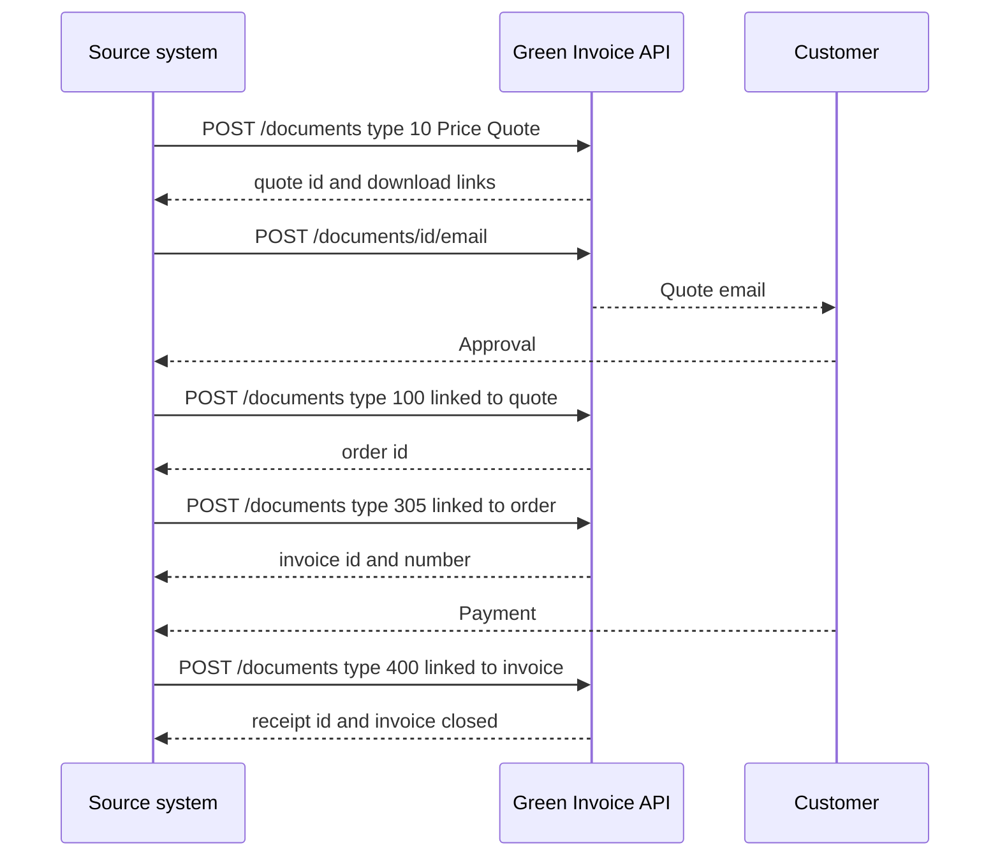
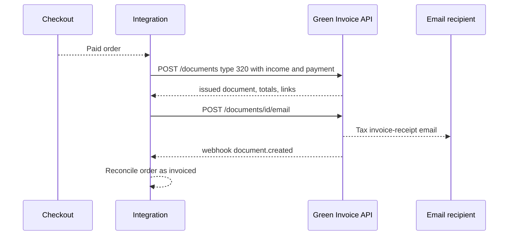
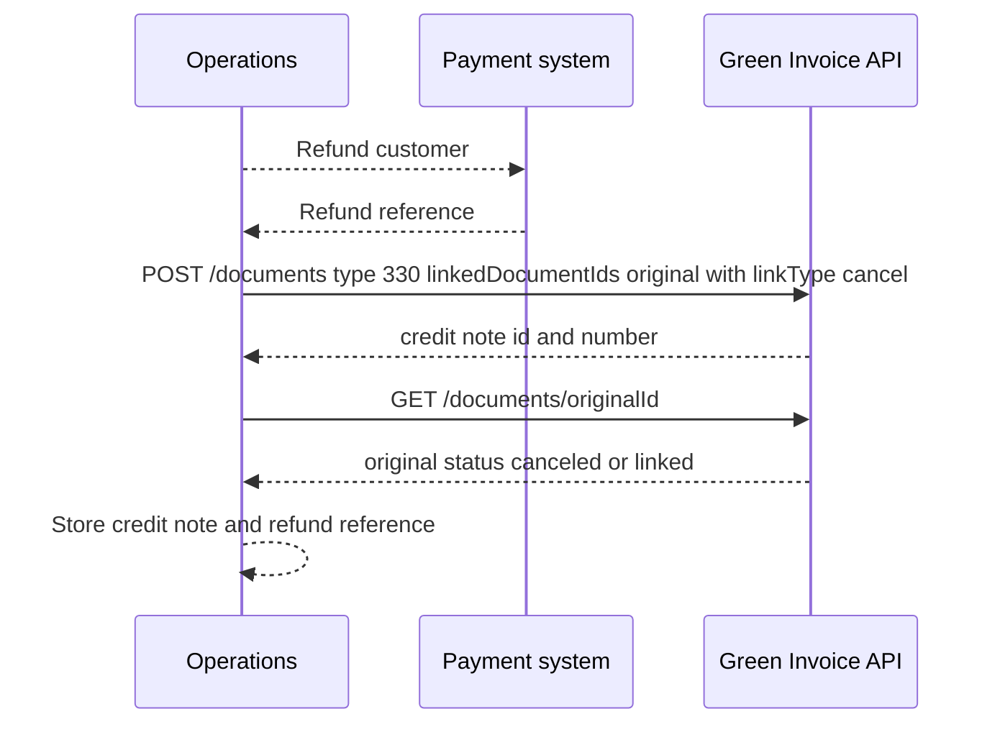
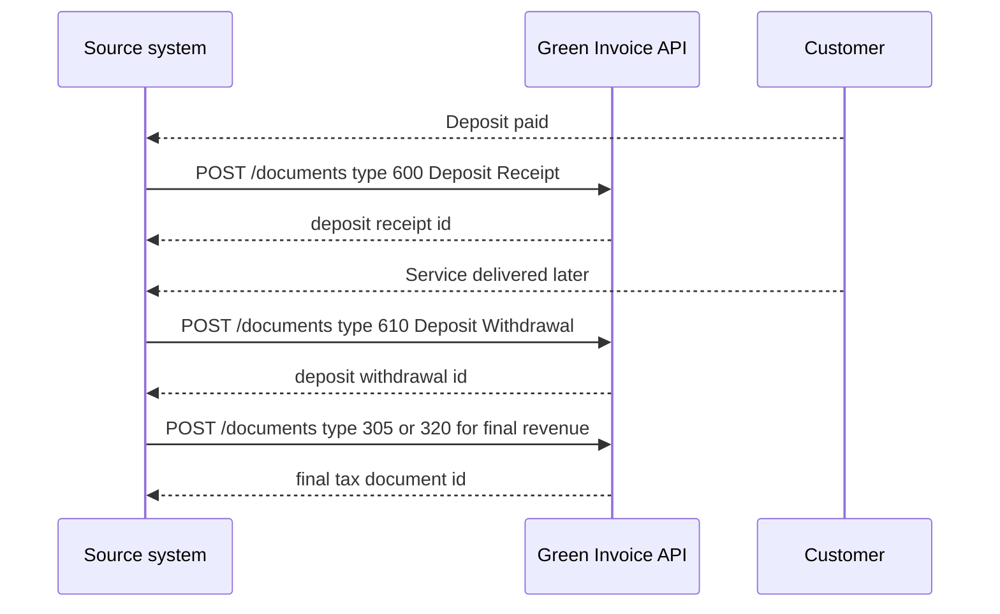

# Green Invoice Document Workflows

This guide describes end-to-end document lifecycle patterns for all 13 Green Invoice (Morning) document types. Use it together with `api-reference.md` for exact endpoint shapes.

## Lifecycle model

A document lifecycle usually follows:

1. Create the document with `POST /documents`.
2. Persist `id`, official `number`, `type`, `status`, `date`, `client`, `total`, `currency`, download links, and allocation number when present.
3. Email through the API or download a signed file for print/manual delivery.
4. Mark the commercial or accounting process as paid, closed, cancelled, credited, or linked to another document.
5. Reconcile webhook events against stored ids.

## All document types

| Code | Hebrew | English | Create and issue | Email or print | Mark paid or complete | Credit, cancel, or reverse |
|---:|---|---|---|---|---|---|
| 10 | הצעת מחיר | Price Quote | Create with `POST /documents`; issue on successful response and persist id/number. | Email using `/documents/{id}/email` or download links for print. | Record payment in same document when supported; otherwise link a type 400 receipt or close manually when no payment applies. | Cancel by issuing the appropriate return/canceling document or by dashboard action when the document has no fiscal cancellation flow. |
| 100 | הזמנה | Order | Create with `POST /documents`; issue on successful response and persist id/number. | Email using `/documents/{id}/email` or download links for print. | Record payment in same document when supported; otherwise link a type 400 receipt or close manually when no payment applies. | Cancel by issuing the appropriate return/canceling document or by dashboard action when the document has no fiscal cancellation flow. |
| 200 | תעודת משלוח | Delivery Note | Create with `POST /documents`; issue on successful response and persist id/number. | Email using `/documents/{id}/email` or download links for print. | Record payment in same document when supported; otherwise link a type 400 receipt or close manually when no payment applies. | Cancel by issuing the appropriate return/canceling document or by dashboard action when the document has no fiscal cancellation flow. |
| 210 | תעודת החזרה | Return Note | Create with `POST /documents`; issue on successful response and persist id/number. | Email using `/documents/{id}/email` or download links for print. | Record payment in same document when supported; otherwise link a type 400 receipt or close manually when no payment applies. | Cancel by issuing the appropriate return/canceling document or by dashboard action when the document has no fiscal cancellation flow. |
| 300 | חשבון עסקה | Transaction Invoice | Create with `POST /documents`; issue on successful response and persist id/number. | Email using `/documents/{id}/email` or download links for print. | Record payment in same document when supported; otherwise link a type 400 receipt or close manually when no payment applies. | Use type 330 Credit Note with `linkType: cancel` for tax document correction. |
| 305 | חשבונית מס | Tax Invoice | Create with `POST /documents`; issue on successful response and persist id/number. | Email using `/documents/{id}/email` or download links for print. | Record payment in same document when supported; otherwise link a type 400 receipt or close manually when no payment applies. | Use type 330 Credit Note with `linkType: cancel` for tax document correction. |
| 320 | חשבונית מס/קבלה | Tax Invoice-Receipt | Create with `POST /documents`; issue on successful response and persist id/number. | Email using `/documents/{id}/email` or download links for print. | Record payment in same document when supported; otherwise link a type 400 receipt or close manually when no payment applies. | Use type 330 Credit Note with `linkType: cancel` for tax document correction. |
| 330 | חשבונית זיכוי | Credit Note | Create with `POST /documents`; issue on successful response and persist id/number. | Email using `/documents/{id}/email` or download links for print. | Record payment in same document when supported; otherwise link a type 400 receipt or close manually when no payment applies. | Credit note is itself the canceling document; do not credit a credit note without accountant review. |
| 400 | קבלה | Receipt | Create with `POST /documents`; issue on successful response and persist id/number. | Email using `/documents/{id}/email` or download links for print. | Record payment in same document when supported; otherwise link a type 400 receipt or close manually when no payment applies. | If payment is refunded, issue a correcting tax document where needed and keep refund reference in remarks. |
| 405 | קבלה על תרומה | Donation Receipt | Create with `POST /documents`; issue on successful response and persist id/number. | Email using `/documents/{id}/email` or download links for print. | Record payment in same document when supported; otherwise link a type 400 receipt or close manually when no payment applies. | Cancel by issuing the appropriate return/canceling document or by dashboard action when the document has no fiscal cancellation flow. |
| 500 | הזמנת רכש | Purchase Order | Create with `POST /documents`; issue on successful response and persist id/number. | Email using `/documents/{id}/email` or download links for print. | Record payment in same document when supported; otherwise link a type 400 receipt or close manually when no payment applies. | Cancel by issuing the appropriate return/canceling document or by dashboard action when the document has no fiscal cancellation flow. |
| 600 | קבלת פיקדון | Deposit Receipt | Create with `POST /documents`; issue on successful response and persist id/number. | Email using `/documents/{id}/email` or download links for print. | Record payment in same document when supported; otherwise link a type 400 receipt or close manually when no payment applies. | Apply with type 610 Deposit Withdrawal or refund with clear payment reference. |
| 610 | משיכת פיקדון | Deposit Withdrawal | Create with `POST /documents`; issue on successful response and persist id/number. | Email using `/documents/{id}/email` or download links for print. | Record payment in same document when supported; otherwise link a type 400 receipt or close manually when no payment applies. | Cancel by issuing the appropriate return/canceling document or by dashboard action when the document has no fiscal cancellation flow. |

## Receipt of payment versus tax invoice-receipt

A receipt (`400`) proves payment. A tax invoice-receipt (`320`) combines a VAT invoice and receipt in one document.

### Use `320` when payment and VAT invoice happen together

Example: a consultant receives ₪11,800 by bank transfer for a ₪10,000 taxable service at 18% VAT on the same day.

```json
{
  "type": 320,
  "date": "2026-05-31",
  "currency": "ILS",
  "vatType": 0,
  "client": {
    "name": "Example Ltd",
    "emails": ["finance@example.co.il"],
    "taxId": "515555555",
    "country": "IL",
    "add": true
  },
  "income": [
    {
      "description": "Consulting services",
      "quantity": 1,
      "price": 10000,
      "currency": "ILS",
      "vatRate": 0.18,
      "vatType": 0
    }
  ],
  "payment": [
    {
      "type": 4,
      "date": "2026-05-31",
      "price": 11800,
      "currency": "ILS",
      "bankName": "Bank Leumi",
      "bankBranch": "800",
      "bankAccount": "123456"
    }
  ]
}
```

### Use `305` then `400` when invoice and payment happen on different dates

Example: a company issues a tax invoice on 31/05/2026 and receives payment on 15/06/2026.

1. Issue `305` with income rows and no payment rows.
2. On payment date, issue `400` with payment rows and `linkedDocumentIds` pointing to the original invoice.
3. Verify the original invoice status moves to closed or close it explicitly if the lifecycle requires it.

### Use `300` then `400` when only a payment demand is needed first

A transaction invoice (`300`, חשבון עסקה) is a demand for payment and is not the same as a VAT invoice. Use it when the accounting policy is to issue the VAT document only after payment.

## Common workflow 1: Quote to order to invoice to receipt



Key checks:

- Quote and order do not create VAT liability by themselves.
- Tax invoice (`305`) is created when VAT invoice timing is reached.
- Receipt (`400`) is created only after payment is received.

## Common workflow 2: Immediate payment with tax invoice-receipt



Use this pattern for online stores, paid subscriptions, and service invoices collected immediately.

## Common workflow 3: Credit note and refund



Important points:

- The credit note handles accounting/tax correction.
- The actual money refund is recorded in the payment channel and referenced in `remarks`.
- Partial refunds use only the credited amount, not the full original document.

## Common workflow 4: Deposit and final invoice



Use a deposit flow when money is received before revenue is recognized.

## Document-specific lifecycle notes

### 10 — Price Quote / הצעת מחיר

Create with client and proposed income rows. Email to the customer. Do not treat it as revenue. When accepted, create an order or invoice linked to the quote.

### 100 — Order / הזמנה

Create after customer approval. Use it to reserve goods or scope work. Link delivery notes, transaction invoices, or tax invoices to the order.

### 200 — Delivery Note / תעודת משלוח

Use when goods leave inventory before the invoice is issued. Link later tax invoice to the delivery note. If goods return, use type `210`.

### 210 — Return Note / תעודת החזרה

Use for returned goods. Link to the delivery note and later to a credit note if the original sale was already invoiced.

### 300 — Transaction Invoice / חשבון עסקה

Use as a payment request where a VAT invoice is not yet issued. When payment arrives, issue a receipt or a tax invoice-receipt according to the accounting policy.

### 305 — Tax Invoice / חשבונית מס

Use when VAT invoice is issued before payment. For Israeli B2B invoices above the active threshold, verify allocation number presence. When payment arrives, issue type `400` receipt linked to the invoice.

### 320 — Tax Invoice-Receipt / חשבונית מס/קבלה

Use when payment is received at the time of issuance. Include both `income` and `payment`. It is the most common paid service or e-commerce pattern.

### 330 — Credit Note / חשבונית זיכוי

Use to reduce or cancel a previous tax document. Always link to the original document. Use `linkType: "cancel"` for cancellation flows.

### 400 — Receipt / קבלה

Use to record payment. Link to an open tax invoice or transaction invoice when applicable. For withholding tax, create one payment row for the cash/bank/card amount and one row with `type: 0`.

### 405 — Donation Receipt / קבלה על תרומה

Use for eligible non-profit donation receipts. Keep donor details and any certificate requirements in the source system. Verify non-profit account configuration before using this type.

### 500 — Purchase Order / הזמנת רכש

Use for supplier ordering. This is an outbound procurement document rather than customer revenue.

### 600 — Deposit Receipt / קבלת פיקדון

Use when funds are received but revenue is not recognized yet. Link later withdrawal and revenue documents through source-system references and `linkedDocumentIds` where supported.

### 610 — Deposit Withdrawal / משיכת פיקדון

Use when a deposit is applied, returned, or moved out of deposit balance. Keep a clear reference to the original deposit receipt.

## webhook lifecycle by document type

| Document type | Event to expect | Reconciliation action |
|---|---|---|
| 10 Price Quote | `document.created`, `document.updated` | Mark quote sent, update approval status externally. |
| 100 Order | `document.created`, `document.updated` | Link order to accepted quote or source order. |
| 200 Delivery Note | `document.created` | Mark shipment document issued. |
| 210 Return Note | `document.created` | Link returned goods and inventory adjustment. |
| 300 Transaction Invoice | `document.created`, `document.closed` | Track payment demand and later closure. |
| 305 Tax Invoice | `document.created`, `document.closed`, `document.canceled` | Store allocation number when present and reconcile receipt. |
| 320 Tax Invoice-Receipt | `document.created`, `document.canceled` | Mark source order invoiced and paid. |
| 330 Credit Note | `document.created` | Link original and credit document. |
| 400 Receipt | `payment.created`, `document.created` | Close receivable or mark payment received. |
| 405 Donation Receipt | `document.created` | Mark donation receipt delivered. |
| 500 Purchase Order | `document.created`, `document.updated` | Track supplier order status. |
| 600 Deposit Receipt | `document.created`, `payment.created` | Track deposit liability. |
| 610 Deposit Withdrawal | `document.created` | Reduce deposit balance and link final revenue document. |

## Worked examples

### Tax invoice followed by receipt

```json
{
  "description": "Enterprise implementation milestone",
  "remarks": "B2B invoice above SHAAM allocation threshold. Payment due end of month plus 30.",
  "type": 305,
  "date": "2026-06-15",
  "dueDate": "2026-07-31",
  "lang": "he",
  "currency": "ILS",
  "vatType": 0,
  "rounding": true,
  "signed": true,
  "attachment": true,
  "client": {
    "name": "Alpha Manufacturing Ltd",
    "emails": [
      "ap@alpha.example"
    ],
    "taxId": "516666666",
    "country": "IL",
    "paymentTerms": 30,
    "add": true
  },
  "income": [
    {
      "catalogNum": "MILESTONE-2",
      "description": "Milestone 2 delivery",
      "quantity": 1,
      "price": 12000.0,
      "currency": "ILS",
      "currencyRate": 1.0,
      "vatRate": 0.18,
      "vatType": 0
    }
  ],
  "linkedDocumentIds": [],
  "linkType": "link"
}
```

```json
{
  "description": "Receipt for invoice 1025 with withholding tax",
  "remarks": "Customer withheld 5% tax at source and transferred the balance.",
  "type": 400,
  "date": "2026-07-20",
  "lang": "he",
  "currency": "ILS",
  "signed": true,
  "attachment": true,
  "client": {
    "id": "cli_2002",
    "name": "Alpha Manufacturing Ltd",
    "emails": [
      "ap@alpha.example"
    ],
    "taxId": "516666666",
    "country": "IL"
  },
  "payment": [
    {
      "type": 4,
      "date": "2026-07-20",
      "price": 13452.0,
      "currency": "ILS",
      "currencyRate": 1.0,
      "bankName": "Bank Hapoalim",
      "bankBranch": "600",
      "bankAccount": "778899"
    },
    {
      "type": 0,
      "date": "2026-07-20",
      "price": 708.0,
      "currency": "ILS",
      "currencyRate": 1.0
    }
  ],
  "linkedDocumentIds": [
    "doc_1002"
  ],
  "linkType": "link"
}
```

### Credit cancellation

```json
{
  "description": "Full cancellation of tax invoice-receipt 1024",
  "remarks": "Service cancelled before delivery. Refund executed to original bank account.",
  "type": 330,
  "date": "2026-06-02",
  "lang": "he",
  "currency": "ILS",
  "vatType": 0,
  "rounding": true,
  "signed": true,
  "attachment": true,
  "client": {
    "id": "cli_2001",
    "name": "Example Ltd",
    "emails": [
      "finance@example.co.il"
    ],
    "taxId": "515555555",
    "country": "IL"
  },
  "income": [
    {
      "catalogNum": "IMPL-001",
      "description": "API implementation services cancellation",
      "quantity": 1,
      "price": 8000.0,
      "currency": "ILS",
      "currencyRate": 1.0,
      "vatRate": 0.18,
      "vatType": 0
    },
    {
      "catalogNum": "SUP-001",
      "description": "Production support package cancellation",
      "quantity": 2,
      "price": 750.0,
      "currency": "ILS",
      "currencyRate": 1.0,
      "vatRate": 0.18,
      "vatType": 0
    }
  ],
  "discount": {
    "amount": 5,
    "type": "percentage"
  },
  "linkedDocumentIds": [
    "doc_1001"
  ],
  "linkType": "cancel"
}
```

### Foreign-currency receipt

```json
{
  "description": "Exported software consulting",
  "remarks": "Service supplied to a non-Israeli customer. VAT exempt treatment confirmed before issuance.",
  "type": 320,
  "date": "2026-05-31",
  "dueDate": "2026-05-31",
  "lang": "en",
  "currency": "USD",
  "vatType": 1,
  "rounding": false,
  "signed": true,
  "attachment": true,
  "client": {
    "name": "Global Apps Inc",
    "emails": [
      "billing@globalapps.example"
    ],
    "taxId": "US-98-7654321",
    "address": "100 Market Street",
    "city": "New York",
    "zip": "10001",
    "country": "US",
    "add": true
  },
  "income": [
    {
      "catalogNum": "EXPORT-CONSULT",
      "description": "Remote software consulting",
      "quantity": 20,
      "price": 180.0,
      "currency": "USD",
      "currencyRate": 3.7,
      "vatRate": 0.0,
      "vatType": 2
    }
  ],
  "payment": [
    {
      "type": 5,
      "date": "2026-05-31",
      "price": 3600.0,
      "currency": "USD",
      "currencyRate": 3.7
    }
  ],
  "linkedDocumentIds": [],
  "linkType": "link"
}
```

## Operational safeguards

- Create documents only after the source transaction is final enough for accounting.
- Persist response data before sending email.
- Use `linkedDocumentIds` to preserve lifecycle traceability.
- Use search before retrying a create operation after timeout.
- Store webhook event ids and process each event id once.
- Re-read the document before changing local state when webhook payload is incomplete.
