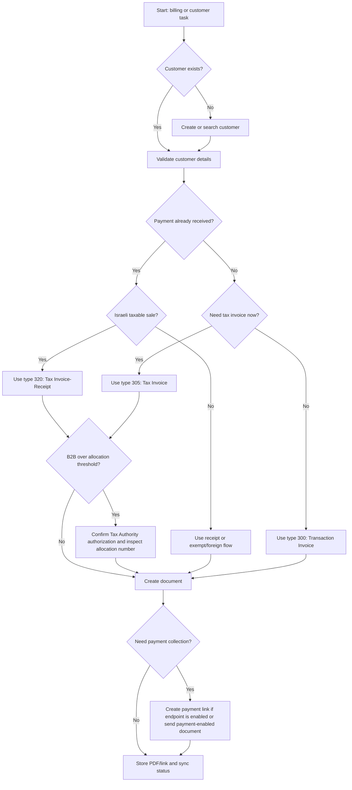

# Green Invoice Integration

Use this skill to automate Israeli invoicing operations with Green Invoice while keeping tax-sensitive choices explicit. Treat API calls that issue documents as consequential actions: validate customer identity, document type, currency, VAT treatment, payment details, and allocation-number obligations before sending the request.

## Activation checklist

Apply this skill when the task mentions Green Invoice, Morning, חשבונית ירוקה, חשבונית מס, חשבונית מס/קבלה, קבלה, Israeli VAT invoices, customer synchronization, payment links, or Green Invoice webhooks.

Do not apply this skill for direct Tax Authority API filing, standalone payment-gateway settlement, bookkeeping advice beyond operational API handling, payroll, or legal/tax opinions. Escalate threshold and deductibility questions to an Israeli accountant or tax adviser.

## Current facts to carry into every workflow

- Standard Israeli VAT is `18%` for ordinary taxable domestic transactions as of 2026.
- Allocation numbers are required for input-tax deduction on qualifying B2B tax invoices above the current Israel Invoices threshold. As of `01-06-2026`, the threshold is `₪5,000` before VAT.
- Green Invoice announced a June 2026 API infrastructure update: use `api.greeninvoice.co.il/api` rather than the retired `www.greeninvoice.co.il/api` base path, and include `grant_type: client_credentials` in token requests.
- API keys and webhooks are dashboard features. Confirm plan access before debugging missing menus.
- Payment links exist in the product UI, but public endpoint coverage can vary by account and API revision. Prefer a documented API endpoint from the current developer portal when available; otherwise automate document issuance with payment buttons or route a human to the payment-link UI.

## Decision tree



## Document type mapping

| Code | Hebrew | English | Use |
|---:|---|---|---|
| 10 | הצעת מחיר | Price quote | Quote before commitment |
| 100 | הזמנה | Order | Approved order |
| 200 | תעודת משלוח | Delivery note | Goods delivery |
| 210 | תעודת החזרה | Return note | Goods return |
| 300 | חשבון עסקה | Transaction invoice | Demand for payment before receipt |
| 305 | חשבונית מס | Tax invoice | VAT invoice when payment is not recorded in the same document |
| 320 | חשבונית מס / קבלה | Tax invoice-receipt | Immediate payment for a taxable Israeli sale |
| 330 | חשבונית זיכוי | Credit note | Correction, cancellation, or refund |
| 400 | קבלה | Receipt | Payment receipt without new VAT invoice |
| 405 | קבלה על תרומה | Donation receipt | Nonprofit donation receipt |
| 500 | הזמנת רכש | Purchase order | Procurement |
| 600 | קבלת פיקדון | Deposit receipt | Deposit received |
| 610 | משיכת פיקדון | Deposit withdrawal | Deposit returned |

## API sequence

1. Obtain an access token with `POST /account/token` and body `{"id":"...","secret":"...","grant_type":"client_credentials"}`.
2. Verify credentials with `GET /users/me`.
3. Search the customer with `POST /clients/search`; create the customer with `POST /clients` only when no match exists.
4. Build a document payload with the correct `type`, `client`, `income`, `payment`, `currency`, `date`, and `lang`.
5. Create the document with `POST /documents`.
6. Retrieve the created document with `GET /documents/{id}` and inspect status, file links, totals, and allocation number where relevant.
7. For cancellation, prefer a credit-note or official cancel endpoint documented for the exact document type. Store the original document id and cancellation reason.
8. Register webhooks in the dashboard and keep the handler idempotent.

## Concrete examples

### Example 1: paid Israeli consulting invoice

Request: create a paid Israeli consulting invoice for `₪1,180` including VAT on `05-06-2026`.

Use type `320`. Set `currency` to `ILS`, `lang` to `he`, `date` to `2026-06-05`, `income[0].price` to `1000` if the API expects net amounts, or use `taxIncludedInPrice` when issuing a gross-price document. Add a `payment` item for the actual method. Verify that total equals `₪1,180`.

```bash
python scripts/green_invoice_integration_cli.py create-document \
  --env sandbox \
  --token "$GREEN_INVOICE_TOKEN" \
  --type 320 \
  --client-name "Demo Client Ltd" \
  --client-email billing@example.com \
  --description "Consulting service" \
  --amount 1000 \
  --currency ILS \
  --date 2026-06-05 \
  --payment-method wire-transfer
```

### Example 2: unpaid invoice, then receipt

Use type `300` for a payment demand when the customer has not paid. After payment arrives, create type `400` and link it to the original document when the account API supports document linking.

### Example 3: B2B tax invoice above `₪5,000`

Before creating type `305` or type `320`, confirm the customer is a business and the net amount exceeds `₪5,000`. Confirm the Tax Authority authorization in the dashboard. After issuing the document, fetch it and inspect the allocation number. If absent, pause delivery and resolve authorization status.

### Example 4: payment link handoff

Create a payment-link request only after payment services are connected in the dashboard. Include amount, currency, description, customer email, and document behavior. If the endpoint returns `404` or `403`, use the dashboard payment-link flow or send a payment-enabled document instead.

### Example 5: webhook filing

Register `document/created`, `client/created`, and `payment/received` as needed. In the receiver, deduplicate by webhook id or document id, persist the raw payload, then route by document `type`.

## Webhook handler rules

- Require HTTPS for public receivers.
- Respond within six seconds.
- Store the event id before doing slow work.
- Treat retries as normal; make processing idempotent.
- Verify any configured secret. If the platform only sends the secret as a shared value, compare it using constant-time comparison. If it sends an HMAC signature, verify the digest before parsing side effects.
- Never trust `total`, `email`, or `downloadLinks` until the associated document is fetched through the authenticated API.

## Troubleshooting

| Symptom | Likely cause | Action |
|---|---|---|
| `401 Unauthorized` | Expired token, missing bearer prefix, old token-body format | Re-authenticate with `grant_type: client_credentials`; verify `Authorization: Bearer ...` |
| `403 Forbidden` | Plan lacks API/webhook/payment feature or key lacks scope | Check dashboard plan, feature access, and API-key permissions |
| `404 Not Found` | Wrong base URL or endpoint not enabled | Use `https://api.greeninvoice.co.il/api/v1`; verify current developer docs |
| VAT total differs | Net/gross mismatch or stale VAT rate | Use `18%`; mark gross prices clearly when needed |
| Missing allocation number | Tax Authority authorization missing or expired | Renew authorization and fetch the document again |
| Duplicate webhook work | Retry after timeout | Deduplicate before side effects |
| Hebrew text appears reversed | Missing UTF-8/RTL handling in downstream system | Preserve UTF-8 and set RTL rendering in the target system |
| Payment link fails | Payment service not connected or endpoint unavailable | Connect digital payments and confirm endpoint coverage |

## Anti-patterns

- Do not issue type `320` just because a user says “invoice”; confirm whether payment was received.
- Do not create duplicate customers when `clients/search` finds a likely match.
- Do not hard-code `17%` VAT in 2026 workflows.
- Do not ignore allocation-number checks on B2B documents above `₪5,000` before VAT.
- Do not process webhooks without idempotency.
- Do not paste API secrets into logs, Markdown, tickets, or chat transcripts.
- Do not assume payment links are available through the same endpoint for every account.
- Do not cancel a document by deleting local records; issue an official cancellation or credit document.

## File index

- `scripts/green_invoice_integration_client.py`: typed sync and async Python client.
- `scripts/green_invoice_integration_cli.py`: Typer CLI for auth, customers, documents, payment-link requests, and webhook verification.
- `references/api-reference.md`: endpoint, regulation, source, and error reference.
- `references/troubleshooting.md`: operational debugging guide.
- `references/test-scenarios.md`: practical scenario checklist.
