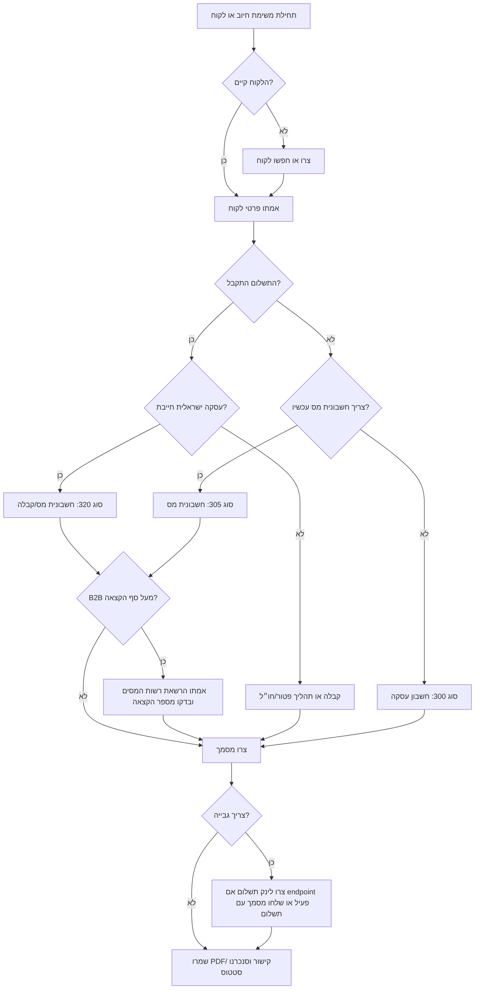

# אינטגרציית Green Invoice

השתמשו במיומנות זו לאוטומציה של תהליכי חיוב ישראליים דרך Green Invoice, תוך שמירה על בחירות מס ותיעוד בצורה מפורשת. התייחסו להפקת מסמכים כפעולה משמעותית: אמתו זהות לקוח, סוג מסמך, מטבע, טיפול במע״מ, פרטי תשלום וחובת מספר הקצאה לפני שליחת בקשה.

## מתי להפעיל

הפעילו כאשר המשימה מזכירה Green Invoice, Morning, חשבונית ירוקה, חשבונית מס, חשבונית מס/קבלה, קבלה, חשבוניות בישראל, סנכרון לקוחות, לינקים לתשלום או webhooks של Green Invoice.

אל תשתמשו לממשק ישיר מול API של רשות המסים, סליקה עצמאית, ייעוץ מס מעבר להפעלה טכנית, שכר או חוות דעת משפטית. העבירו שאלות על זכאות לניכוי ותקרות לרואה חשבון או יועץ מס בישראל.

## עובדות עדכניות לכל תהליך

- שיעור המע״מ הרגיל בישראל הוא `18%` לעסקאות מקומיות חייבות בשנת 2026.
- מספר הקצאה נדרש לניכוי מס תשומות בחשבוניות B2B מעל סף מודל חשבוניות ישראל. החל מ-`01-06-2026`, הסף הוא `₪5,000` לפני מע״מ.
- Green Invoice הודיעה על עדכון תשתית API ביוני 2026: השתמשו ב-`api.greeninvoice.co.il/api` ולא בנתיב הישן `www.greeninvoice.co.il/api`, והוסיפו `grant_type: client_credentials` בבקשת token.
- מפתחות API ו-webhooks תלויים בגישה מתוך לוח הבקרה. בדקו גישת מסלול לפני דיבוג תפריטים חסרים.
- לינקים לתשלום קיימים במוצר, אך כיסוי endpoint ציבורי עשוי להשתנות לפי חשבון וגרסת API. העדיפו endpoint מתועד בפורטל המפתחים העדכני; אחרת שלחו מסמך עם אפשרות תשלום או הפנו לפעולת לוח בקרה.

## עץ החלטה



## מיפוי סוגי מסמכים

| קוד | עברית | אנגלית | שימוש |
|---:|---|---|---|
| 10 | הצעת מחיר | Price quote | הצעה לפני התחייבות |
| 100 | הזמנה | Order | הזמנה שאושרה |
| 200 | תעודת משלוח | Delivery note | אספקת טובין |
| 210 | תעודת החזרה | Return note | החזרת טובין |
| 300 | חשבון עסקה | Transaction invoice | דרישת תשלום לפני קבלה |
| 305 | חשבונית מס | Tax invoice | חשבונית מע״מ ללא רישום תשלום באותו מסמך |
| 320 | חשבונית מס / קבלה | Tax invoice-receipt | תשלום מיידי בעסקה ישראלית חייבת |
| 330 | חשבונית זיכוי | Credit note | תיקון, ביטול או החזר |
| 400 | קבלה | Receipt | אישור תשלום ללא חשבונית מס חדשה |
| 405 | קבלה על תרומה | Donation receipt | קבלת תרומה לעמותה |
| 500 | הזמנת רכש | Purchase order | רכש |
| 600 | קבלת פיקדון | Deposit receipt | קבלת פיקדון |
| 610 | משיכת פיקדון | Deposit withdrawal | החזרת פיקדון |

## רצף API

1. קבלו access token עם `POST /account/token` וגוף `{"id":"...","secret":"...","grant_type":"client_credentials"}`.
2. אמתו את הפרטים עם `GET /users/me`.
3. חפשו לקוח עם `POST /clients/search`; צרו לקוח עם `POST /clients` רק כשאין התאמה.
4. בנו payload למסמך עם `type`, `client`, `income`, `payment`, `currency`, `date` ו-`lang`.
5. צרו מסמך עם `POST /documents`.
6. שלפו את המסמך עם `GET /documents/{id}` ובדקו סטטוס, קישורי קבצים, סכומים ומספר הקצאה כשנדרש.
7. לביטול, העדיפו חשבונית זיכוי או endpoint ביטול רשמי שתואם לסוג המסמך. שמרו מזהה מסמך מקורי וסיבת ביטול.
8. הגדירו webhooks בלוח הבקרה ושמרו על handler אידמפוטנטי.

## דוגמאות מעשיות

### דוגמה 1: חשבונית מס/קבלה לייעוץ ששולם

בקשה: הפקת חשבונית מס/קבלה על ייעוץ בסך `₪1,180` כולל מע״מ בתאריך `05-06-2026`.

השתמשו בסוג `320`. הגדירו `currency` כ-`ILS`, `lang` כ-`he`, `date` כ-`2026-06-05`, ו-`income[0].price` כ-`1000` אם ה-API מצפה לסכום נטו. אם המחיר הוא ברוטו, סמנו זאת בשדה gross/tax-included המתאים לחשבון. הוסיפו פריט `payment` לפי שיטת התשלום בפועל. ודאו שסך המסמך הוא `₪1,180`.

```bash
python scripts/green_invoice_integration_cli.py create-document \
  --env sandbox \
  --token "$GREEN_INVOICE_TOKEN" \
  --type 320 \
  --client-name "לקוח דוגמה בע״מ" \
  --client-email billing@example.com \
  --description "שירות ייעוץ" \
  --amount 1000 \
  --currency ILS \
  --date 2026-06-05 \
  --payment-method wire-transfer
```

### דוגמה 2: חשבון עסקה ואז קבלה

השתמשו בסוג `300` כאשר הלקוח עדיין לא שילם. לאחר קבלת התשלום, צרו סוג `400` וקשרו למסמך המקורי כאשר ה-API בחשבון תומך בקישור מסמכים.

### דוגמה 3: חשבונית B2B מעל `₪5,000`

לפני יצירת סוג `305` או `320`, אמתו שהלקוח הוא עסק ושהסכום לפני מע״מ עובר `₪5,000`. בדקו שהרשאת רשות המסים פעילה בלוח הבקרה. לאחר ההפקה, שלפו את המסמך ובדקו מספר הקצאה. אם אין מספר הקצאה, עצרו שליחה ללקוח וטפלו בהרשאה.

### דוגמה 4: הכנת לינק לתשלום

צרו בקשת לינק תשלום רק אחרי שחיבור תשלומים דיגיטליים פעיל בלוח הבקרה. כללו סכום, מטבע, תיאור, אימייל לקוח והתנהגות מסמך. אם endpoint מחזיר `404` או `403`, השתמשו בתהליך בלוח הבקרה או שלחו מסמך עם אפשרות תשלום.

### דוגמה 5: תיוק לפי webhook

הגדירו `document/created`, `client/created` ו-`payment/received` לפי הצורך. במקבל האירועים, בצעו deduplication לפי מזהה אירוע או מזהה מסמך, שמרו payload גולמי, ואז נווטו לפי `type`.

## כללי webhook

- דרשו HTTPS ל-receiver ציבורי.
- החזירו תגובה תוך שש שניות.
- שמרו מזהה אירוע לפני פעולות איטיות.
- התייחסו ל-retry כמצב תקין; עבדו בצורה אידמפוטנטית.
- אמתו secret שהוגדר. אם נשלח ערך משותף, השוו בצורה constant-time. אם נשלחת חתימת HMAC, אמתו digest לפני פעולת צד.
- אל תסמכו על `total`, `email` או `downloadLinks` עד שליפת המסמך דרך API מאומת.

## פתרון תקלות

| סימפטום | סיבה סבירה | פעולה |
|---|---|---|
| `401 Unauthorized` | token פג, חסר Bearer, או מבנה token ישן | התחברו מחדש עם `grant_type: client_credentials`; בדקו `Authorization: Bearer ...` |
| `403 Forbidden` | אין גישה במסלול או בהרשאות מפתח | בדקו מסלול, גישת פיצ׳ר והרשאות מפתח API |
| `404 Not Found` | Base URL שגוי או endpoint לא פעיל | השתמשו ב-`https://api.greeninvoice.co.il/api/v1`; בדקו תיעוד עדכני |
| סכום מע״מ לא מתאים | ערבוב נטו/ברוטו או שיעור מע״מ ישן | השתמשו ב-`18%`; סמנו מחיר כולל מע״מ כשצריך |
| אין מספר הקצאה | הרשאת רשות המסים חסרה או פגה | חדשו הרשאה ושלפו שוב את המסמך |
| webhook מטופל פעמיים | retry אחרי timeout | בצעו deduplication לפני פעולות צד |
| עברית מוצגת הפוך | בעיית UTF-8 או RTL במערכת יעד | שמרו UTF-8 והגדירו RTL במערכת היעד |
| לינק תשלום נכשל | שירות תשלומים לא מחובר או endpoint לא זמין | חברו תשלומים דיגיטליים ואמתו כיסוי endpoint |

## אנטי-דפוסים

- אל תנפיקו סוג `320` רק כי נאמר “חשבונית”; ודאו שהתשלום התקבל.
- אל תיצרו לקוח כפול כאשר `clients/search` מחזיר התאמה סבירה.
- אל תקודדו `17%` בתהליכי 2026.
- אל תדלגו על בדיקת מספר הקצאה במסמכי B2B מעל `₪5,000` לפני מע״מ.
- אל תעבדו webhooks ללא idempotency.
- אל תדביקו secrets בלוגים, Markdown, tickets או תכתובות.
- אל תניחו שלינקים לתשלום זמינים באותו endpoint לכל חשבון.
- אל תבטלו מסמך על ידי מחיקת רשומה מקומית; הנפיקו ביטול רשמי או זיכוי.

## אינדקס קבצים

- `scripts/green_invoice_integration_client.py`: לקוח Python מסונכרן ואסינכרוני עם טיפוסים.
- `scripts/green_invoice_integration_cli.py`: CLI מבוסס Typer לאימות, לקוחות, מסמכים, בקשות לינק תשלום ואימות webhook.
- `references/api-reference.md`: נקודות קצה, רגולציה, מקורות וטבלאות שגיאה.
- `references/troubleshooting.md`: מדריך תפעולי לפתרון תקלות.
- `references/test-scenarios.md`: רשימת תרחישי בדיקה מעשיים.
