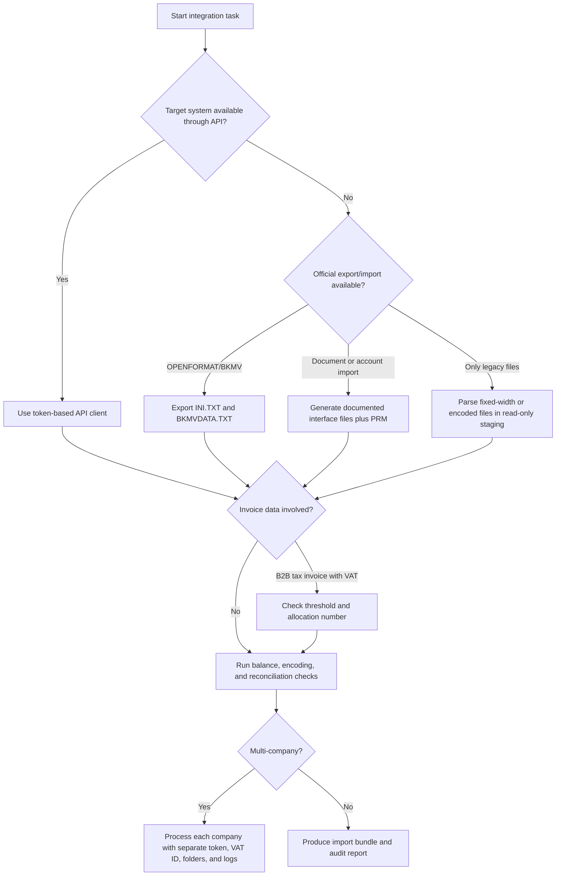

# Hashavshevet Integration

## Purpose

Integrate Hashavshevet data safely across Israeli small-business workflows: export and import accounting data, synchronize customers and suppliers, pull journal entries, generate deterministic BTKN transfer files for staging, prepare OPENFORMAT/BKMV handoff checks, and validate Israel Invoices allocation-number requirements before submitting invoice data to SHAAM or to a connected accounting platform.

Use official exports and vendor APIs before any legacy file parsing. Treat legacy fixed-width files as migration inputs only after an accountant, bookkeeper, or vendor support confirms the layout.

## Current Israeli guardrails

| Topic | Current integration rule |
|---|---|
| VAT | Use 18% for standard Israeli VAT from 01-01-2025 onward. Store the rate in configuration rather than hard-coding business logic everywhere. |
| Exempt dealer ceiling | Use ₪122,833 as the 2026 annual turnover ceiling for עוסק פטור checks. |
| Israel Invoices allocation number | For B2B tax invoices with VAT, require an allocation-number workflow when the net invoice amount exceeds ₪10,000 from 01-01-2026 and ₪5,000 from 01-06-2026. |
| Official audit export | Prefer OPENFORMAT/BKMV, usually `INI.TXT` plus `BKMVDATA.TXT`, for audit and accountant handoff. |
| Hashavshevet cloud API | Use an authorization token and the documented WizCloud API for two-way integration where available. |
| Legacy imports | Use documented interface files such as `HESHIN.DAT`, `BANKIN.DAT`, and `IMOVEIN.DOC` with matching `.PRM` parameter files. |

## Decision tree



## Recommended workflow

1. Identify the company context: Israeli VAT/company number, tax year, VAT rate, currency, Hashavshevet product line, and whether the company uses cloud API or local exports.
2. Prefer API-based sync for ongoing customer/supplier and document flows. Use file export/import only for migration, month-end handoff, or disconnected sites.
3. Validate every customer/supplier number as a 9-digit Israeli identifier before using it in invoice allocation or B2B matching.
4. Keep a per-company configuration file. Never reuse tokens, import folders, numbering ranges, or journal defaults across companies.
5. Stage incoming files in UTF-8. Convert Windows-1255 Hebrew exports only once, then preserve the raw source copy.
6. Reconcile totals before import: journal debit equals credit, VAT equals net times the configured rate, invoice gross equals net plus VAT, and record counts match the handoff summary.
7. Run allocation-number checks before final invoice delivery for B2B tax invoices above the current threshold.
8. Keep official filings and accounting decisions under the accountant/bookkeeper workflow.

## Concrete examples

### Calculate VAT and allocation threshold

```bash
python scripts/hashavshevet_integration_cli.py vat 12000 --date 2026-01-15 --customer-vat 514087337
```

Expected use: show net, VAT, gross, active threshold, and whether an allocation-number workflow is required.

### Convert a Hebrew customer export to JSON

```bash
python scripts/hashavshevet_integration_cli.py csv-to-json customers_windows1255.csv customers.json
```

Use this after reading a Hashavshevet export that opens incorrectly in a UTF-8 editor.

### Generate a BTKN transfer file

Input JSON:

```json
[
  {
    "company_id": "514087337",
    "entry_id": "JE-1001",
    "entry_date": "05-06-2026",
    "debit_account": "1100",
    "credit_account": "4000",
    "net_amount": "1000.00",
    "vat_amount": "180.00",
    "reference": "INV-1001",
    "allocation_number": "123456789",
    "description": "Tax invoice import"
  }
]
```

Command:

```bash
python scripts/hashavshevet_integration_cli.py generate-btkn entries.json BTKN.TXT
```

Treat the generated BTKN file as a deterministic staging bundle. Confirm any production import format with the target Hashavshevet environment.

### Sync a customer through the typed client

```python
from scripts.hashavshevet_integration_client import (
    CustomerSupplier,
    HashavshevetIntegrationClient,
)

client = HashavshevetIntegrationClient(
    "https://api.example.local",
    token="TOKEN_FROM_HASHAVSHEVET_ADMIN",
)

result = client.sync_customer_supplier(
    CustomerSupplier(
        account_id="C100",
        name="Acme Israel Ltd",
        vat_number="514087337",
        email="finance@example.co.il",
    )
)
```

### Pull journal entries for reconciliation

```python
client.pull_journal_entries(
    company_id="514087337",
    from_date="2026-01-01",
    to_date="2026-01-31",
)
```

Run a local debit/credit balance check before pushing the data to another ledger.

### Validate an invoice payload before allocation submission

```bash
python scripts/hashavshevet_integration_cli.py validate-invoice invoice.json
```

Minimum payload fields: `company_id`, `invoice_number`, `invoice_date`, `customer_vat_number`, and `net_amount`.

## Multi-company pattern

Use this folder layout for predictable operation:

```text
companies/
  514087337/
    config.json
    raw/
    staging/
    outgoing/
    archive/
  515555555/
    config.json
    raw/
    staging/
    outgoing/
    archive/
```

Set these values per company:

| Setting | Purpose |
|---|---|
| `company_id` | Israeli VAT/company number used in validation and export names. |
| `base_url` | API base URL for the selected environment. |
| `token_secret_name` | Secret manager key for the company token. |
| `vat_rate` | Current VAT rate, usually `0.18`. |
| `default_income_account` | Fallback account for invoice imports only after approval. |
| `default_vat_output_account` | VAT output account for sales invoices. |
| `import_folder` | Company-specific watched folder. |

## Troubleshooting

| Symptom | Likely cause | Action |
|---|---|---|
| Hebrew appears as gibberish | Windows-1255 export opened as UTF-8 | Re-read with `read_text_auto` or run `convert-encoding`. |
| Debit and credit totals differ | Missing VAT line, rounding drift, or partial import | Recalculate VAT, round to two decimals, and reject unbalanced entries. |
| Allocation number missing | Invoice above current threshold or customer VAT number missing | Validate threshold and submit through the approved SHAAM workflow. |
| Hashavshevet rejects a document import | Missing account ID, zero quantity, unsupported combined invoice/receipt document | Check the documented import rules and split documents when needed. |
| Duplicate customers appear | Inconsistent account IDs or unnormalized VAT numbers | Normalize VAT numbers and use a deterministic external ID. |
| Wrong company receives data | Shared token, shared folder, or wrong base URL | Split configuration by company and fail closed when company ID differs. |

## Anti-patterns

- Parse proprietary database files directly when an official export or API exists.
- Treat best-guess fixed-width layouts as canonical formats.
- Mix companies in one import folder.
- Import B2B tax invoices above the threshold without allocation-number handling.
- Store API tokens in source control, Markdown, screenshots, or sample files.
- Convert Hebrew text multiple times and overwrite the original export.
- Let an import create accounts automatically without a review report.
- Recalculate historical VAT using the current rate without checking the invoice date.
- Use a single suspense account for every mapping error.
- Push journal entries that do not balance to exactly two decimal places.

## Validation checklist

Before production import, verify:

- Company ID matches the target company.
- All source files are archived unchanged.
- Encoding is known and converted once.
- Record counts match source totals.
- Journal entries balance.
- VAT amount and gross amount match configured rules.
- Allocation-number requirement is evaluated by invoice date.
- Customer and supplier IDs are deterministic.
- Dry-run logs contain no rejected rows.
- Accountant/bookkeeper approval is captured for mapping changes.
