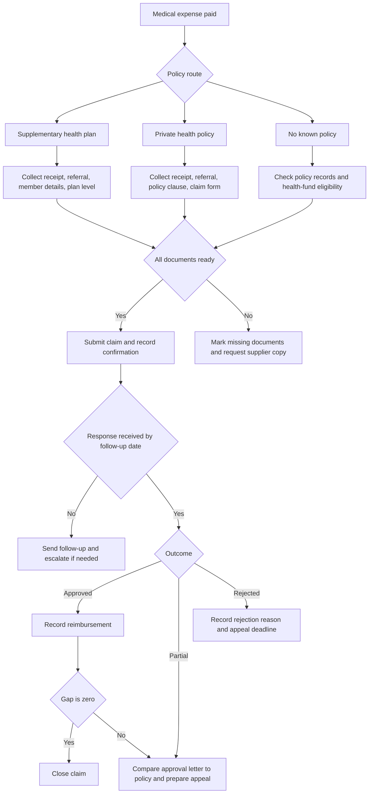

# Health-Insurance Claim Tracker

Track claim submissions, missing documents, insurer responses, appeals, and reimbursements for Israeli supplementary health plans and private health-insurance policies. Use this skill for households, freelancers, clinics, and small businesses that need a clear operational record without depending on an insurer portal.

## Scope

Use the tracker for:

- Supplementary health-plan claims from a health fund plan.
- Private health-insurance claims for consultations, surgery, medication, diagnostics, and medical equipment.
- Reimbursement tracking after out-of-pocket payment.
- Follow-up management when documents are missing or a response is overdue.
- Bookkeeping handoff for self-employed people and small businesses.

Do not use the tracker as legal, medical, insurance, or tax advice. Verify current rules with the insurer, health fund, qualified professional, and official government publications.

## Core workflow

1. Create a claim record immediately after payment or service.
2. Attach the expected document list.
3. Submit the claim through the insurer or health fund channel.
4. Record the submission date, confirmation number, and follow-up date.
5. Update status when the insurer asks for documents, approves, partially approves, rejects, or pays.
6. Record reimbursements separately from claimed amounts.
7. Keep the claim open until the reimbursement gap is zero or a conscious write-off decision is documented.


## Web-validated Israeli reference points

- Treat national health coverage, supplementary health services, and private insurance as separate layers. Use one claim record per payer.
- Use the official Hebrew term `שירותי בריאות נוספים (שב"ן)` for supplementary health services; the package label `supplementary` maps to that local term.
- Record gross receipt amounts in ₪. Do not calculate VAT automatically. The current standard Israeli VAT rate was verified as 18% from 01/01/2025, but reimbursement and bookkeeping treatment must be checked by the business or adviser.
- For business handoff, keep tax invoice or receipt evidence and record any Israel Invoice allocation number in notes when it appears on supplier documentation. Do not treat this tracker as a Tax Authority reporting tool.
- Use Har HaBituach and official policy documents for policy discovery, then store only minimal local references such as plan name, insurer, and last four policy digits.
- No official claim API, endpoint host, or webhook event name is implemented. Submit through the payer channel and use the local tracker for operational evidence.

## Decision tree



## Status model

| Status | Meaning | Next action |
|---|---|---|
| `draft` | Claim data is incomplete. | Add documents and validate dates. |
| `submitted` | Claim was submitted through a portal, branch, email, or agent. | Save confirmation and set a follow-up date. |
| `missing_documents` | Insurer or health fund requested more material. | Add the requested documents and record the upload date. |
| `in_review` | Claim is being checked. | Track the service-level expectation and follow up. |
| `approved` | Payment was approved but not yet recorded. | Record payment once received. |
| `partially_approved` | Only part of the claim was approved. | Compare the explanation to the policy. |
| `rejected` | Claim was denied. | Record the reason and appeal deadline. |
| `appealed` | Appeal or reconsideration was submitted. | Track additional evidence and response date. |
| `paid` | Reimbursement gap is zero or negative. | Close after reconciliation. |
| `closed` | No further operational action is expected. | Preserve records according to retention policy. |

## Concrete examples

### Private consultation reimbursement

A freelancer paid ₪850 for a private specialist consultation on 15/04/2026 and submitted the claim on 20/04/2026.

```bash
hict --env production create \
  --claimant-reference client-7788 \
  --policy-type private \
  --provider "Example Insurance" \
  --service-date 15/04/2026 \
  --submission-date 20/04/2026 \
  --amount 850.00 \
  --description "Private specialist consultation" \
  --channel portal \
  --service-kind consultation \
  --follow-up-date 20/05/2026
```

Save the returned `id`. Use it in the next step:

```bash
CLAIM_ID="HICT-20260604-AB12CD34"
hict --env production document "$CLAIM_ID" \
  --name receipt.pdf \
  --document-type tax_invoice_or_receipt
```

### Supplementary health-plan claim with missing material

Use `missing_documents` when the plan requests a referral, medical summary, or receipt correction. Do not close the claim only because the first submission failed.

```bash
hict --env production status "$CLAIM_ID" missing_documents \
  --note "Health fund requested referral and itemized receipt."
```

### Partial private-policy reimbursement

Record the actual reimbursement separately:

```bash
hict --env production reimburse "$CLAIM_ID" \
  --amount 1500.00 \
  --paid-date 30/04/2026 \
  --payer "Example Insurance" \
  --reference "payment notice 4421"
```

If the open gap remains material, move to appeal:

```bash
hict --env production status "$CLAIM_ID" appealed \
  --note "Attach medical necessity letter and policy clause reference."
```

## Edge cases

### Duplicate coverage

A person may have a health fund supplementary plan and a private policy. Track one claim per reimbursement route. Add tags such as `supplementary-first` or `private-second`. Record the first payer payment before submitting the second claim if the second payer asks for proof of prior reimbursement.

### Service paid by business account

For a self-employed person, store the receipt and payment proof. Mark expected reimbursement separately so bookkeeping can avoid double-counting the expense and the reimbursement.

### Reimbursement lower than expected

Do not overwrite the claimed amount. Record the actual reimbursement and keep the gap. Compare the approval letter to policy clauses, waiting periods, deductibles, copayments, exclusions, provider network rules, and annual caps.

### Missing invoice or receipt

Do not upload a credit-card statement alone unless the payer accepts it. Request a tax invoice or receipt from the supplier. For businesses, separate the medical claim file from accounting records but keep a cross-reference.

### Claimant privacy

Avoid storing full Israeli identity numbers when a short internal reference is enough. Use `claimant_reference` and `policy_number_last4`. Redact exports before sending them to external advisers.

### Rejection after late submission

Record the service date, submission date, policy deadline, and reason text from the rejection letter. Keep evidence of submission channel, confirmation number, and any system failure.

## Troubleshooting

| Problem | Likely cause | Fix |
|---|---|---|
| Claim cannot be created | Date format or negative amount is invalid. | Use `DD/MM/YYYY`, `DD-MM-YYYY`, or `YYYY-MM-DD`; verify amount is positive. |
| Import fails | CSV columns are missing or date values are inconsistent. | Export a sample file first, copy its headers, and keep UTF-8 encoding. |
| Claim looks overdue after payment | Payment was recorded but did not cover the full claimed amount. | Check the reimbursement gap and decide whether to appeal or write off. |
| Documents remain missing | `document_type` does not match the checklist term. | Use the exact document type from `missing_documents`. |
| CLI cannot find records | Different storage file is in use. | Set `HICT_STORAGE_PATH` or pass `--storage`. |

## Anti-patterns

- Store full identity numbers when the last four digits or an internal reference is enough.
- Treat approval as payment before money reaches the bank account.
- Replace the original claimed amount after partial approval.
- Track all policies in a single record when more than one payer is involved.
- Close a rejected claim without recording the rejection reason and appeal deadline.
- Send an unredacted claim export to a bookkeeper, adviser, or assistant.
- Use portal screenshots as the only evidence when downloadable confirmations are available.

## Production checklist

- Define a local storage path with restricted file permissions.
- Back up the JSON store and exported CSV files.
- Store source documents in a controlled folder with the claim id in the filename.
- Use consistent document type names from the reference guide.
- Set follow-up dates based on insurer guidance and internal service expectations.
- Review overdue claims weekly.
- Reconcile reimbursements against bank deposits.
- Redact personal data before sharing exports.
- Preserve records according to current legal, insurance, and accounting requirements.
- Recheck official rules before relying on deadlines, privacy obligations, or appeal routes.
