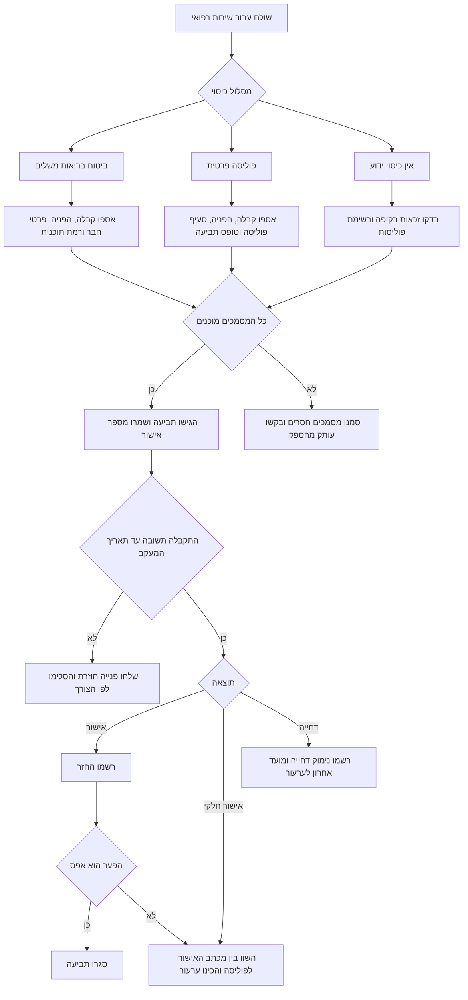

# מעקב תביעות והחזרים בביטוחי בריאות

נהלו תביעות, מסמכים חסרים, תשובות מבטחים, ערעורים והחזרים עבור ביטוח בריאות משלים בקופת חולים ופוליסות בריאות פרטיות בישראל. השתמשו בכלי עבור משקי בית, עצמאים, מרפאות ועסקים קטנים שצריכים תיעוד תפעולי ברור בלי תלות בממשק של מבטח מסוים.

## תחום שימוש

השתמשו במעקב עבור:

- תביעות במסגרת ביטוח בריאות משלים של קופת חולים.
- תביעות בפוליסת בריאות פרטית עבור ייעוץ, ניתוח, תרופות, בדיקות וציוד רפואי.
- מעקב החזרים לאחר תשלום מכיס המבוטח.
- טיפול במסמכים חסרים ובפניות המשך.
- התאמה להנהלת חשבונות עבור עצמאים ועסקים קטנים.

אל תשתמשו בכלי כתחליף לייעוץ משפטי, רפואי, ביטוחי או מס. בדקו את הכללים העדכניים מול המבטח, קופת החולים, איש מקצוע מוסמך ופרסומים רשמיים.

## תהליך עבודה בסיסי

1. פתחו רשומת תביעה מיד לאחר התשלום או השירות.
2. הוסיפו את רשימת המסמכים הצפויים.
3. הגישו את התביעה בערוץ שקבע המבטח או קופת החולים.
4. רשמו תאריך הגשה, מספר אישור ותאריך מעקב.
5. עדכנו מצב כאשר מתקבלת דרישת מסמכים, אישור, אישור חלקי, דחייה או תשלום.
6. רשמו החזרים בנפרד מסכום התביעה.
7. השאירו את התביעה פתוחה עד שסכום הפער הוא ₪0.00 או עד שתועדה החלטת סגירה מודעת.


## נקודות ייחוס ישראליות שאומתו ברשת

- הפרידו בין סל הבריאות הממלכתי, שירותי בריאות נוספים של קופת חולים ופוליסת בריאות פרטית. פתחו רשומה נפרדת לכל גורם משלם.
- השתמשו במונח הרשמי `שירותי בריאות נוספים (שב"ן)` עבור ביטוח בריאות משלים בקופת חולים. הערך `supplementary` בממשק מייצג מונח זה.
- רשמו סכומי קבלות ברוטו ב-₪. אל תחשבו מע"מ אוטומטית בתוך הכלי. שיעור המע"מ הכללי בישראל אומת כ-18% מיום 01/01/2025, אך טיפול בהחזר, במס תשומות ובהכרה בהוצאה תלוי בסוג ההוצאה ובייעוץ חשבונאי.
- לעצמאים ולעסקים קטנים, שמרו חשבונית מס או קבלה ורשמו מספר הקצאה של חשבוניות ישראל בהערות כאשר הוא מופיע במסמך הספק. הכלי אינו מדווח לרשות המסים ואינו בודק ספי הקצאה.
- השתמשו בהר הביטוח ובמסמכי פוליסה רשמיים לאיתור כיסוי. שמרו בכלי רק מזהים תפעוליים מצומצמים, כגון שם תוכנית, מבטח וארבע ספרות אחרונות.
- הכלי אינו מממש ממשק תביעות רשמי, נתיב API או שם אירוע webhook. הגישו את התביעה בערוץ של הגורם המשלם והשתמשו בכלי לתיעוד תפעולי.

## עץ החלטה



## מצבי תביעה

| מצב | משמעות | פעולה הבאה |
|---|---|---|
| `draft` | חסרים פרטי תביעה. | השלימו מסמכים ובדקו תאריכים. |
| `submitted` | התביעה הוגשה באתר, בסניף, בדואר אלקטרוני או דרך סוכן. | שמרו אישור וקבעו תאריך מעקב. |
| `missing_documents` | נדרשו מסמכים נוספים. | העלו את המסמכים ורשמו תאריך מסירה. |
| `in_review` | התביעה בבדיקה. | עקבו אחר זמן הטיפול הצפוי. |
| `approved` | אושר תשלום אך ההחזר עדיין לא נרשם. | רשמו תשלום לאחר קבלתו. |
| `partially_approved` | אושר רק חלק מהסכום. | השוו את ההסבר לתנאי הפוליסה. |
| `rejected` | התביעה נדחתה. | רשמו נימוק ומועד אחרון לערעור. |
| `appealed` | הוגש ערעור או בקשה לעיון מחדש. | עקבו אחר ראיות נוספות ותאריך תשובה. |
| `paid` | פער ההחזר הוא ₪0.00 או נמוך יותר. | בצעו התאמה וסגרו. |
| `closed` | לא צפויה פעולה תפעולית נוספת. | שמרו את הרשומה לפי מדיניות שמירה. |

## דוגמאות מעשיות

### החזר עבור ייעוץ בפוליסה פרטית

עצמאי שילם ₪850 עבור ייעוץ מומחה בתאריך 15/04/2026 והגיש תביעה בתאריך 20/04/2026.

```bash
hict --env production create \
  --claimant-reference client-7788 \
  --policy-type private \
  --provider "Example Insurance" \
  --service-date 15/04/2026 \
  --submission-date 20/04/2026 \
  --amount 850.00 \
  --description "ייעוץ מומחה במסגרת פוליסה פרטית" \
  --channel portal \
  --service-kind consultation \
  --follow-up-date 20/05/2026
```

שמרו את הערך `id` שחוזר מהפקודה. השתמשו בו בשלב הבא:

```bash
CLAIM_ID="HICT-20260604-AB12CD34"
hict --env production document "$CLAIM_ID" \
  --name receipt.pdf \
  --document-type tax_invoice_or_receipt
```

### תביעת ביטוח בריאות משלים עם מסמכים חסרים

השתמשו במצב `missing_documents` כאשר הקופה מבקשת הפניה, סיכום רפואי או תיקון קבלה. אל תסגרו תביעה רק מפני שההגשה הראשונה לא התקבלה.

```bash
hict --env production status "$CLAIM_ID" missing_documents \
  --note "נדרשו הפניה וקבלה מפורטת."
```

### אישור חלקי בפוליסה פרטית

רשמו את ההחזר בפועל בנפרד:

```bash
hict --env production reimburse "$CLAIM_ID" \
  --amount 1500.00 \
  --paid-date 30/04/2026 \
  --payer "Example Insurance" \
  --reference "payment notice 4421"
```

אם נשאר פער מהותי, העבירו לערעור:

```bash
hict --env production status "$CLAIM_ID" appealed \
  --note "צרפו מכתב צורך רפואי והפניה לסעיף פוליסה."
```

## מקרי קצה

### כיסוי כפול

ייתכן שקיימים גם ביטוח בריאות משלים וגם פוליסה פרטית. פתחו תביעה נפרדת לכל גורם משלם. הוסיפו תגיות כגון `supplementary-first` או `private-second`. רשמו את תשלום הגורם הראשון לפני פנייה לגורם השני אם נדרש אישור על החזר קודם.

### תשלום מחשבון עסקי

לעצמאי, שמרו חשבונית מס או קבלה ואישור תשלום. סמנו את ההחזר הצפוי בנפרד כדי למנוע רישום כפול של הוצאה והחזר בהנהלת החשבונות.

### החזר נמוך מהצפוי

אל תשנו את סכום התביעה המקורי. רשמו את ההחזר בפועל והשאירו פער פתוח. בדקו השתתפות עצמית, תקופת אכשרה, חריגים, תקרת כיסוי, ספק שבהסדר וכללי הפוליסה.

### חסרה חשבונית או קבלה

אל תסתמכו על פירוט אשראי בלבד אלא אם הגורם המשלם אישר זאת. בקשו מהספק חשבונית מס או קבלה. לעסק, הפרידו בין תיק התביעה לבין תיק הנהלת החשבונות אך שמרו מספר מזהה משותף.

### פרטיות מבוטחים

אל תשמרו מספר זהות מלא כאשר מזהה פנימי או ארבע ספרות אחרונות מספיקים. השתמשו בשדות `claimant_reference` ו-`policy_number_last4`. בצעו השחרה לפני שליחת ייצוא לגורם חיצוני.

### דחייה עקב איחור

רשמו תאריך שירות, תאריך הגשה, מועד אחרון לפי פוליסה ונימוק דחייה. שמרו ראיות לערוץ ההגשה, מספר אישור ותקלות מערכת אם היו.

## פתרון תקלות

| בעיה | סיבה סבירה | תיקון |
|---|---|---|
| לא ניתן לפתוח תביעה | תאריך או סכום אינם תקינים. | השתמשו בתבנית `DD/MM/YYYY`, `DD-MM-YYYY` או `YYYY-MM-DD`; ודאו שסכום חיובי. |
| ייבוא נכשל | חסרות עמודות או קיימים תאריכים לא אחידים. | ייצאו קובץ דוגמה, העתיקו כותרות ושמרו בקידוד UTF-8. |
| תביעה נראית באיחור לאחר תשלום | התשלום שנרשם לא כיסה את מלוא הסכום. | בדקו את פער ההחזר והחליטו על ערעור או סגירה. |
| מסמכים עדיין חסרים | סוג המסמך אינו תואם למונח ברשימת הבדיקה. | השתמשו בשם המדויק שמופיע ב-`missing_documents`. |
| ממשק שורת הפקודה לא מוצא רשומות | נעשה שימוש בקובץ אחסון אחר. | הגדירו `HICT_STORAGE_PATH` או העבירו `--storage`. |

## דפוסי עבודה שגויים

- שמירת מספרי זהות מלאים כאשר מספיק מזהה פנימי.
- התייחסות לאישור כאל תשלום לפני כניסת הכסף לחשבון הבנק.
- שינוי סכום התביעה המקורי אחרי אישור חלקי.
- מעקב אחר כמה גורמים משלמים באותה רשומה.
- סגירת תביעה דחויה בלי נימוק דחייה ומועד אחרון לערעור.
- שליחת ייצוא לא מושחר ליועץ, מנהל חשבונות או עוזר.
- הסתמכות על צילום מסך בלבד כאשר ניתן להוריד אישור רשמי.

## רשימת מוכנות לשימוש שוטף

- הגדירו נתיב אחסון מקומי עם הרשאות מוגבלות.
- גבו את קובץ ה-JSON ואת קובצי ה-CSV.
- שמרו מסמכי מקור בתיקייה מבוקרת עם מזהה התביעה בשם הקובץ.
- השתמשו בשמות סוגי מסמכים אחידים.
- קבעו תאריכי מעקב לפי הנחיות המבטח ולפי נהלי העסק.
- בדקו תביעות באיחור פעם בשבוע.
- התאימו החזרים להפקדות בחשבון הבנק.
- השחירו מידע אישי לפני שיתוף ייצוא.
- שמרו רשומות לפי חובות ביטוח, פרטיות, מס והנהלת חשבונות.
- בדקו פרסומים רשמיים לפני הסתמכות על מועדים, חובות פרטיות או מסלולי ערעור.
