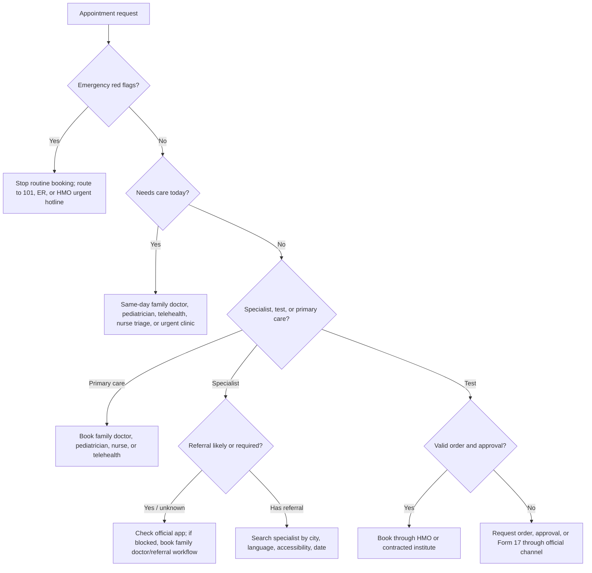
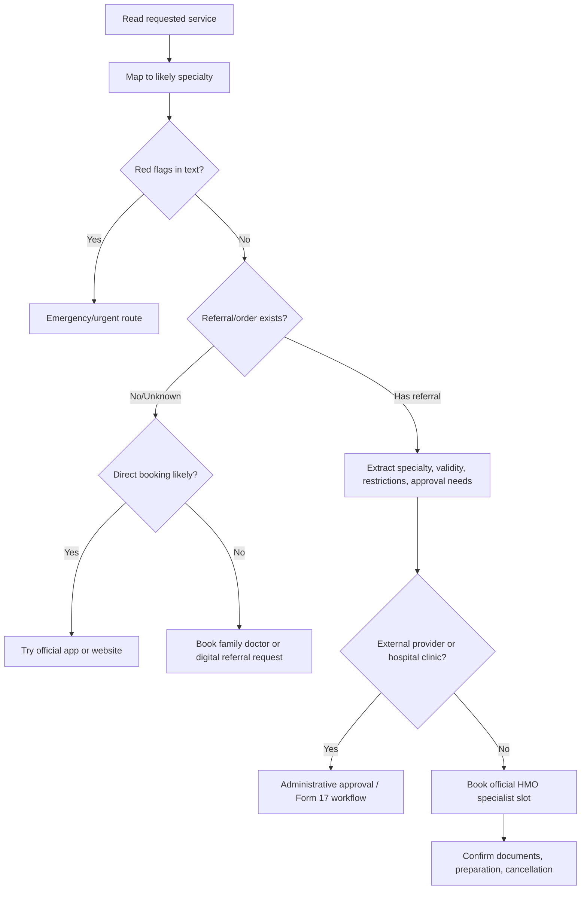

# Healthcare Appointment Booker

## Purpose

Book healthcare appointments in Israel through safe, privacy-preserving workflows for the four Kupot Cholim: Clalit, Maccabi, Meuhedet, and Leumit. The skill helps small businesses, freelancers, caregivers, families, and consumers prepare appointment requests, select the right official channel, route specialist needs, handle referrals and test orders, and document outcomes without collecting unnecessary medical information.

This is an administrative appointment-booking skill. Do not use it to diagnose, interpret results, recommend treatment, or replace urgent medical care.

## Core rules

- Use official HMO channels only: app, member portal, call center, clinic desk, or official digital channel published by the HMO.
- Do not scrape appointment portals or bypass queues, CAPTCHA, SMS verification, access controls, or clinic policies.
- Do not ask for HMO passwords, SMS codes, full Israeli ID numbers, or medical files.
- Ask for the minimum operational information needed to plan the booking.
- Escalate emergency red flags before any routine appointment workflow.
- Store appointment category, time, location, and confirmation number only when needed.
- For caregiver or business-client booking, confirm permission before helping.

## Supported HMOs

| HMO | Hebrew | Common official channels | Booking notes |
|---|---:|---|---|
| Clalit | כללית | App, website, *2700, clinic desk | Some specialist and external services require referral or district approval. |
| Maccabi | מכבי | App, website, *3555, clinic desk | Routine services are often available through online channels. |
| Meuhedet | מאוחדת | App, website, *3833, clinic desk | Availability can vary by branch and district. |
| Leumit | לאומית | App, website, *507, clinic desk | Verify regional service coverage and contracted providers. |

Short codes and portals can change. Verify current official contact pages before production use.

## Inputs to collect

Collect only these fields unless the official channel requires the user to enter more details directly:

1. HMO.
2. Appointment goal.
3. Patient age group: adult, child, infant, senior.
4. City or preferred area.
5. Date range and time windows.
6. Preferred language: Hebrew, Arabic, Russian, English, Amharic, other.
7. Accessibility needs: wheelchair access, elevator, companion, hearing support, video visit.
8. Referral/order status: has referral, no referral, pending, unknown, not applicable.
9. Urgency: routine, soon, same-day, urgent symptoms.
10. Confirmation delivery preference: app notification, SMS, phone, email.

## Urgency decision tree



## Specialist routing tree



## Specialty routing map

| Request terms | Likely route | Referral/order guidance |
|---|---|---|
| prescription renewal, sick note, general concern | Family medicine | Usually direct or digital request. |
| child fever, child ear pain | Pediatrics | Same-day if acute; urgent route for severe symptoms. |
| mole, rash, acne | Dermatology | Direct in some cases; referral may be needed. |
| back, knee, joint injury | Orthopedics | Referral may be needed; physiotherapy may also need order. |
| eye exam, eye pain | Ophthalmology | Sudden vision loss is urgent. |
| ear, nose, throat, hearing | ENT | Pediatric acute ear pain usually starts with pediatrician. |
| pregnancy follow-up | Gynecology / women’s health | Often direct; verify test type and week. |
| stomach, reflux, colonoscopy | Gastroenterology | Referral usually likely. |
| heart follow-up | Cardiology | Referral usually likely; chest pain escalates. |
| migraine, numbness, neurological follow-up | Neurology | Referral usually likely; stroke signs escalate. |
| diabetes, thyroid | Endocrinology | Referral usually likely; add nurse/dietitian route if relevant. |
| anxiety, depression, psychiatry | Mental health / psychiatry | Varies; self-harm escalates. |
| MRI, CT, ultrasound, X-ray | Imaging | Order/referral and approval may be required. |
| blood test, urine test | Lab | Active order usually required. |
| vaccine, injection, wound care | Nurse | Doctor order may be required for some tasks. |
| Form 17, commitment, external clinic | Administrative approvals | Use official HMO approval channel. |

## Emergency red flags

Stop routine booking and recommend urgent help when the request includes chest pain, severe shortness of breath, fainting, stroke signs, severe allergic reaction, uncontrolled bleeding, suicidal intent, high fever in an infant, sudden vision loss, severe injury, or rapidly worsening child symptoms.

Use local emergency routes such as Magen David Adom 101, emergency room, or the HMO urgent hotline. Do not delay urgent care to complete a booking plan.

## Output template

```text
Appointment booking plan
HMO:
Service:
Priority:
Recommended route:
Specialty routing:
Referral/order status:
Area and date range:
Availability strategy:
1. Search official app/website.
2. Compare earliest slot, clinic, provider, language, accessibility.
3. Expand to nearby cities if no slots.
4. Call clinic desk or HMO service center.
Hebrew script:
Documents to prepare:
Follow-up:
Privacy note:
```

## Concrete examples

### Maccabi dermatology, routine

```yaml
hmo: maccabi
service: suspicious mole check
city: Rishon LeZion
date_from: 2026-07-01
date_to: 2026-07-31
referral_status: unknown
urgency: routine
```

Plan: classify as dermatology, try official app/website, check whether referral is required, expand to nearby cities if no slots.

Hebrew script:

```text
שלום, אני מבקש/ת לקבוע תור לרופא/ת עור לבדיקת נקודת חן באזור ראשון לציון.
אם נדרשת הפניה, מה הדרך המהירה לקבל אותה?
```

### Clalit child fever and ear pain

Plan: same-day pediatrician or urgent pediatric clinic. Do not start with ENT unless pediatrician refers. Escalate if severe symptoms appear.

### Meuhedet MRI knee with referral

Plan: imaging workflow. Verify order validity, approval/Form 17 if required, institute arrangement, and preparation instructions.

### Leumit sick note for freelancer

Plan: family doctor, digital request, or telehealth. Include business note only if the service provider charges for administrative help; price must be stated in ₪ and the service must not be described as medical advice.

## Edge cases

### No slots visible

- Expand to nearby cities.
- Search without a specific provider.
- Try morning, afternoon, and evening.
- Check telehealth where suitable.
- Call clinic desk for cancellations.
- Call HMO service center for district alternatives.
- For time-sensitive symptoms, ask for nurse triage or urgent clinic.
- Do not use bots or scraping.

### Referral missing

- Check whether the specialty is directly bookable.
- If blocked, book family doctor or submit digital referral request.
- Prepare a short reason for referral.
- Do not invent symptoms or urgency.

### Maccabi same-specialty continuity rule

Maccabi documents a continuity rule that can block digital booking with a different doctor in the same medical specialty during the same quarter unless approved by the medical-center manager. If this appears, use the official call center or branch workflow rather than treating it as a technical error.

### Referral expired

- Book family doctor or submit renewal request.
- Confirm whether the HMO accepts extension.
- Retry specialist booking after renewal.

### Accessibility need

- Confirm accessible entrance, elevator, restroom, and exam room.
- Confirm companion policy and accessible parking.
- Record only the confirmed operational details.

### Language preference

- Use provider language filters if available.
- Ask call center for Hebrew, Arabic, Russian, English, or Amharic support.
- Suggest caregiver/interpreter support when permitted.

### User shares sensitive data

- Stop using the sensitive content.
- Ask the user to enter it only in the official channel.
- Continue with non-sensitive appointment category, city, and date range.

## Anti-patterns

Avoid: credential collection, SMS-code handling, portal scraping, diagnosis, unofficial phone numbers, detailed medical notes, duplicate slot holding, unverified cancellation rules, guessing referral requirements, and treating urgent symptoms as routine scheduling.

## Production checklist

- [ ] Verify official HMO contact pages and short codes.
- [ ] Review current Ministry of Health and privacy requirements.
- [ ] Add emergency escalation text in Hebrew and English.
- [ ] Add consent flow for caregiver or client booking.
- [ ] Minimize stored data and define retention.
- [ ] Encrypt retained appointment records.
- [ ] Disable credential and SMS-code collection.
- [ ] Log operational metadata only.
- [ ] Include language and accessibility fields.
- [ ] Test the scenarios in `references/test-scenarios.md`.
- [ ] Review Hebrew wording with an Israeli healthcare operations professional.
- [ ] Provide clear business pricing and receipt/invoice process where paid assistance is offered.

## Quality rubric

A good response identifies the HMO, route, urgency, likely specialty, referral/order requirement, official channel, fallback strategy, Hebrew wording, privacy boundary, and follow-up actions.


## Current VAT validation

As verified on 2026-06-04, Israeli VAT is 18%. For paid administrative appointment assistance, disclose the total price in ₪ and state whether VAT applies. This skill does not calculate taxes or replace accounting advice.
