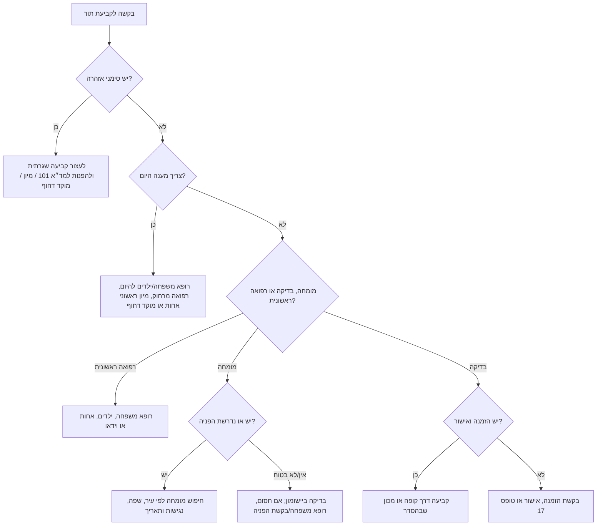

# קביעת תורים רפואיים בקופות החולים בישראל

## מטרה

לקבוע תורים רפואיים בישראל בצורה בטוחה, מסודרת ומכבדת פרטיות עבור כללית, מכבי, מאוחדת ולאומית. המיומנות מיועדת לעסקים קטנים, עצמאים, מטפלים בבני משפחה וצרכנים פרטיים שצריכים תהליך עבודה ברור לקביעת תור לרופא משפחה, רופא ילדים, אחות, רופא מומחה, בדיקות מעבדה, דימות, רפואה דחופה ושירותים מנהליים.

זוהי מיומנות אדמיניסטרטיבית. אין להשתמש בה לאבחון, לפענוח בדיקות, להמלצה טיפולית או במקום פנייה דחופה.

## כללי יסוד

- השתמשו רק בערוצים רשמיים של הקופה: יישומון, אתר, מוקד, מזכירות מרפאה או ערוץ דיגיטלי רשמי.
- אין לגרד אתרי תורים, לעקוף תורים, CAPTCHA, קודי SMS או מנגנוני גישה.
- אין לבקש סיסמת קופה, קוד אימות, מספר תעודת זהות מלא או מסמכים רפואיים.
- אספו רק מידע תפעולי הכרחי.
- במקרה של סימני אזהרה, עצרו קביעת תור שגרתית והפנו לערוץ דחוף.
- אם קובעים תור עבור בן משפחה או לקוח, ודאו הסכמה.
- תעדו רק סוג שירות, אזור, מועד, מרפאה ומספר אישור.

## קופות נתמכות

| קופה | ערוצים רשמיים נפוצים | הערות |
|---|---|---|
| כללית | יישומון, אתר, *2700, מזכירות | בחלק מהמומחים והשירותים החיצוניים נדרשת הפניה או התחייבות. |
| מכבי | יישומון, אתר, *3555, מזכירות | שירותים רבים זמינים בדיגיטל. |
| מאוחדת | יישומון, אתר, *3833, מזכירות | זמינות משתנה לפי סניף ומחוז. |
| לאומית | יישומון, אתר, *507, מזכירות | יש לבדוק פריסה אזורית ומכונים שבהסדר. |

קודים קצרים וערוצים דיגיטליים עשויים להשתנות. יש לאמת באתר הרשמי לפני הפעלה.

## פרטים לאיסוף

1. קופת חולים.
2. מטרת התור.
3. קבוצת גיל: מבוגר, ילד, תינוק, אזרח ותיק.
4. עיר או אזור מועדף.
5. טווח תאריכים בפורמט DD/MM/YYYY וחלונות זמן.
6. שפת שירות: עברית, ערבית, רוסית, אנגלית, אמהרית או אחרת.
7. צרכי נגישות: כיסא גלגלים, מעלית, מלווה, הנגשה שמיעתית, תור מקוון.
8. מצב הפניה/הזמנה: יש, אין, בטיפול, לא בטוח/ה, לא רלוונטי.
9. דחיפות: שגרתי, בקרוב, היום, סימני אזהרה.
10. דרך קבלת אישור: יישומון, SMS, טלפון או דוא״ל.

אין לאסוף מידע מזהה או רפואי מעבר לכך. אם הערוץ הרשמי דורש תעודת זהות או הזדהות, המשתמש/ת מזין/ה זאת בעצמו/ה בערוץ הרשמי.

## עץ החלטה לדחיפות



## ניתוב למומחים

| בקשה | ניתוב סביר | הערות |
|---|---|---|
| מרשם, אישור מחלה, תלונה כללית | רופא משפחה | לרוב ישיר או דיגיטלי. |
| חום וכאב אוזניים לילד | רופא ילדים | להיום אם אקוטי; סימנים חמורים מחייבים דחיפות. |
| נקודת חן, פריחה, אקנה | עור ומין | לעיתים נדרשת הפניה. |
| כאבי גב, ברך, מפרקים | אורתופדיה | ייתכן צורך בהפניה; פיזיותרפיה עשויה לדרוש הוראה. |
| עיניים, ראייה | עיניים | אובדן ראייה פתאומי מחייב דחיפות. |
| אוזן, אף, גרון, שמיעה | אף-אוזן-גרון | בילדים אקוטיים לרוב מתחילים ברופא ילדים. |
| היריון ומעקב נשים | נשים | לרוב ישיר; לבדוק סוג בדיקה ושבוע. |
| בטן, ריפלוקס, קולונוסקופיה | גסטרואנטרולוגיה | לרוב נדרשת הפניה. |
| מעקב לב | קרדיולוגיה | לרוב נדרשת הפניה; כאב בחזה מחייב דחיפות. |
| מיגרנה, נימול, מעקב נוירולוגי | נוירולוגיה | לרוב נדרשת הפניה; סימני שבץ מחייבים חירום. |
| סוכרת, בלוטת התריס | אנדוקרינולוגיה | לרוב נדרשת הפניה; לעיתים גם אחות ודיאטנית. |
| חרדה, דיכאון, פסיכיאטר | בריאות הנפש | משתנה; סכנה עצמית מחייבת עזרה מיידית. |
| MRI, CT, אולטרסאונד, רנטגן | דימות | נדרשת הזמנה ולעיתים אישור/טופס 17. |
| בדיקות דם, שתן | מעבדה | לרוב נדרשת הזמנה פעילה. |
| חיסון, זריקה, טיפול בפצע | אחות | לעיתים נדרשת הוראת רופא. |
| טופס 17, התחייבות, מרפאת חוץ | אישורים מנהליים | להשתמש בערוץ אישורים רשמי של הקופה. |

## סימני אזהרה

כאבים בחזה, קוצר נשימה חמור, התעלפות, סימני שבץ, תגובה אלרגית קשה, דימום בלתי נשלט, סכנה עצמית, חום גבוה בתינוק, אובדן ראייה פתאומי, פציעה קשה או החמרה מהירה אצל ילד. במקרים אלה אין להמתין לתור שגרתי; יש לפנות למד״א 101, למיון או למוקד דחוף של הקופה.

## תבנית תוכנית

```text
תוכנית קביעת תור
קופה:
שירות:
דחיפות:
ערוץ מומלץ:
ניתוב למומחיות:
מצב הפניה/הזמנה:
אזור וטווח תאריכים:
אסטרטגיית זמינות:
1. חיפוש ביישומון/אתר רשמי.
2. השוואה לפי תור ראשון, מרפאה, רופא/ה, שפה ונגישות.
3. הרחבה לערים סמוכות.
4. פנייה למזכירות או למוקד.
נוסח פנייה:
מסמכים להכנה:
מעקב:
הערת פרטיות:
```

## דוגמאות

### מכבי, רופא עור בראשון לציון

```yaml
קופה: מכבי
שירות: בדיקת נקודת חן
עיר: ראשון לציון
טווח: 01/07/2026 עד 31/07/2026
מצב הפניה: לא בטוח/ה
דחיפות: שגרתי
```

החלטה: ניתוב לעור ומין, בדיקה ביישומון או באתר, בירור דרישת הפניה, הרחבה לערים סמוכות אם אין תורים.

```text
שלום, אני מבקש/ת לקבוע תור לרופא/ת עור לבדיקת נקודת חן באזור ראשון לציון.
אם נדרשת הפניה, מה הדרך המהירה לקבל אותה?
```

### כללית, ילד עם חום וכאב אוזניים

קביעת רופא ילדים להיום או מוקד ילדים/מוקד דחוף. אין להתחיל מאף-אוזן-גרון אלא אם ניתנה הפניה או מדובר בבעיה חוזרת.

### מאוחדת, MRI ברך

לוודא הזמנה בתוקף, אישור או טופס 17 אם נדרש, מכון שבהסדר והנחיות הכנה.

### לאומית, אישור מחלה לעצמאי

רופא משפחה, בקשה דיגיטלית או רפואה מרחוק. אם השירות ניתן בתשלום אדמיניסטרטיבי, יש לציין מחיר בשקלים מראש, למשל: ₪45 כולל מע״מ, ללא ייעוץ רפואי.

## מקרי קצה

### אין תורים

- להרחיב לערים סמוכות.
- להסיר העדפת רופא/ה.
- לבדוק בוקר, צהריים וערב.
- לבדוק תור מקוון אם מתאים.
- להתקשר למזכירות ולשאול על ביטולים.
- לפנות למוקד הקופה לחלופות מחוזיות.
- במצב תלוי זמן, לבקש מיון ראשוני אחות או מוקד דחוף.

### חסרה הפניה

- לבדוק אם ניתן לקבוע ישירות.
- אם המערכת חוסמת, לקבוע רופא משפחה או לשלוח בקשה להפניה.
- להכין סיבה קצרה ואמיתית לבקשה.
- לא להמציא סימפטומים או דחיפות.

### כלל רצף טיפולי במכבי

במכבי מתועד כלל רצף טיפולי שעלול למנוע קביעה דיגיטלית לרופא אחר באותה מומחיות באותו רבעון ללא אישור מנהל המרכז הרפואי. אם ההודעה מופיעה, פנו למוקד 3555 או למרפאה במקום להתייחס לכך כתקלה טכנית.

### ההפניה פגה

- לקבוע רופא משפחה או לשלוח בקשת חידוש.
- לבדוק אם הקופה מאפשרת הארכה.
- לחזור לחיפוש לאחר החידוש.

### נגישות

- לוודא כניסה נגישה, מעלית, שירותים נגישים וחדר בדיקה נגיש.
- לבדוק חניה ומדיניות מלווה.
- לתעד רק את הפרטים התפעוליים שאושרו.

### שפה

- להשתמש במסנני שפה אם קיימים.
- לבקש במוקד רופא/ה דובר/ת עברית, ערבית, רוסית, אנגלית או אמהרית.
- להציע מלווה או מתורגמן כאשר זה מותר ובהסכמה.

## טעויות שיש להימנע מהן

איסוף סיסמאות, טיפול בקודי SMS, גירוד אתרים, אבחון רפואי, שמירת תיעוד רפואי מפורט, מספרים לא רשמיים, החזקת תורים כפולים, ניחוש דרישת הפניה, התעלמות מהנחיות הכנה, וקביעת תור שגרתי למרות סימני אזהרה.

## צ׳ק-ליסט להפעלה

- [ ] אימות ערוצי קשר רשמיים וקודים קצרים.
- [ ] בדיקת דרישות משרד הבריאות ודיני פרטיות עדכניים.
- [ ] הוספת טקסט הסלמה לחירום בעברית ובאנגלית.
- [ ] קבלת הסכמה לסיוע עבור בן משפחה או לקוח.
- [ ] מזעור מידע ושמירתו לזמן מוגבל.
- [ ] הצפנת רשומות תור אם נשמרות.
- [ ] חסימת איסוף סיסמאות וקודי אימות.
- [ ] תיעוד נתונים תפעוליים תפעולי בלבד.
- [ ] הכללת שפה ונגישות.
- [ ] בדיקת התרחישים בקובץ `references/test-scenarios.md`.
- [ ] סקירת ניסוחים על ידי גורם תפעול רפואי ישראלי.
- [ ] אם מדובר בשירות בתשלום, הצגת מחיר ב-₪ והפקת קבלה/חשבונית לפי הדין.

## מדד איכות

תוכנית טובה כוללת קופה, ערוץ רשמי, דחיפות, ניתוב למומחיות, דרישת הפניה/הזמנה, אסטרטגיית זמינות, נוסח בעברית, גבול פרטיות ופעולות מעקב.


## אימות מע״מ עדכני

נכון לאימות שבוצע ביום 04/06/2026, שיעור המע״מ בישראל הוא 18%. כאשר גובים תשלום עבור סיוע אדמיניסטרטיבי בקביעת תור, הציגו מחיר כולל בשקלים (₪) וציינו אם חל מע״מ. המיומנות אינה מחליפה ייעוץ חשבונאי או מס.
