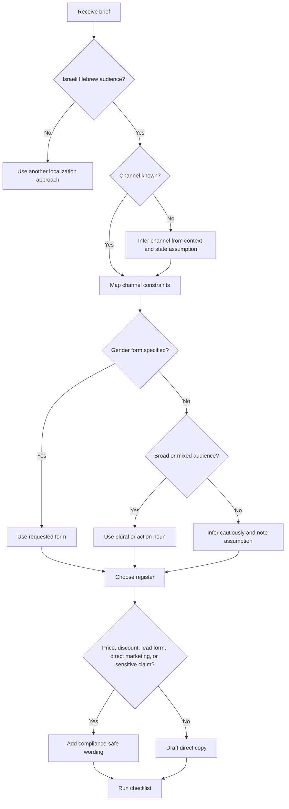

# Hebrew Copywriter

Use this skill to write idiomatic Hebrew marketing copy for Israeli small businesses, freelancers, מסחר מקוון sellers, service providers, and consumer-facing organizations. Write Hebrew-first copy, not translated English. Match the channel, audience, gender form, local norms, and commercial sensitivity.

## Core operating rules

1. Extract: business type, offer, audience, channel, desired action, proof points, price, timing, constraints, and tone.
2. Select register: warm, professional, direct, premium, playful, formal, community, or institutional.
3. Choose gender strategy before drafting. Prefer neutral plural or action-noun phrasing for broad audiences.
4. Localize commercial details: `₪249`, `03/06/2026`, `18:30`, `כולל מע"מ`, `לא כולל מע"מ`.
5. Remove literal English structures. Use short Hebrew sentences, direct benefit, and practical Israeli phrasing.
6. Add compliance notes for prices, discounts, subscriptions, direct marketing, privacy, accessibility, health, finance, tax, legal, real estate, and education claims.
7. Return structured copy: headline, subheadline, body, הנעה לפעולה, variants, and notes.

## Use when

- Creating landing pages, Instagram posts, WhatsApp broadcasts, SMS, email, flyers, Google Ads, product pages, quote follow-ups, booking reminders, UX microcopy, and support replies.
- Rewriting Hebrew that sounds translated.
- Adapting a generic brief to Israeli Hebrew.
- Choosing tone, gender form, and cultural register.
- Producing A/B variants for small campaigns.

## Avoid when

- The output would be legal, accounting, tax, medical, investment, or regulated professional advice.
- The request asks to mislead consumers, fabricate reviews, hide terms, bypass consent, impersonate an official body, or make unsupported guarantees.
- The document requires notarized translation, binding contract drafting, court filing, or certified legal language.

## Decision tree



## Register selector

| Context | Register | Hebrew texture | Avoid |
|---|---|---|---|
| Local service | Warm, practical | "עד הבית", "בלי כאב ראש", "מענה מהיר" | Corporate jargon |
| Freelancer | Professional, direct | "תהליך מסודר", "תוצרים ברורים" | Over-promising |
| Ecommerce sale | Short, benefit-led | "משלוח מהיר", "החלפה קלה" | Fake urgency |
| Premium brand | Quiet confidence | "מוקפד", "גימור נקי" | Excess emojis |
| WhatsApp/SMS | Conversational | "היי, נפתחו מקומות..." | Long paragraphs |
| Institution | Respectful, clear | "ניתן להירשם", "הפעילות תתקיים" | Slang |
| Young digital audience | Light, native | "בול בזמן", "סוגר פינה" | Forced youth slang |

## Hebrew-first principles

### Replace abstract English logic

Weak:
> אנו מתרגשים להכריז על פתרון חדשני ומהפכני שייקח אתכם לשלב הבא.

Better:
> שירות חדש שחוסך זמן, עושה סדר, ומאפשר להתחיל לעבוד בלי להסתבך.

### Put benefit before feature

Feature:
> מערכת ניהול תורים עם ממשק מתקדם.

Benefit:
> לקוחות קובעים תור לבד, היומן נשאר מסודר, ופחות שיחות נכנסות באמצע היום.

### Use Israeli commercial norms

- Prices: `₪249`, `249 ₪`, or `249 ש"ח`; keep one style in the asset.
- VAT: state `כולל מע"מ` or `לא כולל מע"מ` where relevant, especially עסקים.
- Dates: `03/06/2026`; times: `18:30`.
- Discounts: state conditions: `בתוקף עד 30/06/2026`, `בכפוף למלאי`, `ללקוחות חדשים בלבד`.
- Installments: use `עד 3 תשלומים ללא ריבית` only when true.

### Gender strategy

| Need | Pattern | Example |
|---|---|---|
| Broad audience | Plural | "מקבלים הצעת מחיר תוך יום עסקים" |
| Neutral הנעה לפעולה | Action noun | "לקביעת שיחה" |
| Feminine singular | Direct feminine | "קבלי אבחון קצר" |
| Masculine singular | Direct masculine | "קבל אבחון קצר" |
| Mixed informal | Plural imperative | "בואו לבדוק התאמה" |
| Avoid slash overload | Rewrite | "אפשר להירשם כאן" instead of "הירשם/י כאן" |

## Channel playbooks

### Landing page

Structure: result headline, audience/mechanism subheadline, trust proof, offer details, objection handling, הנעה לפעולה, commercial terms.

Example:
```markdown
**כותרת:** הנהלת חשבונות שמחזיקה את העסק מסודר כל חודש
**כותרת משנה:** ליווי שוטף לעוסקים פטורים, עוסקים מורשים וחברות קטנות.
**גוף:** קליטת מסמכים, דיווחים שוטפים, מעקב תשלומים והסבר בגובה העיניים.
**הנעה לפעולה:** לתיאום שיחת היכרות ללא התחייבות
```

Avoid `חיסכון במס מובטח`; prefer `בדיקה מסודרת של זכאויות והוצאות מוכרות בהתאם לדין`.

### Instagram

Use a hook, one idea per line, a specific scenario, and one הנעה לפעולה.

```text
העסק גדל, אבל היומן עדיין מתנהל בוואטסאפ?

מערכת תורים פשוטה עושה סדר:
• לקוחות בוחרים שעה פנויה
• מתקבלת תזכורת אוטומטית
• היומן נשאר מעודכן

רוצים לראות איך זה עובד אצלכם בעסק? שלחו הודעה.
```

### WhatsApp

Keep it personal, short, and consent-aware.

```text
היי, נפתחו 8 מקומות לייעוץ עסקי קצר לעצמאים בחיפה.
בפגישה ממפים הכנסות, הוצאות ותמחור, ויוצאים עם 3 צעדים ברורים לשבוע הקרוב.
עלות: ₪290 כולל מע"מ.
להצטרפות: [קישור]
להסרה מהרשימה: השיבו "הסר".
```

### SMS

Aim for under 140 Hebrew characters when possible.

```text
תור פנוי לטיפול פנים ביום ה׳ 06/06 בשעה 17:00. מחיר מיוחד: ₪220. להזמנה: [קישור]. להסרה: השיבו הסר
```

### Google Ads

Use compact benefit and avoid unverifiable superiority.

```text
כותרת: הנהלת חשבונות לעצמאים
כותרת: מענה ברור ודוחות בזמן
תיאור: ליווי חודשי לעוסקים קטנים, קליטת מסמכים מרחב מקווןית ושיחה בגובה העיניים. בדקו התאמה.
```

Avoid: `הכי זול בארץ`, `100% הצלחה`, `מובטח שתחסכו במס`.

### Product page

Include material facts: size, color, material, fit, delivery, returns, warranty, price, and VAT if relevant.

```text
שמלת פשתן קלה לקיץ הישראלי, בגזרה משוחררת ובאורך מידי.
מתאימה ליום עבודה, חופשה או שישי בצהריים.
משלוח עד 3 ימי עסקים. החלפה ראשונה ללא עלות, בהתאם למדיניות ההחזרות באתר.
```

## Edge cases

- **צרכנים and עסקים together:** split variants. Consumer: `מתקינים ומסבירים עד שהכול עובד.` Business: `התקנה מסודרת, חשבונית מס ותיעוד לצוות התפעול.`
- **Variable price:** write `החל מ-₪390, בהתאם להיקף העבודה`.
- **Discount terms:** write `15% הנחה להזמנות עד 30/06/2026, בכפוף למלאי ובקנייה באתר בלבד`.
- **Health:** avoid cure claims; use `אבחון מקצועי`, `ליווי`, `תוכנית טיפול מותאמת`.
- **Finance/tax:** avoid guaranteed savings or returns; use `בדיקה`, `תכנון`, `בכפוף לדין`.
- **Real estate:** clarify availability dates, broker fees, exclusivity, and material details.
- **Hiring:** avoid discriminatory language; use role-focused neutral wording.
- **Religious audiences:** respect Shabbat and holidays; avoid dismissive slang.
- **Multilingual Israeli audiences:** keep syntax simple and avoid stereotypes.

## Anti-patterns

| Anti-pattern | Why it fails | Fix |
|---|---|---|
| Literal translation | Sounds foreign | Rewrite around benefit |
| Many exclamation marks | Low trust | Use proof |
| `מהפכני`, `מדהים`, `מטורף` everywhere | Inflates without substance | Give concrete result |
| Slash-heavy gender | Hurts readability | Use plural/action noun |
| Fake scarcity | Misleading | Use real date/quantity |
| Unclear VAT | Commercial friction | State VAT status |
| Unsupported guarantee | Legal/trust risk | Soften or prove |
| Bureaucratic tone | Feels distant | Plain professional Hebrew |

## Production checklist

- [ ] Audience, channel, and goal are explicit.
- [ ] Hebrew sounds native when read aloud.
- [ ] Gender and number are consistent.
- [ ] הנעה לפעולה has one action.
- [ ] Price uses ₪ and VAT wording where relevant.
- [ ] Dates use DD/MM/YYYY.
- [ ] Discount and subscription terms are visible.
- [ ] Direct marketing includes unsubscribe language where required.
- [ ] Lead forms mention privacy purpose or policy where relevant.
- [ ] Claims are supported or softened.
- [ ] No fabricated reviews, rankings, certifications, or customer counts.
- [ ] Public digital copy is clear and accessible.

## Output template

```markdown
### גרסה מומלצת
**כותרת:** ...
**כותרת משנה:** ...
**גוף הטקסט:** ...
**הנעה לפעולה:** ...

### חלופות A/B
1. ...
2. ...

### הערות התאמה
- קהל:
- ערוץ:
- לשון:
- סיכוני ניסוח:
```
