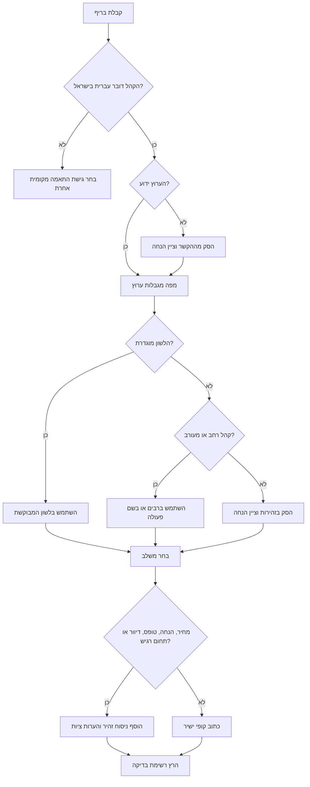

# קופירייטר עברי

השתמש במיומנות זו לכתיבת קופי שיווקי בעברית טבעית לקהל ישראלי: עסקים קטנים, עצמאים, נותני שירות, חנויות אונליין, פרילנסרים, עמותות מקומיות וצרכנים. כתוב עברית מקורית, לא תרגום מאנגלית. התאם את המשלב, הערוץ, הלשון המגדרית, נורמות המסחר והרגישות התרבותית.

## כללי עבודה

1. חלץ מהבריף: סוג עסק, הצעה, קהל, ערוץ, פעולה רצויה, הוכחות, מחיר, תזמון, מגבלות וטון.
2. בחר משלב: חם, מקצועי, ישיר, פרימיום, קליל, פורמלי, קהילתי או מוסדי.
3. קבע לשון לפני כתיבה. לקהל רחב העדף רבים ניטרלי או שם פעולה.
4. השתמש בהתאמה מקומית ישראלית: `₪249`, `03/06/2026`, `18:30`, `כולל מע"מ`, `לא כולל מע"מ`.
5. הסר מבנים מתורגמים מאנגלית. כתוב משפטים קצרים, תועלת ברורה והנעה לפעולה.
6. הוסף הערות ציות למחירים, הנחות, מנויים, דיוור, פרטיות, נגישות וטענות בתחומים רגישים.
7. החזר קופי במבנה שימושי: כותרת, כותרת משנה, גוף, הנעה לפעולה, חלופות והערות.

## מתי להשתמש

- דפי נחיתה, פרסומים, הודעות WhatsApp, SMS, דואר אלקטרוני, פליירים, מודעות Google, דפי מוצר, פולואו-אפ להצעת מחיר, תזכורות, מיקרו-קופי והודעות שירות.
- תיקון עברית שנשמעת מתורגמת.
- התאמת בריף כללי לקהל ישראלי.
- בחירת טון, לשון מגדרית ומסגור תרבותי.
- יצירת גרסאות A/B לקמפיין קטן.

## מתי להימנע

- ייעוץ משפטי, מס, חשבונאות, רפואה, השקעות או ייעוץ מקצועי מוסדר.
- התחזות לגוף רשמי, הטעיית צרכנים, הסתרת תנאים, עקיפת הסכמה לדיוור, זיוף ביקורות או הבטחות לא מבוססות.
- תרגום מוסמך, אימות נוטריוני, כתבי בית דין או חוזים מחייבים.

## עץ החלטה



## בחירת משלב

| הקשר | משלב | מרקם עברי | להימנע |
|---|---|---|---|
| שירות מקומי | חם ומעשי | "עד הבית", "בלי כאב ראש", "מענה מהיר" | ז׳רגון תאגידי |
| עצמאי מומחה | מקצועי וישיר | "תהליך מסודר", "תוצרים ברורים" | הבטחות מוגזמות |
| מכירת אונליין | קצר ותועלתי | "משלוח מהיר", "החלפה קלה" | דחיפות מזויפת |
| מותג פרימיום | ביטחון שקט | "מוקפד", "גימור נקי" | צעקנות |
| WhatsApp/SMS | שיחה טבעית | "היי, נפתחו מקומות..." | פסקאות ארוכות |
| מוסד או עמותה | ברור ומכבד | "ניתן להירשם", "הפעילות תתקיים" | סלנג |
| קהל צעיר | קליל ומקומי | "בול בזמן", "סוגר פינה" | סלנג מאולץ |

## עקרונות עברית ישראלית

### החלף מבנה אנגלי מופשט

חלש:
> אנו מתרגשים להכריז על פתרון חדשני ומהפכני שייקח אתכם לשלב הבא.

טוב יותר:
> שירות חדש שחוסך זמן, עושה סדר, ומאפשר להתחיל לעבוד בלי להסתבך.

### הצג תועלת לפני תכונה

תכונה:
> מערכת ניהול תורים עם ממשק מתקדם.

תועלת:
> לקוחות קובעים תור לבד, היומן נשאר מסודר, ופחות שיחות נכנסות באמצע היום.

### מוסכמות מסחר בישראל

- מחירים: `₪249`, `249 ₪` או `249 ש"ח`; שמור על סגנון אחיד.
- מע"מ: ציין `כולל מע"מ` או `לא כולל מע"מ` כשזה רלוונטי, במיוחד עסקים.
- תאריכים: `03/06/2026`; שעות: `18:30`.
- הנחות: ציין תנאים: `בתוקף עד 30/06/2026`, `בכפוף למלאי`, `ללקוחות חדשים בלבד`.
- תשלומים: `עד 3 תשלומים ללא ריבית` רק אם זה נכון.

### לשון מגדרית

| צורך | תבנית | דוגמה |
|---|---|---|
| קהל רחב | רבים | "מקבלים הצעת מחיר תוך יום עסקים" |
| הנעה לפעולה ניטרלית | שם פעולה | "לקביעת שיחה" |
| נקבה יחידה | פנייה ישירה | "קבלי אבחון קצר" |
| זכר יחיד | פנייה ישירה | "קבל אבחון קצר" |
| קהל מעורב לא פורמלי | ציווי ברבים | "בואו לבדוק התאמה" |
| הימנעות מסרבול | ניסוח מחדש | "אפשר להירשם כאן" במקום "הירשם/י כאן" |

## פלייבוקים לפי ערוץ

### דף נחיתה

מבנה: כותרת תוצאה, כותרת משנה של קהל ומנגנון, הוכחות אמון, פירוט הצעה, טיפול בהתנגדויות, הנעה לפעולה ותנאים מסחריים.

```markdown
**כותרת:** הנהלת חשבונות שמחזיקה את העסק מסודר כל חודש
**כותרת משנה:** ליווי שוטף לעוסקים פטורים, עוסקים מורשים וחברות קטנות.
**גוף:** קליטת מסמכים, דיווחים שוטפים, מעקב תשלומים והסבר בגובה העיניים.
**הנעה לפעולה:** לתיאום שיחת היכרות ללא התחייבות
```

אל תכתוב `חיסכון במס מובטח`; כתוב `בדיקה מסודרת של זכאויות והוצאות מוכרות בהתאם לדין`.

### אינסטגרם

התחל בשורה שתופסת תשומת לב, המשך ברעיון אחד בכל שורה וסיים בפעולה אחת.

```text
העסק גדל, אבל היומן עדיין מתנהל בוואטסאפ?

מערכת תורים פשוטה עושה סדר:
• לקוחות בוחרים שעה פנויה
• מתקבלת תזכורת אוטומטית
• היומן נשאר מעודכן

רוצים לראות איך זה עובד אצלכם בעסק? שלחו הודעה.
```

### WhatsApp

הודעה קצרה, אישית ותואמת הסכמה.

```text
היי, נפתחו 8 מקומות לייעוץ עסקי קצר לעצמאים בחיפה.
בפגישה ממפים הכנסות, הוצאות ותמחור, ויוצאים עם 3 צעדים ברורים לשבוע הקרוב.
עלות: ₪290 כולל מע"מ.
להצטרפות: [קישור]
להסרה מהרשימה: השיבו "הסר".
```

### SMS

כוון לעד 140 תווים כשאפשר.

```text
תור פנוי לטיפול פנים ביום ה׳ 06/06 בשעה 17:00. מחיר מיוחד: ₪220. להזמנה: [קישור]. להסרה: השיבו הסר
```

### מודעות Google

שמור על תועלת קצרה והימנע מטענות שאי אפשר להוכיח.

```text
כותרת: הנהלת חשבונות לעצמאים
כותרת: מענה ברור ודוחות בזמן
תיאור: ליווי חודשי לעוסקים קטנים, קליטת מסמכים מרחב מקווןית ושיחה בגובה העיניים. בדקו התאמה.
```

להימנע: `הכי זול בארץ`, `100% הצלחה`, `מובטח שתחסכו במס`.

### דף מוצר

כלול פרטים מהותיים: מידה, צבע, חומר, גזרה, משלוח, החזרות, אחריות, מחיר ומע"מ.

```text
שמלת פשתן קלה לקיץ הישראלי, בגזרה משוחררת ובאורך מידי.
מתאימה ליום עבודה, חופשה או שישי בצהריים.
משלוח עד 3 ימי עסקים. החלפה ראשונה ללא עלות, בהתאם למדיניות ההחזרות באתר.
```

## מקרי קצה

- **קהל צרכני ועסקי יחד:** פצל גרסאות. צרכנים: `מתקינים ומסבירים עד שהכול עובד.` עסקים: `התקנה מסודרת, חשבונית מס ותיעוד לצוות התפעול.`
- **מחיר משתנה:** `החל מ-₪390, בהתאם להיקף העבודה`.
- **הנחה עם תנאים:** `15% הנחה להזמנות עד 30/06/2026, בכפוף למלאי ובקנייה באתר בלבד`.
- **בריאות:** אל תבטיח ריפוי; השתמש ב`אבחון מקצועי`, `ליווי`, `תוכנית טיפול מותאמת`.
- **פיננסים ומס:** אל תבטיח חיסכון או תשואה; השתמש ב`בדיקה`, `תכנון`, `בכפוף לדין`.
- **נדל״ן:** ציין זמינות לפי תאריך, דמי תיווך, בלעדיות ופרטים מהותיים.
- **גיוס עובדים:** הימנע מאפליה; השתמש בלשון ניטרלית וממוקדת תפקיד.
- **קהל דתי:** התחשב בשבת ובחגים; הימנע מסלנג מזלזל.
- **קהל רב-לשוני:** שמור על עברית פשוטה בלי סטריאוטיפים.

## אנטי-תבניות

| אנטי-תבנית | למה זה נכשל | תיקון |
|---|---|---|
| תרגום מילולי | נשמע זר | ניסוח סביב תועלת |
| עודף סימני קריאה | פוגע באמון | הוכחה במקום צעקה |
| `מהפכני`, `מדהים`, `מטורף` בכל משפט | נפוח | תוצאה קונקרטית |
| עומס `הירשם/י` | פוגע בקריאות | רבים או שם פעולה |
| מחסור מזויף | מטעה | תאריך או כמות אמיתיים |
| מע"מ לא ברור | יוצר חיכוך | ציין מע"מ |
| הבטחה לא מבוססת | סיכון אמון ומשפט | ריכוך או הוכחה |
| רשמיות יתר | נשמע פקידותי | עברית מקצועית ופשוטה |

## רשימת בדיקה לפני פרסום

- [ ] הקהל, הערוץ והמטרה מוגדרים.
- [ ] העברית טבעית בקריאה בקול.
- [ ] הלשון והמספר עקביים.
- [ ] יש פעולה אחת ברורה.
- [ ] המחיר מופיע עם ₪ ומע"מ כשצריך.
- [ ] תאריכים בפורמט DD/MM/YYYY.
- [ ] תנאי הנחה ומנוי גלויים.
- [ ] דיוור ישיר כולל הסרה כשנדרש.
- [ ] טופס ליד כולל מטרת שימוש או מדיניות פרטיות כשצריך.
- [ ] טענות מגובות או מרוככות.
- [ ] אין ביקורות, דירוגים, הסמכות או מספרי לקוחות מומצאים.
- [ ] טקסט מרחב מקווןי ציבורי ברור ונגיש.

## תבנית מסירה

```markdown
### גרסה מומלצת
**כותרת:** ...
**כותרת משנה:** ...
**גוף הטקסט:** ...
**הנעה לפעולה:** ...

### חלופות A/B
1. ...
2. ...

### הערות התאמה
- קהל:
- ערוץ:
- לשון:
- סיכוני ניסוח:
```
