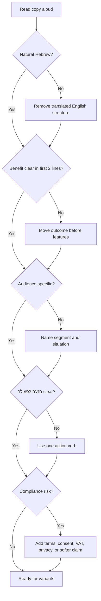

# Troubleshooting Hebrew marketing copy

Use this guide to diagnose weak copy and repair it quickly.

## Diagnostic flow



## Symptoms and fixes

### Copy sounds translated

Before:
```text
הפתרון שלנו מאפשר לך למקסם את הפוטנציאל העסקי שלך.
```

After:
```text
מקבלים תמונה ברורה של ההכנסות, ההוצאות והצעדים שצריך לעשות השבוע.
```

Fix:
- Replace abstractions with action.
- Remove English idioms.
- Keep Hebrew clauses short.

### Copy is too aggressive

Before:
```text
מבצע מטורף!!! אסור לפספס!!!
```

After:
```text
מחיר השקה עד 30/06/2026, בכפוף למלאי. מתאים למי שרוצה להתחיל בלי התחייבות ארוכה.
```

Fix:
- Use proof instead of shouting.
- Keep only real deadlines and inventory limits.
- Remove repeated exclamation marks.

### Copy is too formal

Before:
```text
הנך מוזמן להשאיר את פרטיך ונציג מטעמנו יצור עמך קשר.
```

After:
```text
השאירו פרטים ונחזור אליכם לתיאום קצר.
```

Fix:
- Use active verbs.
- Remove bureaucratic nouns.
- Keep respect without paperwork language.

### Gender form is awkward

Before:
```text
רוצה לקבל הצעה? השאר/י פרטים ונחזור אליך.
```

After:
```text
רוצים לקבל הצעה? משאירים פרטים וחוזרים אליכם עם מחיר מסודר.
```

Feminine:
```text
רוצה לקבל הצעה? השאירי פרטים ונחזור אלייך עם מחיר מסודר.
```

### הנעה לפעולה is vague

Before:
```text
לפרטים נוספים צרו קשר.
```

After:
```text
השאירו פרטים ונחזור אליכם תוך יום עסקים עם הצעת מחיר.
```

### Price causes friction

Before:
```text
רק 99 לחודש!
```

After:
```text
₪99 לחודש כולל מע"מ. ניתן לבטל בהתאם לתנאי השירות.
```

### Legal or trust risk

Before:
```text
מובטח שתחסכו במס.
```

After:
```text
בדיקה מסודרת של זכאויות והוצאות מוכרות, בהתאם לדין ולנתוני העסק.
```

### WhatsApp feels spammy

Before:
```text
מבצע ענק על כל השירותים שלנו! כנסו עכשיו!!!
```

After:
```text
היי, כאן דנה מסטודיו דנה. נפתחה הרשמה לשיעורי יולי במחיר ₪220 כולל מע"מ. להרשמה: [קישור]. להסרה: השיבו "הסר".
```

## Repair checklist

- [ ] Replace vague benefit with concrete result.
- [ ] Cut first sentence if it does not sell the offer.
- [ ] Remove unsupported superlatives.
- [ ] Convert slash gender to plural or action noun.
- [ ] Add VAT, date, or condition when price/discount appears.
- [ ] Add unsubscribe for promotional direct messages.
- [ ] Add privacy note for lead forms.
- [ ] Keep one הנעה לפעולה.
- [ ] Read aloud and remove unnatural word order.
- [ ] Produce one conservative version and one stronger version.

## Quality scoring rubric

Score each item from 0 to 2.

| Item | 0 | 1 | 2 |
|---|---|---|---|
| Native Hebrew | Translated | Mixed | Natural |
| Audience fit | Generic | Some fit | Specific |
| Benefit clarity | Hidden | Present | Immediate |
| Trust | Unsupported | Some proof | Concrete proof |
| הנעה לפעולה | Missing | Generic | Clear next step |
| Compliance | Risky | Notes needed | Safe and clear |
| Localization | Foreign | Partial | ₪, DD/MM/YYYY, local terms |
| Channel fit | Wrong length/style | Adequate | Optimized |

Score below 11 requires revision before publishing.
