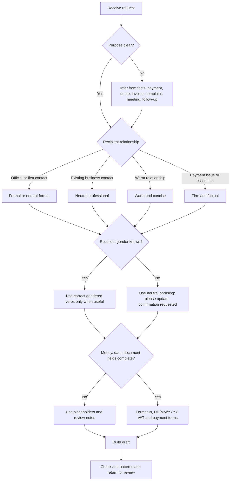

# Hebrew Email Formatter

## Purpose

Create polished Hebrew email drafts that sound natural in Israel, respect the relationship with the recipient, and preserve practical business details. Prefer clear, direct, courteous language over literal translation from English.

Use this skill to draft Hebrew email for:

- clients, suppliers, landlords, accountants, attorneys, public authorities, and customer-service departments;
- payment reminders, quotes, invoice notes, meeting requests, complaint responses, cancellations, apologies, follow-ups, and status updates;
- Israeli formatting such as `1,250 ₪`, `31/12/2026`, `חשבונית מס`, `קבלה`, `עוסק מורשה`, `חברה בע"מ`, and `שוטף + 30`;
- correct greetings, formality levels, gender-aware verbs, neutral phrasing, and business signature blocks.

Do not provide binding legal, accounting, tax, privacy, or consumer-rights advice. Draft factual wording and add review notes when the message touches debt collection, refunds, cancellation rights, privacy, marketing consent, or tax documentation.

## Output contract

Return a ready-to-review draft with:

1. **Subject**: short, searchable, and specific.
2. **Greeting**: matched to recipient and formality.
3. **Opening line**: one sentence of context.
4. **Body**: facts, documents, amounts, dates, and requested action.
5. **Call to action**: clear next step and deadline when needed.
6. **Closing**: polite and consistent with the tone.
7. **Signature**: sender name and relevant business details.
8. **Review notes**: only when a risk, assumption, or missing field matters.

Use Hebrew as the default output language. Keep product names, ticket identifiers, document numbers, and system names unchanged.

## Decision tree



## Formality levels

| Level | Use when | Greeting | Closing | Style |
|---|---|---|---|---|
| `formal` | authority, bank, attorney, official complaint, first contact | `שלום רב,` or `לכבוד [מחלקה],` | `בברכה,` | restrained and precise |
| `neutral` | most clients, suppliers, freelancers, service providers | `שלום [שם],` | `תודה,` or `בברכה,` | direct and professional |
| `warm` | known client, friendly supplier, ongoing project | `היי [שם],` | `תודה רבה,` | friendly and concise |
| `firm` | overdue payment, unresolved complaint, deadline, documentation trail | `שלום [שם],` | `בברכה,` | courteous, factual, documented |

## Greeting rules

Prefer the simplest natural option:

- Known individual: `שלום דנה,`
- Unknown individual: `שלום,`
- Department or official entity: `לכבוד מחלקת שירות לקוחות,`
- Company with no contact person: `שלום רב,`
- Warm existing relationship: `היי נועה,`
- Group: `שלום לכולם,` or `שלום צוות [שם],`

Avoid `מר` and `גברת` unless the user requests a highly formal style.

## Gender-aware phrasing

Use known recipient gender only when a gendered verb is necessary. Prefer neutral phrasing when the recipient is a department, the email may be forwarded, or gender is unknown.

| Intent | Male | Female | Plural | Neutral |
|---|---|---|---|---|
| Request confirmation | `אשמח אם תוכל לאשר` | `אשמח אם תוכלי לאשר` | `אשמח אם תוכלו לאשר` | `אשמח לקבל אישור` |
| Ask to send | `אנא שלח` | `אנא שלחי` | `אנא שלחו` | `אנא להעביר` |
| Ask to update | `תעדכן בבקשה` | `תעדכני בבקשה` | `תעדכנו בבקשה` | `נא לעדכן` |

Avoid slash-heavy phrasing such as `תוכל/י` in polished business email.

## Localization rules

- Currency: write `1,250 ₪`, not `NIS 1,250`, unless the user requests English.
- Dates: write `31/12/2026`.
- VAT: write `כולל מע"מ`, `לא כולל מע"מ`, or `בתוספת מע"מ כדין` only from supplied facts.
- Payment terms: write `שוטף + 30`, `עד 15/07/2026`, or `עם קבלת החשבונית`.
- Documents: use `חשבונית מס`, `קבלה`, `חשבונית מס/קבלה`, `דרישת תשלום`, or `הזמנת עבודה` only when known.
- Business identifiers: use `עוסק מורשה`, `עוסק פטור`, `ח.פ.`, `ח.צ.`, or `עמותה` only when supplied.
- Attachments: write `מצורפת חשבונית` for one confirmed attachment and `מצורפים המסמכים` for multiple confirmed attachments.

## Standard templates

### First payment reminder

**Subject:** `תזכורת לתשלום חשבונית [מספר]`

```text
שלום [שם],

רציתי לוודא שחשבונית [מספר] מיום [DD/MM/YYYY] התקבלה אצלכם.

סכום לתשלום: [סכום] ₪
תאריך פירעון: [DD/MM/YYYY]
תנאי תשלום: [שוטף + 30 / אחר]

אשמח לקבל עדכון לגבי מועד התשלום הצפוי.

תודה,
[חתימה]
```

### Firm payment reminder

**Subject:** `תשלום חשבונית [מספר] – תזכורת`

```text
שלום [שם],

בהמשך לחשבונית [מספר], התשלום בסך [סכום] ₪ טרם התקבל.

תאריך הפירעון היה [DD/MM/YYYY]. נא לעדכן עד [DD/MM/YYYY] לגבי מועד התשלום הצפוי או להעביר אסמכתא אם התשלום כבר בוצע.

בברכה,
[חתימה]
```

### Quote

**Subject:** `הצעת מחיר עבור [שירות/פרויקט]`

```text
שלום [שם],

בהמשך לשיחתנו, מצורפת הצעת מחיר עבור [שירות/פרויקט].

היקף העבודה:
- [פריט 1]
- [פריט 2]

לוחות זמנים: [לוח זמנים]
עלות: [סכום] ₪ [לא כולל מע"מ / כולל מע"מ / בתוספת מע"מ כדין]
תוקף ההצעה: עד [DD/MM/YYYY]

לאישור ההצעה, נא להשיב למייל זה עם אישור כתוב או להעביר הזמנת עבודה.

בברכה,
[חתימה]
```

### Invoice sent

```text
שלום [שם],

מצורפת חשבונית [מספר] עבור [שירות/חודש].

סכום לתשלום: [סכום] ₪
תנאי תשלום: [תנאים]
תאריך פירעון: [DD/MM/YYYY]

אשמח לעדכון אם נדרש פרט נוסף לצורך הטיפול בתשלום.

תודה,
[חתימה]
```

### Consumer complaint

```text
שלום רב,

בתאריך [DD/MM/YYYY] רכשתי או הזמנתי [מוצר/שירות]. לצערי, [תיאור הבעיה בקצרה].

פרטי הפנייה:
- מספר הזמנה או לקוח: [מספר]
- תאריך רכישה או הזמנה: [DD/MM/YYYY]
- סכום העסקה: [סכום] ₪
- תיאור הבעיה: [תיאור מדויק]

אבקש לקבל מענה בכתב עד [DD/MM/YYYY], כולל פתרון מוצע: [החלפה / תיקון / זיכוי / החזר / אחר].

בברכה,
[חתימה]
```

## Edge cases

### Unknown gender

Prefer neutral forms: `אשמח לקבל אישור`, `נא לעדכן`, `אפשר להעביר אליי`.

### Multiple recipients

Use plural verbs only when the email addresses a team. For one named contact with copied recipients, address the named contact in singular.

### Hebrew-English work environment

Keep official product names, identifiers, ticket numbers, invoice numbers, and file names as supplied. Translate surrounding prose only.

### Delicate payment collection

Start soft for a first reminder. Escalate to firm only when the due date passed, reminders were sent, or the user requests a firm tone. Keep the wording factual.

### Israel Invoices review note

As of 03/06/2026, public Tax Authority guidance indicated that Israel Invoices allocation-number relevance begins above 5,000 ₪ before VAT. Treat this as a review note only. Do not request, verify, or generate allocation numbers inside email drafting.

### Accounting ambiguity

When document type or VAT status is missing, do not invent it. Add a visible review note.

```text
[בדיקה נדרשת: האם הסכום כולל מע"מ או בתוספת מע"מ כדין?]
```

### Legal or consumer-rights claims

Draft the facts and requested remedy. Use `אבקש לבדוק את זכאותי` instead of declaring legal entitlement unless approved wording is supplied.

### Shabbat and holidays

Avoid pressuring a response during Shabbat or holidays. Prefer `עד יום העסקים הבא` or `במהלך יום העבודה הקרוב`.

## Anti-patterns

Avoid:

- literal English structures in Hebrew;
- English closings inside Hebrew emails;
- amounts without `₪` and VAT context;
- threats or legal escalation without approved wording;
- vague deadlines such as `בהקדם` when a concrete date is needed;
- slash-heavy gendering;
- unnecessary personal data;
- invented invoice numbers, VAT status, business identifiers, or bank details;
- promotional content inside a transactional email without consent review.

## Production checklist

- [ ] Purpose is clear from the subject.
- [ ] Greeting matches recipient and formality.
- [ ] Names are consistent.
- [ ] Gendered verbs are correct or avoided.
- [ ] Amounts use `₪`.
- [ ] Dates use `DD/MM/YYYY`.
- [ ] VAT status is explicit for prices.
- [ ] Invoice, quote, or order numbers appear when supplied.
- [ ] Call to action is concrete.
- [ ] Deadline is concrete when needed.
- [ ] Tone matches urgency and relationship.
- [ ] Signature contains supplied sender details.
- [ ] Attachments are referenced only when confirmed.
- [ ] Sensitive data is minimized.
- [ ] No legal or tax conclusion is invented.

## Reference files

- `references/api-reference.md` contains schemas, validation codes, and Israeli context references.
- `references/workflow-guide.md` contains end-to-end workflows.
- `references/troubleshooting.md` contains detailed fixes.
- `references/test-scenarios.md` contains validation scenarios.
- `references/migration-checklist.md` contains migration steps.
- `references/branding-audit.md` records the neutral-package audit.
- `references/hebrew-qa-log.md` records language and localization changes.
