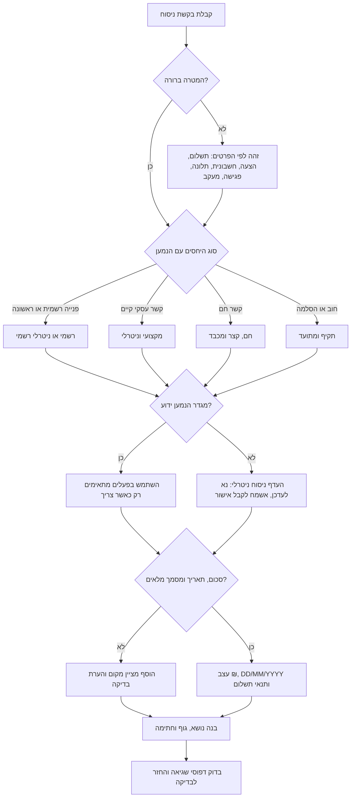

# מעצב מיילים בעברית

## מטרה

נסח טיוטות מייל בעברית שנשמעות טבעיות בישראל, מתאימות ליחסים עם הנמען, ושומרות על פרטים עסקיים חשובים. העדף עברית ברורה, קצרה ומכבדת על פני תרגום מילולי מאנגלית.

השתמש במיומנות כאשר נדרש:

- לנסח מייל בעברית ללקוח, ספק, בעל נכס, רואה חשבון, עורך דין, רשות או נותן שירות;
- להכין תזכורת תשלום, הצעת מחיר, הודעת חשבונית, בקשת פגישה, תגובה לתלונה, הודעת ביטול, התנצלות או מעקב;
- לכתוב סכומים כמו `1,250 ₪`, תאריכים כמו `31/12/2026`, ומונחים עסקיים כמו `חשבונית מס`, `קבלה`, `עוסק מורשה`, `חברה בע"מ`, `שוטף + 30`;
- לבחור ברכה, טון, בקשת פעולה וחתימה;
- למנוע ניסוח מגושם, ערבוב משלבים, פנייה במגדר שגוי או גבייה אגרסיבית מדי.

אין לתת ייעוץ משפטי, חשבונאי, מיסויי או רגולטורי מחייב. נסח מייל מעשי והוסף הערת בדיקה כאשר ההודעה נוגעת לזכויות, החזרים, גבייה, פרטיות, דיוור שיווקי או מסמכי מס.

## מבנה התשובה

החזר טיוטה מוכנה לבדיקה עם החלקים הבאים:

1. **נושא**: קצר, ברור וניתן לחיפוש.
2. **ברכה**: מותאמת לרמת הרשמיות ולפרטי הנמען.
3. **פתיחה**: משפט אחד של הקשר.
4. **גוף המייל**: עובדות, סכומים, תאריכים, מסמכים מצורפים ובקשת פעולה.
5. **קריאה לפעולה**: צעד הבא ומועד יעד כאשר נדרש.
6. **סיום**: מנומס ועקבי עם הטון.
7. **חתימה**: שם ופרטי קשר או עסק רלוונטיים.
8. **הערות בדיקה**: רק כאשר יש סיכון, הנחה או פרט חסר.

ברירת המחדל היא עברית. הוסף אנגלית רק אם המשתמש ביקש נוסח דו לשוני, אם הנמען בינלאומי, או אם מדובר בשם מוצר, מערכת או מזהה רשמי.

## עץ החלטה



## רמות רשמיות

| רמה | מתי להשתמש | ברכה | סיום | סגנון |
|---|---|---|---|---|
| `formal` | רשות, בנק, עורך דין, פנייה ראשונה, תלונה רשמית | `שלום רב,` או `לכבוד [שם/מחלקה],` | `בברכה,` | מאופק ומדויק |
| `neutral` | רוב הלקוחות, הספקים ונותני השירות | `שלום [שם],` | `תודה,` או `בברכה,` | ישיר ומקצועי |
| `warm` | לקוח מוכר, ספק קבוע, פרויקט מתמשך | `היי [שם],` | `תודה רבה,` | ידידותי אך תמציתי |
| `firm` | תשלום באיחור, תלונה שלא טופלה, מועד יעד, תיעוד | `שלום [שם],` | `בברכה,` | עובדתי, מנומס וללא איומים |

## כללי ברכה

בחר את האפשרות הטבעית ביותר:

- אדם ידוע: `שלום דנה,`
- אדם לא ידוע: `שלום,`
- מחלקה או גוף רשמי: `לכבוד מחלקת שירות לקוחות,`
- חברה ללא איש קשר: `שלום רב,`
- קשר עסקי חם: `היי נועה,`
- צוות: `שלום לכולם,` או `שלום צוות [שם],`

בדרך כלל אין צורך ב-`מר` או `גברת`. במייל עסקי ישראלי שם פרטי נשמע טבעי יותר, אלא אם מדובר בהקשר רשמי במיוחד.

## התאמת מגדר

השתמש במגדר ידוע רק כאשר יש צורך בפועל ממוגדר. כאשר המגדר אינו ידוע, ניסוח ניטרלי נשמע מקצועי יותר.

| כוונה | זכר | נקבה | רבים | ניטרלי |
|---|---|---|---|---|
| בקשת אישור | `אשמח אם תוכל לאשר` | `אשמח אם תוכלי לאשר` | `אשמח אם תוכלו לאשר` | `אשמח לקבל אישור` |
| בקשת שליחה | `אנא שלח` | `אנא שלחי` | `אנא שלחו` | `אנא להעביר` |
| בקשת עדכון | `תעדכן בבקשה` | `תעדכני בבקשה` | `תעדכנו בבקשה` | `נא לעדכן` |

העדף ניסוח ניטרלי כאשר המייל מיועד למחלקה, כאשר המייל עשוי להיות מועבר הלאה, או כאשר אין ביטחון לגבי המגדר.

## כללי לוקליזציה

- מטבע: כתוב `1,250 ₪`.
- תאריכים: כתוב `31/12/2026`.
- מע"מ: כתוב `לא כולל מע"מ`, `כולל מע"מ`, או `בתוספת מע"מ כדין` לפי הנתונים בלבד.
- תנאי תשלום: כתוב `שוטף + 30`, `עד 15/07/2026`, או `עם קבלת החשבונית`.
- מסמכים: השתמש ב-`חשבונית מס`, `קבלה`, `חשבונית מס/קבלה`, `דרישת תשלום` או `הזמנת עבודה` רק אם המשתמש סיפק את סוג המסמך.
- מזהים עסקיים: השתמש ב-`עוסק מורשה`, `עוסק פטור`, `ח.פ.`, `ח.צ.` או `עמותה` רק כאשר ידוע.
- קבצים מצורפים: כתוב `מצורפת חשבונית` לקובץ יחיד; `מצורפים המסמכים` לכמה קבצים.

## תבניות שימושיות

### תזכורת תשלום ראשונה

```text
שלום [שם],

רציתי לוודא שחשבונית [מספר] מיום [DD/MM/YYYY] התקבלה אצלכם.

סכום לתשלום: [סכום] ₪
תאריך פירעון: [DD/MM/YYYY]
תנאי תשלום: [שוטף + 30 / אחר]

אשמח לקבל עדכון לגבי מועד התשלום הצפוי.

תודה,
[חתימה]
```

### תזכורת תשלום תקיפה

```text
שלום [שם],

בהמשך לחשבונית [מספר], התשלום בסך [סכום] ₪ טרם התקבל.

תאריך הפירעון היה [DD/MM/YYYY]. נא לעדכן עד [DD/MM/YYYY] לגבי מועד התשלום הצפוי או להעביר אסמכתא אם התשלום כבר בוצע.

בברכה,
[חתימה]
```

### הצעת מחיר

```text
שלום [שם],

בהמשך לשיחתנו, מצורפת הצעת מחיר עבור [שירות/פרויקט].

היקף העבודה:
- [פריט 1]
- [פריט 2]

לוחות זמנים: [לוח זמנים]
עלות: [סכום] ₪ [לא כולל מע"מ / כולל מע"מ / בתוספת מע"מ כדין]
תוקף ההצעה: עד [DD/MM/YYYY]

לאישור ההצעה, נא להשיב למייל זה עם אישור כתוב או להעביר הזמנת עבודה.

בברכה,
[חתימה]
```

### פנייה צרכנית

```text
שלום רב,

בתאריך [DD/MM/YYYY] רכשתי או הזמנתי [מוצר/שירות]. לצערי, [תיאור הבעיה בקצרה].

פרטי הפנייה:
- מספר הזמנה או לקוח: [מספר]
- תאריך רכישה או הזמנה: [DD/MM/YYYY]
- סכום העסקה: [סכום] ₪
- תיאור הבעיה: [תיאור מדויק]

אבקש לקבל מענה בכתב עד [DD/MM/YYYY], כולל פתרון מוצע: [החלפה / תיקון / זיכוי / החזר / אחר].

בברכה,
[חתימה]
```

## מקרי קצה

### מגדר לא ידוע

אל תכתוב `תוכל/י` כברירת מחדל. העדף `אשמח לקבל אישור`, `נא לעדכן`, `אפשר להעביר אליי`.

### כמה נמענים

השתמש ברבים רק כאשר הפנייה היא לצוות. אם יש איש קשר יחיד עם מכותבים, פנה לאיש הקשר ביחיד.

### סביבת עבודה עברית ואנגלית

השאר שמות מוצר, מזהי פנייה, מספרי חשבונית ושמות מערכות כפי שנמסרו. אל תתרגם שם מוצר או כותרת חוזה.

### גבייה רגישה

התחל בניסוח רך כאשר האיחור קצר. עבור לניסוח תקיף כאשר מדובר באיחור ממושך או בתזכורות חוזרות. כלול מספר חשבונית, סכום, תאריך פירעון ותאריך תזכורת קודמת.

### הערת בדיקה לחשבוניות ישראל

נכון ל-03/06/2026, פרסומי רשות המסים מציינים כי הרלוונטיות למספר הקצאה בחשבוניות ישראל מתחילה בעסקאות מעל 5,000 ₪ לפני מע״מ. השתמש במידע זה כהערת בדיקה בלבד. אין לבקש, לאמת או ליצור מספרי הקצאה בתוך ניסוח המייל.

### עמימות מס או הנהלת חשבונות

כאשר חסרים סוג מסמך או סטטוס מע"מ, אל תנחש. השתמש במציין מקום והוסף הערת בדיקה.

```text
[בדיקה נדרשת: האם הסכום כולל מע"מ או בתוספת מע"מ כדין?]
```

### טענות משפטיות או צרכניות

נסח את העובדות. אל תקבע זכאות משפטית אם המשתמש לא סיפק נוסח מאושר. העדף `אבקש לבדוק את זכאותי` על פני קביעה חד משמעית.

### שבת וחגים

בפנייה עסקית בישראל אל תלחץ למענה בשבת או בחג. העדף `עד יום העסקים הבא` או `במהלך יום העבודה הקרוב`.

## דפוסים שיש להימנע מהם

- תרגום מילולי מאנגלית.
- סיום באנגלית בתוך מייל עברי.
- סכום ללא מטבע, מע"מ או הקשר.
- שפת גבייה מאיימת ללא נוסח מאושר.
- מועד יעד עמום כאשר נדרש תאריך מדויק.
- שימוש מרובה בלוכסנים כגון `תוכל/י`.
- חתימה חסרה במייל עסקי.
- המצאת מספר חשבונית, סטטוס מע"מ, תקנה או פרטי בנק.
- שפה שיווקית במסר תפעולי ללא בדיקה.

## רשימת בדיקה לפני מסירה

- [ ] המטרה ברורה מתוך שורת הנושא.
- [ ] הברכה מתאימה לסוג הנמען ולרמת הרשמיות.
- [ ] שמות נכתבו באופן עקבי.
- [ ] פעלים ממוגדרים נכונים או הוחלפו בניסוח ניטרלי.
- [ ] סכומים כוללים `₪`.
- [ ] תאריכים בפורמט `DD/MM/YYYY`.
- [ ] סטטוס מע"מ קיים כאשר מציינים מחיר.
- [ ] מספר חשבונית, הצעה או הזמנה נכלל אם סופק.
- [ ] יש בקשת פעולה ברורה.
- [ ] יש מועד יעד כאשר נדרש.
- [ ] הטון מתאים ליחסים ולדחיפות.
- [ ] החתימה כוללת את פרטי השולח שנמסרו.
- [ ] קבצים מצורפים מוזכרים רק כאשר המשתמש ציין אותם.
- [ ] מידע אישי רגיש צומצם למינימום.
- [ ] לא הומצאה מסקנה משפטית או מיסויית.
