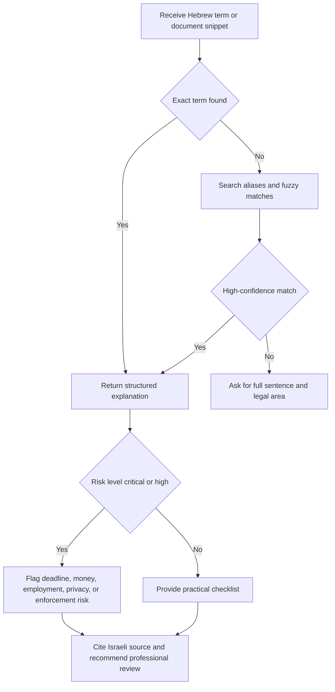
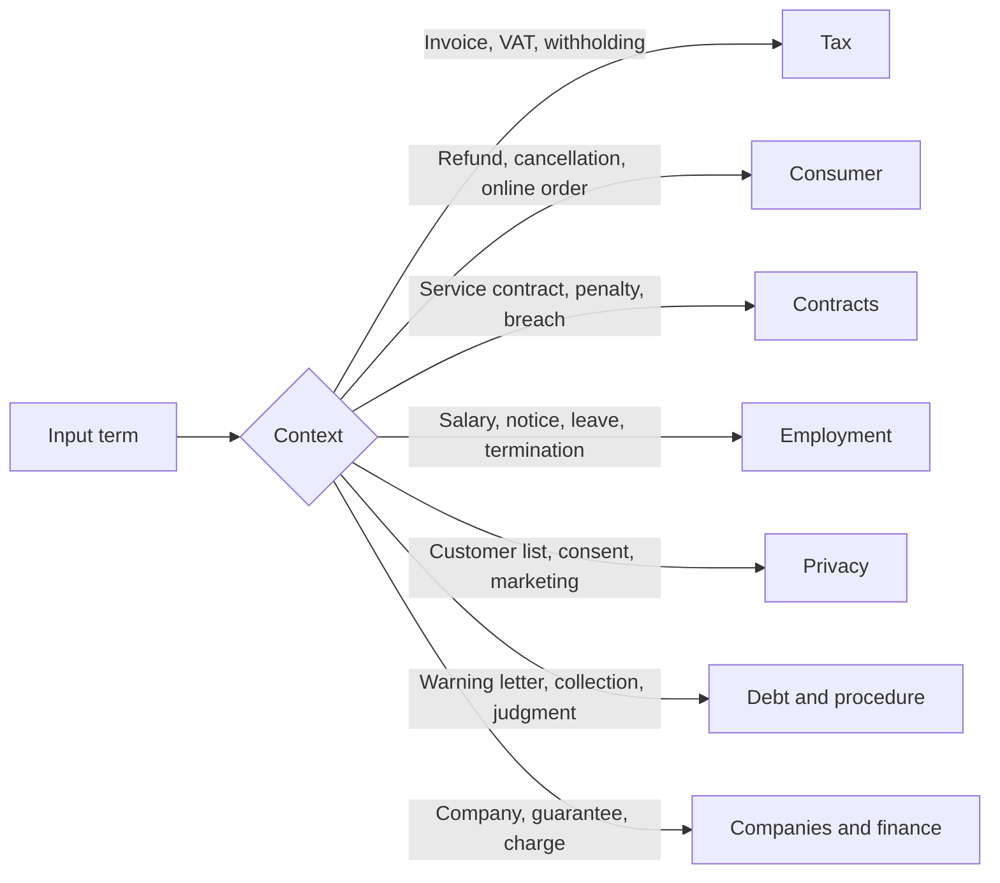

# Hebrew Legal-Term Translator

## Purpose

Explain Israeli Hebrew legal and regulatory terms in plain English for people who do not read Hebrew fluently. Focus on practical situations faced by small businesses, freelancers, and consumers in Israel: invoices, VAT status, service agreements, cancellation rights, payroll terms, privacy notices, debt warnings, small claims, limited companies, guarantees, and security interests.

Return structured explanations with:

- Hebrew term and English meaning.
- Plain-language explanation.
- Risk level.
- Practical context for business, consumer, or freelancer use.
- Questions to ask before action.
- Citations to Israeli law, courts, regulators, or official government sources.

Do not present the output as legal advice. Direct the user to verify the current consolidated Hebrew source and seek qualified professional advice for deadlines, money exposure, litigation, employment termination, tax filings, privacy incidents, or enforcement proceedings.

## Core workflow

1. Identify the exact Hebrew term.
2. Normalize punctuation, gershayim, niqqud, and spelling variants.
3. Match the term against the local glossary.
4. Detect the legal area: tax, consumer, contracts, employment, privacy, civil, debt, procedure, companies, or finance.
5. Explain the term in plain language.
6. Flag risk level and missing facts.
7. Cite Israeli sources.
8. Suggest safe next questions.

## Decision tree



## Context routing



## Concrete examples

### Example 1: Small business invoice

Input: `חשבונית מס`

Output focus:

- Meaning: VAT tax invoice.
- Risk: medium.
- Check: supplier name, VAT registration, invoice number, date, VAT amount, transaction description.
- Source: Value Added Tax Law, Israel Tax Authority.

Use when a bookkeeper asks whether a document supports input VAT deduction. Do not treat every invoice-like document as a valid VAT invoice.

### Example 2: Freelancer VAT status

Input: `עוסק פטור`

Output focus:

- Meaning: VAT-exempt dealer.
- Risk: high.
- Check: annual turnover, occupation type, VAT registration confirmation, whether the supplier charged VAT.
- Source: Value Added Tax Law, Israel Tax Authority.

Flag that exempt VAT status does not mean exemption from income tax or National Insurance duties.

### Example 3: Online purchase cancellation

Input: `עסקת מכר מרחוק`

Output focus:

- Meaning: distance sale transaction.
- Risk: medium.
- Check: order date, disclosure page, delivery date, product or service type, price in ₪, cancellation request date.
- Source: Consumer Protection Law and Consumer Protection and Fair Trade Authority.

### Example 4: Service agreement penalty

Input: `פיצוי מוסכם`

Output focus:

- Meaning: agreed compensation clause.
- Risk: high.
- Check: clause wording, breach type, contract value, actual damage, proportionality.
- Source: Contracts Remedies Law.

### Example 5: Debt notice

Input: `התראה לפני נקיטת הליכים`

Output focus:

- Meaning: pre-action warning notice.
- Risk: high.
- Check: notice date, deadline, claimed amount in ₪, creditor identity, invoice or judgment, delivery proof.
- Source: Enforcement and Collection Authority, Contracts Law.

## Edge cases

### Mixed invoice documents

A document titled `חשבונית עסקה` may not be a `חשבונית מס`. Explain that a pro forma or demand document does not necessarily support VAT deduction. Ask for the exact title, VAT number, invoice number, and payment status.

### English contract with Hebrew statutory term

A clause may say "liquidated damages" while an annex says `פיצוי מוסכם`. Link both terms and explain that Israeli contract law may still matter when the governing law, forum, performance location, or parties connect to Israel.

### Consumer acting through a business

A person may buy through a company, partnership, or sole proprietorship. Do not assume consumer rights apply. Ask who purchased, why, and which entity appears on the invoice.

### Contractor misclassified as employee

A freelancer clause may mention `הודעה מוקדמת` or `פיצויי פיטורים`. Flag classification risk. Ask for control, exclusivity, tools, economic dependence, invoices, payslips, and work pattern.

### Privacy spreadsheet

A customer spreadsheet may be a `מאגר מידע`. Do not dismiss it because the file is small. Ask what personal data appears, who accesses it, where it is stored, and whether marketing use occurs.

### Enforcement notice with disputed debt

A debtor may dispute the invoice yet still face a deadline. Flag urgent deadline review. Ask for case number, warning date, service method, claimed amount in ₪, and supporting document.

## Anti-patterns

- Do not translate literally without explaining the Israeli legal effect.
- Do not infer a legal deadline from memory when the current source is not verified.
- Do not say that a VAT-exempt dealer is exempt from all taxes.
- Do not treat a receipt as a VAT invoice.
- Do not tell a user to ignore an enforcement warning because the debt is disputed.
- Do not classify a worker as a freelancer based only on the contract title.
- Do not treat every harsh consumer term as automatically void.
- Do not rely on outdated minimum wage amounts, VAT thresholds, court filing limits, or privacy registration rules.
- Do not omit citations when explaining a legal term.
- Do not advise signing a personal guarantee without amount, expiry, notice, and release checks.

## Troubleshooting

| Symptom | Likely cause | Corrective action |
| --- | --- | --- |
| No match found | Term is misspelled, abbreviated, or embedded in a long sentence | Run `explain-text`, provide the full clause, or search by area. |
| Wrong area returned | Same word appears in several legal contexts | Add `context` or use an area-filtered search. |
| Hebrew punctuation blocks lookup | Gershayim, geresh, or niqqud differs | Normalize with `normalize_text` or search by alias. |
| Outdated threshold risk | Law or regulator threshold may have changed | Verify current official source before using a number. |
| User asks for legal conclusion | Term explanation is not enough | Provide information, missing facts, citations, and professional-review trigger. |

## Current-value checks verified on 03/06/2026

- Standard VAT rate: 18% from 01/01/2025. Re-check the Tax Authority before final accounting treatment.
- VAT-exempt dealer turnover ceiling for 2026: ₪122,833. Re-check before advising registration status.
- General minimum wage from 01/04/2026: ₪6,443.85 monthly and ₪34.64 hourly for the cited National Insurance calculation. Re-check sector-specific orders separately.
- Consumer cancellation fee reference: up to 5% of the transaction or ₪100, whichever is lower, subject to exceptions.
- Small-claims filing fee reference: 1% of the claim amount, minimum ₪50.

## Production checklist

Before using an output in a business, consumer, or legal process:

- Confirm the exact Hebrew term from the original document.
- Preserve the original file, screenshot, email, or notice.
- Record the date in DD/MM/YYYY format.
- Record all amounts in ₪.
- Check the cited law or regulator page in Hebrew.
- Check whether the user acts as consumer, business, freelancer, employee, company, guarantor, debtor, or creditor.
- Identify deadlines and delivery dates.
- Separate legal meaning from business negotiation advice.
- Escalate high and critical risk results to a qualified professional.
- Keep source citations with the translated explanation.

## CLI usage

```bash
hebrew-legal-term-translator lookup "ניכוי מס במקור" --json --env sandbox
hebrew-legal-term-translator search "online refund" --area consumer --json
hebrew-legal-term-translator explain-text "החוזה כולל פיצוי מוסכם והפרה יסודית" --json
```

## Python usage

```python
from hebrew_legal_term_translator import HebrewLegalTermTranslator

translator = HebrewLegalTermTranslator()
result = translator.explain("ערבות אישית", context="business")
print(result.to_json())
```

## Source policy

Prefer official Israeli sources:

- National Legislation Database for laws.
- Official Gazette for current publications.
- Israel Tax Authority for VAT, income tax, and withholding guidance.
- Consumer Protection and Fair Trade Authority for consumer guidance.
- Privacy Protection Authority for privacy guidance.
- Israel Courts Authority for court procedure.
- Enforcement and Collection Authority for enforcement proceedings.

Use non-official sources only as secondary reading, never as the citation anchor.
