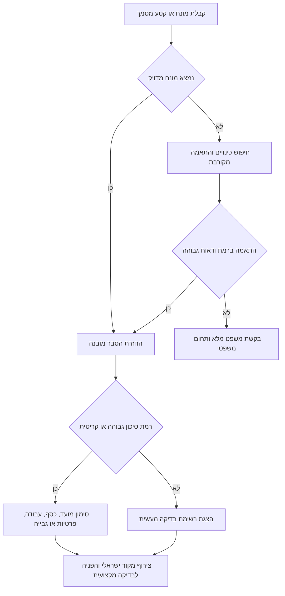
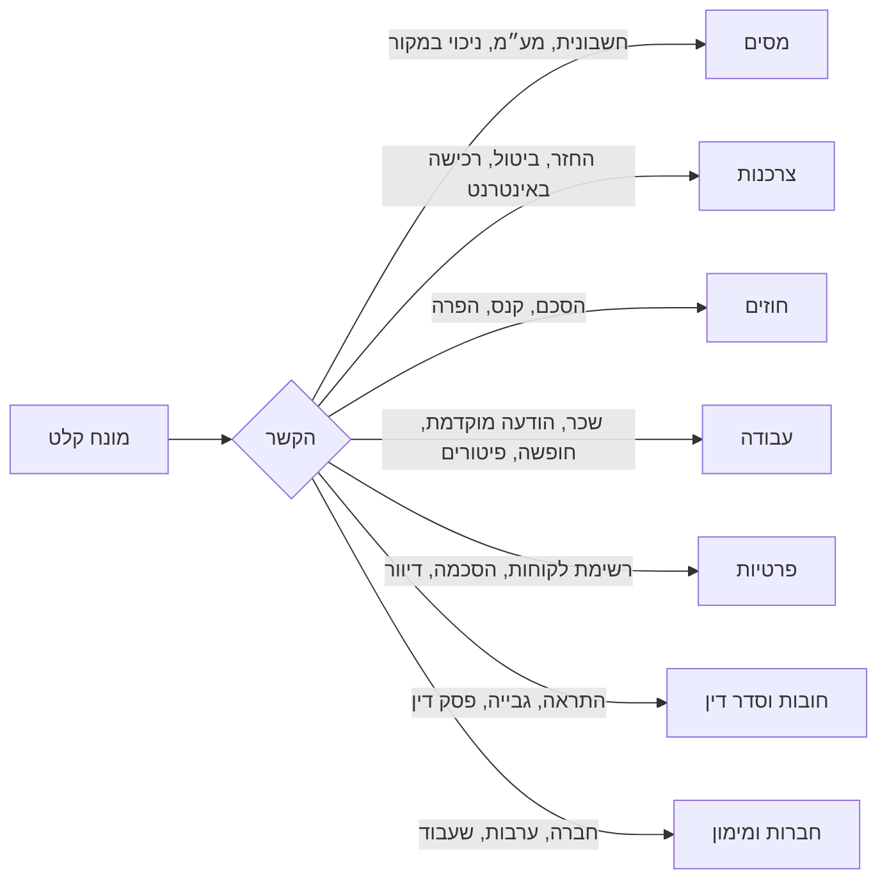

# מתרגם מונחים משפטיים בעברית

## מטרה

הסבר מונחים משפטיים ורגולטוריים בעברית ישראלית בשפה פשוטה לדוברי שפות אחרות, לעסקים קטנים, לעצמאים ולצרכנים. התמקד במצבים מעשיים בישראל: חשבוניות, מע״מ, מעמד עוסק, הסכמי שירות, ביטול עסקה, שכר, פרטיות, התראות חוב, תביעות קטנות, חברות בע״מ, ערבויות ושעבודים.

החזר תשובה מובנית הכוללת:

- המונח בעברית והתרגום לאנגלית.
- הסבר פשוט.
- רמת סיכון.
- הקשר מעשי לעסק, לצרכן או לעצמאי.
- שאלות בדיקה לפני פעולה.
- הפניות למקורות דין, בתי משפט, רשויות או אתרי ממשלה בישראל.

אל תציג את התשובה כייעוץ משפטי. הפנה לאימות המקור העדכני בעברית ולבדיקה מקצועית כאשר קיימים מועדים, חשיפה כספית, פיטורים, מס, פרטיות, תביעה או הליכי גבייה.

## תהליך עבודה בסיסי

1. זהה את המונח המדויק בעברית.
2. נרמל גרשיים, גרש, ניקוד, מקפים ווריאציות כתיב.
3. התאם את המונח למילון המקומי.
4. זהה תחום: מסים, צרכנות, חוזים, עבודה, פרטיות, אזרחי, חובות, סדר דין, חברות או מימון.
5. הסבר את המשמעות בשפה פשוטה.
6. סמן רמת סיכון ועובדות חסרות.
7. צרף מקור ישראלי.
8. הצע שאלות המשך בטוחות.

## עץ החלטה



## ניתוב לפי הקשר



## דוגמאות מעשיות

### דוגמה 1: חשבונית לעסק קטן

קלט: `חשבונית מס`

מוקד התשובה:

- משמעות: מסמך מס לעסקה חייבת במע״מ.
- סיכון: בינוני.
- בדוק: שם הספק, מספר עוסק, מספר חשבונית, תאריך, סכום המע״מ ותיאור העסקה.
- מקור: חוק מס ערך מוסף ורשות המסים בישראל.

אל תתייחס לכל מסמך דמוי חשבונית כמסמך שמאפשר ניכוי מס תשומות.

### דוגמה 2: מעמד עצמאי

קלט: `עוסק פטור`

מוקד התשובה:

- משמעות: מעמד לעניין מע״מ לעסק קטן.
- סיכון: גבוה.
- בדוק: מחזור שנתי, סוג העיסוק, אישור רישום במע״מ והאם נגבה מע״מ.
- מקור: חוק מס ערך מוסף ורשות המסים בישראל.

הדגש כי עוסק פטור ממע״מ אינו פטור ממס הכנסה או מביטוח לאומי.

### דוגמה 3: ביטול רכישה באינטרנט

קלט: `עסקת מכר מרחוק`

מוקד התשובה:

- משמעות: עסקה צרכנית ללא נוכחות פיזית משותפת.
- סיכון: בינוני.
- בדוק: תאריך הזמנה, תאריך אספקה, סוג מוצר או שירות, מחיר ב-₪ ומועד בקשת הביטול.
- מקור: חוק הגנת הצרכן והרשות להגנת הצרכן ולסחר הוגן.

### דוגמה 4: סעיף פיצוי בהסכם

קלט: `פיצוי מוסכם`

מוקד התשובה:

- משמעות: סכום שנקבע מראש כפיצוי על הפרה.
- סיכון: גבוה.
- בדוק: נוסח הסעיף, סוג ההפרה, שווי ההסכם, נזק בפועל ויחס סביר בין הסכום לסיכון.
- מקור: חוק החוזים (תרופות בשל הפרת חוזה).

### דוגמה 5: התראה על חוב

קלט: `התראה לפני נקיטת הליכים`

מוקד התשובה:

- משמעות: אזהרה לפני פתיחה בהליך משפטי או גבייה.
- סיכון: גבוה.
- בדוק: תאריך ההתראה, מועד אחרון לתגובה, סכום ב-₪, זהות הנושה, חשבונית או פסק דין ואישור מסירה.
- מקור: רשות האכיפה והגבייה וחוק החוזים.

## מקרי קצה

### מסמכי חשבונית מעורבים

מסמך בשם `חשבונית עסקה` אינו בהכרח `חשבונית מס`. הסבר כי מסמך דרישת תשלום או מסמך מקדמי אינו בהכרח מאפשר ניכוי מע״מ. בקש כותרת מדויקת, מספר עוסק, מספר חשבונית וסטטוס תשלום.

### חוזה באנגלית עם מונח עברי

סעיף באנגלית עשוי להזכיר פיצוי מוסכם גם כאשר הנספח בעברית. קשר בין המונחים ובדוק דין חל, מקום ביצוע, זהות הצדדים ותניית שיפוט.

### צרכן שרוכש דרך עסק

אדם עשוי לרכוש באמצעות חברה, שותפות או עוסק. אל תניח שדיני צרכנות חלים. שאל מי רכש, לאיזו מטרה ועל שם מי הופקה החשבונית.

### עצמאי שעלול להיחשב עובד

סעיף של עצמאי עשוי להזכיר `הודעה מוקדמת` או `פיצויי פיטורים`. סמן סיכון סיווג. בקש נתונים על פיקוח, בלעדיות, ציוד, תלות כלכלית, חשבוניות, תלושי שכר ודפוס עבודה.

### גיליון לקוחות

קובץ לקוחות עשוי להיות `מאגר מידע`. אל תבטל את הסיכון בגלל גודל הקובץ. בדוק איזה מידע אישי נשמר, מי ניגש אליו, היכן הוא מאוחסן והאם נעשה בו שימוש לשיווק.

### התראה על חוב שנוי במחלוקת

חייב עשוי לחלוק על החשבונית ועדיין לעמוד מול מועד תגובה. סמן דחיפות. בקש מספר תיק, תאריך אזהרה, אופן מסירה, סכום ב-₪ ומסמך תומך.

## תבניות לא תקינות

- אל תתרגם מילולית בלי להסביר את המשמעות בישראל.
- אל תסיק מועד משפטי מזיכרון בלי לאמת מקור עדכני.
- אל תכתוב שעוסק פטור פטור מכל מס.
- אל תתייחס לקבלה כאל חשבונית מס.
- אל תמליץ להתעלם מאזהרת הוצאה לפועל משום שהחוב שנוי במחלוקת.
- אל תסווג עובד כעצמאי רק לפי כותרת ההסכם.
- אל תציג כל תנאי קשה בחוזה צרכני כתנאי שבטל אוטומטית.
- אל תסתמך על סכומי שכר מינימום, תקרות מע״מ, מגבלות תביעה או כללי פרטיות שאינם עדכניים.
- אל תשמיט מקור כאשר מוסבר מונח משפטי.
- אל תמליץ לחתום על ערבות אישית בלי תקרה, מועד סיום, חובת הודעה ותנאי שחרור.

## פתרון תקלות

| סימן | סיבה סבירה | פעולה מתקנת |
| --- | --- | --- |
| לא נמצאה התאמה | שגיאת כתיב, קיצור או מונח בתוך משפט ארוך | השתמש ב-`explain-text`, ספק משפט מלא או חפש לפי תחום. |
| התקבל תחום שגוי | אותו ביטוי מופיע בכמה הקשרים | הוסף הקשר או השתמש בסינון לפי תחום. |
| סימני פיסוק בעברית פוגעים בזיהוי | גרשיים, גרש או ניקוד שונים | נרמל בעזרת `normalize_text` או חפש לפי כינוי. |
| קיים סיכון לסכום מיושן | סכום או תקרה עשויים להשתנות | אמת מקור רשמי עדכני לפני שימוש במספר. |
| המשתמש מבקש מסקנה משפטית | הסבר מונח אינו מספיק | הצג מידע, עובדות חסרות, מקורות וסימן לבדיקה מקצועית. |

## רשימת בדיקה לשימוש מעשי

לפני שימוש בתוצאה בתהליך עסקי, צרכני או משפטי:

- אמת את המונח המדויק במסמך המקורי.
- שמור את הקובץ, צילום המסך, הדוא״ל או ההתראה.
- רשום תאריך בפורמט DD/MM/YYYY, למשל 03/06/2026.
- רשום סכומים ב-₪, למשל ₪4,200.
- בדוק את החוק או דף הרשות בעברית.
- זהה אם המשתמש פועל כצרכן, עסק, עצמאי, עובד, חברה, ערב, חייב או נושה.
- אתר מועדים ותאריכי מסירה.
- הפרד בין משמעות משפטית לבין משא ומתן עסקי.
- העבר תוצאה ברמת סיכון גבוהה או קריטית לבדיקה מקצועית.
- שמור את ההפניות למקורות יחד עם ההסבר המתורגם.

## שימוש בשורת פקודה

```bash
hebrew-legal-term-translator lookup "ניכוי מס במקור" --json --env sandbox
hebrew-legal-term-translator search "online refund" --area consumer --json
hebrew-legal-term-translator explain-text "החוזה כולל פיצוי מוסכם והפרה יסודית" --json
```

## שימוש בפייתון

```python
from hebrew_legal_term_translator import HebrewLegalTermTranslator

translator = HebrewLegalTermTranslator()
result = translator.explain("ערבות אישית", context="business")
print(result.to_json())
```

## מדיניות מקורות

העדף מקורות רשמיים בישראל:

- מאגר החקיקה הלאומי לחוקים.
- רשומות לפרסומים רשמיים.
- רשות המסים בישראל להנחיות מס, מע״מ וניכוי במקור.
- הרשות להגנת הצרכן ולסחר הוגן להנחיות צרכניות.
- הרשות להגנת הפרטיות להנחיות פרטיות.
- הרשות השופטת לסדרי דין.
- רשות האכיפה והגבייה להליכי גבייה.

השתמש במקורות שאינם רשמיים רק לקריאה משלימה, לא כעוגן ציטוט.
