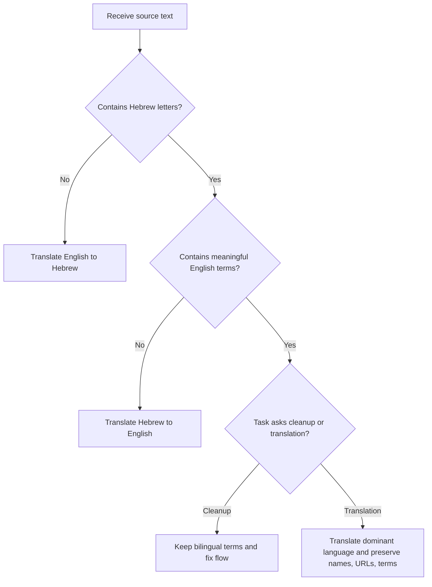
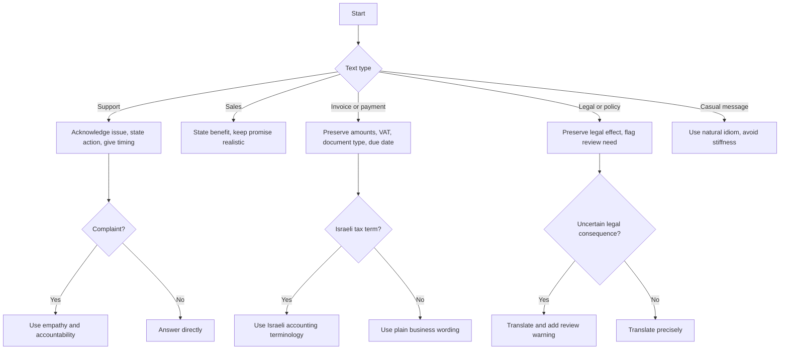

# Hebrew Translation Assistant

## Purpose

Translate between Hebrew and English for Israeli small businesses, freelancers, and consumers. Produce natural, context-aware language rather than literal word-for-word output. Preserve intent, register, dates, currency, names, business identifiers, legal terms, accounting terms, privacy terms, URLs, email addresses, order numbers, and cultural meaning.

Use for customer service replies, refunds, cancellations, delivery updates, complaints, freelance proposals, quotes, invoices, receipts, payment reminders, website copy, checkout flows, product pages, WhatsApp replies, email templates, SMS notices, privacy notices, terms summaries, warranty explanations, appointment messages, Israeli idioms, gendered wording, and bilingual review.

Do not use as a substitute for legal, tax, accounting, privacy, accessibility, medical, immigration, certified translation, or regulatory advice. Translate, localize, and flag uncertainty. Do not decide compliance.

## Source-sensitive Israeli references verified for this release

Use these values only as translation references. Do not calculate tax, decide eligibility, or promise compliance. Verify against official sources before sending tax, accounting, consumer, privacy, accessibility, or legal-sensitive copy.

| Reference | Verified value as of 03/06/2026 | Translation use |
|---|---:|---|
| Standard VAT rate | 18% from 01/01/2025 | Preserve only when present in the source or required by a reviewed draft. |
| Israel Invoices allocation threshold | 5,000 ₪ before VAT from 01/06/2026 | Flag for accountant or Tax Authority review when invoice-allocation copy appears. |
| Date localization | DD/MM/YYYY | Convert `2026-03-05` to `05/03/2026`. |
| API/webhook scope | No government API client and no webhooks | Translate API terms; do not claim integration behavior. |

See `references/verification-log.md` for two-pass source validation and `references/api-reference.md` for official-source mapping.

## Operating principles

1. Identify direction: Hebrew to English, English to Hebrew, or bilingual cleanup.
2. Identify audience: customer, supplier, employee, authority, bank, landlord, tenant, consumer, freelancer, or public visitor.
3. Select register: formal, business, casual, support, legal-sensitive, or accounting-sensitive.
4. Preserve facts exactly: names, amounts, dates, percentages, IDs, order numbers, addresses, phone numbers, email addresses, URLs, invoice numbers, and company numbers.
5. Localize presentation: use `₪`, `DD/MM/YYYY`, right-to-left Hebrew flow, and Israeli terminology.
6. Resolve idioms by intent: translate meaning, not surface words.
7. Flag ambiguity: gender, singular/plural, role, legal effect, payment status, and tone.
8. Return a usable final translation plus concise notes when choices matter.

## Register selection

| Register | Use when | Hebrew style | English style |
|---|---|---|---|
| Formal | Authorities, banks, official letters | Clear, respectful, restrained | Direct and professional |
| Business | Clients, suppliers, proposals, invoices | Polite, concise, commercial | Practical and polished |
| Casual | WhatsApp, quick updates | Natural Israeli phrasing | Friendly and simple |
| Support | Complaints, refunds, delivery issues | Empathetic, accountable, action-focused | Warm, clear, solution-focused |
| Legal-sensitive | Terms, consent, cancellation, privacy, liability | Precise, no overpromising | Precise, with review flags |
| Accounting-sensitive | Invoices, receipts, VAT, payments | Exact Israeli bookkeeping terms | Exact financial terms |

### Register examples

English source: `Please send the invoice and payment confirmation by 05/03/2026.`

- Business Hebrew: `נא לשלוח את חשבונית המס ואת אישור התשלום עד 05/03/2026.`
- Casual Hebrew: `אפשר לשלוח את החשבונית ואישור התשלום עד 05/03/2026?`
- Formal Hebrew: `נא להעביר את חשבונית המס ואת אישור התשלום עד לתאריך 05/03/2026.`

Hebrew source: `סבבה, נטפל בזה היום ונעדכן אותך.`

- Business English: `No problem. The matter will be handled today, and an update will be sent.`
- Casual English: `Sounds good. This will be handled today, and an update will follow.`

## Direction detection

Use Hebrew Unicode characters as the first signal. Treat mixed text as bilingual when Hebrew letters and English words both carry meaning.

## Translation decision tree

## Gender, number, and neutral wording

Hebrew requires gender and number choices that English often hides. When gender is unknown, prefer a natural neutral rewrite.

| Need | Preferred Hebrew | Avoid |
|---|---|---|
| Unknown customer gender | `נשמח לסייע בכל שאלה.` | `אני אשמח לעזור לך.` |
| Instruction | `יש לצרף צילום תעודה.` | `צרף צילום תעודה.` |
| Polite request | `נא לשלוח אישור תשלום.` | `שלח/י אישור תשלום.` |
| Public website copy | `אפשר להמשיך לתשלום.` | `המשך/המשיכי לתשלום.` |

Use slash forms such as `לקוח/ה` only when the channel expects them and the text is short. For polished business copy, rewrite.

## Israeli terminology guide

| English | Preferred Hebrew | Notes |
|---|---|---|
| tax invoice | חשבונית מס | Use when VAT document is intended |
| receipt | קבלה | Use for payment confirmation document |
| tax invoice/receipt | חשבונית מס/קבלה | Common combined document |
| VAT | מע״מ | Preserve rate only when provided |
| exempt dealer | עוסק פטור | Do not translate as exempt business |
| licensed dealer | עוסק מורשה | Israeli VAT registration term |
| withholding tax | ניכוי מס במקור | Tax/accounting context |
| quote | הצעת מחיר | Freelance and small-business context |
| bank transfer | העברה בנקאית | Payment method |
| direct debit | הוראת קבע | Recurring charge authorization |
| cancellation fee | דמי ביטול | Consumer and service context |
| refund | החזר כספי | Prefer over literal return |
| business days | ימי עסקים | Preserve exact number |
| pickup | איסוף עצמי | E-commerce and retail |
| privacy policy | מדיניות פרטיות | Do not use transliteration |
| accessibility statement | הצהרת נגישות | Website/service context |
| terms of use | תנאי שימוש | Website/app context |
| power of attorney | ייפוי כוח | Legal-sensitive |
| lease agreement | הסכם שכירות | Legal-sensitive |
| promissory note | שטר חוב | Legal-sensitive |

## Idiom handling

| Hebrew idiom | Meaning | Business translation | Casual translation |
|---|---|---|---|
| סבבה | Agreement or acceptance | No problem | Sounds good |
| על הפנים | Very poor | very poor | awful |
| חבל על הזמן | Excellent, or not worth the time depending on context | excellent / not worth the time | awesome / waste of time |
| תכלס | In practice, bottom line | in practice | honestly |
| לסגור פינה | Take care of a remaining item | resolve the remaining item | sort it out |
| בראש טוב | In a positive spirit | in a positive spirit | with good vibes |
| עושה שכל | Makes sense | makes sense | makes sense |

Translate `חבל על הזמן` by context. In `השירות היה חבל על הזמן`, use positive meaning. In `חבל על הזמן, לא שווה להתעסק עם זה`, use negative meaning.

## Edge cases

### Mixed Hebrew and English product names

Source: `אפשר להוסיף את Starter Plus לסל ולשלם באשראי?`

Output: `Can Starter Plus be added to the cart and paid for by credit card?`

Preserve `Starter Plus`. Translate `סל` as `cart` and `אשראי` as `credit card`.

### URL and email preservation

Source: `Please send the receipt to billing@example.test and upload it at https://example.test/docs.`

Keep the email address and URL unchanged. Translate only surrounding text.

### Currency and dates

Use `₪1,250` or `1,250 ₪` consistently according to the target layout. For Hebrew business text, prefer `1,250 ₪` when embedded in a sentence and `₪1,250` in compact UI labels. Convert `2026-03-05` to `05/03/2026`.

### Legal-sensitive translation

Source: `The cancellation fee is non-refundable unless required by law.`

Hebrew: `דמי הביטול אינם ניתנים להחזר, אלא אם החוק מחייב אחרת.`

Add note: `Verify the final clause against current consumer-protection requirements before publication.`

### Accounting-sensitive translation

Source: `Please issue a tax invoice/receipt for ₪1,250 plus VAT.`

Hebrew: `נא להפיק חשבונית מס/קבלה על סך 1,250 ₪ בתוספת מע״מ.`

Add note: `Verify document type, VAT treatment, invoice-allocation threshold, and totals before sending.`

## Troubleshooting summary

| Symptom | Likely cause | Correction |
|---|---|---|
| Hebrew sounds too literal | English syntax copied into Hebrew | Rewrite with Israeli sentence order |
| Tone sounds rude | Imperative too direct | Use `נא`, `אפשר`, or passive functional wording |
| Gender feels wrong | English source hid gender | Use neutral plural or functional phrasing |
| VAT wording is wrong | Generic tax term used | Use `מע״מ`, `חשבונית מס`, `עוסק מורשה`, or `עוסק פטור` as applicable |
| Idiom is mistranslated | Literal rendering | Translate the intent |
| Date is ambiguous | US date format retained | Convert to `DD/MM/YYYY` |
| Legal term overstates certainty | Translator added interpretation | Preserve meaning and flag review |

## Anti-patterns

Do not transliterate where a real Hebrew term exists. Use `חשבונית`, not `אינבויס`. Use `מדיניות פרטיות`, not `פוליסת פרטיות`. Use `החזר כספי`, not `ריפאנד`.

Do not make legal or tax decisions. Translate `may cancel under applicable law` as a legal-sensitive clause and flag review; do not decide whether cancellation is permitted.

Do not flatten register. `סבבה` can become `No problem`, `Sounds good`, or `Acknowledged` depending on audience.

Do not remove numbers, IDs, URLs, email addresses, invoice numbers, or order numbers.

Do not add marketing claims such as `best`, `guaranteed`, or `risk-free` unless present in the source.

## Production checklist

Before publishing a translation:

1. Confirm target audience and register.
2. Confirm direction and whether the task is translation, adaptation, or bilingual cleanup.
3. Verify all numbers, dates, amounts, percentages, and identifiers.
4. Verify `₪` placement and `DD/MM/YYYY` date format.
5. Verify Israeli accounting terminology when invoices, receipts, VAT, or withholding tax appear.
6. Verify legal-sensitive wording against current official sources.
7. Verify privacy and accessibility wording against current official sources when applicable.
8. Check Hebrew gender and number agreement.
9. Check right-to-left rendering in the final channel.
10. Confirm URLs, emails, coupon codes, product names, and brand names remain unchanged.
11. Remove nikud from technical prose unless the source requires a quoted form.
12. Verify source-sensitive reference facts such as VAT rates, invoice-allocation thresholds, cancellation fees, forms, and API paths against current official sources.
12. Keep notes short and actionable.
