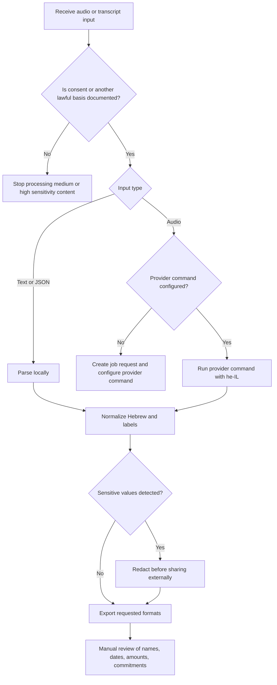

# Voice-to-Text in Hebrew

## Purpose

Transcribe Hebrew audio messages and calls into structured text for Israeli small businesses, freelancers, and consumers. Produce readable punctuation, speaker labels, timestamps, privacy warnings, and export files for follow-up, bookkeeping, customer service, subtitles, and documentation.

Use this skill when the input is a WhatsApp voice note, mobile call recording, meeting audio, dictation, customer support recording, or short audio clip in Hebrew or mixed Hebrew-English. Prefer `he-IL` and Israeli formatting conventions when handling currency, dates, phone numbers, addresses, and business terms.

## Core outcomes

1. Convert audio or provider JSON into normalized Hebrew transcript text.
2. Preserve speaker separation with labels such as `לקוח`, `עסק`, `דובר 1`, and `דובר 2`.
3. Add light punctuation without inventing facts.
4. Export TXT, JSON, SRT, VTT, and Markdown.
5. Detect common sensitive values such as Israeli phone numbers, identity-like numbers, payment cards, bank hints, and ₪ amounts.
6. Support repeatable local jobs for sandbox and production workflows.

## Install and run

```bash
python -m venv .venv
. .venv/bin/activate
pip install -e .
pip install -r requirements-dev.txt
```

Create a job, extract the job id, inspect the request, then run it:

```bash
printf "שלום, שלחתי חשבונית על ₪450 ל-15/03/2026" > sample.txt

CREATE_RESPONSE=$(hebrew-voice-to-text --env sandbox create-job sample.txt --jobs-dir .hvt-jobs)
JOB_ID=$(python -c 'import json,sys; print(json.load(sys.stdin)["id"])' <<< "$CREATE_RESPONSE")

hebrew-voice-to-text --env sandbox show-job "$JOB_ID" --jobs-dir .hvt-jobs
hebrew-voice-to-text --env sandbox run-job "$JOB_ID" --jobs-dir .hvt-jobs --output-dir out
```

Transcribe audio through a provider command:

```bash
export HVTT_PROVIDER_COMMAND='python provider.py {input} {language}'
hebrew-voice-to-text --env sandbox transcribe call.wav \
  --output-dir out --format txt --format json --format srt --format vtt
```

The provider command must print UTF-8 JSON to stdout:

```json
{
  "language": "he-IL",
  "duration_seconds": 8.2,
  "segments": [
    {"start": 0.0, "end": 2.4, "speaker": "לקוח", "text": "שלום, רציתי לבדוק את ההזמנה."},
    {"start": 2.4, "end": 8.2, "speaker": "עסק", "text": "כן, ההזמנה תצא היום."}
  ]
}
```

## Decision tree



## Input handling

### WhatsApp voice notes

Use the original file when possible. Common suffixes include `.opus`, `.ogg`, and `.m4a`. For WhatsApp Business Platform voice-message integrations, prefer OGG audio encoded with OPUS when preparing outbound voice audio. Do not convert repeatedly. If conversion is required, keep the original file and create a separate working copy.

Recommended labels:

```text
לקוח
עסק
נציג
ספק
```

Use `דובר 1` and `דובר 2` only when the role is unknown.

### Call recordings

Check whether the call is mono or stereo. If each side is on a separate channel, keep channel labels during provider processing. If the file is mono, request diarization and review speaker turns manually.

### Mixed Hebrew-English

Keep real product names and legal names as spoken. Normalize common Hebrew terms instead of transliteration where a Hebrew term exists:

| Prefer | Avoid |
|---|---|
| תמלול | transcription as Hebrew prose |
| חותמת זמן | timestamp as Hebrew prose |
| זיהוי דוברים | diarization as Hebrew prose |
| ממשק שורת פקודה | CLI as Hebrew prose |
| סביבת בדיקה | sandbox as Hebrew prose |

Technical command names may remain in English.

## Processing rules

### Punctuation

Add terminal punctuation when confidence is high. Do not insert commas that change meaning. Use a question mark for clear question cues such as `מה`, `מי`, `מתי`, `איפה`, `למה`, `כמה`, and `האם`.

### Speaker labels

Use role labels when known. Keep labels stable throughout the transcript. Do not merge speakers when an answer overlaps a question. Mark unclear turns as `דובר לא מזוהה` only during review, not as a guessed final label.

### Timestamps

Use seconds in JSON and SRT/VTT formatted timestamps in subtitle exports. Keep segment boundaries close to speech changes. Do not create subtitle blocks longer than 7 seconds for customer-facing videos.

### Currency and dates

Use `₪` for shekels. Use Israeli date order in Hebrew-facing output, such as `15/03/2026`. In English-facing logs, keep ISO dates when needed for sorting. When a transcript mentions VAT, record the spoken value and verify the current official rate before calculating totals; the v3 verification log confirmed 18% from 01/01/2025 as current on 03/06/2026.

## Edge cases

| Case | Recommended action |
|---|---|
| Noisy street recording | Run noise reduction outside the skill, then reprocess a copy. Mark unclear words. |
| Child speaker | Treat as high sensitivity. Confirm lawful basis and minimize retention. |
| Medical or financial content | Treat as high sensitivity. Redact before sharing. |
| Customer says only a phone number | Preserve the number internally, redact external copies. |
| Multiple customers in one recording | Split by customer before storage. |
| Names sound similar | Mark as uncertain and verify manually. |
| Spoken date lacks year | Add no year unless context proves it. |
| Spoken amount lacks currency | Do not assume ₪ unless the conversation context clearly indicates it. |
| Fast overlapping speech | Keep separate segments with short timestamps and lower confidence. |
| Audio in Arabic, Russian, or English | Set language only when the provider supports it. Do not force Hebrew normalization over non-Hebrew text. |

## Anti-patterns

- Do not upload sensitive recordings to an unknown provider.
- Do not skip consent checks for calls.
- Do not treat automatic punctuation as a legal transcript.
- Do not rewrite customer commitments to sound cleaner.
- Do not translate Hebrew to English unless explicitly required.
- Do not replace Israeli terms with unnecessary English words in Hebrew prose.
- Do not store raw recordings longer than needed.
- Do not publish transcripts that include phone numbers, identity-like values, bank hints, or payment details.
- Do not infer speaker identity from voice alone when the role is not known.
- Do not remove uncertainty notes during review.

## Workflow checklist

### Before processing

- Confirm consent or another lawful basis.
- Classify sensitivity as low, medium, or high.
- Save the original audio unchanged.
- Select `sandbox` for tests and `production` for controlled operational work.
- Define output formats.
- Define speaker labels.

### During processing

- Use `he-IL`.
- Capture timestamps and speaker labels.
- Keep provider stdout as JSON.
- Detect sensitive values.
- Keep error logs separate from transcript text.

### After processing

- Review names, amounts, dates, addresses, order numbers, commitments, and cancellation requests.
- Redact external copies.
- Save the accepted transcript and a minimal audit trail.
- Delete temporary files according to the retention policy.
- Document provider, date, input file, output file, and reviewer.

## Quality review rubric

| Dimension | Accept | Fix |
|---|---|---|
| Hebrew readability | Natural sentence flow and correct terms | Broken word order or unnecessary transliteration |
| Speaker separation | Stable labels with clear turns | Mixed speaker text in one segment |
| Punctuation | Helps reading without changing meaning | Adds commitments or changes questions |
| Timing | Segment starts match speech turns | Subtitles lag or run too long |
| Privacy | Sensitive values detected and redacted before sharing | External copy includes private values |
| Business usefulness | Follow-up action is clear | Transcript is too raw for operational use |

## Python usage

```python
from hebrew_voice_to_text import HebrewVoiceTextClient

client = HebrewVoiceTextClient(env="sandbox")
job = client.create_job("sample.txt", jobs_dir=".hvt-jobs", expected_speakers=2)
result = client.transcribe("sample.txt", job_id=job.id)
client.save_result(result, "out", formats=("txt", "json", "srt"))
```

## Troubleshooting pointers

- If audio fails without provider output, configure `HVTT_PROVIDER_COMMAND`.
- If Hebrew appears reversed, remove right-to-left control marks and open the file in a UTF-8 editor.
- If punctuation is poor, run manual review rather than aggressive automatic rewriting.
- If speaker labels are unstable, reduce expected speakers or provide channel labels.
- If tests fail after moving files, install with `pip install -e .` from the package root.
- If command output escapes Hebrew, confirm `json.dumps(..., ensure_ascii=False, indent=2)` in custom scripts.

See `references/troubleshooting.md` for a deeper table.
