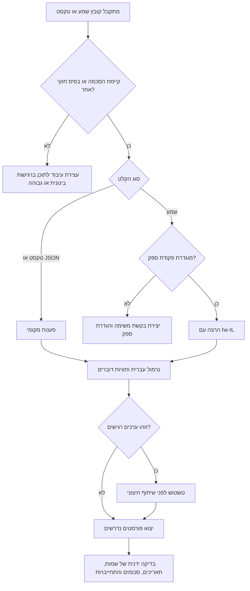

# תמלול קולי בעברית

## מטרה

תמלל הודעות קוליות ושיחות בעברית לטקסט קריא עם פיסוק, חותמות זמן, תוויות דוברים, בדיקות פרטיות וקובצי יצוא. השתמשו בחבילה עבור הודעות וואטסאפ, הקלטות שיחה, סיכומי פגישות, שירות לקוחות, כתוביות ותיעוד תפעולי לעסקים קטנים, עצמאים וצרכנים בישראל.

העדיפו `he-IL` ותבניות ישראליות: סכומים עם `₪`, תאריכים בסדר `DD/MM/YYYY`, מספרי טלפון ישראליים, כתובות מקומיות ומונחי חשבונות מוכרים.

## תוצרים מרכזיים

1. המרת קול או פלט ספק לטקסט עברי מנורמל.
2. שמירת הפרדה בין דוברים עם תוויות כגון `לקוח`, `עסק`, `נציג`, `ספק`, `דובר 1`.
3. הוספת פיסוק בסיסי בלי להמציא משמעות.
4. יצוא לקובצי TXT, JSON, SRT, VTT ו-Markdown.
5. זיהוי ערכים רגישים: מספרי טלפון, מספרים הדומים לתעודת זהות, כרטיסי תשלום, רמזים לחשבון בנק וסכומים ב-₪.
6. יצירת משימות מקומיות שניתנות להרצה בסביבת בדיקה או בסביבת ייצור.

## התקנה והרצה

```bash
python -m venv .venv
. .venv/bin/activate
pip install -e .
pip install -r requirements-dev.txt
```

יצירת משימה מקומית, חילוץ מזהה המשימה מתשובת היצירה ושימוש בו בשלב הבא:

```bash
printf "שלום, שלחתי חשבונית על ₪450 ל-15/03/2026" > sample.txt

CREATE_RESPONSE=$(hebrew-voice-to-text --env sandbox create-job sample.txt --jobs-dir .hvt-jobs)
JOB_ID=$(python -c 'import json,sys; print(json.load(sys.stdin)["id"])' <<< "$CREATE_RESPONSE")

hebrew-voice-to-text --env sandbox show-job "$JOB_ID" --jobs-dir .hvt-jobs
hebrew-voice-to-text --env sandbox run-job "$JOB_ID" --jobs-dir .hvt-jobs --output-dir out
```

תמלול קובץ שמע באמצעות פקודת ספק חיצונית:

```bash
export HVTT_PROVIDER_COMMAND='python provider.py {input} {language}'
hebrew-voice-to-text --env sandbox transcribe call.wav \
  --output-dir out --format txt --format json --format srt --format vtt
```

פקודת הספק חייבת להדפיס JSON בקידוד UTF-8:

```json
{
  "language": "he-IL",
  "duration_seconds": 8.2,
  "segments": [
    {"start": 0.0, "end": 2.4, "speaker": "לקוח", "text": "שלום, רציתי לבדוק את ההזמנה."},
    {"start": 2.4, "end": 8.2, "speaker": "עסק", "text": "כן, ההזמנה תצא היום."}
  ]
}
```

## עץ החלטה



## טיפול בקלט

### הודעות קוליות מוואטסאפ

שמרו את הקובץ המקורי. סיומות נפוצות הן `.opus`, `.ogg` ו-`.m4a`. בשילוב עם פלטפורמת וואטסאפ לעסקים, העדיפו שמע OGG בקידוד OPUS כאשר מכינים הודעה קולית יוצאת. אם נדרשת המרה, צרו עותק עבודה והשאירו את המקור ללא שינוי.

תוויות מומלצות:

```text
לקוח
עסק
נציג
ספק
```

השתמשו ב-`דובר 1` וב-`דובר 2` רק כאשר התפקיד אינו ידוע.

### הקלטות שיחה

בדקו אם הקובץ חד-ערוצי או דו-ערוצי. כאשר כל צד נמצא בערוץ נפרד, שמרו תוויות ערוץ לאורך כל התהליך. כאשר הקובץ חד-ערוצי, הפעילו זיהוי דוברים ובדקו את המעברים ידנית.

### עברית עם מילים באנגלית

שמרו שמות מוצרים, שמות משפטיים ומספרי דגם כפי שנאמרו. במדריכים בעברית השתמשו במונחים עבריים קיימים:

| העדיפו | הימנעו |
|---|---|
| תמלול | תיאור באנגלית בגוף הטקסט |
| חותמת זמן | timestamp בגוף הטקסט |
| זיהוי דוברים | diarization בגוף הטקסט |
| ממשק שורת פקודה | CLI בגוף הטקסט |
| סביבת בדיקה | sandbox בגוף הטקסט |

שמות פקודות וקבצים יכולים להישאר באנגלית.

## כללי עיבוד

### פיסוק

הוסיפו פיסוק סופי כאשר המשמעות ברורה. אל תכניסו פסיקים שמשנים התחייבות, שאלה או הוראה. השתמשו בסימן שאלה כאשר המשפט מתחיל במילות שאלה כגון `מה`, `מי`, `מתי`, `איפה`, `למה`, `כמה` ו-`האם`.

### תוויות דוברים

השתמשו בתוויות לפי תפקיד כאשר הוא ידוע. שמרו תווית עקבית לכל דובר. אל תאחדו תשובה ושאלה של דוברים שונים באותו מקטע. כאשר זהות הדובר אינה ברורה, סמנו לבדיקה ידנית במקום לנחש.

### חותמות זמן

שמרו שניות בפלט JSON וחותמות בפורמט SRT או VTT לקובצי כתוביות. התאימו גבולות מקטעים למעבר דיבור. עבור סרטונים ללקוחות, אל תיצרו מקטעי כתוביות ארוכים מ-7 שניות.

### כסף ותאריכים

כתבו שקלים כך: `₪450`, `₪1,280`, `₪0`. כתבו תאריכים כך: `15/03/2026`. כאשר השנה אינה נאמרת, אל תוסיפו שנה ללא הקשר ברור. כאשר התמלול מזכיר מע"מ, שמרו את הערך שנאמר ובדקו את השיעור הרשמי לפני חישוב סכום; ביומן האימות של גרסה 2.2.0 אומת שיעור 18% מ-01/01/2025 כנכון ל-03/06/2026.

## מקרי קצה

| מקרה | פעולה מומלצת |
|---|---|
| הקלטה רועשת ברחוב | בצעו ניקוי רעשים מחוץ לחבילה ועבדו על עותק. סמנו מילים לא ברורות. |
| דובר קטין | סווגו כרגישות גבוהה, צמצמו שמירה ובדקו בסיס חוקי. |
| מידע רפואי או פיננסי | סווגו כרגישות גבוהה וטשטשו לפני שיתוף. |
| לקוח מוסר רק מספר טלפון | שמרו פנימית לפי צורך תפעולי וטשטשו בעותקים חיצוניים. |
| כמה לקוחות באותה הקלטה | פצלו לפי לקוח לפני שמירה או שיתוף. |
| שמות נשמעים דומים | סמנו כאי ודאות ובדקו מול מקור נוסף. |
| תאריך נאמר בלי שנה | אל תנחשו שנה. |
| סכום נאמר בלי מטבע | אל תניחו ₪ בלי הקשר עסקי ברור. |
| דיבור מהיר וחופף | חלקו למקטעים קצרים, שמרו תוויות והורידו ביטחון. |
| שפה שאינה עברית | אל תפעילו נרמול עברי על טקסט שאינו עברי. |

## דפוסים שיש להימנע מהם

- אל תעלו הקלטות רגישות לספק שאינו מאושר.
- אל תדלגו על בדיקת הסכמה לפני עיבוד שיחות.
- אל תתייחסו לפיסוק אוטומטי כתמלול משפטי מוסמך.
- אל תנסחו מחדש התחייבויות של לקוחות כדי שישמעו מסודרות יותר.
- אל תתרגמו לאנגלית ללא צורך מפורש.
- אל תחליפו מונחים עבריים במילים באנגלית כאשר קיים מונח עברי ברור.
- אל תשמרו הקלטות מקור מעבר למדיניות השמירה.
- אל תשתפו תמלול עם מספרי טלפון, מספרי זהות, פרטי בנק או כרטיסי תשלום גלויים.
- אל תנחשו זהות דובר לפי קול בלבד.
- אל תמחקו סימוני אי ודאות לפני בדיקה.

## רשימת בדיקה לפני ייצור

### לפני עיבוד

- אשרו הסכמה או בסיס חוקי אחר.
- סווגו רגישות: נמוכה, בינונית או גבוהה.
- שמרו את קובץ המקור ללא שינוי.
- בחרו סביבת בדיקה לניסוי וסביבת ייצור לעבודה מבוקרת.
- הגדירו פורמטי יצוא.
- הגדירו תוויות דוברים.

### בזמן עיבוד

- השתמשו ב-`he-IL`.
- שמרו חותמות זמן ותוויות דוברים.
- קבלו פלט ספק כ-JSON תקין.
- זהו ערכים רגישים.
- הפרידו יומני שגיאה מתוכן התמלול.

### לאחר עיבוד

- בדקו ידנית שמות, סכומים, תאריכים, כתובות, מספרי הזמנה, התחייבויות וביטולים.
- טשטשו עותקים המיועדים לשיתוף.
- שמרו תמלול מאושר ותיעוד מינימלי.
- מחקו קבצים זמניים לפי מדיניות השמירה.
- תעדו ספק, תאריך, קובץ מקור, קובצי פלט ובודק.

## מדדי איכות

| תחום | תקין | דורש תיקון |
|---|---|---|
| קריאות בעברית | משפטים טבעיים ומונחים מקצועיים | סדר מילים שבור או תרגום מילולי |
| הפרדת דוברים | תוויות עקביות וברורות | ערבוב דוברים באותו מקטע |
| פיסוק | מסייע לקריאה בלי שינוי משמעות | משנה שאלה, התחייבות או סכום |
| תזמון | מקטעים תואמים את הדיבור | כתוביות מאחרות או ארוכות מדי |
| פרטיות | ערכים רגישים מזוהים ומטושטשים | עותק חיצוני כולל מידע פרטי |
| שימוש עסקי | פעולת המשך ברורה | הטקסט גולמי מדי לעבודה תפעולית |

## שימוש בפייתון

```python
from hebrew_voice_to_text import HebrewVoiceTextClient

client = HebrewVoiceTextClient(env="sandbox")
job = client.create_job("sample.txt", jobs_dir=".hvt-jobs", expected_speakers=2)
result = client.transcribe("sample.txt", job_id=job.id)
client.save_result(result, "out", formats=("txt", "json", "srt"))
```

## פתרון תקלות מהיר

- אם שמע נכשל ללא פלט ספק, הגדירו `HVTT_PROVIDER_COMMAND`.
- אם עברית מוצגת בכיוון שגוי, הסירו סימני כיווניות ופתחו את הקובץ בעורך UTF-8.
- אם הפיסוק חלש, בצעו בדיקה ידנית במקום שכתוב אגרסיבי.
- אם תוויות הדוברים לא יציבות, צמצמו מספר דוברים צפוי או ספקו תוויות ערוץ.
- אם בדיקות נכשלות לאחר העברת קבצים, הריצו `pip install -e .` משורש החבילה.
- אם פלט פקודה מציג עברית כקודי Unicode, ודאו שימוש ב-`json.dumps(..., ensure_ascii=False, indent=2)`.

ראו גם `references/troubleshooting.md`.
