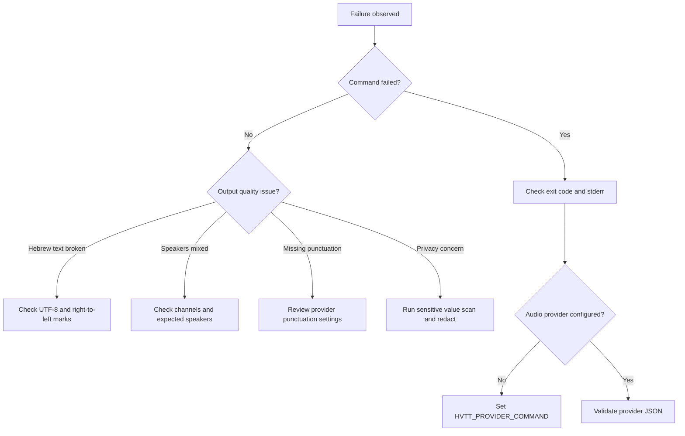

# Troubleshooting

## Quick diagnosis

## Audio issues

| Symptom | Likely cause | Fix |
|---|---|---|
| `No provider command configured` | Audio requires external transcription | Set `HVTT_PROVIDER_COMMAND` or pass `--provider-command`. |
| Empty transcript | Silent file, unsupported codec, provider failure | Inspect file, test playback, convert a copy if needed. |
| Duration missing | Non-WAV container or provider omitted duration | Keep processing, add duration from provider if available. |
| Transcript includes background speech | Noisy location or speaker overlap | Reprocess cleaner copy and mark uncertainty. |
| Hebrew words split incorrectly | Provider language mismatch | Force `he-IL` and compare provider settings. |
| WhatsApp file rejected | Provider lacks `.opus` support | Convert a copy to WAV or M4A and keep the original. |

## Hebrew quality issues

| Symptom | Likely cause | Fix |
|---|---|---|
| Text contains Hebrew marks | Source text includes niqqud | Normalize text with the client. |
| Text direction looks wrong | Hidden right-to-left controls or editor issue | Remove control marks and open in UTF-8 editor. |
| English words replace Hebrew terms | Provider or reviewer overuses English | Use accepted Hebrew terminology in final prose. |
| Question lacks question mark | Provider omitted punctuation | Apply light punctuation and review manually. |
| Amount loses currency | Provider omits `₪` | Confirm currency before adding it. |
| Date order looks foreign | Provider output uses month-first date | Convert to `DD/MM/YYYY` only when the date is unambiguous. |

## Speaker issues

| Symptom | Likely cause | Fix |
|---|---|---|
| Same speaker has two labels | Diarization drift | Merge labels during manual review only when verified. |
| Two speakers in one segment | Long segment or overlap | Split segment near the speech change. |
| `דובר 1` and `דובר 2` are unclear | Roles not known | Replace with role labels after review. |
| Customer and business are swapped | First speaker assumption failed | Re-label from the first clear exchange. |
| Call-center transfer creates extra speaker | New agent joined | Add a new label such as `נציג 2`. |

## Provider JSON issues

| Error | Meaning | Fix |
|---|---|---|
| `Provider command did not emit valid JSON` | stdout is not parseable JSON | Print only JSON to stdout and logs to stderr. |
| `Provider output must include segments or text` | Required payload missing | Emit `segments` array or `text` field. |
| Hebrew appears escaped | JSON serializer default escaped Unicode | Use `json.dumps(..., ensure_ascii=False, indent=2)`. |
| Confidence values fail | Non-numeric confidence | Emit a number or omit the field. |
| Segment times fail | Non-numeric timestamps | Emit seconds as numbers. |

## Export issues

| Symptom | Likely cause | Fix |
|---|---|---|
| SRT does not load | Bad timestamp or file encoding | Use generated SRT and save UTF-8. |
| VTT does not load | Missing `WEBVTT` header | Use generated VTT renderer. |
| Markdown too detailed for sharing | Includes sensitive values | Redact and create an external copy. |
| JSON too large | Long call or many segments | Store compressed archive and keep summary separately. |

## Privacy issues

| Situation | Required response |
|---|---|
| Identity-like number detected | Redact before external sharing. |
| Payment card detected | Redact and avoid storing unless required. |
| Bank hint detected | Restrict access and review retention. |
| Child voice detected | Treat as high sensitivity. |
| Medical or financial hardship mentioned | Treat as high sensitivity. |
| Supplier asks for full transcript | Share only the minimum required portion. |

## Operational recovery

1. Preserve the source audio.
2. Save the failed command, stderr, and job JSON.
3. Reproduce in sandbox.
4. Fix one variable at a time: codec, language, provider, speaker count, output format.
5. Re-run the smallest representative sample.
6. Promote to production only after manual review passes.
