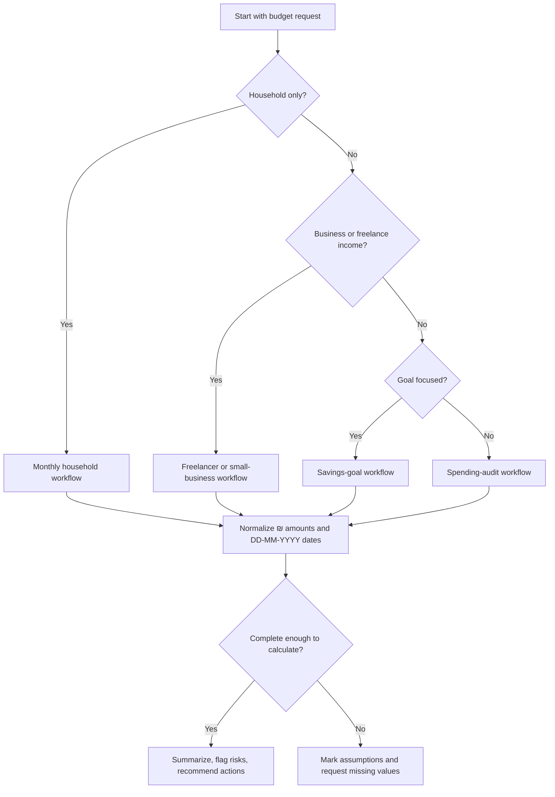
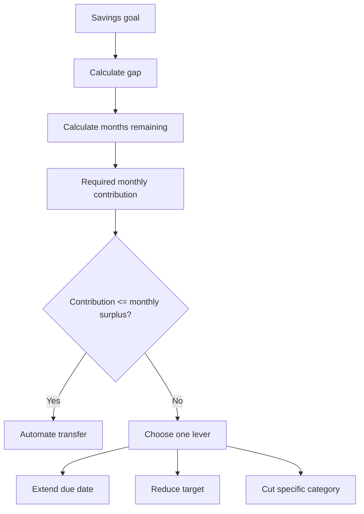

# Household Budget Planner

Use this skill to build a practical Israeli monthly budget for a household, freelancer, consumer, or small business owner. Track income, expenses, transfers, VAT-aware business costs, sinking funds, and savings goals in ₪. Use `DD-MM-YYYY` dates and keep business cash separate from household cash.

Do not treat the output as tax, legal, investment, pension, mortgage, or insurance advice. Verify current rates and rules with official Israeli sources or a qualified professional before filing, signing, investing, borrowing, pricing, or cancelling coverage.

## When to use

| Situation | Use this workflow | Main output |
|---|---|---|
| Household asks “where did the money go?” | Spending audit | Category totals, recurring charges, leakage list |
| Family wants a monthly plan | Monthly household budget | Income, expense, surplus, savings rate, action list |
| Freelancer mixes business and household money | Freelancer cash-flow split | VAT reserve, tax reserve reminder, owner draw |
| Consumer has card installments | Liability review | Monthly cash impact and remaining obligation note |
| Household wants to save for a goal | Savings goal workflow | Gap, months remaining, monthly contribution |
| Small business needs a basic cash view | Business/household separation | Business expenses, household transfer, reserve warnings |

## Israeli categories

Use these categories unless the user supplies a better structure.

| Category | Examples | Planning note |
|---|---|---|
| housing | rent, mortgage, Va'ad Bayit, repairs | Separate repairs from recurring housing |
| arnona | municipal property tax | Bi-monthly bills usually need division by 2 |
| utilities | electricity, water, gas | Expect summer/winter seasonality |
| food | groceries, delivery, restaurants | Split groceries from delivery when food is high |
| transport | Rav-Kav, fuel, parking, tolls, insurance | Separate commuting from leisure trips when useful |
| healthcare | Kupat Cholim, supplemental insurance, medication | Include family premiums and recurring prescriptions |
| insurance | car, home, life, disability | Avoid double-counting health insurance |
| communications | mobile, internet, TV, streaming | Detect duplicate subscriptions |
| education_childcare | gan, after-school care, school fees, tutoring | Watch September and holiday spikes |
| debt | loans, overdraft, installments | Track monthly payment and remaining liability |
| tax_reserve | VAT, income tax, Bituach Leumi reserve | Reserve before household spending |
| business | software, accountant, equipment, professional travel | Tag separately from household spending |
| savings | emergency fund, annual sinking funds, goals | Treat as planned allocation |
| leisure | gifts, culture, hobbies, vacations | Keep realistic; zero leisure often fails |
| other | unclear spending | Keep below 5% of expenses |

## Data to collect

1. Budget month in `MM-YYYY`.
2. Net salary, benefits, refunds, and business collections.
3. Fixed obligations: rent or mortgage, arnona, utilities, loans, insurance, subscriptions.
4. Variable expenses: food, transport, healthcare, childcare, leisure, household supplies.
5. Irregular expenses: annual car insurance, test/licensing, school supplies, holidays, professional dues.
6. Savings goals: name, target, current balance, due date.
7. Freelancer fields: VAT status, accountant-provided reserve rates if known, business expenses, owner draw.
8. Shared-household fields: payer, split percentage, reimbursements, joint vs personal expenses.

## Decision tree



## Monthly household workflow

1. Set month and currency.
2. Record all income first.
3. Record fixed expenses.
4. Record variable expenses.
5. Normalize non-monthly bills:
   - Arnona paid every two months: divide by 2.
   - Annual insurance: divide by 12 or by months until due.
   - School-year costs: divide over active months or average over 12 months.
6. Add savings goals and sinking funds.
7. Compare actual spending to category limits.
8. Return no more than five concrete actions.

### Example

```json
{
  "month": "05-2026",
  "income": [
    {"date": "01-05-2026", "amount": 15000, "kind": "income", "category": "salary"},
    {"date": "10-05-2026", "amount": 3200, "kind": "income", "category": "freelance"}
  ],
  "expenses": [
    {"date": "02-05-2026", "amount": 6200, "kind": "expense", "category": "housing"},
    {"date": "05-05-2026", "amount": 920, "kind": "expense", "category": "arnona", "normalize_months": 2},
    {"date": "08-05-2026", "amount": 3900, "kind": "expense", "category": "food"},
    {"date": "15-05-2026", "amount": 860, "kind": "expense", "category": "transport"}
  ],
  "savings_goals": [
    {"name": "Emergency fund", "target_amount": 30000, "current_amount": 18000, "due_date": "31-12-2026"}
  ]
}
```

Expected summary pattern:

```text
Income: ₪18,200
Expenses: ₪11,420
Net cash flow: ₪6,780
Savings rate: 37.3%
Emergency fund gap: ₪12,000
Required monthly contribution: about ₪1,500
Actions:
1. Cap food and delivery at ₪3,300 next month.
2. Schedule ₪1,500 automatic transfer after salary.
3. Review parking/fuel if transport remains above ₪850.
```

## Freelancer and small-business workflow

1. Record gross collected revenue by cash receipt date.
2. Identify VAT status:
   - Osek patur: no VAT collection on ordinary invoices, subject to current official threshold and rules. The 2026 Tax Authority threshold verified in the web pass is ₪122,833; verify annually.
   - Osek murshe or company: VAT may be collected and remitted under reporting rules.
3. If VAT is included, extract VAT and place it in a reserve bucket.
4. Add accountant-provided income-tax and Bituach Leumi reserve rates when available.
5. Mark expenses as household, business, mixed, or unclear.
6. Set a stable owner draw to the household budget.
7. Keep a business buffer before increasing household spending.

VAT extraction:

```text
VAT component = gross × VAT rate / (1 + VAT rate)
Net before VAT = gross / (1 + VAT rate)
```

Example:

```text
VAT-inclusive receipt: ₪11,800
VAT rate: 18% (verified as current in the 04-06-2026 web validation pass for examples from 01-01-2025 onward)
Net before VAT: ₪10,000
VAT component: ₪1,800
Spendable household income: not the gross receipt; use owner draw after reserves
```

## Savings goal workflow

1. Confirm target, current amount, and due date.
2. Calculate `gap = target - current`.
3. Calculate months remaining.
4. Calculate required monthly contribution.
5. Compare required contribution to monthly surplus.
6. If infeasible, extend date, reduce target, or reduce named categories.



## Spending audit workflow

1. Import bank or credit-card CSV.
2. Convert to normalized fields: date, amount, kind, category, description, vendor.
3. Remove internal transfers.
4. Deduplicate by date, amount, vendor, and description.
5. Treat refunds as negative expenses or refund-tagged entries.
6. Mark cash withdrawals as temporary until receipts exist.
7. Detect recurring charges by vendor and similar amount.
8. Report top merchants and top categories.
9. Split quick wins from structural changes.

## Edge cases

| Edge case | Handling |
|---|---|
| Bi-monthly arnona | Divide by 2 for planning and keep original bill note |
| Annual insurance | Create monthly sinking fund and track cash month separately |
| Credit-card installments | Count monthly installment in cash flow and track remaining liability |
| Refunds | Do not inflate income; tag as refund or negative expense |
| Foreign-currency purchase | Use actual card settlement in ₪ |
| Shared household | Track payer, split percent, and reimbursement as transfer |
| Mixed business/household expense | Use business-use percent only with a stated basis |
| Cash withdrawals | Keep temporary category until receipts exist |
| Overdraft interest | Treat as urgent debt cost |
| Holidays and school year | Create Passover, High Holidays, vacation, and September sinking funds |
| VAT rate change | Pass VAT rate as a parameter; do not hard-code decisions |

## Anti-patterns

- Treating gross freelance revenue as household income.
- Spending VAT collected from customers.
- Averaging annual expenses without checking payment month.
- Hiding installments under purchase date only.
- Combining groceries, delivery, and restaurants when diagnosing overspending.
- Classifying refunds as normal income.
- Leaving more than 5% of expenses in “other”.
- Recommending insurance cancellation without professional review.
- Presenting reserve estimates as official tax advice.
- Assuming municipal, utility, benefit, or tax amounts are identical across households.
- Mixing business and household expenses without tags.
- Using stale rates without verification.

## Troubleshooting quick table

| Symptom | Likely cause | Fix |
|---|---|---|
| Paper surplus but falling bank balance | Missing annual bills, installments, transfers | Add cash calendar and liability list |
| Food is too high | Delivery/restaurants mixed with groceries | Split categories and cap delivery first |
| Freelancer cannot pay VAT | VAT treated as income | Reserve VAT immediately |
| Goal never progresses | No automatic transfer | Schedule transfer after income receipt |
| Totals do not match statement | Duplicates, refunds, card timing | Reconcile by date, amount, vendor |
| Expenses look too low | Cash spending missing | Add cash withdrawals as temporary |
| Plan feels impossible | No leisure or holidays | Add realistic discretionary and sinking funds |

## Production checklist

- [ ] Confirm all amounts are in ₪.
- [ ] Confirm dates use `DD-MM-YYYY`.
- [ ] Verify VAT, osek patur threshold, Bituach Leumi, income-tax, labor, municipal, utility, rate, and benefit rules through official sources.
- [ ] Separate household, business, mixed, and reserve entries.
- [ ] Reconcile imports against bank/card totals.
- [ ] Remove duplicates and transfers.
- [ ] Avoid storing identity numbers, full card numbers, account numbers, passwords, or tokens.
- [ ] Review unclear transactions manually.
- [ ] Document assumptions.
- [ ] Use accountant or tax adviser for filings, VAT, payroll, deductible expenses, and entity decisions.
- [ ] Use licensed advice for investment, pension, mortgage, and insurance decisions.
- [ ] Re-run after major income, rent, rate, family-size, or business-status changes.

## Response template

```text
Budget month: MM-YYYY
Currency: ₪

Income:
- Salary: ₪...
- Business revenue: ₪...
- Other: ₪...

Expenses:
- Housing: ₪...
- Arnona/utilities: ₪...
- Food: ₪...
- Transport: ₪...
- Healthcare/insurance: ₪...
- Taxes/reserves: ₪...
- Other: ₪...

Net cash flow: ₪...
Savings rate: ...%

Risks:
1. ...
2. ...

Recommended actions:
1. ...
2. ...
3. ...

Assumptions to verify:
- ...
```
