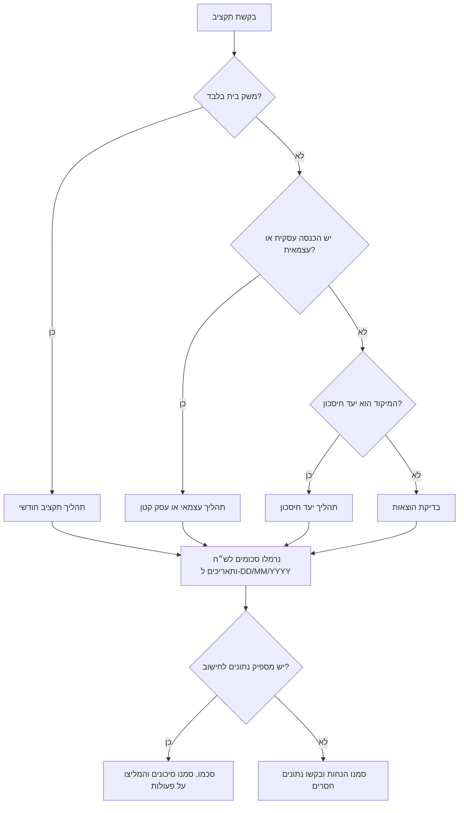
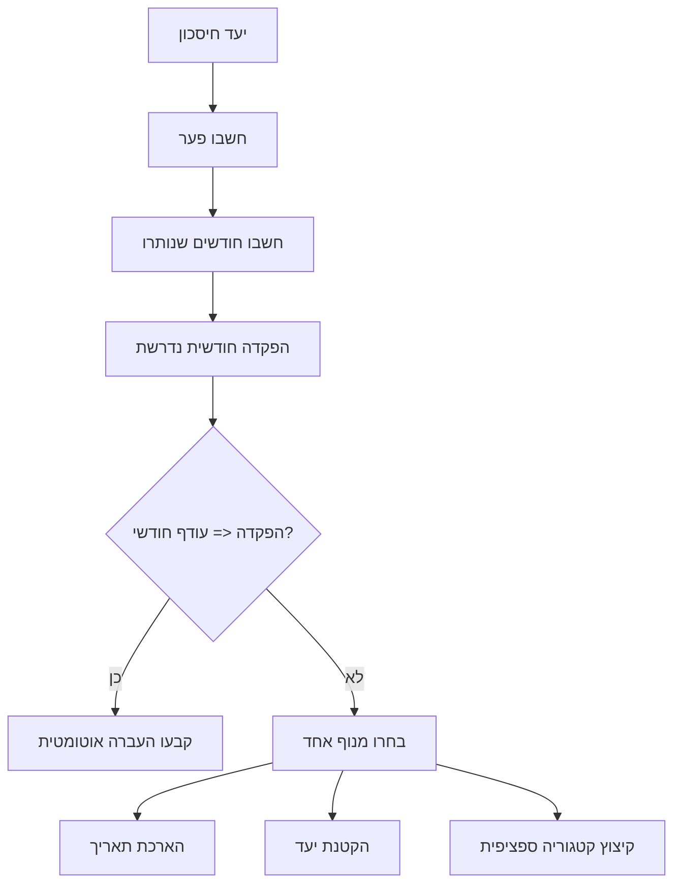

# מתכנן תקציב למשק בית בישראל

השתמשו במיומנות זו לבניית תקציב חודשי מעשי למשק בית, לצרכן, לעצמאי, לפרילנסר או לעסק קטן בישראל. עקבו אחר הכנסות, הוצאות, העברות, רכיב מע״מ, רזרבות, קופות ייעודיות ויעדי חיסכון בש״ח. השתמשו בתאריכים בפורמט `DD/MM/YYYY` והפרידו כסף עסקי מכסף ביתי.

אין להתייחס לתוצר כייעוץ מס, ייעוץ משפטי, ייעוץ השקעות, ייעוץ פנסיוני, ייעוץ משכנתאות או ייעוץ ביטוח. אמתו שיעורים וכללים מול מקורות ישראליים רשמיים או בעל מקצוע מוסמך לפני דיווח, חתימה, השקעה, נטילת אשראי, שינוי מחיר או ביטול כיסוי ביטוחי.

## מתי להשתמש

| מצב | תהליך מתאים | תוצר מרכזי |
|---|---|---|
| “לאן הלך הכסף?” | בדיקת הוצאות | סיכום קטגוריות, חיובים חוזרים ורשימת דליפות |
| בניית תקציב משפחתי | תקציב חודשי למשק בית | הכנסה, הוצאה, עודף, שיעור חיסכון ופעולות |
| עצמאי מערבב עסק ובית | הפרדת תזרים עצמאי | רזרבת מע״מ, רזרבת מס ומשיכת בעלים |
| צרכן עם תשלומים בכרטיס | בדיקת התחייבויות | השפעה חודשית ויתרת התחייבות |
| יעד חיסכון | תהליך יעד חיסכון | פער, חודשים שנותרו והפקדה חודשית |
| עסק קטן צריך תמונת מצב | הפרדה עסקית וביתית | הוצאות עסקיות, העברה לבית ואזהרות רזרבה |

## קטגוריות ישראליות

| קטגוריה | דוגמאות | הערת תכנון |
|---|---|---|
| דיור | שכר דירה, משכנתה, ועד בית, תיקונים | הפרידו תיקון חד-פעמי מהוצאה קבועה |
| ארנונה | חיוב עירוני | חיוב דו-חודשי מחלקים בדרך כלל ב-2 |
| שירותים | חשמל, מים, גז | בדקו עונתיות בקיץ ובחורף |
| מזון | סופר, משלוחים, מסעדות | פצלו משלוחים כשקטגוריית מזון גבוהה |
| תחבורה | רב-קו, דלק, חניה, כבישי אגרה, ביטוח רכב | הפרידו נסיעות עבודה כאשר זה מועיל |
| בריאות | קופת חולים, שב״ן, תרופות | כללו פרמיות משפחתיות ותרופות קבועות |
| ביטוחים | רכב, דירה, חיים, אובדן כושר עבודה | אל תספרו ביטוח בריאות פעמיים |
| תקשורת | סלולר, אינטרנט, טלוויזיה, סטרימינג | אתרו מנויים כפולים |
| חינוך וילדים | גן, צהרון, תשלומי בית ספר, שיעורים פרטיים | שימו לב לספטמבר ולחגים |
| חובות | הלוואות, מינוס, תשלומים | עקבו גם אחר יתרת התחייבות |
| רזרבת מס | מע״מ, מס הכנסה, ביטוח לאומי | שמרו בצד לפני צריכה ביתית |
| עסק | תוכנה, הנהלת חשבונות, ציוד, נסיעות מקצועיות | סמנו בנפרד מהבית |
| חיסכון | קרן חירום, קופות שנתיות, יעדים | הגדירו כהקצאה מתוכננת |
| פנאי | מתנות, תרבות, תחביבים, חופשות | תקציב אפס לפנאי לרוב לא מחזיק |
| אחר | הוצאה לא ברורה | שמרו מתחת ל-5% מההוצאות |

## נתונים לאיסוף

1. חודש תקציב בפורמט `MM-YYYY`.
2. משכורת נטו, הטבות, החזרים והכנסות עסקיות שנגבו.
3. התחייבויות קבועות: שכר דירה או משכנתה, ארנונה, חשמל, מים, הלוואות, ביטוחים ומנויים.
4. הוצאות משתנות: מזון, תחבורה, בריאות, ילדים, פנאי וציוד לבית.
5. הוצאות לא סדירות: ביטוח רכב שנתי, טסט, ציוד לבית הספר, חגים, חופשות ותשלומים מקצועיים.
6. יעדי חיסכון: שם יעד, סכום יעד, יתרה נוכחית ותאריך יעד.
7. לעצמאים: מעמד מע״מ, שיעורי רזרבה שסופקו על ידי רואה חשבון או יועצת מס, הוצאות עסקיות ומשיכת בעלים.
8. למשק בית משותף: מי שילם, אחוז חלוקה, החזרים, הוצאה משותפת מול הוצאה אישית.

## עץ החלטה



## תהליך תקציב חודשי למשק בית

1. הגדירו חודש ומטבע.
2. רשמו קודם את כל ההכנסות.
3. רשמו הוצאות קבועות.
4. רשמו הוצאות משתנות.
5. נרמלו חיובים שאינם חודשיים:
   - ארנונה דו-חודשית: חלקו ב-2.
   - ביטוח שנתי: חלקו ב-12 או במספר החודשים עד התשלום.
   - עלויות שנת לימודים: חלקו לפי חודשי פעילות או פרסו על פני 12 חודשים.
6. הוסיפו יעדי חיסכון וקופות ייעודיות.
7. השוו ביצוע למסגרות קטגוריה.
8. החזירו עד חמש פעולות קונקרטיות.

### דוגמה

```json
{
  "month": "05-2026",
  "income": [
    {"date": "01/05/2026", "amount": 15000, "kind": "income", "category": "משכורת"},
    {"date": "10/05/2026", "amount": 3200, "kind": "income", "category": "הכנסה עצמאית"}
  ],
  "expenses": [
    {"date": "02/05/2026", "amount": 6200, "kind": "expense", "category": "דיור"},
    {"date": "05/05/2026", "amount": 920, "kind": "expense", "category": "ארנונה", "normalize_months": 2},
    {"date": "08/05/2026", "amount": 3900, "kind": "expense", "category": "מזון"},
    {"date": "15/05/2026", "amount": 860, "kind": "expense", "category": "תחבורה"}
  ],
  "savings_goals": [
    {"name": "קרן חירום", "target_amount": 30000, "current_amount": 18000, "due_date": "31/12/2026"}
  ]
}
```

תבנית פלט:

```text
הכנסות: ₪18,200
הוצאות: ₪11,420
תזרים נטו: ₪6,780
שיעור חיסכון: 37.3%
פער בקרן החירום: ₪12,000
הפקדה חודשית נדרשת: כ-₪1,500
פעולות:
1. הגבילו מזון ומשלוחים ל-₪3,300 בחודש הבא.
2. קבעו העברה אוטומטית של ₪1,500 לאחר כניסת השכר.
3. בדקו דלק וחניה אם תחבורה נשארת מעל ₪850.
```

## תהליך לעצמאי ולעסק קטן

1. רשמו הכנסה גולמית שנגבתה בפועל לפי תאריך קבלת הכסף.
2. זהו את מעמד המע״מ:
   - עוסק פטור: בדרך כלל אינו גובה מע״מ בעסקאות רגילות, בכפוף לתקרה ולכללים עדכניים. בבדיקת האימות מ-04/06/2026 אומתה תקרה לשנת 2026 בסך ₪122,833; אמתו מחדש בכל שנה.
   - עוסק מורשה או חברה: ייתכן שנגבה מע״מ ויש לדווח ולהעביר לפי הכללים.
3. כאשר הסכום כולל מע״מ, חלצו את רכיב המע״מ והעבירו לרזרבה.
4. הוסיפו שיעורי רזרבה למס הכנסה ולביטוח לאומי כאשר נמסרו על ידי בעל מקצוע.
5. סמנו הוצאות כביתיות, עסקיות, מעורבות או לא ברורות.
6. הגדירו משיכת בעלים קבועה לבית.
7. שמרו כרית עסקית לפני הגדלת הוצאות הבית.

חילוץ מע״מ:

```text
רכיב מע״מ = סכום כולל × שיעור מע״מ / (1 + שיעור מע״מ)
סכום לפני מע״מ = סכום כולל / (1 + שיעור מע״מ)
```

דוגמה:

```text
תקבול כולל מע״מ: ₪11,800
שיעור מע״מ: 18% (אומת בבדיקת האינטרנט מ-04/06/2026 כדוגמה בתוקף מ-01/01/2025 ואילך)
סכום לפני מע״מ: ₪10,000
רכיב מע״מ: ₪1,800
הכנסה פנויה לבית: לא התקבול הגולמי; השתמשו במשיכת בעלים אחרי רזרבות
```

## תהליך יעד חיסכון

1. ודאו יעד, סכום קיים ותאריך יעד.
2. חשבו `פער = יעד - סכום קיים`.
3. חשבו חודשים שנותרו.
4. חשבו הפקדה חודשית נדרשת.
5. השוו את ההפקדה לעודף החודשי.
6. אם היעד לא אפשרי, האריכו תאריך, הקטינו יעד או צמצמו קטגוריות מוגדרות.



## בדיקת הוצאות

1. ייבאו CSV מבנק או מכרטיס אשראי.
2. נרמלו לשדות: תאריך, סכום, סוג, קטגוריה, תיאור וספק.
3. הסירו העברות פנימיות.
4. הסירו כפילויות לפי תאריך, סכום, ספק ותיאור.
5. סווגו החזרים כהוצאה שלילית או כהחזר מתויג.
6. סמנו משיכות מזומן כקטגוריה זמנית עד שיש קבלות.
7. אתרו חיובים חוזרים לפי ספק וסכום דומה.
8. הציגו ספקים וקטגוריות מובילים.
9. הפרידו בין ניצחונות מהירים לבין שינויים מבניים.

## מקרי קצה

| מקרה | טיפול |
|---|---|
| ארנונה דו-חודשית | חלקו ב-2 לתכנון ושמרו הערה על החשבון המקורי |
| ביטוח שנתי | צרו קופה חודשית ושמרו את חודש התשלום |
| תשלומים בכרטיס אשראי | ספרו את התשלום החודשי ושמרו יתרת התחייבות |
| החזרים | אל תנפחו הכנסה; סמנו כהחזר או כהוצאה שלילית |
| רכישה במט״ח | השתמשו בחיוב הסופי בש״ח |
| משק בית משותף | עקבו אחר משלם, אחוז חלוקה והחזר כהעברה |
| הוצאה מעורבת | השתמשו באחוז עסקי רק כאשר יש בסיס ברור |
| מזומן | השאירו זמני עד לקבלת פירוט |
| ריבית על מינוס | סווגו כעלות חוב דחופה |
| חגים ושנת לימודים | צרו קופות לפסח, חגי תשרי, חופשות וספטמבר |
| שינוי מע״מ | העבירו שיעור מע״מ כפרמטר; אל תקבעו כנתון קשיח |

## דפוסי טעות

- התייחסות להכנסה עסקית ברוטו כהכנסה פנויה לבית.
- שימוש במע״מ שנגבה מלקוחות לצריכה שוטפת.
- ממוצע שנתי בלי לבדוק את חודש התשלום.
- הסתרת תשלומים תחת תאריך הרכישה בלבד.
- איחוד סופר, משלוחים ומסעדות בזמן אבחון חריגה.
- סיווג החזרים כהכנסה רגילה.
- השארת יותר מ-5% מההוצאות ב“אחר”.
- המלצה לבטל ביטוח ללא בדיקה מקצועית.
- הצגת רזרבת מס כהוראת מס רשמית.
- הנחה שארנונה, מים, חשמל, הטבות או מסים זהים בכל משק בית.
- ערבוב הוצאות עסקיות וביתיות ללא תגיות.
- שימוש בשיעורים ישנים ללא אימות.

## פתרון תקלות מהיר

| סימפטום | סיבה אפשרית | תיקון |
|---|---|---|
| יש עודף על הנייר אבל היתרה יורדת | חסרות הוצאות שנתיות, תשלומים או העברות | הוסיפו לוח תזרים ורשימת התחייבויות |
| מזון גבוה מדי | משלוחים ומסעדות מעורבבים עם סופר | פצלו קטגוריות והגבילו משלוחים תחילה |
| עצמאי לא מצליח לשלם מע״מ | מע״מ טופל כהכנסה | הפרידו רזרבת מע״מ מיד |
| יעד חיסכון לא מתקדם | אין העברה אוטומטית | קבעו העברה אחרי כניסת הכנסה |
| הסכומים לא תואמים לדף הבנק | כפילויות, החזרים או עיתוי כרטיס | התאימו לפי תאריך, סכום וספק |
| ההוצאות נראות נמוכות מדי | חסרות הוצאות מזומן | הוסיפו משיכות מזומן כזמניות |
| התוכנית לא ישימה | אין פנאי או קופת חגים | הוסיפו תקציב ריאלי לפנאי וקופות ייעודיות |

## רשימת בדיקה לשימוש מקצועי

- [ ] ודאו שכל הסכומים בש״ח.
- [ ] ודאו שכל התאריכים בפורמט `DD/MM/YYYY`.
- [ ] אמתו מע״מ, תקרת עוסק פטור, ביטוח לאומי, מס הכנסה, דיני עבודה, ארנונה, תעריפי שירותים, ריביות והטבות מול מקורות רשמיים.
- [ ] הפרידו הוצאות ביתיות, עסקיות, מעורבות ורזרבות.
- [ ] התאימו ייבוא לסיכומי בנק וכרטיס.
- [ ] הסירו כפילויות והעברות פנימיות.
- [ ] הימנעו משמירת מספרי זהות, מספרי כרטיס מלאים, מספרי חשבון, סיסמאות או אסימוני גישה.
- [ ] בדקו ידנית עסקאות לא ברורות.
- [ ] תעדו הנחות.
- [ ] פנו לרואה חשבון או יועצת מס לגבי דיווחים, מע״מ, שכר, הוצאות מוכרות וסוג עוסק.
- [ ] פנו לבעל רישיון מתאים להשקעות, פנסיה, משכנתאות וביטוח.
- [ ] עדכנו תקציב לאחר שינוי הכנסה, שכירות, ריבית, גודל משפחה או מעמד עסקי.

## תבנית סיכום

```text
חודש תקציב: MM-YYYY
מטבע: ₪

הכנסות:
- משכורת: ₪...
- הכנסה עסקית: ₪...
- אחר: ₪...

הוצאות:
- דיור: ₪...
- ארנונה ושירותים: ₪...
- מזון: ₪...
- תחבורה: ₪...
- בריאות וביטוחים: ₪...
- מסים ורזרבות: ₪...
- אחר: ₪...

תזרים נטו: ₪...
שיעור חיסכון: ...%

סיכונים:
1. ...
2. ...

פעולות מומלצות:
1. ...
2. ...
3. ...

הנחות לאימות:
- ...
```
