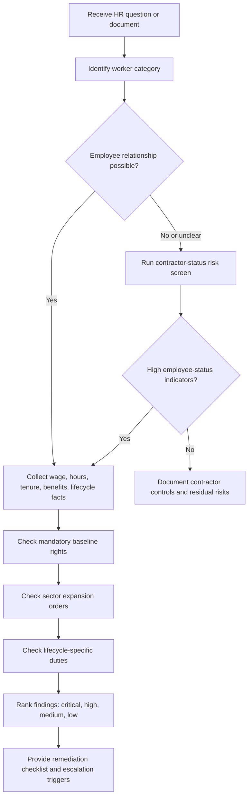
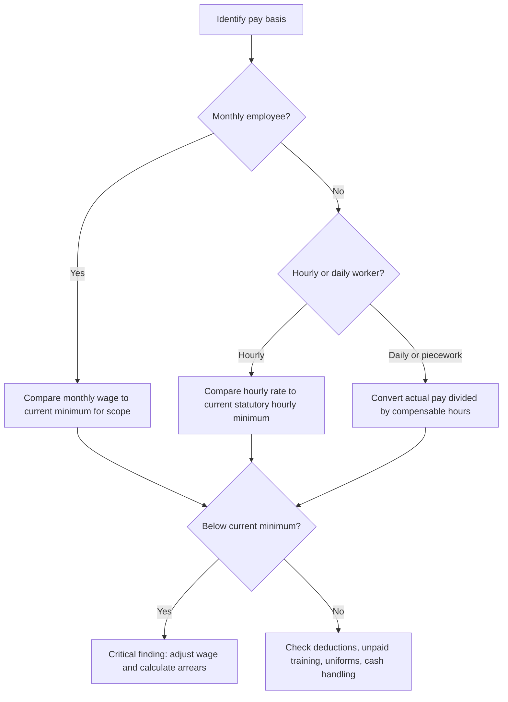
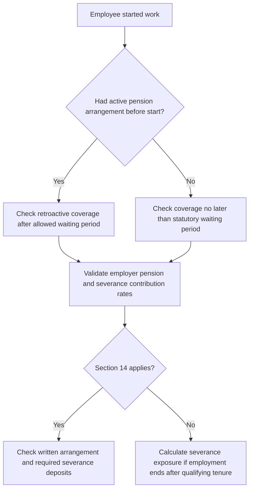
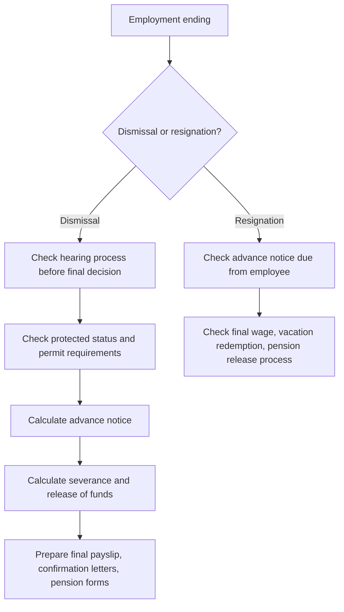

# HR Compliance Advisor

## Purpose

Use this skill to audit common Israeli HR compliance questions for a small business, freelancer, employee, or consumer. Focus on practical risk identification, structured fact gathering, and next actions that reduce exposure under Israeli labor law.

The skill does not replace licensed legal advice. Treat every output as a compliance triage memo. Escalate unusual, high-value, unionized, regulated, cross-border, discrimination, harassment, immigration, collective bargaining, strike, or criminal-liability matters to an Israeli labor-law attorney or qualified payroll professional.

## Core use cases

- Review an HR policy before rollout.
- Check wage, overtime, pension, severance, notice, vacation, sick leave, convalescence, travel, and parental-rights rules.
- Compare a freelancer arrangement against employee-status risk indicators.
- Build onboarding, monthly payroll, or termination checklists.
- Detect missing expansion-order obligations for a specific sector.
- Prepare questions for payroll, bookkeeping, or legal review.

## Required input

| Area | Facts to collect |
|---|---|
| Worker status | Employee, contractor, freelancer, candidate, intern, youth worker, foreign worker, caregiver, unknown |
| Location | Israel, remote from Israel, remote to Israel, mixed |
| Sector | General, guarding, cleaning, construction, caregiving, hospitality, retail, tech, transport, public-sector contractor, other |
| Pay model | Monthly salary, hourly wage, daily wage, commission, retainer, piecework, tips, expense reimbursements |
| Work pattern | Days per week, weekly hours, daily hours, night work, Saturday/rest-day work, on-call time, travel time |
| Tenure | Start date, end date, breaks, probation, prior pension arrangement |
| Benefits | Pension, severance component, vacation, sick leave, convalescence pay, travel reimbursement, holiday pay |
| Lifecycle event | Hiring, policy rollout, monthly payroll, parental leave, reserve duty, termination, resignation, contractor conversion |
| Documents | Contract, payslips, attendance records, policy draft, termination letter, contractor invoice, correspondence |
| Dates and amounts | Use DD-MM-YYYY and ₪ values where possible |

When facts are missing, state the missing facts and provide a conditional answer. Do not invent rates, dates, sector coverage, or eligibility.

## Legal source map

Use `references/api-reference.md` for source names, lookup points, and structured request/response examples. Core Israeli sources include the Minimum Wage Law, Hours of Work and Rest Law, Annual Leave Law, Sick Pay Law, Severance Pay Law, Advance Notice Law, Protection of Wages Law, Women's Employment Law, Equal Employment Opportunities Law, mandatory pension expansion order, travel-expense expansion order, convalescence arrangements, and sector expansion orders.

Always verify the current version, rate, and sector applicability before final implementation.

## Decision workflow



## Baseline rights checklist

### Minimum wage

Check both the stated pay and the effective pay after unpaid mandatory time.



Examples:

- A shop pays ₪31 per hour while the current official hourly minimum is higher. Flag a critical risk and calculate arrears.
- A monthly employee receives a salary above minimum but regularly works unpaid hours. Recalculate the effective hourly rate and overtime duties.
- A commission-only salesperson must still receive at least minimum wage for compensable work time in each pay period.

Edge cases: tips, training, mandatory meetings, setup time, closing procedures, deductions, youth rates, foreign workers, sector rules, and global salary clauses.

### Hours, overtime, weekly rest, and night work

Check actual working time, not only contract wording. Flag more than the regular weekly cap, more than the daily maximum, repeated night work, rest-day work without permit analysis, and title-only "management" or "trust" exemptions.

Recommended calculation:

1. Collect attendance records.
2. Separate regular hours, daily overtime, weekly overtime, rest-day work, and night work.
3. Apply required premium rules to the correct bucket.
4. Compare paid amounts to required amounts.
5. Flag gaps and remediation.

### Pension and severance



Examples:

- Employee with active pension before hiring: confirm retroactive contributions where required.
- Employee after six months with no pension: flag a high or critical gap.
- Section 14 clause with partial severance deposits: flag incomplete waiver risk.
- Severance contributions described as optional benefits: flag inaccurate wording.

### Vacation, sick leave, holidays, convalescence, and travel

Do not treat one benefit as a substitute for another. Flag automatic vacation forfeiture, missing sick-pay structure, missing convalescence pay, low travel reimbursement, denied holiday pay for eligible hourly/daily workers, and payslips lacking required line items.

### Parental, pregnancy, fertility-treatment, family, and reserve-duty rights

Treat these questions as high sensitivity. Critical flags include dismissal, reduced hours, demotion, pay reduction, refusal to return, or adverse hiring treatment connected to pregnancy, fertility treatment, parental leave, reserve duty, disability, complaint activity, or protected family status.

### Termination and resignation



Minimum termination checklist: hearing invitation, good-faith hearing, written decision, protected-status check, notice or payment in lieu, final wage, vacation redemption, severance analysis, pension release, and employment-period confirmation.

### Freelancer and contractor status

A written "independent contractor" label is not enough. Check control, personal service, substitution, integration, tools, exclusivity, economic dependence, payment model, leave approval, discipline, duration, and whether the service is core business activity. Separate tax/VAT invoicing from labor-law status.

## Risk ranking

| Risk | Use when | Response |
|---|---|---|
| Critical | Likely legal breach, protected-status issue, wage arrears, unlawful dismissal, serious misclassification | Stop rollout or action until reviewed. Preserve records. Escalate. |
| High | Strong compliance gap or missing mandatory right | Correct policy and calculate exposure. Get payroll/legal confirmation. |
| Medium | Ambiguous facts, sector-specific coverage, incomplete documentation | Gather facts, update wording, verify source. |
| Low | Process improvement or documentation weakness | Add checklist, template, or training note. |

## Output format

```markdown
## Compliance snapshot
- Worker/category:
- Sector:
- Period reviewed:
- Documents reviewed:
- Overall risk:

## Findings
### 1. [Risk] Finding title
- Evidence:
- Rule:
- Why it matters:
- Remediation:
- Source to verify:

## Missing facts
- ...

## Immediate actions
1. ...
2. ...
3. ...

## Escalation triggers
- ...
```

## Concrete examples

### Retail employee paid hourly

Facts: Part-time cashier, ₪31/hour, 5 shifts/week, 20 unpaid closing minutes per shift, tenure 10 months, no pension.

Findings: critical minimum wage if official rate is higher; high unpaid closing time; high pension gap; medium travel and holiday-pay review.

Actions: verify current minimum wage, recalculate actual paid time, correct pension, define closing time as paid work.

### Monthly employee with "global overtime"

Facts: ₪9,500/month, "salary includes all overtime", actual work 50-55 hours/week, no attendance records.

Findings: high blanket global-overtime risk, high missing timekeeping, medium management-exemption uncertainty.

Actions: implement timekeeping, separate lawful overtime component after review, cap overtime, preserve records.

### Freelancer doing core work

Facts: monthly invoice, office 4 days/week, company email, manager approves vacation, 18-month relationship.

Findings: high employee-status risk, high exposure for mandatory rights, medium tax/labor-law distinction.

Actions: convert to employment or restructure genuine supplier relationship; get legal review before termination.

### Pregnancy-related schedule reduction

Facts: employee reports pregnancy; manager removes shifts.

Findings: critical protected-status risk and high evidence risk.

Actions: freeze change, document objective constraints, review permit requirements, escalate before adverse action.

## Edge cases

- Remote work can trigger Israeli law, foreign law, tax, and social-security questions.
- Sector expansion orders can add wages, training, pension, seniority, and holiday rules.
- A monthly payslip does not turn an hourly worker into a salaried employee.
- Commission, tips, and bonuses do not erase mandatory rights.
- Wage deductions for shortages, uniforms, tools, damage, fines, or training are high risk.
- Probation does not remove minimum wage, overtime, pension timing, leave, hearing, notice, or anti-discrimination protections.
- A senior title alone does not remove overtime rights.

## Anti-patterns

Avoid these clauses and practices:

- "Employee agrees to waive all statutory rights."
- "Salary includes unlimited overtime."
- "No pension during probation."
- "Vacation days expire automatically at year end."
- "The contractor cannot work for others and must follow all staff procedures."
- "Termination is immediate at the employer's discretion without hearing."
- "Pregnant employees must report pregnancy during interviews."
- "Payslip line items are optional."
- "Expansion orders do not apply because the business is small."

## Troubleshooting quick checks

| Symptom | Likely cause | Fix |
|---|---|---|
| Contractor status unclear | Missing facts about control, integration, exclusivity, business risk | Run contractor-status questionnaire |
| Minimum wage conflict | Wrong rate period, unpaid hours excluded, deductions ignored | Recalculate by pay period |
| Overtime too high | Daily and weekly overtime double-counted | Build a daily ledger |
| Pension timing unclear | Prior active pension status unknown | Ask for pension-fund evidence |
| Termination checklist incomplete | Hearing, notice, protected status, final pay mixed together | Separate process rights from monetary rights |
| Hebrew output unnatural | Literal translation | Use Israeli HR terms from `SKILL_HE.md` |

## Production checklist

1. Verify current minimum wage and benefit rates from official or authoritative Israeli sources.
2. Confirm whether a sector expansion order applies.
3. Confirm protected status, disability accommodation, pregnancy/parental status, reserve duty, immigration status, and collective coverage where relevant.
4. Check actual payslips and attendance records, not only contracts.
5. Validate calculations with payroll software or an Israeli payroll professional.
6. Preserve source documents.
7. Mark assumptions clearly.
8. Separate legal risk from payroll implementation steps.
9. Avoid final legal conclusions on disputed facts.
10. Escalate critical and high-risk findings before action.
