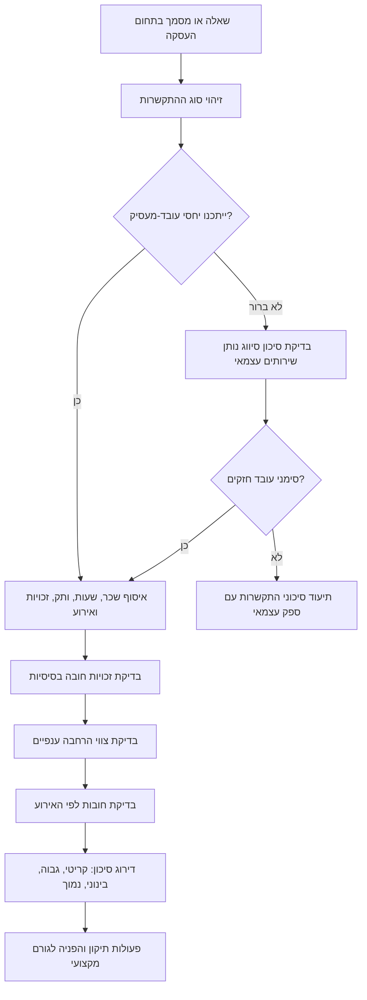
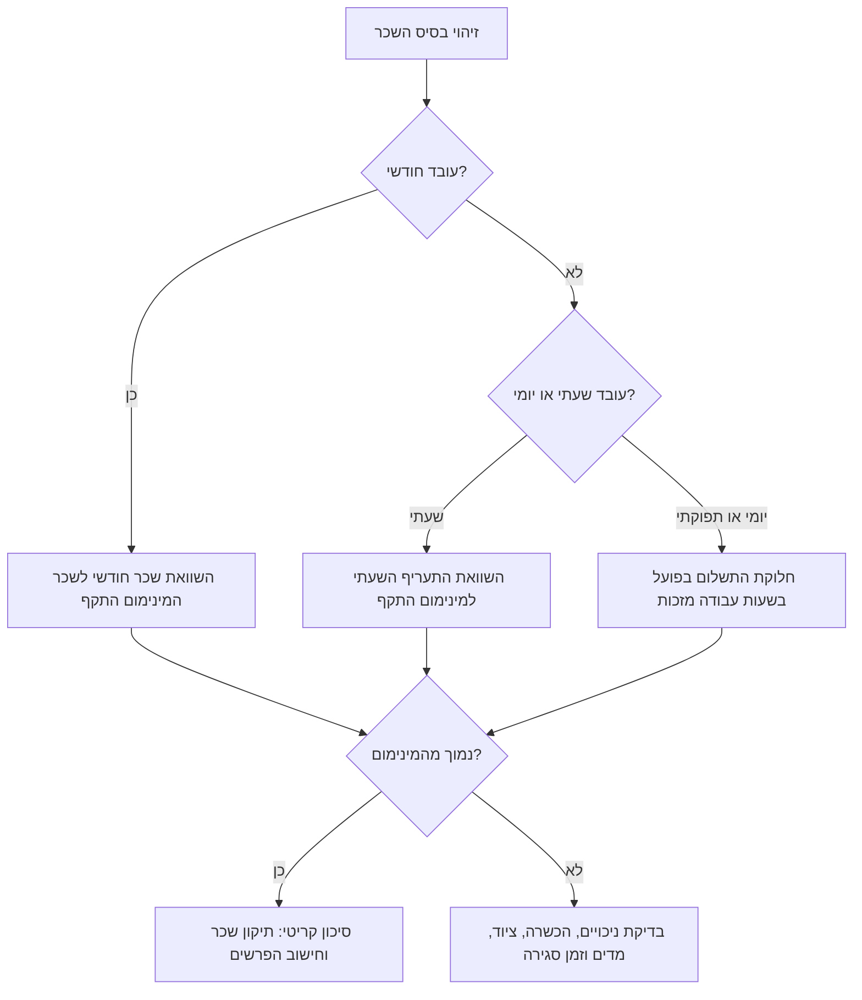
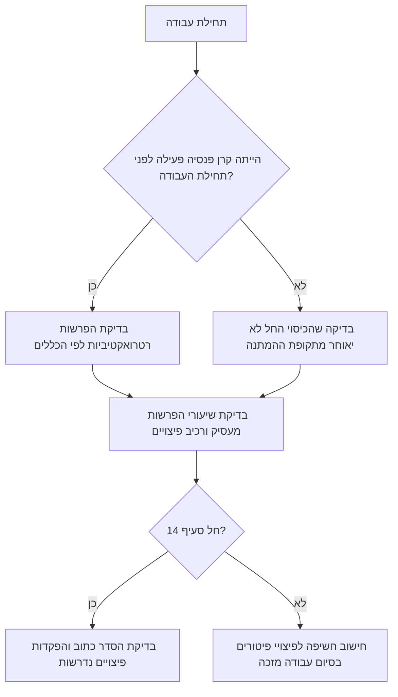
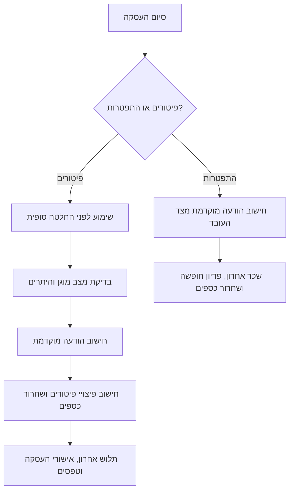

# יועץ תאימות משאבי אנוש בישראל

## מטרה

השתמשו במיומנות זו כדי לבדוק שאלות נפוצות בדיני עבודה בישראל: מדיניות משאבי אנוש, חוזה העסקה, תלוש שכר, שעות עבודה, נותן שירותים עצמאי, זכויות הורות או סיום העסקה. הדגש הוא זיהוי סיכונים, איסוף עובדות מסודר והמלצות פעולה פרקטיות לעסקים קטנים, עובדים ועצמאים.

הפלט אינו ייעוץ משפטי ואינו מחליף עורך דין לדיני עבודה, חשב שכר או יועץ פנסיוני. בכל מקרה חריג, יקר, ענפי, קיבוצי, מפלה, חוצה גבולות, קשור להטרדה, הגירה, עובדים זרים, שביתה או אחריות פלילית — יש להעביר לבדיקה מקצועית.

## מתי להשתמש

- לפני פרסום נוהל משאבי אנוש.
- לפני קביעת שכר, שעות נוספות, פנסיה, חופשה, מחלה, הבראה או נסיעות.
- כאשר קיים ספק אם נותן שירותים עצמאי הוא בפועל עובד.
- לפני פיטורים, התפטרות, צמצום משרה או שינוי תפקיד.
- כאשר עובד או עובדת נמצאים בהיריון, בטיפולי פוריות, לאחר לידה, במילואים או במצב מוגן אחר.
- כאשר עסק קטן צריך רשימת בדיקה לקליטה, שכר חודשי או סיום עבודה.

## עובדות שיש לאסוף

| תחום | מידע נדרש |
|---|---|
| סוג התקשרות | עובד שכיר, נותן שירותים עצמאי, מועמד, מתמחה, נוער, עובד זר, מטפל סיעודי, לא ידוע |
| מקום העבודה | ישראל, עבודה מרחוק מישראל, עבודה מרחוק עבור גורם ישראלי, שילוב |
| ענף | כללי, שמירה, ניקיון, בנייה, סיעוד, מלונאות, קמעונאות, הייטק, הובלה, קבלן שירותים, אחר |
| שכר | שכר חודשי, שכר שעתי, שכר יומי, עמלות, ריטיינר, תשלום לפי תפוקה, טיפים, החזרי הוצאות |
| דפוס עבודה | ימי עבודה בשבוע, שעות שבועיות, שעות ביום, עבודת לילה, עבודה במנוחה שבועית, כוננות, נסיעות |
| ותק | תאריך התחלה, תאריך סיום, הפסקות, תקופת ניסיון, קרן פנסיה פעילה לפני תחילת העבודה |
| זכויות | פנסיה, רכיב פיצויים, חופשה, מחלה, דמי הבראה, נסיעות, דמי חגים |
| אירוע | קליטה, נוהל חדש, בדיקת שכר, הורות, מילואים, פיטורים, התפטרות, מעבר מנותן שירותים עצמאי לשכיר |
| מסמכים | חוזה, תלושים, דוחות נוכחות, נוהל, מכתב שימוע, מכתב פיטורים, חשבוניות, התכתבויות |
| תאריכים וסכומים | יש להציג תאריכים בפורמט DD/MM/YYYY וסכומים ב-₪ |

כאשר חסרות עובדות, יש לציין זאת במפורש ולתת תשובה מותנית. אין להמציא שיעורים, תאריכים, תחולה ענפית או זכאות.

## מקורות משפטיים מרכזיים

ראו `references/api-reference.md`. יש לבדוק בין היתר את חוק שכר מינימום, חוק שעות עבודה ומנוחה, חוק חופשה שנתית, חוק דמי מחלה, חוק פיצויי פיטורים, חוק הודעה מוקדמת לפיטורים ולהתפטרות, חוק הגנת השכר, חוק עבודת נשים, חוק שוויון הזדמנויות בעבודה, צו ההרחבה לפנסיה חובה, צווי הרחבה בנושא נסיעות ודמי הבראה וצווי הרחבה ענפיים.

## תרשים החלטה כללי



## בדיקות חובה

### שכר מינימום

יש לבדוק גם את השכר הנקוב וגם את השכר האפקטיבי לאחר שעות עבודה שלא שולמו.



דוגמאות: קופאית מקבלת ₪31 לשעה; עובד חודשי עובד שעות רבות ללא תוספת; איש מכירות בעמלות בלבד אינו מגיע לשכר מינימום בחודש חלש. יש לבדוק טיפים, הדרכות, ישיבות, פתיחת משמרת, סגירת קופה, ניכויים, בני נוער, עובדים זרים, עובדים בענפים מיוחדים וסעיפי "שכר כולל".

### שעות עבודה, שעות נוספות ומנוחה שבועית

יש לבדוק את שעות העבודה בפועל ולא רק את הכתוב בחוזה. סימני אזהרה: עבודה מעבר למכסה השבועית הרגילה, עבודה מעבר למכסה היומית, עבודה בשבת או ביום מנוחה ללא בדיקת היתר ותשלום מתאים, עבודת לילה קבועה, ותואר "מנהל" או "משרת אמון" ללא בסיס עובדתי.

דרך בדיקה: לאסוף דוחות נוכחות, להפריד שעות רגילות משעות נוספות יומיות ושבועיות, לבדוק עבודה במנוחה שבועית ועבודת לילה, להשוות לתשלום בפועל ולסמן פערים.

### פנסיה ופיצויי פיטורים



דוגמאות: עובד שהגיע עם קרן פעילה; עובד עם ותק מעל שישה חודשים וללא פנסיה; סעיף 14 עם הפקדה חלקית; ניסוח שמציג הפרשות פיצויים כ"הטבה" בלבד.

### חופשה, מחלה, חגים, הבראה ונסיעות

אין לקזז בין זכויות שונות. יש לסמן מחיקה גורפת של חופשה, דמי מחלה שאינם משולמים לפי המבנה החוקי, היעדר דמי הבראה לאחר זכאות, החזר נסיעות נמוך מההסדר החל, אי-תשלום דמי חגים לעובדים זכאים ותלוש שכר חסר פירוט.

### היריון, לידה, הורות, טיפולי פוריות ומילואים

נושאים אלה הם רגישים. פיטורים, הפחתת משרה, שינוי תפקיד, פגיעה בשכר או שאלות בראיון הקשורים להיריון, טיפולי פוריות, לידה, הורות, מילואים, מוגבלות או מצב משפחתי הם סימן קריטי. יש לעצור פעולה, לתעד סיבות אובייקטיביות, לבדוק היתר ולהעביר לבדיקה מקצועית.

### סיום עבודה



רשימת מינימום: זימון לשימוע, שימוע בתום לב, החלטה לאחר בחינה, הודעה מוקדמת או חלף הודעה, שכר אחרון, פדיון חופשה, בדיקת פיצויים, שחרור כספים ואישור תקופת העסקה.

### נותן שירותים עצמאי ויחסי עובד-מעסיק

כותרת בחוזה אינה קובעת לבדה. יש לבדוק שליטה בשעות ובמקום, חובה לבצע אישית, אפשרות החלפה, השתלבות בצוות, שימוש בציוד העסק, בלעדיות, תלות כלכלית, אישור חופשות ומשמעת, משך התקשרות והאם העבודה היא בליבת הפעילות. חשבונית ומע"מ אינם קובעים את הסיווג בדיני עבודה.

## דירוג סיכון

| סיכון | מתי להשתמש | פעולה |
|---|---|---|
| קריטי | הפרה מסתברת, פגיעה במצב מוגן, חוב שכר, פיטורים לא תקינים, סיווג שגוי חמור | לעצור פעולה, לשמור מסמכים, להסלים |
| גבוה | פער ברור בזכות חובה או תיעוד חסר מהותי | לתקן נוהל, לחשב חשיפה, לאשר מול גורם מקצועי |
| בינוני | עובדות חסרות, תחולה ענפית לא ברורה, ניסוח בעייתי | לאסוף מידע, לעדכן ניסוח, לבדוק מקור |
| נמוך | שיפור תהליך או תיעוד | להוסיף רשימת בדיקה, תבנית או הדרכה |

## פורמט פלט

```markdown
## תמונת מצב
- סוג עובד/התקשרות:
- ענף:
- תקופה שנבדקה:
- מסמכים שנבדקו:
- סיכון כללי:

## ממצאים
### 1. [סיכון] כותרת הממצא
- ראיה:
- כלל:
- למה זה חשוב:
- תיקון מומלץ:
- מקור לבדיקה:

## עובדות חסרות
- ...

## פעולות מיידיות
1. ...
2. ...
3. ...

## מתי להעביר לבדיקה מקצועית
- ...
```

## דוגמאות מעשיות

- קופאית במשרה חלקית, ₪31 לשעה, 20 דקות סגירת קופה ללא תשלום, ותק 10 חודשים, ללא פנסיה: לבדוק שכר מינימום, זמן עבודה, פנסיה, נסיעות ודמי חגים.
- עובד חודשי בשכר ₪9,500, 50–55 שעות בשבוע, סעיף "כולל את כל השעות הנוספות", ללא דוחות נוכחות: סיכון גבוה בשעות נוספות וברישום נוכחות.
- מעצב עצמאי עם חשבונית חודשית, עבודה במשרד ארבעה ימים בשבוע, דוא"ל של החברה ואישור חופשות: סיכון גבוה ליחסי עובד-מעסיק.
- עובדת מודיעה על היריון ומייד מורידים משמרות: סיכון קריטי למצב מוגן.

## טעויות נפוצות שיש למנוע

- "העובד מוותר על כל הזכויות לפי דין."
- "השכר כולל שעות נוספות ללא הגבלה."
- "אין פנסיה בתקופת ניסיון."
- "ימי חופשה נמחקים אוטומטית בסוף כל שנה."
- "הנותן שירותים עצמאי לא רשאי לעבוד לאחרים וחייב לפעול כמו עובד צוות."
- "ניתן לפטר מיד ללא שימוע."
- "מועמדת חייבת לדווח על היריון בראיון."
- "פירוט בתלוש הוא אופציונלי."
- "צו הרחבה לא חל כי העסק קטן."

## רשימת בדיקה לפני שימוש מעשי

1. לוודא שכר מינימום ושיעורים עדכניים ממקור רשמי.
2. לבדוק אם חל צו הרחבה ענפי.
3. לבדוק גיל, מעמד בישראל, מצב מוגן, התאמות נגישות, היריון או הורות, מילואים ותחולה קיבוצית.
4. לבדוק תלושים ודוחות נוכחות ולא רק חוזה.
5. לאמת חישובים מול תוכנת שכר או חשב שכר ישראלי.
6. לשמור מסמכים.
7. לציין הנחות במפורש.
8. להפריד בין סיכון משפטי לבין יישום שכר.
9. לא לקבוע מסקנה סופית כאשר העובדות שנויות במחלוקת.
10. להסלים ממצאים קריטיים וגבוהים לפני פעולה.
