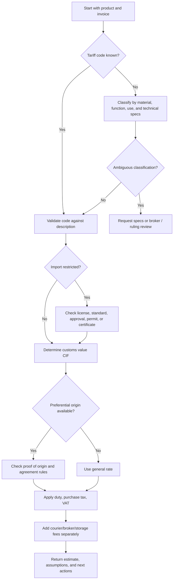

# Import/Export Tariff Advisor

Estimate Israeli customs duty, purchase tax, and VAT on imported goods using Israeli Customs tariff classification logic and official tariff-code lookup sources. Use this skill to guide small businesses, freelancers, and consumers through import-cost estimation, document preparation, and risk checks before ordering goods from abroad.

This skill produces an estimate, not a binding customs ruling. For high-value, regulated, ambiguous, or recurring commercial imports, verify the tariff code, exemptions, import legality, and valuation treatment with official Israeli Customs resources or a licensed customs broker.

## What this skill does

Use this skill to:

- Identify likely Israeli tariff headings and decision factors for a product.
- Estimate customs duty, purchase tax, VAT, and landed cost.
- Compare consumer imports, commercial imports, samples, returned goods, repairs, gifts, and drop-shipping scenarios.
- Explain which documents are needed for customs clearance.
- Flag common problems: wrong HS code, missing import license, undervalued invoice, hidden freight cost, purchase tax categories, and courier handling fees.
- Produce a structured result that can be saved, reviewed, or handed to a broker.

Do not use this skill to invent an official tariff code when the product description is weak. Ask for a more precise description, technical specification, material composition, intended use, value, origin, shipping cost, and import purpose.

## Web-validated defaults and live-rule cautions

Validated on 02/06/2026:

- Use 18% as the default VAT rate for estimates, because official sources confirm the increase from 17% to 18% from 01/01/2025.
- Treat personal-import thresholds as live rules. A temporary 2026 increase to the personal-import exemption was not a stable baseline after 01/06/2026, so verify the current threshold on the estimate date.
- Use the Israeli Customs and Purchase Tax Tariff and the Tax Authority personal-import calculator as official web sources, not as a guaranteed public API.
- For filing-level estimates, use official customs exchange-rate logic rather than a marketplace or credit-card estimate.

## Required inputs

Collect these fields before estimating:

| Field | Why it matters | Example |
|---|---|---|
| Product description | Drives tariff classification | "Bluetooth over-ear headphones with lithium battery" |
| Tariff code if known | Enables direct rate lookup | "8518.30..." |
| Commercial or personal use | Changes document and exemption assumptions | "Small business resale" |
| Goods value | Customs valuation base | 1,200 USD |
| Currency | Convert before calculating | USD, EUR, GBP, ILS |
| Shipping and insurance | Usually part of CIF customs value | 75 USD shipping, 0 insurance |
| Quantity | Reveals commercial scale and unit duties | 20 units |
| Origin country | Preferential rates may apply | Germany, China, USA |
| Importer type | Consumer, exempt dealer, VAT-registered dealer, company | Licensed dealer |
| Restrictions | Standards, communications approval, food, cosmetics, medical device, vehicle parts | "Wi-Fi device" |
| Date of estimate | Rates can change | 15/04/2026 |

## Core concepts

### Customs value

Israeli import taxes normally start from the customs value, typically the CIF value:

```text
customs_value_ils = goods_value_ils + international_shipping_ils + insurance_ils + adjustments
```

Adjustments may include royalties, assists, packing, commissions, or other additions under customs valuation rules. Domestic delivery after import is normally separated when the invoice supports the split.

### Customs duty

Customs duty is applied using the tariff code and origin treatment:

```text
customs_duty = customs_value_ils × customs_duty_rate
```

Some lines can include specific duties per unit, weight, volume, alcohol content, vehicle attributes, or mixed formulas. Do not force every product into a simple ad-valorem calculation.

### Purchase tax

Purchase tax is not universal. It applies to categories such as certain vehicles, vehicle parts, tobacco, alcohol, electronics, and other scheduled goods. The tax base may include customs value plus customs duty and may include special calculation rules.

Use the configured rate only when a tariff lookup or official source confirms the category.

### VAT

VAT is usually charged on the import VAT base, commonly including customs value, customs duty, purchase tax, and some clearance-related charges. The default VAT rate in the included helper is configurable. Verify the current official VAT rate before production use.

```text
vat_base = customs_value_ils + customs_duty + purchase_tax + taxable_fees
vat = vat_base × vat_rate
```

## Decision tree



## Classification guide

Classify goods in this order:

1. Identify the product's primary function.
2. Determine composition and technology.
3. Identify whether the product is a complete article, part, accessory, kit, set, raw material, or sample.
4. Check whether a more specific heading overrides a general heading.
5. Review chapter notes and exclusions.
6. Match the Israeli tariff subheading and local suffix.
7. Confirm whether purchase tax, mandatory standard, communications approval, health approval, or other import condition applies.
8. Record uncertainty and alternatives.

### Good product descriptions

Use detailed descriptions:

- "Men's cotton knitted T-shirt, 100% cotton, 180 gsm, for retail resale, country of origin Turkey."
- "Rechargeable lithium-ion power bank, 20,000 mAh, USB-C PD 65W, country of origin China."
- "Stainless steel insulated bottle, vacuum flask, 750 ml, for promotional gifts."
- "Desktop FDM 3D printer, heated bed, no laser module, for business prototyping."

Avoid vague descriptions:

- "Electronics"
- "Parts"
- "Samples"
- "Accessories"
- "Machine"
- "Toy thing"

## Estimation formula

Use this sequence:

1. Convert goods, freight, insurance, and fees to ILS.
2. Calculate customs value.
3. Apply customs duty.
4. Apply purchase tax if applicable.
5. Calculate VAT base.
6. Apply VAT.
7. Add non-tax fees separately.
8. Show assumptions, source date, and confidence.

Example formula:

```text
customs_value = goods_value + shipping + insurance
customs_duty = customs_value × duty_rate
purchase_tax = (customs_value + customs_duty) × purchase_tax_rate
vat_base = customs_value + customs_duty + purchase_tax + taxable_fees
vat = vat_base × vat_rate
total_import_taxes = customs_duty + purchase_tax + vat
landed_cost = customs_value + total_import_taxes + non_tax_fees
```

## Concrete examples

### Example 1: Consumer imports headphones

Inputs:

- Goods: Bluetooth headphones
- Goods value: 120 USD
- Shipping: 20 USD
- Insurance: 0
- Exchange rate: 3.70 ILS/USD
- Duty rate: 0%
- Purchase tax: 0%
- VAT: 18%
- Courier fee: 35 ILS, treated as non-tax fee for this estimate

Calculation:

```text
customs_value = (120 + 20) × 3.70 = 518.00 ILS
customs_duty = 0.00
purchase_tax = 0.00
vat = 518.00 × 18% = 93.24 ILS
landed_cost = 518.00 + 93.24 + 35.00 = 646.24 ILS
```

Result: estimate about 93.24 ILS import VAT plus courier fee.

Caution: Wireless products may require communications approval depending on product type and import route.

### Example 2: Freelancer imports a laptop for work

Inputs:

- Goods: laptop computer
- Goods value: 1,000 USD
- Shipping: 60 USD
- Exchange rate: 3.70
- Duty rate: 0%
- Purchase tax: 0%
- VAT: 18%
- Importer: VAT-registered freelancer

Calculation:

```text
customs_value = 1,060 × 3.70 = 3,922.00 ILS
vat = 3,922.00 × 18% = 705.96 ILS
```

Result: pay VAT at import. A VAT-registered business may be able to claim input VAT if the import is for taxable business activity and documentation is valid.

### Example 3: Small business imports wine

Inputs:

- Goods: wine for resale
- Customs value: 12,000 ILS
- Duty: example 12%
- Purchase tax: example 20%
- VAT: 18%

Calculation:

```text
customs_duty = 12,000 × 12% = 1,440
purchase_tax = (12,000 + 1,440) × 20% = 2,688
vat_base = 12,000 + 1,440 + 2,688 = 16,128
vat = 16,128 × 18% = 2,903.04
taxes = 1,440 + 2,688 + 2,903.04 = 7,031.04
```

Caution: Alcohol imports require regulatory review. Unit-based alcohol taxes or special rules may apply.

### Example 4: Returned repaired item

Inputs:

- Original item exported from Israel for repair
- Repair charge: 150 EUR
- Return shipping: 40 EUR
- Exchange rate: 4.00
- Duty rate: 0%
- VAT: 18%

Possible treatment:

```text
customs_value may be repair cost + return freight, not the full original item value, if documentation proves temporary export and repair.
taxable_base = (150 + 40) × 4.00 = 760 ILS
vat = 136.80 ILS
```

Caution: Without export proof and repair invoice, customs may treat the full item value as imported.

## Edge cases

### Gifts

A gift is not automatically tax-free. Customs may still tax based on fair market value, shipping, and import rules. Declaring a commercial purchase as a gift is an anti-pattern.

### Samples

Samples can still be dutiable and taxable. Marking goods as "sample" does not replace classification, valuation, or import approvals. Some sample shipments qualify for special treatment only when unusable for sale or supported by proper documentation.

### Used goods

Used condition can affect declared value but does not remove classification requirements. Provide proof of actual paid price and realistic market value.

### Warranty replacement

A replacement item may still require import processing. Keep warranty approval, original import documents, export documents, and supplier correspondence.

### Mixed shipment

Calculate each tariff line separately. Do not apply one duty rate to a mixed invoice unless all goods genuinely share the same tariff code and tax treatment.

### Kits and sets

A retail set may classify by essential character. A commercial kit with separable items may need line-by-line classification.

### Drop-shipping

The importer of record, customer identity, payment trail, and shipping route matter. Ensure the declared value reflects the actual transaction and not only the supplier's internal cost.

### Digital services and software

Physical media and equipment follow import rules. Pure digital services usually fall outside customs clearance but may have separate VAT rules.

### Courier de minimis and personal import assumptions

Thresholds and relief rules can change. Treat consumer threshold logic as a live-rule lookup, not a permanent hard-coded fact. Verify current Tax Authority guidance for personal imports before quoting relief.

## Anti-patterns

Avoid these practices:

- Selecting a tariff code only because it has the lowest duty.
- Ignoring purchase tax on product categories known to carry it.
- Estimating VAT only on the product price while ignoring freight.
- Combining commercial and personal assumptions in one estimate.
- Treating courier fees, storage, and broker fees as government taxes.
- Using foreign HS 6-digit code as a complete Israeli tariff code without local suffix validation.
- Ignoring mandatory standards or import licenses.
- Failing to keep exchange-rate source and date.
- Failing to split mixed invoices by line item.
- Presenting an uncertain code as final.

## Troubleshooting quick guide

| Symptom | Likely cause | Action |
|---|---|---|
| Courier charged more than estimate | Handling, storage, broker fee, VAT base difference | Request tax breakdown and customs entry |
| Tariff code differs from supplier invoice | Supplier used export HS, not Israeli import code | Validate Israeli tariff code |
| VAT charged despite duty-free item | Duty exemption does not equal VAT exemption | Recalculate VAT base |
| Shipment held | Missing approval, permit, invoice, ID, or import declaration | Review hold notice and documents |
| Purchase tax unexpected | Product category has purchase tax | Check tariff line notes and purchase tax schedule |
| Estimate too low | Freight, insurance, exchange, or taxable fees omitted | Rebuild CIF and VAT base |

## Production checklist

Before relying on an estimate:

- Confirm the Israeli tariff code from an official source or professional classification.
- Confirm customs duty, purchase tax, and VAT rates for the estimate date.
- Confirm whether an import license, standard, communications approval, food/cosmetics approval, or other permit is needed.
- Use a documented exchange rate and date.
- Include freight and insurance in customs value unless a specific rule says otherwise.
- Separate taxable government charges from broker/courier service fees.
- Split mixed shipments by tariff line.
- Keep invoices, proof of payment, freight invoice, origin documents, permits, and correspondence.
- Record assumptions and confidence level.
- Have high-value or recurring imports reviewed before ordering.

## Output format

Return a compact estimate plus an audit trail:

```json
{
  "currency": "ILS",
  "customs_value": 3922.0,
  "customs_duty": 0.0,
  "purchase_tax": 0.0,
  "vat": 705.96,
  "total_taxes": 705.96,
  "non_tax_fees": 80.0,
  "landed_cost": 4707.96,
  "assumptions": [
    "Duty rate supplied by user: 0%",
    "VAT rate configured: 18%",
    "No purchase tax applied",
    "Exchange rate supplied by user: 3.70"
  ],
  "warnings": [
    "Verify tariff code and VAT rate against official sources before filing"
  ]
}
```

## When to recommend a broker

Recommend professional review when:

- Goods value is high.
- Product is regulated.
- Import will repeat.
- Classification is ambiguous.
- Purchase tax applies.
- Preferential origin is claimed.
- The importer needs accounting documentation for VAT recovery.
- Customs has challenged a previous shipment.
- The shipment includes alcohol, tobacco, vehicle parts, cosmetics, food, supplements, medical devices, communications equipment, or dual-use goods.
