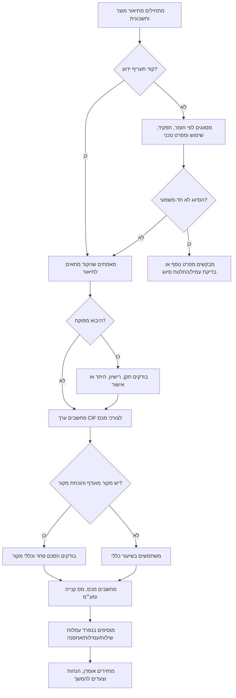

# יועץ מכס ומסי יבוא/יצוא

השתמשו במיומנות זו כדי לאמוד מכס, מס קנייה ומע״מ על יבוא לישראל לפי סיווג טובין וקודי תעריף של רשות המסים. המיומנות מיועדת לעסקים קטנים, עצמאיות ועצמאים, יבואנים מזדמנים וצרכנים שרוצים להבין את העלות הצפויה לפני הזמנה מחו״ל.

התוצאה היא אומדן עבודה בלבד ואינה קביעה מחייבת של רשות המסים. ביבוא מסחרי חוזר, בטובין מפוקחים, בסכומים גבוהים או כאשר הסיווג אינו חד-משמעי, יש לאמת את קוד התעריף, שיעורי המס, תנאי היבוא והמסמכים מול מקורות רשמיים או עמיל מכס מורשה.

## מה המיומנות עושה

המיומנות מסייעת לבצע את הפעולות הבאות:

- לזהות כיוון סיווג אפשרי לפי תיאור הטובין, החומר, השימוש והמאפיינים הטכניים.
- לאמוד ערך לצורכי מכס, מכס, מס קנייה, מע״מ ועלות נחיתה.
- להבדיל בין יבוא אישי, יבוא מסחרי, דוגמאות, החזרת טובין מתיקון, מתנות, יבוא באחריות ושילוח ישיר מספק ללקוח.
- להכין רשימת מסמכים לשחרור מהמכס.
- להתריע על סיכונים נפוצים: קוד תעריף שגוי, חוסר באישור תקן, ערך חשבונית לא סביר, מס קנייה לא צפוי, עלויות שילוח שלא נכללו ועמלות חברת שילוח.
- להפיק תוצאה מסודרת שאפשר לשמור, להעביר לרואה חשבון או לבדוק מול עמיל מכס.

אין להמציא קוד תעריף רשמי כאשר תיאור המוצר דל. יש לבקש תיאור מדויק, מפרט טכני, חומר, שימוש, ערך, מדינת מקור, עלות משלוח, ביטוח ומטרת היבוא.

## ברירות מחדל מאומתות והסתייגויות מכללים משתנים

נבדק ביום 02/06/2026:

- השתמשו ב-18% כברירת מחדל למע״מ באומדן, משום שמקורות רשמיים מאשרים את העלאת השיעור מ-17% ל-18% החל מ-01/01/2025.
- התייחסו לספי יבוא אישי ככללים משתנים בזמן אמת. העלאה זמנית בשנת 2026 לא הפכה לבסיס יציב לאחר 01/06/2026, ולכן יש לבדוק את הסף התקף בתאריך האומדן.
- השתמשו בתעריף המכס ומס הקנייה ובמחשבון מסי היבוא של רשות המסים כמקורות רשמיים באינטרנט, ולא כחוזה ממשק תכנות ציבורי מובטח.
- לצורך אומדן ברמת הגשה, השתמשו בכללי שער המכס הרשמיים ולא בשער של אתר מסחר או חברת אשראי.

## נתוני חובה

אספו את הנתונים הבאים לפני חישוב:

| נתון | למה הוא חשוב | דוגמה |
|---|---|---|
| תיאור הטובין | בסיס הסיווג | "אוזניות Bluetooth נטענות עם סוללת ליתיום" |
| קוד תעריף אם ידוע | מאפשר בדיקת שיעורי מס | "8518.30..." |
| יבוא אישי או מסחרי | משפיע על הנחות, מסמכים וסיכון | "יבוא לעסק קטן לצורך מכירה" |
| ערך הטובין | בסיס הערך לצורכי מכס | 1,200 דולר |
| מטבע | נדרש להמרה לשקלים | USD, EUR, GBP, ILS |
| משלוח וביטוח | בדרך כלל חלק מערך CIF | 75 דולר משלוח, ללא ביטוח |
| כמות | משפיעה על אופי היבוא ועל מסים ליחידה | 20 יחידות |
| מדינת מקור | עשויה להשפיע על שיעור מכס מועדף | גרמניה, סין, ארה״ב |
| סוג היבואן | צרכן, עוסק פטור, עוסק מורשה, חברה | עוסק מורשה |
| דרישות רגולטוריות | תקן, תקשורת, מזון, קוסמטיקה, ציוד רפואי, חלקי רכב | "מוצר עם Wi‑Fi" |
| תאריך האומדן | שיעורי מס ונהלים משתנים | 15/04/2026 |

## מושגי בסיס

### ערך לצורכי מכס

נקודת הפתיחה היא בדרך כלל ערך CIF:

```text
ערך_מכס_בשח = ערך_טובין_בשח + משלוח_בינלאומי_בשח + ביטוח_בשח + התאמות
```

התאמות יכולות לכלול תמלוגים, אריזה, סיוע ייצור, עמלות או רכיבים נוספים לפי כללי הערכת טובין. הובלה מקומית לאחר היבוא תופרד רק כאשר המסמכים תומכים בכך.

### מכס

מכס מחושב לפי קוד התעריף והטיפול במדינת המקור:

```text
מכס = ערך_מכס × שיעור_מכס
```

יש פרטי מכס עם מס קצוב לפי יחידה, משקל, נפח, אחוז אלכוהול, מאפייני רכב או נוסחה משולבת. אין לכפות חישוב אחוזי פשוט על כל מוצר.

### מס קנייה

מס קנייה חל רק על טובין מסוימים, למשל כלי רכב וחלקים מסוימים, אלכוהול, טבק, מוצרים אלקטרוניים מסוימים וקטגוריות נוספות לפי צווי מס קנייה. בסיס המס עשוי לכלול את ערך המכס בתוספת מכס, ולעיתים כללים מיוחדים.

יש להשתמש בשיעור מס קנייה רק כאשר קוד התעריף או מקור רשמי מאשרים שהוא חל.

### מע״מ ביבוא

מע״מ מחושב בדרך כלל על בסיס הכולל את ערך המכס, מכס, מס קנייה וחיובים מסוימים הקשורים לשחרור. שיעור ברירת המחדל בכלי העזר ניתן לשינוי. לפני שימוש תפעולי יש לבדוק את שיעור המע״מ הרשמי התקף.

```text
בסיס_מע״מ = ערך_מכס + מכס + מס_קנייה + חיובים_חייבים
מע״מ = בסיס_מע״מ × שיעור_מע״מ
```

## עץ החלטה



## מדריך סיווג

סווגו לפי הסדר הבא:

1. הגדירו את התפקיד העיקרי של המוצר.
2. בדקו חומר, טכנולוגיה ומאפיינים טכניים.
3. קבעו אם מדובר במוצר שלם, חלק, אביזר, ערכה, מערכת, חומר גלם או דוגמה.
4. העדיפו פרט מכס ספציפי על פני פרט כללי.
5. בדקו הערות פרקים והחרגות.
6. התאימו לתת-פרט ישראלי מלא, ולא רק לקוד סיווג בינלאומי בן 6 ספרות.
7. בדקו מס קנייה, תקן רשמי, אישור תקשורת, אישור בריאות, היתר יבוא או תנאי יבוא אחר.
8. תעדו רמת ודאות וחלופות אפשריות.

### תיאור מוצר טוב

דוגמאות לתיאור מספק:

- "חולצת T סרוגה לגברים, 100% כותנה, 180 גרם למ״ר, למכירה קמעונאית, מקור טורקיה."
- "מטען נייד ליתיום‑יון, 20,000mAh, USB‑C PD 65W, מקור סין."
- "בקבוק נירומערכתה מבודד בוואקום, 750 מ״ל, לחלוקה כמתנה שיווקית."
- "מדפסת תלת‑ממד שולחנית מסוג FDM, משטח מחומם, ללא מודול לייזר, לשימוש עסקי."

תיאורים חלשים:

- "אלקטרוניקה"
- "חלקים"
- "דוגמאות"
- "אביזרים"
- "מכונה"
- "צעצוע"

## נוסחת אומדן

בצעו את החישוב בסדר הבא:

1. המירו ערך טובין, משלוח, ביטוח ועמלות לשקלים.
2. חשבו ערך לצורכי מכס.
3. חשבו מכס.
4. חשבו מס קנייה אם חל.
5. חשבו בסיס מע״מ.
6. חשבו מע״מ.
7. הוסיפו עמלות שאינן מס בנפרד.
8. הציגו הנחות, מקור שער חליפין, תאריך ורמת ודאות.

```text
ערך_מכס = ערך_טובין + משלוח + ביטוח
מכס = ערך_מכס × שיעור_מכס
מס_קנייה = (ערך_מכס + מכס) × שיעור_מס_קנייה
בסיס_מע״מ = ערך_מכס + מכס + מס_קנייה + עמלות_חייבות
מע״מ = בסיס_מע״מ × שיעור_מע״מ
סך_מסים = מכס + מס_קנייה + מע״מ
עלות_נחיתה = ערך_מכס + סך_מסים + עמלות_שאינן_מס
```

## דוגמאות

### דוגמה 1: צרכן מייבא אוזניות

נתונים:

- מוצר: אוזניות Bluetooth
- ערך טובין: 120 דולר
- משלוח: 20 דולר
- ביטוח: 0
- שער חליפין: 3.70 ₪ לדולר
- מכס: 0%
- מס קנייה: 0%
- מע״מ: 18%
- עמלת חברת שילוח: 35 ₪, לא נכללת בבסיס המס באומדן זה

חישוב:

```text
ערך מכס = (120 + 20) × 3.70 = 518.00 ₪
מכס = 0.00 ₪
מס קנייה = 0.00 ₪
מע״מ = 518.00 × 18% = 93.24 ₪
עלות נחיתה = 518.00 + 93.24 + 35.00 = 646.24 ₪
```

תוצאה: אומדן מע״מ ביבוא בסך 93.24 ₪, בנוסף לעמלת שילוח.

הערה: מוצרים אלחוטיים עשויים לדרוש אישור תקשורת לפי סוג המוצר והמסלול.

### דוגמה 2: עצמאית מייבאת מחשב נייד לעסק

נתונים:

- מוצר: מחשב נייד
- ערך טובין: 1,000 דולר
- משלוח: 60 דולר
- שער חליפין: 3.70
- מכס: 0%
- מס קנייה: 0%
- מע״מ: 18%
- סוג יבואן: עוסקת מורשה

חישוב:

```text
ערך מכס = 1,060 × 3.70 = 3,922.00 ₪
מע״מ = 3,922.00 × 18% = 705.96 ₪
```

תוצאה: המע״מ משולם בשחרור. עוסק מורשה עשוי לנכות מס תשומות אם היבוא משמש לעסקה חייבת ויש מסמכים תקינים.

### דוגמה 3: עסק קטן מייבא יין

נתונים לדוגמה:

- מוצר: יין למכירה
- ערך מכס: 12,000 ₪
- מכס לדוגמה: 12%
- מס קנייה לדוגמה: 20%
- מע״מ: 18%

חישוב:

```text
מכס = 12,000 × 12% = 1,440 ₪
מס קנייה = (12,000 + 1,440) × 20% = 2,688 ₪
בסיס מע״מ = 12,000 + 1,440 + 2,688 = 16,128 ₪
מע״מ = 16,128 × 18% = 2,903.04 ₪
סך מסים = 7,031.04 ₪
```

אזהרה: יבוא אלכוהול דורש בדיקה רגולטורית. ייתכנו מסים קצובים וכללים מיוחדים.

### דוגמה 4: פריט שחזר מתיקון

נתונים:

- פריט נשלח מישראל לתיקון וחזר
- עלות תיקון: 150 אירו
- משלוח חזרה: 40 אירו
- שער חליפין: 4.00
- מכס: 0%
- מע״מ: 18%

טיפול אפשרי:

```text
ערך לצורכי מכס עשוי להיות עלות התיקון + משלוח חזרה, אם קיימים מסמכי יצוא זמני וחשבונית תיקון.
בסיס חייב = (150 + 40) × 4.00 = 760 ₪
מע״מ = 136.80 ₪
```

ללא מסמכים, המכס עלול להתייחס לפריט כאילו יובא מחדש לפי ערכו המלא.

## מקרי קצה

### מתנות

מתנה אינה פטורה אוטומטית ממסים. המכס רשאי למסות לפי שווי שוק, עלות משלוח וכללי יבוא. אין לסווג רכישה מסחרית כמתנה.

### דוגמאות

דוגמה מסחרית עדיין עשויה להיות חייבת במכס ובמע״מ. הכיתוב "דוגמה" אינו מחליף סיווג, ערך או אישורי יבוא.

### טובין משומשים

מצב משומש עשוי להשפיע על הערך המוצהר, אך אינו מבטל צורך בסיווג. שמרו אסמכתאות למחיר ששולם ולשווי שוק סביר.

### החלפה באחריות

מוצר חלופי יכול עדיין לעבור שחרור יבוא. שמרו אישור אחריות, מסמכי היבוא המקוריים, מסמכי יצוא והתכתבויות עם הספק.

### משלוח מעורב

חשבו כל שורת טובין בנפרד. אין להשתמש בשיעור מכס אחד לכל החשבונית אם יש מוצרים עם סיווגים שונים.

### ערכות ומערכות

מערכת קמעונאי עשוי להיות מסווג לפי האופי העיקרי. ערכה מסחרית עם פריטים נפרדים עשויה לדרוש סיווג לכל פריט.

### שילוח ישיר מספק ללקוח

חשובים זהות היבואן הרשום, זהות הלקוח, שרשרת התשלום ומסלול המשלוח. הערך המוצהר צריך לשקף את העסקה האמיתית.

### שירותים דיגיטליים ותוכנה

מדיה פיזית וציוד כפופים לכללי יבוא. שירותים דיגיטליים טהורים בדרך כלל אינם משתחררים במכס, אך עשויים להיות כפופים לכללי מע״מ אחרים.

### ספי יבוא אישי

ספי הקלה ליבוא אישי משתנים. אין לקבע אותם בקוד ללא בדיקה מול רשות המסים במועד החישוב.

## טעויות נפוצות

הימנעו מהפעולות הבאות:

- בחירת קוד תעריף רק משום ששיעור המכס נמוך.
- התעלמות ממס קנייה בקטגוריות שבהן הוא חל.
- חישוב מע״מ רק על מחיר המוצר, ללא משלוח.
- ערבוב הנחות של יבוא אישי ויבוא מסחרי.
- הצגת עמלות חברת שילוח כאילו הן מס ממשלתי.
- שימוש בקוד סיווג בינלאומי זר בן 6 ספרות כאילו הוא קוד ישראלי מלא.
- התעלמות מתקנים, רישיונות ואישורים.
- אי תיעוד שער חליפין ותאריך.
- אי פיצול חשבונית מעורבת לפי שורות.
- הצגת סיווג לא ודאי כסופי.

## פתרון תקלות מהיר

| סימפטום | סיבה אפשרית | פעולה מומלצת |
|---|---|---|
| חברת השילוח גבתה יותר מהאומדן | עמלה, אחסנה, עמילות או בסיס מע״מ שונה | לבקש פירוט חיובים ורשימון |
| קוד התעריף שונה מזה שבחשבונית הספק | הספק השתמש בקוד יצוא זר | לאמת קוד תעריף ישראלי |
| נגבה מע״מ למרות שאין מכס | פטור ממכס אינו פטור ממע״מ | לחשב מחדש בסיס מע״מ |
| המשלוח נעצר | חסר אישור, תקן, חשבונית, ת״ז או הצהרה | לבדוק הודעת עיכוב ומסמכים |
| הופיע מס קנייה לא צפוי | המוצר שייך לקטגוריה חייבת | לבדוק פרט תעריף וצווי מס קנייה |
| האומדן נמוך מדי | לא נכללו משלוח, ביטוח, שער או עמלות חייבות | לבנות מחדש ערך CIF ובסיס מע״מ |

## רשימת בדיקה לפני שימוש תפעולי

- לאמת קוד תעריף ישראלי במקור רשמי או מול בעל מקצוע.
- לאמת מכס, מס קנייה ומע״מ לתאריך האומדן.
- לבדוק אם נדרש רישיון יבוא, תקן, אישור תקשורת, אישור בריאות או היתר אחר.
- להשתמש בשער חליפין מתועד ובתאריך בפורמט DD/MM/YYYY.
- לכלול משלוח וביטוח בערך לצורכי מכס, אלא אם כלל ספציפי קובע אחרת.
- להפריד מסים ממשלתיים מעמלות עמיל/חברת שילוח/אחסנה.
- לפצל משלוח מעורב לפי שורות תעריף.
- לשמור חשבוניות, הוכחות תשלום, מסמכי משלוח, מסמכי מקור, אישורים והתכתבויות.
- לתעד הנחות ורמת ודאות.
- להעביר יבוא יקר, חוזר או מפוקח לבדיקה מקצועית לפני הזמנה.

## מבנה תוצאה מומלץ

```json
{
  "currency": "ILS",
  "customs_value": 3922.0,
  "customs_duty": 0.0,
  "purchase_tax": 0.0,
  "vat": 705.96,
  "total_taxes": 705.96,
  "non_tax_fees": 80.0,
  "landed_cost": 4707.96,
  "assumptions": [
    "שיעור מכס שסופק: 0%",
    "שיעור מע״מ מוגדר: 18%",
    "לא חושב מס קנייה",
    "שער חליפין שסופק: 3.70"
  ],
  "warnings": [
    "יש לאמת קוד תעריף ושיעור מע״מ מול מקורות רשמיים לפני הגשה"
  ]
}
```

## מתי להפנות לעמיל מכס

הפנו לבדיקה מקצועית כאשר:

- ערך הטובין גבוה.
- המוצר מפוקח.
- היבוא צפוי להיות חוזר.
- הסיווג לא חד-משמעי.
- חל מס קנייה.
- נטענת העדפת מקור לפי הסכם סחר.
- נדרש מסמך חשבונאי לניכוי מס תשומות.
- המכס כבר חלק בעבר על סיווג או ערך.
- מדובר באלכוהול, טבק, חלקי רכב, קוסמטיקה, מזון, תוספי תזונה, ציוד רפואי, ציוד תקשורת או טובין דו-שימושיים.
