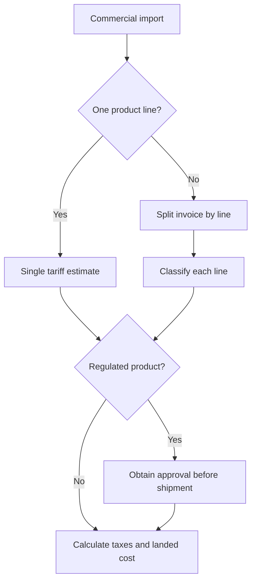

# Workflow Guide

Use these workflows as end-to-end operating procedures for Israeli import-cost estimates.

## Workflow 1: Consumer personal import estimate

Goal: Estimate expected taxes and delivery costs before buying online.

Inputs:

- Product description
- Product price
- Shipping and insurance
- Currency
- Importer's intended personal use
- Shipment quantity
- Seller country and origin country when known

Steps:

1. Confirm the item is for personal use and the quantity is plausible.
2. Ask for product page, invoice, or technical description.
3. Identify likely tariff heading.
4. Check if the item is controlled, wireless, food, cosmetic, medical, vehicle-related, or otherwise sensitive.
5. Convert price, freight, and insurance to ILS.
6. Apply confirmed or user-supplied duty rate.
7. Apply confirmed purchase tax only when applicable.
8. Apply VAT to the import VAT base.
9. Add courier service fees separately.
10. Return taxes, landed cost, assumptions, and documents to keep.

Output example:

```text
Estimated customs value: ₪518.00
Customs duty: ₪0.00
Purchase tax: ₪0.00
VAT: ₪93.24
Courier fee estimate: ₪35.00
Estimated landed cost: ₪646.24
```

## Workflow 2: Small business first commercial import

Goal: Help an Israeli business estimate taxes and avoid a clearance hold.

Inputs:

- Business status: exempt dealer, licensed dealer, company, nonprofit
- Product line list
- Quantity and unit price
- Supplier invoice and proforma invoice
- Freight quote
- Origin documents
- Intended resale or internal use
- Standards/import permits known

Steps:

1. Split invoice into separate product lines.
2. Classify each line separately.
3. Confirm whether the importer can import the goods commercially.
4. Check import legality and approvals.
5. Confirm Incoterms and whether freight/insurance are included.
6. Convert each amount to ILS.
7. Calculate taxes per line.
8. Add broker/courier/port/terminal/storage estimates separately.
9. Identify VAT input recovery considerations for a VAT-registered business.
10. Produce a summary for management and a detailed calculation appendix.

Decision point:



## Workflow 3: Purchase tax category review

Goal: Avoid surprise purchase tax.

Steps:

1. Identify whether the product belongs to a known purchase-tax family.
2. Check the tariff code and purchase tax order.
3. Determine whether tax is ad-valorem, specific, mixed, or formula-based.
4. Collect required unit data.
5. Calculate purchase tax base.
6. Include purchase tax in VAT base.
7. Flag uncertainty for broker review.

Common signals:

- Vehicle or vehicle part
- Alcohol or tobacco
- Entertainment electronics
- High-value consumer goods
- Special tariff notes

## Workflow 4: Preferential origin claim

Goal: Estimate whether a free-trade agreement lowers customs duty.

Steps:

1. Identify origin country, not only seller country.
2. Confirm direct shipment requirements.
3. Request proof of origin from supplier.
4. Compare general duty rate and preferential rate.
5. Check whether the tariff line is excluded or staged.
6. Calculate both scenarios.
7. Warn that missing or invalid proof can reverse the benefit.

Output should show:

```text
Scenario A: general rate
Scenario B: preferential rate with valid proof of origin
Savings: difference between A and B
```

## Workflow 5: Returned goods after repair

Goal: Estimate import treatment for an item sent abroad and returned.

Steps:

1. Confirm the item was previously in Israel.
2. Collect export documents or courier export receipt.
3. Collect repair invoice.
4. Collect warranty or RMA confirmation.
5. Determine whether tax base is repair cost, replacement value, or full value.
6. Include return freight and insurance when required.
7. Flag missing proof as a risk.

## Workflow 6: Mixed e-commerce shipment

Goal: Avoid applying one rate to unrelated goods.

Steps:

1. Parse invoice into line items.
2. Classify each product separately.
3. Allocate shipping by value, weight, or supplier allocation.
4. Calculate duty, purchase tax, and VAT per line.
5. Sum taxes and landed cost.
6. Explain allocation method.

## Workflow 7: Broker handoff package

Prepare a folder with:

- Commercial invoice
- Packing list
- Freight invoice or airway bill
- Proof of payment
- Product descriptions and datasheets
- Country-of-origin proof
- Import approvals, if any
- Prior rulings or previous customs entries
- Estimate spreadsheet or JSON output
- Questions requiring broker confirmation

## Workflow 8: Accounting handoff

For VAT-registered businesses, prepare:

- Import declaration or customs entry
- Supplier invoice
- Freight/broker invoices
- Proof of payment
- VAT amount at import
- Business purpose
- Asset vs inventory classification
- Exchange rate date used for bookkeeping

Caution: Input VAT recovery depends on Israeli VAT rules, business use, proper documentation, and the taxpayer's status.

## Workflow 9: Web-validated source check

Goal: verify that a rate or threshold is current before presenting an estimate.

Steps:

1. Open the Tax Authority VAT source and confirm the VAT rate for the estimate date.
2. Open the Customs and Purchase Tax Tariff service and confirm the tariff code and tax columns.
3. Open the personal-import calculator when the shipment is for personal use.
4. Check whether any personal-import relief is temporary or date-limited.
5. Check the Free Import Order or competent-authority page for regulated goods.
6. Record the URL, access date, exact snippet, and confidence level.
7. Re-run the estimate after correcting any stale rule.
