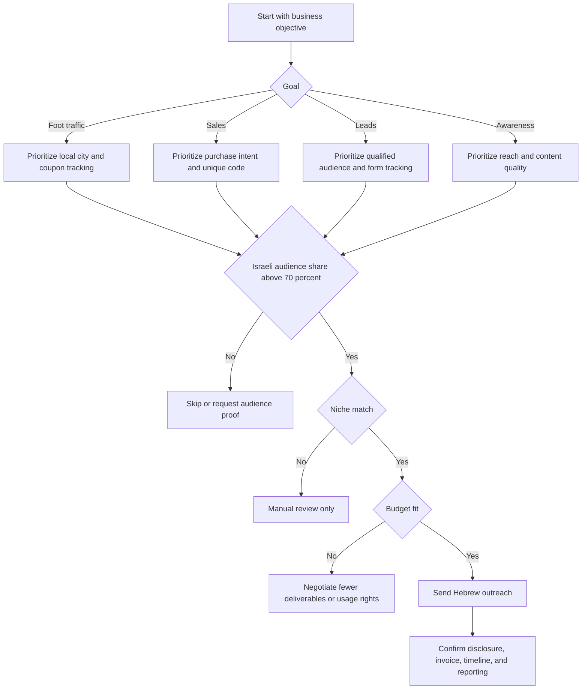

# Influencer Collaboration Helper

Use this skill to identify Israeli influencers across niches, prepare Hebrew outreach, compare creator fit, manage campaign operations, and track performance for small businesses, freelancers, and consumers. Apply it when the objective is practical collaboration planning rather than broad brand strategy.

## Scope

Use the helper for these tasks:

- Build an Israeli creator shortlist by niche, city, audience fit, and campaign goal.
- Score influencers with transparent criteria instead of follower count alone.
- Draft Hebrew outreach with disclosure expectations, deliverables, usage rights, dates, and payment anchors.
- Plan coupon codes, landing links, screenshots, invoices, approval gates, and reporting.
- Summarize campaign performance with CPM, CPC, CPL, cost per sale, ROAS, and conversion rate.
- Detect common risks such as weak Israeli audience share, unclear commercial disclosure, suspicious metric ratios, and missing written terms.

Do not use the helper as a substitute for legal, tax, accounting, or privacy advice. Treat the built-in references as operational checklists that must be validated against current Israeli law and professional guidance before launch.

## Required inputs

Collect the following before scoring:

| Field | Why it matters | Example |
|---|---:|---|
| Handle and platform | Deduplication and contact tracking | `haifa_food`, Instagram |
| Niche | Segment fit | food, beauty, parenting, local services |
| Location | Local relevance | Haifa, Jerusalem, Tel Aviv, Beersheba |
| Followers | Upper-funnel scale signal | 18,000 |
| Average views | Practical reach signal | 9,000 |
| Average likes and comments | Engagement quality | 620 likes, 80 comments |
| Israeli audience share | Market relevance | 0.91 |
| Campaign goal | Scoring priority | awareness, leads, sales, foot traffic |
| Budget in ₪ | Budget fit | ₪6,500 |
| Dates | Operational feasibility | 10/06/2026 to 25/06/2026 |
| Deliverables | Fee estimate and contract scope | reel, story, story |
| Disclosure wording | Compliance workflow | פרסומת |
| Usage rights | Content reuse limits | 30 days |

## Decision tree

Use this decision tree before outreach:



## Scoring model

The client scores each influencer on a 0 to 100 scale.

| Component | Weight | What to inspect |
|---|---:|---|
| Fit score | 30 percent | Niche and location match |
| Engagement score | 25 percent | Likes, comments, views, and follower ratio |
| Israeli relevance score | 20 percent | Share of audience in Israel |
| Budget score | 15 percent | Estimated creator fee versus available budget |
| Risk score | 10 percent | Brand conflicts and suspicious metric patterns |

Recommended interpretation:

| Total score | Recommendation | Action |
|---:|---|---|
| 80 to 100 | shortlist | Contact first and request media kit |
| 60 to 79 | manual review | Request audience screenshots or adjust scope |
| 0 to 59 | skip | Save only for a different campaign |

## Concrete examples

### Local cafe in Haifa

Use when a small cafe wants foot traffic from nearby customers.

Inputs:

```json
{
  "business_name": "קפה שכונתי",
  "product_or_service": "תפריט בוקר חדש",
  "goal": "foot_traffic",
  "target_locations": ["חיפה"],
  "target_segments": ["food"],
  "budget_ils": 6500,
  "start_date": "10/06/2026",
  "end_date": "25/06/2026",
  "deliverables": ["reel", "story"],
  "coupon_code": "HAIFA10"
}
```

Select creators with strong Haifa or northern audience share, restaurant or cafe content, and trackable story clicks. Avoid a national lifestyle creator when local reach is unknown, even if total follower count is higher.

### Freelancer selling consulting sessions

Use when a consultant needs qualified leads rather than reach.

Prioritize creators with a trust-based niche, such as finance, business, career, technology, or parenting if relevant. Require a landing page, form source field, and call booking status. Do not judge success only by impressions.

### Consumer choosing a paid recommendation

Use when a consumer asks whether a recommendation looks trustworthy.

Check whether the post uses clear Hebrew commercial disclosure near the beginning, whether the influencer has explained experience with the product, whether a coupon creates pressure, and whether claims sound measurable or exaggerated. Treat missing disclosure and vague claims as warning signs.

## Hebrew outreach template

Use this structure:

```text
שלום {display_name}, יש התאמה אפשרית בין הקהל שלך לבין {business_name}.

המוצר או השירות: {product_or_service}.
מטרת הקמפיין: {goal}.
תוצרים מוצעים: {deliverables}.
חלון פעילות: {DD/MM/YYYY} עד {DD/MM/YYYY}.
נדרשת הצגת גילוי מסחרי ברור, למשל: פרסומת.
זכויות שימוש בתוכן: {usage_rights_days} ימים, בכפוף לאישור כתוב ולסיכום תנאים.
טווח תקציב מוצע לשלב ראשון: עד ₪{budget}, לפני מע"מ ככל שרלוונטי.

כדאי לשלוח מדיה קיט עדכני, נתוני קהל בישראל, תעריף, ותנאים לשימוש חוזר בתוכן.
תודה.
```

Keep the message short, specific, and operational. Do not open with generic praise. Ask for data that supports the business objective.

## Edge cases

### Micro-influencer with small but local audience

Shortlist a creator with 4,000 followers when city fit is strong, comments are real, and coupon use is trackable. Micro-influencers often outperform larger creators for local services.

### Large creator with low local relevance

Skip a creator with 150,000 followers when Israeli audience share is low, especially for a local restaurant, clinic, course, or store.

### Creator requests barter only

Define the fair value of the product, deliverables, reporting date, cancellation terms, and whether barter affects invoice or receipt handling. For ongoing campaigns, prefer written payment terms.

### Story-only campaign

Use story-only content for short promotions, local traffic, or flash offers. Require screenshot reporting before expiry and confirm whether link sticker data will be shared.

### Regulated or sensitive products

Apply additional review for finance, health, supplements, minors, alcohol, lotteries, professional services, and data collection. Avoid unverified claims. Require substantiation before publication.

### Consumer-facing review

When a consumer asks about a sponsored recommendation, focus on disclosure clarity, claim quality, pressure tactics, and whether the creator shows actual use.

## Workflow

1. Define goal, budget, locations, dates, deliverables, and disclosure wording.
2. Collect creator profile data from media kits, platform analytics screenshots, public posts, and prior campaigns.
3. Score each creator and label as shortlist, manual review, or skip.
4. Request media kit, Israeli audience proof, price, availability, and usage rights.
5. Confirm the commercial disclosure wording in Hebrew.
6. Record written terms: deliverables, due dates, payment, cancellation, review rounds, reporting, and content reuse.
7. Launch with unique coupon codes or link parameters.
8. Save post links, screenshots, spend, impressions, views, clicks, leads, sales, and revenue.
9. Summarize performance and decide whether to renew, renegotiate, or stop.

## Troubleshooting

| Problem | Likely cause | Fix |
|---|---|---|
| High views but no clicks | Weak call to action or broad audience | Change offer, landing link, or creator fit |
| Many clicks but no leads | Landing page friction | Shorten form and align promise with post |
| Leads but no sales | Slow follow-up or low intent | Add response SLA and qualify form fields |
| Creator delays posting | Missing date commitment | Confirm exact publication window in writing |
| Report missing after story | Story expired | Require screenshots before expiry |
| Disclosure absent | Terms were vague | Add exact Hebrew wording before approval |
| Budget exceeded | Deliverables or usage rights expanded | Split paid content, usage, and exclusivity lines |
| Suspicious engagement | Inflated followers or weak audience fit | Request analytics screenshots and compare views |

## Anti-patterns

Avoid these patterns:

- Choosing creators only by follower count.
- Sending generic outreach with no campaign goal.
- Agreeing to content reuse without a usage period.
- Paying before deliverables, reporting, and invoice details are documented.
- Accepting English-only disclosure for Hebrew content.
- Ignoring Israeli audience share for a local business.
- Comparing creators without normalizing platform and deliverable type.
- Reporting impressions without clicks, leads, sales, or revenue when the goal is commercial.
- Combining barter, payment, exclusivity, and usage rights into one vague sentence.

## Production checklist

Before launch:

- Confirm campaign goal and success metric.
- Confirm target city or region.
- Confirm budget in ₪ and whether tax is included.
- Confirm deliverables and due dates.
- Confirm Hebrew disclosure wording.
- Confirm content approval process.
- Confirm usage rights and duration.
- Confirm exclusivity, if any.
- Confirm payment milestone and invoice or receipt process.
- Confirm coupon code or tracked link.
- Confirm reporting fields.
- Confirm who saves screenshots.
- Confirm cancellation terms.
- Confirm privacy handling for leads.
- Confirm claim substantiation for sensitive categories.

After launch:

- Save post links and screenshots.
- Record publication time.
- Record spend and creator fee.
- Record impressions, views, clicks, leads, sales, revenue.
- Calculate CPM, CPC, CPL, cost per sale, ROAS, and conversion rate.
- Compare results by creator and content format.
- Renew only creators with clear business value or strategic content value.

## Disclaimer / הבהרה

This skill is a preparation and automation aid only. It does not constitute tax, legal, financial, or other professional advice, and its output must be reviewed by a licensed professional (רו"ח / עו"ד / יועץ מס) before any filing, payment, or contractual use.

כלי זה מהווה שכבת הכנה ואוטומציה בלבד. אין בו ייעוץ מס, ייעוץ משפטי או ייעוץ מקצועי אחר, ויש לאמת כל פלט מול בעל מקצוע מורשה לפני הגשה, תשלום או שימוש חוזי.
