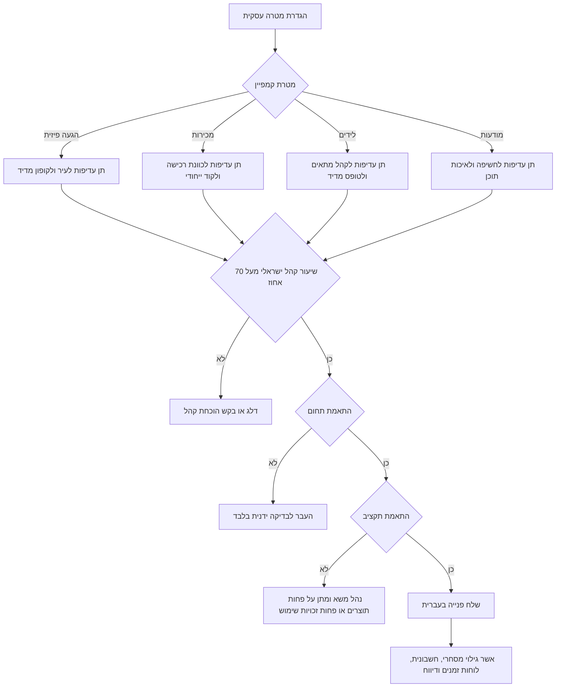

# מסייע לשיתופי פעולה עם משפיענים בישראל

השתמש במיומנות זו כדי לאתר משפיענים ויוצרי תוכן בישראל, לנסח פנייה בעברית, לבדוק התאמה לקהל יעד, לנהל תנאי התקשרות, ולעקוב אחר ביצועי קמפיין עבור עסקים קטנים, עצמאים, פרילנסרים וצרכנים. הפעל את המיומנות כאשר נדרש תהליך עבודה מעשי ולא רק רעיון שיווקי כללי.

## תחום שימוש

השתמש במסייע עבור משימות אלה:

- בניית רשימת יוצרים לפי תחום, עיר, התאמת קהל ומטרת קמפיין.
- דירוג משפיענים לפי מדדים שקופים במקום לפי מספר עוקבים בלבד.
- ניסוח פנייה בעברית הכוללת גילוי מסחרי, תוצרים, זכויות שימוש, תאריכים ועוגן תקציבי.
- תכנון קופוני הטבה, קישורים מסומנים, צילומי מסך, חשבונית או קבלה, נקודות אישור ודיווח.
- סיכום ביצועים לפי עלות לאלף חשיפות, עלות לקליק, עלות לליד, עלות למכירה, החזר על הוצאה ושיעור המרה.
- איתור סיכונים כגון שיעור קהל ישראלי נמוך, גילוי מסחרי לא ברור, יחס מדדים חשוד או תנאי התקשרות חסרים.

אין להשתמש במסייע כתחליף לייעוץ משפטי, חשבונאי, מסחרי או ייעוץ פרטיות. בדוק כל סוגיה רגולטורית מול גורם מקצועי לפני פרסום, במיוחד בתחומי בריאות, פיננסים, קטינים, הגרלות, משקאות משכרים ואיסוף פרטים אישיים.

## נתונים נדרשים

אסוף את הנתונים הבאים לפני דירוג יוצרים:

| שדה | למה הוא חשוב | דוגמה |
|---|---:|---|
| שם משתמש ופלטפורמה | זיהוי, מניעת כפילות ומעקב | `haifa_food`, אינסטגרם |
| תחום תוכן | התאמה למוצר או לשירות | אוכל, טיפוח, הורות, שירותים מקומיים |
| מיקום | רלוונטיות מקומית | חיפה, ירושלים, תל אביב, באר שבע |
| מספר עוקבים | אינדיקציה ראשונית להיקף | 18,000 |
| צפיות ממוצעות | מדד מעשי לחשיפה | 9,000 |
| לייקים ותגובות ממוצעים | איכות מעורבות | 620 לייקים, 80 תגובות |
| שיעור קהל בישראל | התאמה לשוק המקומי | 0.91 |
| מטרת קמפיין | קובע את סדר העדיפויות | מודעות, לידים, מכירות, הגעה פיזית |
| תקציב בשקלים | התאמת עלות | ₪6,500 |
| תאריכים | היתכנות תפעולית | 10/06/2026 עד 25/06/2026 |
| תוצרים | הערכת מחיר והיקף התחייבות | סרטון קצר, סטורי, סטורי |
| נוסח גילוי מסחרי | צמצום סיכון בפרסום | פרסומת |
| זכויות שימוש | מגבלת שימוש חוזר בתוכן | 30 ימים |

## עץ החלטה

הפעל את עץ ההחלטה לפני יצירת קשר:



## מודל דירוג

המסייע מדרג כל יוצר בסולם 0 עד 100.

| רכיב | משקל | מה לבדוק |
|---|---:|---|
| התאמה | 30 אחוז | תחום תוכן ומיקום |
| מעורבות | 25 אחוז | לייקים, תגובות, צפיות ויחס לעוקבים |
| רלוונטיות ישראלית | 20 אחוז | שיעור קהל בישראל |
| התאמת תקציב | 15 אחוז | הערכת מחיר מול תקציב פנוי |
| סיכון | 10 אחוז | ניגודי מותגים ודפוס מדדים חשוד |

פירוש מומלץ:

| ציון כולל | המלצה | פעולה |
|---:|---|---|
| 80 עד 100 | רשימה קצרה | פנה ראשון ובקש נתוני קהל |
| 60 עד 79 | בדיקה ידנית | בקש צילומי נתונים או שנה היקף |
| 0 עד 59 | דילוג | שמור להזדמנות אחרת בלבד |

## דוגמאות מעשיות

### בית קפה שכונתי בחיפה

השתמש במקרה זה כאשר בית קפה קטן רוצה להגדיל הגעה פיזית של לקוחות קרובים.

קלט לדוגמה:

```json
{
  "business_name": "קפה שכונתי",
  "product_or_service": "תפריט בוקר חדש",
  "goal": "foot_traffic",
  "target_locations": ["חיפה"],
  "target_segments": ["food"],
  "budget_ils": 6500,
  "start_date": "10/06/2026",
  "end_date": "25/06/2026",
  "deliverables": ["reel", "story"],
  "coupon_code": "HAIFA10"
}
```

בחר יוצרים עם קהל חיפאי או צפוני, תוכן אמיתי סביב מסעדות ובתי קפה, ונכונות למסור נתוני צפייה והקלקות. אל תעדיף יוצר לייף סטייל ארצי רק בגלל מספר עוקבים גבוה כאשר אין הוכחת קהל מקומי.

### עצמאי שמוכר פגישות ייעוץ

השתמש במקרה זה כאשר המטרה היא לידים איכותיים ולא חשיפה רחבה.

תן עדיפות ליוצרים בתחומי עסקים, קריירה, פיננסים, טכנולוגיה או הורות, לפי השירות. דרוש דף נחיתה, שדה מקור בטופס, ותיעוד של סטטוס שיחה או פגישה. אל תמדוד הצלחה לפי חשיפות בלבד.

### צרכן שבודק המלצה בתשלום

השתמש במקרה זה כאשר צרכן רוצה להבין אם המלצה ממומנת נראית אמינה.

בדוק אם מופיע גילוי מסחרי ברור בעברית בתחילת הפרסום, אם היוצר מציג שימוש אמיתי במוצר, אם קופון ההטבה מפעיל לחץ מוגזם, ואם הטענות ניתנות לבדיקה. התייחס להיעדר גילוי או להבטחות מוגזמות כסימן אזהרה.

## תבנית פנייה בעברית

השתמש במבנה הבא:

```text
שלום {display_name}, יש התאמה אפשרית בין הקהל שלך לבין {business_name}.

המוצר או השירות: {product_or_service}.
מטרת הקמפיין: {goal}.
תוצרים מוצעים: {deliverables}.
חלון פעילות: {DD/MM/YYYY} עד {DD/MM/YYYY}.
נדרשת הצגת גילוי מסחרי ברור, למשל: פרסומת.
זכויות שימוש בתוכן: {usage_rights_days} ימים, בכפוף לאישור כתוב ולסיכום תנאים.
טווח תקציב מוצע לשלב ראשון: עד ₪{budget}, לפני מע"מ ככל שרלוונטי.

כדאי לשלוח ערכת נתוני קהל ותעריפים, שיעור קהל בישראל, זמינות ותנאים לשימוש חוזר בתוכן.
תודה.
```

שמור על ניסוח קצר, ענייני ותפעולי. אל תפתח במחמאות כלליות. בקש מידע שתומך במטרת הקמפיין.

## מקרי קצה

### יוצר קטן עם קהל מקומי חזק

הכנס לרשימה קצרה יוצר עם 4,000 עוקבים כאשר ההתאמה לעיר גבוהה, התגובות אמיתיות, והקופון ניתן למדידה. משפיענים קטנים יכולים להפיק תוצאות טובות יותר לעסקים מקומיים.

### יוצר גדול עם רלוונטיות מקומית נמוכה

דלג על יוצר עם 150,000 עוקבים כאשר שיעור הקהל הישראלי נמוך, במיוחד עבור מסעדה, קליניקה, קורס או חנות מקומית.

### בקשת תמורה במוצר בלבד

הגדר את שווי המוצר, התוצרים, מועד הדיווח, תנאי ביטול, והאם נדרש טיפול חשבונאי מתאים. עבור שיתוף פעולה מתמשך, העדף תנאי תשלום כתובים.

### פעילות סטורי בלבד

השתמש בסטורי בלבד לקידום קצר, תנועה מקומית או מבצע מוגבל. דרוש צילומי מסך לפני פקיעת הסטורי ואשר מראש אם נתוני הקלקה יימסרו.

### מוצר רגיש או מוסדר

הפעל בדיקה נוספת עבור פיננסים, בריאות, תוספים, קטינים, משקאות משכרים, הגרלות, שירותים מקצועיים ואיסוף פרטים אישיים. הימנע מטענות לא מוכחות. דרוש אסמכתאות לפני פרסום.

## תהליך עבודה

1. הגדר מטרה, תקציב, מיקומים, תאריכים, תוצרים ונוסח גילוי.
2. אסוף נתוני יוצרים מתוך ערכת נתוני קהל, צילומי נתונים, פרסומים ציבוריים וקמפיינים קודמים.
3. דרג כל יוצר וסמן רשימה קצרה, בדיקה ידנית או דילוג.
4. בקש נתוני קהל בישראל, מחיר, זמינות, תנאי שימוש חוזר ותנאי בלעדיות אם קיימים.
5. אשר את נוסח הגילוי המסחרי בעברית.
6. תעד תנאים בכתב: תוצרים, מועדים, תשלום, ביטול, סבבי אישור, דיווח ושימוש חוזר.
7. הפעל קופון ייחודי או קישור מסומן.
8. שמור קישורי פרסום, צילומי מסך, הוצאה, חשיפות, צפיות, הקלקות, לידים, מכירות והכנסה.
9. סכם ביצועים והחלט על חידוש, שינוי תנאים או עצירה.

## פתרון תקלות

| בעיה | סיבה סבירה | תיקון |
|---|---|---|
| הרבה צפיות בלי הקלקות | קריאה לפעולה חלשה או קהל רחב מדי | שנה הצעה, קישור או התאמת יוצר |
| הקלקות רבות בלי לידים | דף נחיתה מסורבל | קצר טופס והתאם את ההבטחה לפרסום |
| לידים בלי מכירות | מעקב מכירה איטי או כוונת רכישה נמוכה | הגדר זמן תגובה ושדות סינון |
| היוצר מתעכב בפרסום | אין התחייבות תאריכים | אשר חלון פרסום מדויק בכתב |
| אין נתוני סטורי | הסטורי פג | דרוש צילומי מסך לפני פקיעה |
| אין גילוי מסחרי | התנאים לא היו ברורים | הוסף נוסח עברי מדויק לפני אישור |
| חריגה מתקציב | נוספו תוצרים או זכויות שימוש | הפרד תשלום, שימוש ובלעדיות |
| מעורבות חשודה | עוקבים לא איכותיים או התאמה חלשה | בקש צילומי נתונים והשווה צפיות |

## דפוסים שכדאי להימנע מהם

הימנע מהדפוסים הבאים:

- בחירת יוצרים לפי מספר עוקבים בלבד.
- שליחת פנייה כללית ללא מטרה עסקית.
- אישור שימוש חוזר בתוכן ללא תקופת שימוש מוגדרת.
- תשלום לפני תיעוד תוצרים, דיווח וחשבונית או קבלה.
- הסתפקות בגילוי באנגלית עבור תוכן בעברית.
- התעלמות משיעור קהל ישראלי עבור עסק מקומי.
- השוואת יוצרים ללא התאמה לפלטפורמה ולסוג התוצר.
- דיווח חשיפות בלבד כאשר המטרה היא לידים או מכירות.
- ערבוב תמורה במוצר, תשלום, בלעדיות וזכויות שימוש במשפט עמום אחד.

## רשימת בדיקה לפני הפקה

לפני פרסום:

- אשר מטרה עסקית ומדד הצלחה.
- אשר עיר או אזור יעד.
- אשר תקציב ב-₪ והאם מס נכלל.
- אשר תוצרים ותאריכי ביצוע.
- אשר נוסח גילוי מסחרי בעברית.
- אשר תהליך אישור תוכן.
- אשר זכויות שימוש ומשך שימוש.
- אשר בלעדיות, אם נדרשת.
- אשר שלב תשלום וחשבונית או קבלה.
- אשר קופון או קישור מדיד.
- אשר שדות דיווח.
- אשר מי שומר צילומי מסך.
- אשר תנאי ביטול.
- אשר טיפול בפרטים אישיים של לידים.
- אשר אסמכתאות לטענות במוצרים רגישים.

לאחר פרסום:

- שמור קישורים וצילומי מסך.
- תעד שעת פרסום.
- תעד הוצאה ותשלום ליוצר.
- תעד חשיפות, צפיות, הקלקות, לידים, מכירות והכנסה.
- חשב עלות לאלף חשיפות, עלות לקליק, עלות לליד, עלות למכירה, החזר על הוצאה ושיעור המרה.
- השווה תוצאות לפי יוצר וסוג תוכן.
- חדש פעילות רק עם יוצרים שהציגו ערך עסקי ברור או ערך תוכני אסטרטגי.
