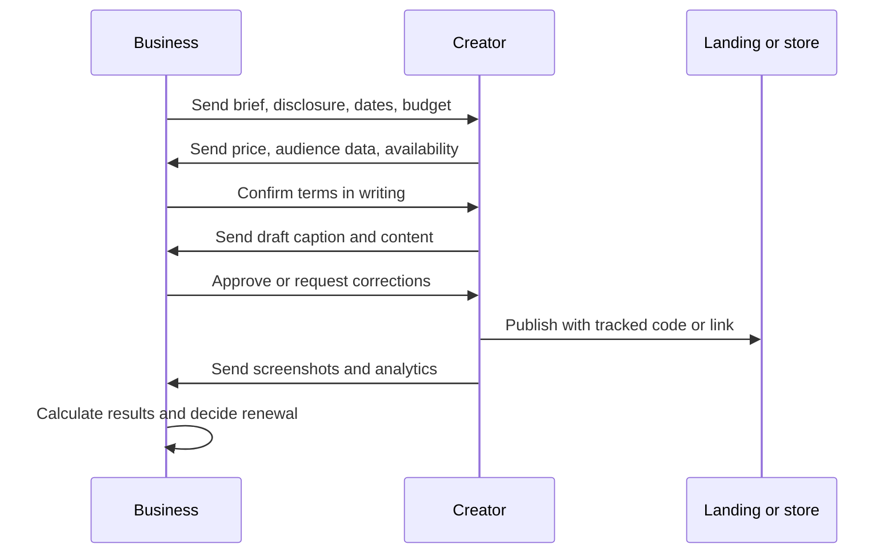
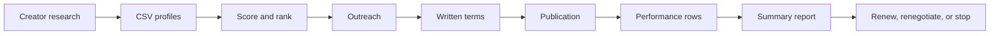

# Workflow guide

Use these end-to-end workflows to run practical Israeli influencer collaborations from brief to post-campaign review.

## Workflow 1: Local restaurant foot-traffic campaign

Objective: drive customers to a branch during a specific offer window.

1. Define the offer: dish, discount, dates, redemption condition, and branch.
2. Create one coupon code per creator, for example `HAIFA10DANA`.
3. Collect 10 to 20 local food creators from public search, customer mentions, local groups, and supplier recommendations.
4. Record city, niche, followers, average views, average engagement, and Israeli audience share.
5. Score the creators.
6. Shortlist creators above 80 and manually review creators between 60 and 79.
7. Send Hebrew outreach with exact dates, disclosure wording, and expected deliverables.
8. Request recent audience screenshots and price.
9. Confirm written terms:
   - publication date and time
   - story and reel count
   - disclosure wording
   - coupon code
   - approval deadline
   - payment amount and invoice or receipt process
   - permission to reuse content, if any
10. Approve caption before publication.
11. Save screenshots before story expiry.
12. Count redemptions in point-of-sale data.
13. Summarize spend, impressions, views, clicks, redemptions, sales, and revenue.
14. Renew only creators with profitable redemptions or high-quality reusable content.

Success metric: cost per redemption, revenue from coupon, and repeat visit potential.

## Workflow 2: Freelancer lead-generation campaign

Objective: sell discovery calls, consulting sessions, or workshops.

1. Define target customer and qualification criteria.
2. Build a landing page with source field, consent checkbox, and calendar link.
3. Create a unique tracked link per creator.
4. Prioritize creators whose audience trusts professional recommendations.
5. Avoid creators with broad entertainment-only audiences unless the offer is simple.
6. Score creators with higher attention to niche fit and Israeli relevance.
7. Send outreach that asks for audience data and clarifies the service category.
8. Confirm the content cannot promise guaranteed results.
9. Use clear disclosure at the start of the caption or video.
10. Track form submissions, qualified leads, booked calls, attended calls, and closed deals.
11. Review lead quality after 7 days and 30 days.
12. Continue only when the lead source produces qualified conversations.

Success metric: qualified lead cost, show-up rate, conversion rate, and revenue per lead.

## Workflow 3: Product launch with micro-influencers

Objective: generate credible social proof with limited budget.

1. Define one product promise and one proof point.
2. Prepare product shipment list and delivery tracking.
3. Ask each creator for availability before shipping.
4. Score micro-influencers by engagement and relevance, not by reach alone.
5. Decide whether payment, product, or combined compensation applies.
6. Confirm whether content must be posted, whether review is honest, and whether non-public feedback is allowed.
7. Define rights to reuse content on the business page and website.
8. Use one coupon or tracked link per creator.
9. Collect comments, saves, replies, and questions, not only views.
10. Turn high-performing posts into testimonials only with written permission.
11. Stop sending product to creators who do not provide a reporting path.

Success metric: content quality, cost per usable asset, coupon use, and customer questions.

## Workflow 4: Consumer checks an influencer recommendation

Objective: help a consumer decide whether a recommendation deserves trust.

1. Check whether the content says `פרסומת`, `ממומן`, `בשיתוף`, or another clear commercial disclosure near the start.
2. Check whether the creator describes actual use, not only a sales claim.
3. Look for comparison details, limitations, and price context.
4. Treat urgent coupon language as a sales mechanism, not proof of quality.
5. Search for independent reviews and product details outside the creator content.
6. Avoid relying on a single sponsored post for health, finance, legal, or safety decisions.
7. Save screenshots when a claim may later change.

Decision rule: clear disclosure plus useful detail can still be advertising; missing disclosure or extreme claims require skepticism.

## Workflow 5: Monthly agency-style reporting for a small business

Objective: keep a recurring influencer program accountable.

1. Maintain a spreadsheet with one row per creator per post.
2. Record spend in ₪, publication date, deliverables, and usage rights.
3. Record impressions, views, clicks, leads, sales, revenue, and screenshots.
4. Separate paid content performance from organic repost performance.
5. Use the client to summarize each month.
6. Rank creators by ROAS and by strategic content value.
7. Renegotiate creators with strong content but weak sales.
8. Stop creators with unclear audience, weak reporting, or high cost per result.
9. Keep a renewal list, test list, and stop list.

Success metric: blended ROAS, usable content assets, and incremental sales or leads.

## Approval workflow

## Data workflow

## Minimum spreadsheet columns

Creator sheet:

| Column | Example |
|---|---|
| handle | haifa_food |
| display_name | דנה |
| platform | instagram |
| niche | אוכל בחיפה |
| followers | 18000 |
| avg_views | 9000 |
| avg_likes | 620 |
| avg_comments | 80 |
| location | חיפה |
| audience_israel_pct | 0.91 |
| contact_status | contacted |
| quoted_fee_ils | 2400 |
| notes | strong northern audience |

Performance sheet:

| Column | Example |
|---|---|
| handle | haifa_food |
| spend_ils | 2400 |
| impressions | 38000 |
| views | 16000 |
| clicks | 820 |
| leads | 95 |
| sales | 34 |
| revenue_ils | 5100 |
| date_reported | 30/06/2026 |
| screenshot_saved | yes |
| disclosure_checked | yes |

## Quality gates

Use these gates before paying or renewing:

| Gate | Pass condition |
|---|---|
| Audience proof | Recent audience data shows relevant Israeli share |
| Disclosure | Clear Hebrew commercial disclosure appears near start |
| Scope | Deliverables, dates, and usage rights are written |
| Tax handling | Invoice or receipt process is known |
| Tracking | One link or code per creator |
| Reporting | Creator can provide screenshots or analytics |
| Performance | Results match the campaign objective |
| Retention | Lead and customer data are kept only as needed |
