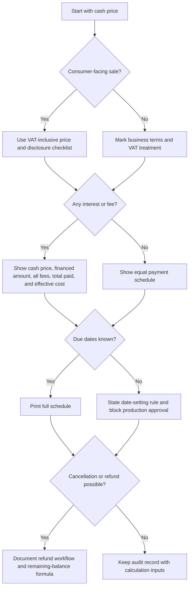
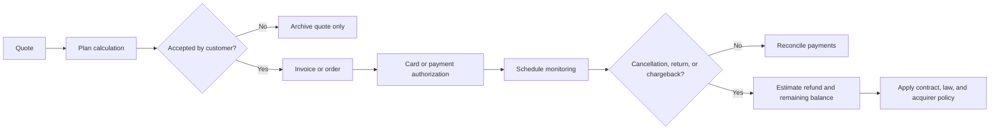

# Installment Calculator (Tashlumim)

Use this skill to calculate and explain installment plans for Israeli checkout, quotes, invoices, service retainers, and consumer-facing credit offers. Produce a clear schedule in ₪, show the cash price, list every fee, calculate the cost of credit, and flag disclosure gaps before a customer accepts a plan.

This skill is a calculation and workflow aid, not legal advice. Verify the current text of Israeli law, regulator guidance, card-acquirer rules, and bookkeeping instructions before production use.

## Core outcomes

Create outputs that a customer, bookkeeper, store manager, or freelancer can understand:

1. Cash price and VAT treatment.
2. Down payment, financed amount, interest rate, and fee policy.
3. Number of installments and due dates in `DD/MM/YYYY`.
4. Payment schedule with principal, interest, fee, payment, and remaining balance.
5. Total paid under the plan, total interest, total fees, and total finance charge.
6. APR-style effective annual cost estimate when fees make the true cost higher than the nominal rate.
7. Disclosure checklist for Israeli consumer-facing use, including VAT, price-display, cancellation-fee, and credit-cost review points.
8. Warnings for rounding, dates, refund, VAT, cancellation, and legal-review issues.

## Inputs

| Input | Meaning | Typical source | Validation |
|---|---|---|---|
| `cash_price` | Total immediate-payment price, generally VAT-inclusive for consumers | POS, quote, invoice | Greater than ₪0 |
| `down_payment` | Amount paid before financing | Checkout payment | From ₪0 up to but not including the cash price |
| `installments` | Number of monthly payments | Checkout selection | Positive integer |
| `annual_interest_rate` | Nominal annual rate used for amortization | Finance policy | Non-negative percentage |
| `upfront_fee` | Fixed fee charged at start | Contract, acquirer fee, admin fee | Non-negative ₪ |
| `upfront_fee_percent` | Percentage fee on financed amount | Finance policy | Non-negative percentage |
| `per_installment_fee` | Fixed fee added to each payment | Card-acquirer or admin policy | Non-negative ₪ |
| `first_due_date` | First payment date | Checkout or contract | `YYYY-MM-DD`, `DD-MM-YYYY`, or `DD/MM/YYYY` |
| `payment_day` | Preferred day of month | Customer mandate | 1-31, clipped to month end |
| `rounding` | Money precision | Accounting policy | Usually ₪0.01 |

## Calculation model

The client calculates a level-payment amortization plan. Fees are disclosed separately and included in total cost. The final installment is adjusted so rounding does not leave a remaining balance.

Formula for the base payment before per-installment fees:

```text
if monthly_rate = 0:
    base_payment = financed_amount / installments
else:
    base_payment = P * r / (1 - (1 + r)^-n)
```

Where `P` is the financed amount, `r` is the nominal annual rate divided by 12, and `n` is the number of installments.

APR-style effective annual cost is estimated with an internal-rate-of-return calculation. Treat the customer as receiving the financed amount net of upfront fees at period 0, then paying each monthly installment including per-installment fees.

## Recommended output sections

Use this order in customer-facing summaries:

1. Offer headline: `₪3,600 in 12 installments`.
2. Cash price: state the immediate-payment price first.
3. Credit terms: financed amount, number of payments, first payment date, interest rate, fees.
4. Schedule table: include each due date and amount.
5. Cost summary: total interest, total fees, total paid, total cost above cash price.
6. Disclosure checks: list required checks and unresolved assumptions.
7. Operational note: invoice or receipt timing, cancellation treatment, and payment authorization.

## Decision tree



## Workflow decision tree



## Concrete examples

### Consumer purchase with no interest

Input:

```python
from installment_calculator import InstallmentRequest, calculate_plan

plan = calculate_plan(InstallmentRequest(
    cash_price="1200",
    installments=6,
    annual_interest_rate="0",
    first_due_date="15/07/2026",
))
print(plan.disclosure_table())
```

Expected use: show `₪200.00` for each payment, no finance charge, and due dates from 15/07/2026.

### Freelancer quote with down payment

Use when a service provider charges a deposit before monthly payments:

```python
plan = calculate_plan(InstallmentRequest(
    cash_price="9800",
    down_payment="2800",
    installments=4,
    first_due_date="10/08/2026",
    consumer_context=False,
    label="website build",
))
```

Disclose the full project price, the deposit, the financed balance of ₪7,000, and four monthly payments.

### Plan with interest and per-payment fee

```python
plan = calculate_plan(InstallmentRequest(
    cash_price="3600",
    installments=12,
    annual_interest_rate="7.5",
    upfront_fee="49",
    per_installment_fee="1.90",
    first_due_date="05/07/2026",
))
```

Use the effective annual cost estimate because fixed fees can make the real cost higher than the nominal rate.

### Refund after partial payment

```python
from installment_calculator import estimate_refund

refund = estimate_refund(plan, installments_paid=3, cancellation_fee="0")
```

Treat the result as an operational estimate. Apply the actual cancellation rule, returned-goods condition, chargeback policy, and invoice correction process before issuing money.

## Edge cases

| Case | Risk | Required handling |
|---|---|---|
| Zero interest plus fixed fees | Customer may think credit is free | Show total fees and cost above cash price |
| Upfront fee above 10 percent of financed amount | Fairness and cancellation issues | Add warning and require review |
| Missing due dates | Customer cannot verify payment timing | Block production disclosure until dates or date rule are added |
| Payment day 31 | Some months have fewer days | Clip to the last day of the month |
| Down payment equals cash price | No financed amount remains | Reject and process as immediate payment |
| VAT-exclusive business quote | Consumer display may be misleading | Mark VAT treatment and create separate consumer wording |
| Long plan above 36 months | Product may resemble credit arrangement | Review legal, acquirer, and bookkeeping treatment |
| Final rounding difference | Residual balance may remain | Adjust final installment and disclose rounding |
| Cancellation after several installments | Interest, fees, and principal must be split | Run refund estimate and review policy |
| Chargeback after partial fulfillment | Accounting and evidence risk | Keep calculation inputs, acceptance record, and delivery evidence |

## Anti-patterns

Avoid these patterns:

- Showing only the monthly payment while hiding the cash price.
- Calling a plan interest-free when fees increase the total paid.
- Applying fees inside the principal without disclosing them separately.
- Rounding each field manually in a spreadsheet without final-balance reconciliation.
- Using a VAT-exclusive amount for a consumer-facing price unless the context legally allows it and wording is clear.
- Reusing a plan after price, date, fee, or cancellation terms changed.
- Treating the effective annual cost estimate as a legal APR without review.
- Omitting first payment date, payment day, or card authorization terms.

## Production checklist

Before launch, verify:

1. Current cash price is displayed before installment terms.
2. VAT status is explicit and consistent with invoices and receipts.
3. All fixed, percentage, and per-installment fees are named.
4. Total paid and cost above cash price are visible.
5. Schedule includes due dates in `DD/MM/YYYY` or a clear date-setting rule.
6. Cancellation, return, and refund handling is documented.
7. Customer acceptance records store all calculation inputs.
8. Card-acquirer rules allow the installment structure.
9. Bookkeeping flow handles down payments, fees, refunds, and invoice corrections.
10. Legal review covers consumer-facing wording.
11. Automated tests include zero-rate, fee-only, high-rate, leap-month, and refund scenarios.
12. Monitoring flags finance charge, effective cost, and failed payments.

## Troubleshooting quick map

| Symptom | Likely cause | Fix |
|---|---|---|
| Final balance is ₪0.01 or -₪0.01 | Rounding each row independently | Adjust final installment |
| Effective cost is much higher than nominal rate | Upfront or monthly fees | Explain fee impact and compare a fee-free plan |
| Due date becomes invalid | Payment day falls after month end | Clip date to last day of month |
| Total paid is lower than cash price | Down payment or upfront fee omitted from total | Include down payment plus all installment payments and fees |
| Customer disputes free installments | Fees were not disclosed as finance charge | Show cash price, fees, and total paid before acceptance |

## Use with documents

When drafting a quote, invoice note, or customer disclosure, include:

```text
Cash price: ₪3,600.00
Installment plan: 12 monthly payments beginning 05/07/2026
Nominal annual interest: 7.5%
Fees: upfront fee ₪49.00; per-installment fee ₪1.90
Total paid: calculated total from the schedule
Total cost above cash price: calculated finance charge
Cancellation and refund terms: according to the approved policy and applicable law
```
