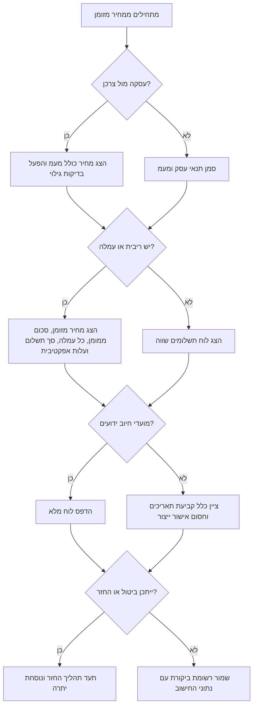

# מחשבון תשלומים

השתמש במיומנות זו לחישוב ולהסבר של עסקאות תשלומים בקופה, בהצעות מחיר, בחשבוניות, במקדמות שירות ובעסקאות צרכניות. הצג לוח סילוקין ברור בשקלים, מחיר מזומן, כל עמלה בנפרד, עלות אשראי כוללת ובדיקות גילוי לפני אישור הלקוח.

המיומנות היא כלי חישוב ותפעול, לא ייעוץ משפטי. אמת את נוסח הדין, הנחיות הרגולטור, כללי סולק האשראי והוראות הנהלת החשבונות לפני שימוש בייצור.

## תוצרים מרכזיים

הפק פלט שמובן ללקוח, למנהל חנות, לעוסק עצמאי או למנהל חשבונות:

1. מחיר מזומן ומעמד מעמ.
2. מקדמה, סכום ממומן, שיעור ריבית ומדיניות עמלות.
3. מספר תשלומים ומועדי חיוב בפורמט `DD/MM/YYYY`.
4. לוח תשלומים עם קרן, ריבית, עמלה, סכום חיוב ויתרה.
5. סך התשלומים, סך הריבית, סך העמלות ועלות האשראי.
6. אומדן עלות שנתית אפקטיבית כאשר עמלות מגדילות את העלות האמיתית.
7. רשימת בדיקות גילוי לשימוש צרכני בישראל.
8. אזהרות לגבי עיגול סכומים, תאריכים, ביטול עסקה, החזר, מעמ ובדיקה משפטית.

## נתוני קלט

| קלט | משמעות | מקור טיפוסי | אימות |
|---|---|---|---|
| `cash_price` | מחיר לתשלום מיידי, בדרך כלל כולל מעמ לצרכן | קופה, הצעת מחיר, חשבונית | גדול מ-₪0 |
| `down_payment` | סכום ששולם לפני פריסת היתרה | תשלום בקופה | מ-₪0 ועד פחות ממחיר המזומן |
| `installments` | מספר תשלומים חודשיים | בחירת לקוח | מספר שלם חיובי |
| `annual_interest_rate` | שיעור ריבית שנתי נומינלי | מדיניות מימון | אחוז לא שלילי |
| `upfront_fee` | עמלה קבועה בתחילת העסקה | הסכם, עמלת סליקה, דמי טיפול | סכום לא שלילי בשקלים |
| `upfront_fee_percent` | עמלה באחוז מהסכום הממומן | מדיניות מימון | אחוז לא שלילי |
| `per_installment_fee` | עמלה קבועה בכל תשלום | מדיניות סליקה או דמי טיפול | סכום לא שלילי בשקלים |
| `first_due_date` | מועד החיוב הראשון | קופה או הסכם | `YYYY-MM-DD`, `DD-MM-YYYY`, או `DD/MM/YYYY` |
| `payment_day` | יום חיוב מועדף בחודש | הרשאת חיוב | 1-31, עם התאמה לסוף חודש |
| `rounding` | דיוק עיגול כספי | מדיניות חשבונאית | בדרך כלל ₪0.01 |

## מודל החישוב

הלקוח מחשב לוח סילוקין בתשלום חודשי קבוע. העמלות מוצגות בנפרד ונכללות בסך העלות. התשלום האחרון מותאם כך שלא תישאר יתרה בגלל עיגול אגורות.

חישוב התשלום הבסיסי לפני עמלה לכל תשלום:

```text
אם שיעור הריבית החודשי הוא 0:
    תשלום בסיסי = סכום ממומן / מספר תשלומים
אחרת:
    תשלום בסיסי = P * r / (1 - (1 + r)^-n)
```

כאשר `P` הוא הסכום הממומן, `r` הוא שיעור הריבית השנתי הנומינלי חלקי 12, ו-`n` הוא מספר התשלומים.

אומדן העלות השנתית האפקטיבית מחושב בדומה לשיעור תשואה פנימי. התייחס ללקוח כאילו קיבל בזמן 0 את הסכום הממומן בניכוי עמלה מראש, ולאחר מכן שילם בכל חודש את התשלום כולל עמלה חודשית.

## סדר הצגה מומלץ

הצג סיכום ללקוח בסדר הבא:

1. כותרת הצעה: `₪3,600 ב-12 תשלומים`.
2. מחיר מזומן: הצג תחילה את המחיר לתשלום מיידי.
3. תנאי האשראי: סכום ממומן, מספר תשלומים, מועד חיוב ראשון, שיעור ריבית ועמלות.
4. לוח תשלומים: הצג כל מועד חיוב וכל סכום.
5. סיכום עלות: סך ריבית, סך עמלות, סך תשלום ועלות מעל מחיר המזומן.
6. בדיקות גילוי: הצג דרישות בדיקה והנחות שלא נסגרו.
7. הערה תפעולית: חשבונית או קבלה, ביטול, החזר והרשאת חיוב.

## עץ החלטה



## דוגמאות מעשיות

### רכישה צרכנית ללא ריבית

```python
from installment_calculator import InstallmentRequest, calculate_plan

plan = calculate_plan(InstallmentRequest(
    cash_price="1200",
    installments=6,
    annual_interest_rate="0",
    first_due_date="15/07/2026",
))
print(plan.disclosure_table())
```

הצג תשלום של ₪200.00 בכל חודש, ללא עלות אשראי, עם מועדים החל מ-15/07/2026.

### הצעת מחיר של עוסק עצמאי עם מקדמה

```python
plan = calculate_plan(InstallmentRequest(
    cash_price="9800",
    down_payment="2800",
    installments=4,
    first_due_date="10/08/2026",
    consumer_context=False,
    label="בניית אתר",
))
```

הצג מחיר פרויקט מלא, מקדמה, יתרה ממומנת של ₪7,000 וארבעה חיובים חודשיים.

### תשלומים עם ריבית ועמלה לכל חיוב

```python
plan = calculate_plan(InstallmentRequest(
    cash_price="3600",
    installments=12,
    annual_interest_rate="7.5",
    upfront_fee="49",
    per_installment_fee="1.90",
    first_due_date="05/07/2026",
))
```

הצג אומדן עלות שנתית אפקטיבית כי עמלות קבועות עשויות להעלות את העלות מעבר לריבית הנומינלית.

### אומדן החזר לאחר תשלומים חלקיים

```python
from installment_calculator import estimate_refund

refund = estimate_refund(plan, installments_paid=3, cancellation_fee="0")
```

התייחס לתוצאה כאומדן תפעולי. החל את תנאי ההסכם, כללי ביטול עסקה, מדיניות סולק האשראי ותהליך תיקון החשבונית לפני ביצוע החזר.

## מקרי קצה

| מקרה | סיכון | טיפול נדרש |
|---|---|---|
| אפס ריבית עם עמלות קבועות | הלקוח עלול לחשוב שהאשראי חינם | הצג סך עמלות ועלות מעל מחיר מזומן |
| עמלה מראש מעל 10 אחוז מהסכום הממומן | חשש הוגנות וביטול | הוסף אזהרה וחייב בדיקה |
| אין מועדי חיוב | הלקוח לא יכול לבדוק מתי יחויב | חסום שימוש בייצור עד הוספת מועדים או כלל תאריכים |
| יום חיוב 31 | בחלק מהחודשים אין יום 31 | התאם ליום האחרון בחודש |
| מקדמה שווה למחיר המזומן | לא נשאר סכום למימון | דחה את הקלט וטפל כתשלום מיידי |
| הצעת מחיר עסקית ללא מעמ | תצוגה צרכנית עלולה להטעות | סמן מעמד מעמ ונסח בנפרד לצרכן |
| פריסה מעל 36 חודשים | העסקה עשויה להיחשב אשראי משמעותי | בדוק דין, כללי סולק והנהלת חשבונות |
| הפרש עיגול בתשלום האחרון | עלולה להישאר יתרה | התאם את התשלום האחרון ותעד עיגול |
| ביטול לאחר כמה תשלומים | יש להפריד קרן, ריבית ועמלות | הרץ אומדן החזר ובדוק מדיניות |
| הכחשת עסקה לאחר אספקה חלקית | סיכון חשבונאי וראייתי | שמור קלט חישוב, אישור לקוח ואסמכתאות אספקה |

## תבניות פעולה שגויות

הימנע מהדפוסים הבאים:

- הצגת תשלום חודשי בלבד בלי מחיר מזומן.
- הצגת עסקה כחסרת ריבית כאשר עמלות מגדילות את סך התשלום.
- הכנסת עמלות לקרן בלי גילוי נפרד.
- עיגול ידני בכל שורה בגיליון בלי התאמת יתרה סופית.
- שימוש במחיר ללא מעמ בהצגה לצרכן ללא הקשר מותר וניסוח ברור.
- שימוש חוזר בתוכנית לאחר שינוי מחיר, תאריך, עמלה או תנאי ביטול.
- התייחסות לאומדן העלות האפקטיבית כאל שיעור משפטי מחייב ללא בדיקה.
- השמטת מועד חיוב ראשון, יום חיוב או תנאי הרשאת חיוב.

## רשימת בדיקה לייצור

לפני השקה, אמת:

1. מחיר המזומן מוצג לפני תנאי התשלומים.
2. מעמד המעמ ברור ותואם חשבוניות וקבלות.
3. כל עמלה קבועה, אחוזית או חודשית מוצגת בשם ברור.
4. סך התשלום ועלות מעל מחיר המזומן מוצגים ללקוח.
5. הלוח כולל תאריכים בפורמט `DD/MM/YYYY` או כלל קביעת תאריכים ברור.
6. תהליך ביטול, החזרה והחזר כספי מתועד.
7. אישור הלקוח שומר את כל קלט החישוב.
8. כללי סולק האשראי מאפשרים את מבנה העסקה.
9. הנהלת החשבונות יודעת לטפל במקדמות, עמלות, החזרים ותיקוני חשבונית.
10. ניסוח צרכני עובר בדיקה משפטית.
11. בדיקות אוטומטיות כוללות אפס ריבית, עמלות בלבד, ריבית גבוהה, סוף חודש והחזר.
12. ניטור תפעולי מסמן עלות אשראי, עלות אפקטיבית וכשלי חיוב.

## פתרון תקלות מהיר

| תסמין | סיבה סבירה | תיקון |
|---|---|---|
| יתרה סופית של ₪0.01 או -₪0.01 | עיגול עצמאי בכל שורה | התאם תשלום אחרון |
| העלות האפקטיבית גבוהה מהריבית הנומינלית | עמלות מראש או עמלות חודשיות | הסבר את השפעת העמלות והשווה חלופה ללא עמלה |
| תאריך חיוב לא תקף | יום חיוב מעבר לסוף חודש | התאם ליום האחרון בחודש |
| סך התשלום נמוך ממחיר המזומן | מקדמה או עמלה מראש לא נכללה בסיכום | כלול מקדמה, תשלומים ועמלות |
| לקוח מתנגד לעסקת אפס ריבית | עמלות לא הוצגו כעלות אשראי | הצג מחיר מזומן, עמלות וסך תשלום לפני אישור |
